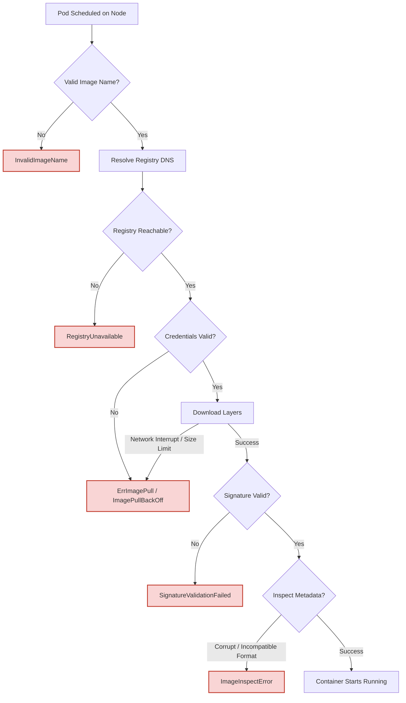

# Image Pull & Verification Debugging Cheat Sheet

A comprehensive guide to diagnosing and resolving container image errors in Kubernetes, covering download failures, registry issues, and cryptographic signature validation.

---

## 🗺️ Image Pull Lifecycle & Error Map

When a Pod is scheduled, the `kubelet` on the target worker node invokes the Container Runtime Interface (CRI) to fetch and prepare the image. Errors can occur at any stage of this workflow:



---

## 🔍 Error Breakdown & Troubleshooting

### 1. `ErrImagePull` & `ImagePullBackOff`
* **What it is:** `ErrImagePull` is the immediate error returned when a pull request fails. `ImagePullBackOff` is the subsequent state where Kubernetes waits (backing off exponentially) before trying again to avoid overloading the registry.
* **Common Causes:**
    * Typo in image name or tag (defaults to `:latest` if omitted).
    * Private registry requires authentication (missing `imagePullSecrets`).
    * The node is not authorized to pull from the registry (e.g., GKE node lacks IAM read access to Artifact Registry).
* **Diagnostic Commands:**
    ```bash
    # View Pod lifecycle events (scroll to the bottom)
    kubectl describe pod <pod-name>

    # Fetch the exact error message from the CRI
    kubectl get pod <pod-name> -o jsonpath='{.status.containerStatuses[*].state.waiting.message}'
    ```
* **How to Fix:**
    1. Double-check image spelling: `gcr.io/my-project/my-app:v1.0.0`.
    2. Ensure the registry credential Secret exists and is attached to the Pod:
       ```yaml
       spec:
         imagePullSecrets:
         - name: my-registry-key
       ```

---

### 2. `RegistryUnavailable`
* **What it is:** The kubelet cannot establish a network connection to the image registry.
* **Common Causes:**
    * Registry is experiencing downtime or rate-limiting.
    * Firewall rules, network security groups, or a proxy block egress traffic to the registry from the worker nodes.
    * DNS resolution failure inside the cluster or on the host node.
* **Diagnostic Commands:**
    ```bash
    # Test registry DNS resolution and reachability inside the cluster
    kubectl run net-test --rm -it --image=alpine -- sh -c "nslookup registry.hub.docker.com && wget -qO- https://registry.hub.docker.com/v2/"
    ```
* **How to Fix:**
    * Configure firewalls to allow egress traffic to your registry ports (`443` for HTTPS).
    * If running in a private cluster (e.g., GKE Private Cluster), ensure Cloud NAT is configured to let nodes access public registries.

---

### 3. `InvalidImageName`
* **What it is:** The container runtime rejects the image reference because the name, format, or syntax is invalid.
* **Common Causes:**
    * Uppercase letters in the image repository path (Docker and OCI standards require all-lowercase repository names).
    * Invalid special characters (e.g., spaces, backslashes).
    * Incorrect registry port designation or schema prefix (e.g., `https://` prepended to the image name).
* **Diagnostic Commands:**
    * Inspect the image field in the Pod description:
      ```bash
      kubectl get pod <pod-name> -o jsonpath='{.spec.containers[*].image}'
      ```
* **How to Fix:**
    * Re-tag and push the image using lowercase path components:
      ```bash
      # Change from: MyRegistry/MyApp:V1
      docker tag MyRegistry/MyApp:V1 myregistry/myapp:v1
      ```

---

### 4. `SignatureValidationFailed`
* **What it is:** The cluster security or admission control policy (e.g., Kyverno, OPA Gatekeeper, or GKE Binary Authorization) blocks the image because its cryptographic signature is invalid or missing.
* **Common Causes:**
    * The image was pushed without being signed using tools like Cosign or Notary.
    * The signature public key configured in the cluster does not match the key used to sign the image.
    * The signature has expired.
* **Diagnostic Commands:**
    ```bash
    # Verify the signature manually using Cosign
    cosign verify --key cosign.pub <image-url>
    
    # Check admission controller logs for blocked requests
    kubectl get events -n kube-system | grep -i admission
    ```
* **How to Fix:**
    * Sign the OCI image before pushing it:
      ```bash
      cosign sign --key cosign.key <image-url>
      ```
    * Update the cluster's Binary Authorization or Gatekeeper policy to match the correct public keys.

---

### 5. `ImageInspectError`
* **What it is:** The kubelet successfully downloads the image files but fails to inspect the metadata (config manifest) or extract the image schema.
* **Common Causes:**
    * Image layer files got corrupted during transmission or storage.
    * Incompatible storage driver on the worker node.
    * The image manifest format (e.g., Docker V2 Schema 1) is deprecated and not supported by the node's container runtime.
* **Diagnostic Commands:**
    * SSH into the worker node (if accessible) and try inspecting manually using the local runtime CLI:
      ```bash
      # For containerd:
      ctr images check <image-name>
      ```
* **How to Fix:**
    * Rebuild the image from source and push a clean copy to the registry.
    * Build OCI-compliant images using modern toolchains (Docker Buildx, Kaniko, or Ko).

---

!!! tip "Quick Diagnostic Sequence"
    Always run **`kubectl describe pod <pod-name>`** first. Look at the `Events` log at the very bottom — it provides the exact reason and error message sent by the container runtime.

---

[← Cheatsheets Index](./index.md) | [Back to mission.md](../mission.md)
