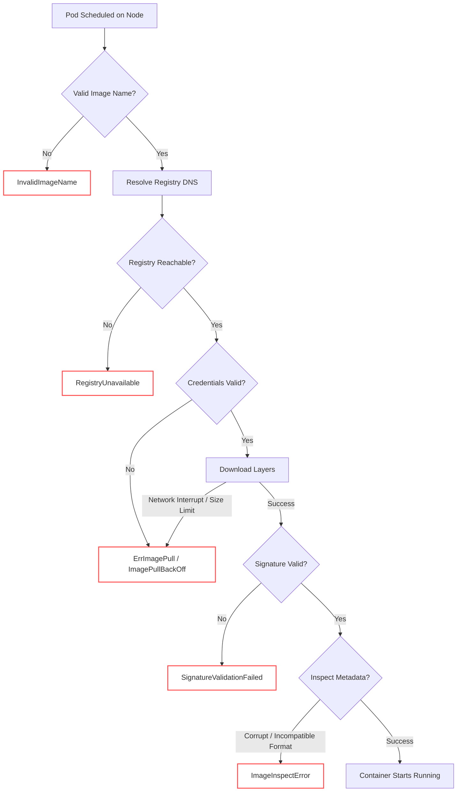

# Image pull and verification debugging cheat sheet

Diagnostic guide for resolving container image errors in Kubernetes: download failures, registry authentication issues, and cryptographic signature validation errors.

---

## Image pull lifecycle and error map

When a Pod is scheduled, the `kubelet` on the target worker node invokes the Container Runtime Interface (CRI) to fetch and prepare the image:


```mermaid
graph TD
    Start[Pod Scheduled on Node] --> ValName{Valid Image Name?}
    ValName -->|No| ErrInvalid[InvalidImageName]
    ValName -->|Yes| DNS[Resolve Registry DNS]
    
    DNS --> Conn{Registry Reachable?}
    Conn -->|No| ErrReg[RegistryUnavailable]
    Conn -->|Yes| Auth{Credentials Valid?}
    
    Auth -->|No| ErrPull[ErrImagePull / ImagePullBackOff]
    Auth -->|Yes| Pull[Download Layers]
    
    Pull -->|Network Interrupt / Size Limit| ErrPull
    Pull -->|Success| Verify{Signature Valid?}
    
    Verify -->|No| ErrSig[SignatureValidationFailed]
    Verify -->|Yes| Inspect{Inspect Metadata?}
    
    Inspect -->|Corrupt / Incompatible Format| ErrInspect[ImageInspectError]
    Inspect -->|Success| Run[Container Starts Running]

    classDef error fill:none,stroke:#ff4d4f,stroke-width:2px;
    class ErrInvalid,ErrReg,ErrPull,ErrSig,ErrInspect error;
```

---

## Error breakdown and troubleshooting

### 1. `ErrImagePull` and `ImagePullBackOff`
* **What it is:** `ErrImagePull` is the immediate error returned when an image pull request fails. `ImagePullBackOff` is the subsequent state where Kubernetes waits with an exponential delay before retrying.
* **Common causes:**
    * Typo in image name or tag (defaults to `:latest` if omitted).
    * Private registry requires authentication (missing `imagePullSecrets`).
    * The node is not authorized to pull from the registry (for example, a GKE node lacks IAM read access to Artifact Registry).
* **Diagnostic commands:**
    ```bash
    # View Pod lifecycle events
    kubectl describe pod <pod-name>

    # Fetch the exact error message from the CRI
    kubectl get pod <pod-name> -o jsonpath='{.status.containerStatuses[*].state.waiting.message}'
    ```
* **How to fix:**
    1. Verify image spelling: `gcr.io/my-project/my-app:v1.0.0`.
    2. Verify the registry credential Secret exists and is attached to the Pod:
       ```yaml
       spec:
         imagePullSecrets:
         - name: my-registry-key
       ```

---

### 2. `RegistryUnavailable`
* **What it is:** The kubelet cannot establish a network connection to the image registry.
* **Common causes:**
    * Registry is experiencing downtime or rate-limiting.
    * Firewall rules, network security groups, or an egress proxy block traffic from the worker nodes to the registry.
    * DNS resolution failure inside the cluster or on the host node.
* **Diagnostic commands:**
    ```bash
    # Test registry DNS resolution and reachability inside the cluster
    kubectl run net-test --rm -it --image=alpine -- sh -c "nslookup registry.hub.docker.com && wget -qO- https://registry.hub.docker.com/v2/"
    ```
* **How to fix:**
    * Configure firewalls to allow egress traffic to registry endpoints (port `443` for HTTPS).
    * In private clusters (such as GKE Private Clusters), verify Cloud NAT is configured so nodes can access public registries.

---

### 3. `InvalidImageName`
* **What it is:** The container runtime rejects the image reference because the name, format, or syntax is invalid.
* **Common causes:**
    * Uppercase letters in the image repository path (OCI standards require lowercase repository names).
    * Invalid special characters (spaces, backslashes).
    * Schema prefixes prepended to the image name (such as `https://`).
* **Diagnostic commands:**
    ```bash
    # Inspect the image field in the Pod description
    kubectl get pod <pod-name> -o jsonpath='{.spec.containers[*].image}'
    ```
* **How to fix:**
    * Retag and push the image using lowercase path components:
      ```bash
      docker tag MyRegistry/MyApp:V1 myregistry/myapp:v1
      ```

---

### 4. `SignatureValidationFailed`
* **What it is:** Cluster admission control policies (such as Kyverno, OPA Gatekeeper, or GKE Binary Authorization) block the image because its cryptographic signature is invalid or missing.
* **Common causes:**
    * The image was pushed without being signed using tools like Cosign.
    * The signature public key configured in the cluster does not match the key used to sign the image.
    * The signature has expired.
* **Diagnostic commands:**
    ```bash
    # Verify the signature manually using Cosign
    cosign verify --key cosign.pub <image-url>
    
    # Check admission controller logs for blocked requests
    kubectl get events -n kube-system | grep -i admission
    ```
* **How to fix:**
    * Sign the OCI image before pushing it:
      ```bash
      cosign sign --key cosign.key <image-url>
      ```
    * Update the cluster's Binary Authorization or Gatekeeper policy to match the correct public keys.

---

### 5. `ImageInspectError`
* **What it is:** The kubelet downloads the image files but fails to inspect metadata or extract the image schema.
* **Common causes:**
    * Image layer files were corrupted during transmission or storage.
    * Incompatible storage driver on the worker node.
    * The image manifest format (such as Docker V2 Schema 1) is deprecated.
* **Diagnostic commands:**
    ```bash
    # Inspect containerd images on node
    ctr images check <image-name>
    ```
* **How to fix:**
    * Rebuild the image from source and push a clean copy to the registry.
    * Build OCI-compliant images using modern toolchains (Docker Buildx, Kaniko, or Ko).

---

!!! tip "Diagnostic sequence"
    Run `kubectl describe pod <pod-name>` first. The `Events` log at the bottom provides the exact error message reported by the container runtime.

---

[← Cheatsheets overview](./index.md) | [kubectl debugging cheat sheet →](./kubectl-debugging-cheat-sheet.md)
