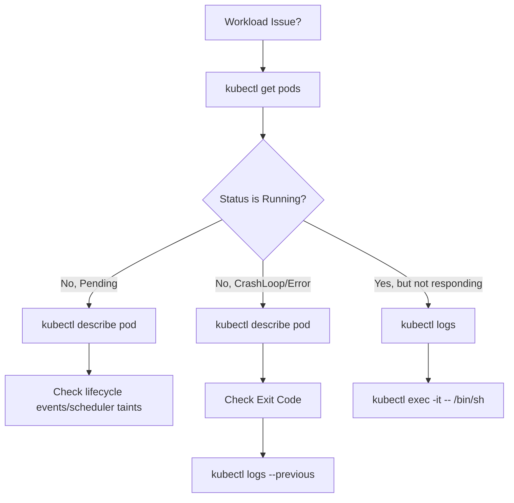

# Kubectl Debugging Cheat Sheet

A visual walkthrough and command reference for diagnosing workload issues.

### Diagnostic Workflow Decision-Tree



---

## 1. The Diagnostic Workflow

1. **Inspect Status**  
   Identify which Pods are not in the `Running` or `Completed` state.
   ```bash
   kubectl get pods
   ```

2. **Describe the Pod**  
   Inspect lifecycle Events and State details. Look for Exit Codes, OOMKills, or failed probes.
   ```bash
   kubectl describe pod <pod-name>
   ```

3. **Check logs of the current run**  
   Fetch stdout/stderr of the running (or terminated) container.
   ```bash
   kubectl logs <pod-name>
   ```

4. **Check logs of the previous crashed run**  
   *Crucial for CrashLoopBackOff:* See why the container crashed before K8s restarted it.
   ```bash
   kubectl logs <pod-name> --previous
   ```

---

## 2. Common Pod Statuses

| Status | Description | Primary Cause |
| :--- | :--- | :--- |
| **CrashLoopBackOff** | The container starts, but repeatedly crashes or exits. K8s waits for an increasing backoff period before attempting to restart it again. | Application config errors, missing environment vars, DB connection failure, or permission errors. |
| **ImagePullBackOff** | The container image cannot be fetched from the registry. | Typo in image name/tag, private registry authentication credentials not configured (`imagePullSecrets`). |
| **OOMKilled** | The container process consumed more memory than its limit allowed, and was terminated by the Linux kernel Out-Of-Memory killer. | Insufficient memory limit configuration or application memory leaks. |
| **Pending** | The Pod has been accepted by the cluster, but one or more containers are not yet created or scheduled. | Insufficient CPU/Memory resources on nodes, unschedulable taints, or waiting for persistent volumes. |

---

## 3. Advanced Diagnostic Commands

### Execute a command in a running pod
```bash
kubectl exec -it <pod-name> -- /bin/sh
```

### Stream logs in real-time
```bash
kubectl logs -f <pod-name>
```

### Check logs of a specific container in a multi-container pod
```bash
kubectl logs <pod-name> -c <container-name>
```

---

Part of the Kubernetes learning workspace. Back to [mission.md](../mission.md).
