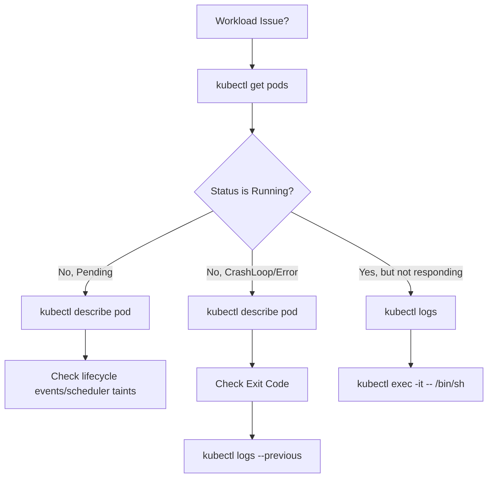

# kubectl debugging cheat sheet

Command reference and workflow for diagnosing Kubernetes workload issues.

### Diagnostic workflow decision tree


```mermaid
graph TD
    Start[Workload Issue?] --> GetPods[kubectl get pods]
    GetPods --> IsRunning{Status is Running?}
    IsRunning -->|No, Pending| DescPod[kubectl describe pod]
    DescPod --> CheckEvents[Check lifecycle events/scheduler taints]
    IsRunning -->|No, CrashLoop/Error| DescPod2[kubectl describe pod]
    DescPod2 --> CheckExit[Check Exit Code]
    CheckExit --> LogsPrev[kubectl logs --previous]
    IsRunning -->|Yes, but not responding| LogsCur[kubectl logs]
    LogsCur --> ExecPod[kubectl exec -it -- /bin/sh]
```

---

## 1. Diagnostic workflow

1. **Inspect status**  
   Identify Pods that are not in the `Running` or `Completed` state:
   ```bash
   kubectl get pods
   ```

2. **Describe the Pod**  
   Inspect lifecycle Events and container State. Check for exit codes, OOMKills, or failing probes:
   ```bash
   kubectl describe pod <pod-name>
   ```

3. **Check logs of the current container**  
   Fetch stdout and stderr from the container:
   ```bash
   kubectl logs <pod-name>
   ```

4. **Check logs of the previous container instance**  
   Inspect output from the crashed container before restart:
   ```bash
   kubectl logs <pod-name> --previous
   ```

---

## 2. Common Pod statuses

| Status | Description | Primary cause |
| :--- | :--- | :--- |
| **CrashLoopBackOff** | The container starts and repeatedly exits. Kubernetes enters an exponential backoff delay before restarting. | Missing environment variables, database connection timeouts, syntax errors, or invalid flags. |
| **ImagePullBackOff** | The container image cannot be pulled from the registry. | Typo in repository name or tag, missing `imagePullSecrets`, or rate limits. |
| **OOMKilled** | The container process exceeded its memory limit and was killed by the Linux kernel OOM killer. | Low `limits.memory` setting or application memory leak. |
| **Pending** | The Pod was created but has not been bound to a node. | Insufficient CPU/memory resources on nodes, node taints, or unbound PersistentVolumeClaims. |

---

## 3. Advanced diagnostic commands

### Execute an interactive shell in a running pod
```bash
kubectl exec -it <pod-name> -- /bin/sh
```

### Stream logs in real time
```bash
kubectl logs -f <pod-name>
```

### Check logs of a specific container in a multi-container pod
```bash
kubectl logs <pod-name> -c <container-name>
```

---

[← Cheatsheets overview](./index.md) | [Image pull debugging cheat sheet →](./image-pull-debugging-cheat-sheet.md)
