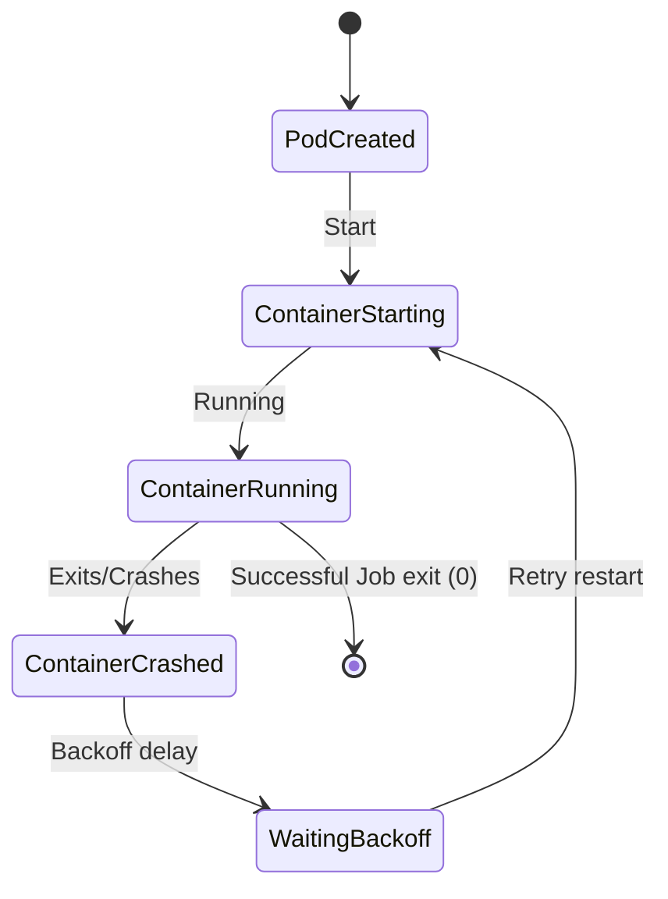

# Debugging: Troubleshooting CrashLoopBackOff

One of the most frequent errors encountered when running workloads in a Kubernetes cluster is **`CrashLoopBackOff`**. This guide covers what the status actually means, how to run the diagnostic sequence, and how to fix the underlying issues.

---

## 1. What is CrashLoopBackOff?

`CrashLoopBackOff` is **not** an error code returned by your application. It is a status message from Kubernetes indicating that:

1. The container started.
2. The container exited or crashed.
3. The cluster tried to restart it (due to its `restartPolicy`).
4. The container crashed again.
5. Kubernetes enters a **backoff** loop, waiting before trying to start the container again.

To prevent overloading the host node with infinite reboot loops, Kubernetes delays restarts exponentially: 10 seconds, 20 seconds, 40 seconds, up to a maximum delay of **5 minutes**.



---

## 2. The 3-Step Diagnostic Workflow

When a Pod exhibits `CrashLoopBackOff`, execute this command sequence in your terminal to pinpoint the root cause:

### Step A: Identify the failing Pod
List the pods in your namespace and check the `STATUS` and `RESTARTS` count:
```bash
kubectl get pods
```

### Step B: Inspect Pod Lifecycle & Events
Look at the metadata, state changes, and events of the Pod:
```bash
kubectl describe pod <pod-name>
```
Scroll to the **Events** section at the bottom. Check the **State** of the container, paying close attention to:

* **Exit Code:** A non-zero exit code (e.g. `1`, `137`, `139`) indicates the app crashed.
* **Reason:** Look for `OOMKilled` or `Error`.

### Step C: Retrieve the Logs
If the app crashed, check its standard stdout/stderr logs.
```bash
# Get logs of the currently starting container
kubectl logs <pod-name>

# CRUCIAL: Retrieve logs from the previous instance that actually crashed
kubectl logs <pod-name> --previous
```
*Tip: Standard `kubectl logs` only shows logs for the current container execution. If it has just restarted and is waiting, the logs may be blank. Passing the `--previous` flag gets logs from the crashed container before it was rebooted.*

---

## 3. Common Root Causes

* **Exit Code 1 / 255 (Application Error):** Missing environment variables, database connection failures, incorrect startup flags, or syntax errors.
* **Exit Code 137 (OOMKilled):** The container consumed more memory than allowed by its `limits.memory` resource boundaries and was terminated by the OS kernel.
* **Exit Code 0 (Completed too quickly):** The container ran a quick task (like a shell script) and finished. Kubernetes expects web servers/APIs to run indefinitely, so it interprets quick completion as a crash and restarts it. Keep the main process foregrounded!

---

## Hands-on Lab: Deploy & Resolve a Broken Pod

Let's deploy a container deliberately configured to crash, diagnose it, and patch it.

### Step 1: Deploy the broken container
Save the following configuration to `broken-pod.yaml` and apply it:

```yaml
apiVersion: v1
kind: Pod
metadata:
  name: debug-challenge-pod
spec:
  containers:
  - name: test-app
    image: alpine
    command: ["/bin/sh", "-c"]
    args:
    - "echo 'Booting up service...'; sleep 3; echo 'Error: DB_PASSWORD not found!'; exit 1;"
```

```bash
kubectl apply -f broken-pod.yaml
```

### Step 2: Run diagnostic steps
Monitor the status until it enters `CrashLoopBackOff`:
```bash
kubectl get pods -w
```
Run `kubectl describe` to see the exit code:
```bash
kubectl describe pod debug-challenge-pod
```
Retrieve the error message from the crashed container logs:
```bash
kubectl logs debug-challenge-pod --previous
```
You should see: `Error: DB_PASSWORD not found!`.

### Step 3: Clean up
```bash
kubectl delete -f broken-pod.yaml
```

---

## Test Your Knowledge

### 1. Which command retrieves the logs of the container instance that crashed right before the current restart loop?
- [ ] **A.** `kubectl logs <pod> --all`
- [ ] **B.** `kubectl logs <pod> --previous`
- [ ] **C.** `kubectl describe pod <pod>`

<details>
<summary><b>Answer & Explanation</b></summary>

**Correct Answer:** B

**Explanation:** The `--previous` flag fetches stdout/stderr output from the container that actually crashed, which is key to finding application runtime errors.
</details>

---

[← Cheatsheets Index](../cheatsheet/index.md) | [DNS & Network Troubleshooting →](./0002-dns-networking-troubleshooting.md)
