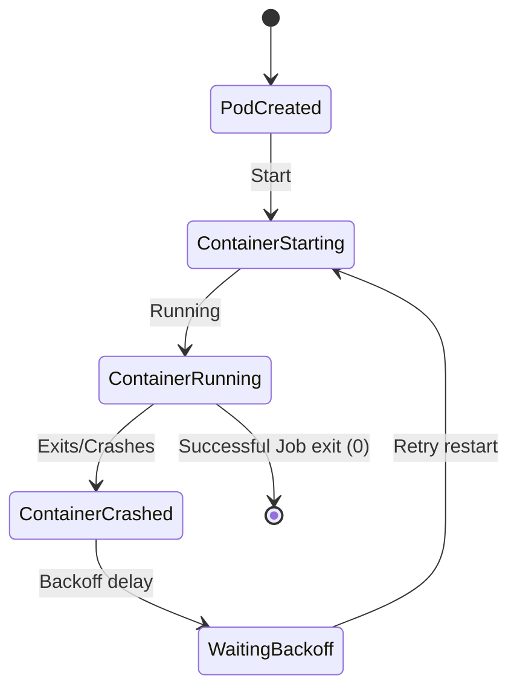

# Troubleshooting CrashLoopBackOff

`CrashLoopBackOff` is one of the most common status codes encountered in Kubernetes. This guide explains what the status means, how to run the diagnostic sequence, and how to fix the underlying errors.

---

## 1. What is CrashLoopBackOff?

`CrashLoopBackOff` is not an error code returned by your application process. It is a status message from Kubernetes indicating that:

1. The container started.
2. The process exited or crashed.
3. The cluster attempted a restart based on `restartPolicy`.
4. The container crashed again.
5. Kubernetes enters an exponential **backoff** delay before attempting the next restart.

To avoid overloading host nodes with continuous restart loops, Kubernetes delays retries exponentially: 10s, 20s, 40s, 80s, 160s, up to a maximum delay of **5 minutes (300s)**.


```mermaid
stateDiagram-v2
    [*] --> PodCreated
    PodCreated --> ContainerStarting : Start
    ContainerStarting --> ContainerRunning : Running
    ContainerRunning --> ContainerCrashed : Exits/Crashes
    ContainerCrashed --> WaitingBackoff : Backoff delay
    WaitingBackoff --> ContainerStarting : Retry restart
    ContainerRunning --> [*] : Successful Job exit (0)
```

---

## 2. Three-step diagnostic workflow

When a Pod enters `CrashLoopBackOff`, run this sequence in your terminal to isolate the root cause:

### Step A: Identify the failing Pod
List pods in your namespace and check the `STATUS` and `RESTARTS` columns:
```bash
kubectl get pods
```

### Step B: Inspect Pod lifecycle and events
Inspect the metadata, state changes, and events of the Pod:
```bash
kubectl describe pod <pod-name>
```
Scroll to the **Events** section and check the container **State**:

* **Exit Code:** A non-zero code (such as `1`, `137`, `139`) indicates the process terminated abnormally.
* **Reason:** Check for `OOMKilled` or `Error`.

### Step C: Retrieve the logs
Inspect standard output and standard error:
```bash
# Get logs of the currently running container
kubectl logs <pod-name>

# Retrieve logs from the previous instance that crashed
kubectl logs <pod-name> --previous
```
Standard `kubectl logs` only displays output from the current container instance. If the container recently restarted and is waiting, output may be empty. The `--previous` flag pulls logs from the crashed instance before it restarted.

---

## 3. Common root causes

* **Exit Code 1 / 255 (Application Error):** Missing environment variables, database connection timeouts, invalid CLI flags, or uncaught runtime exceptions.
* **Exit Code 137 (OOMKilled):** The container exceeded memory limits set in `limits.memory` and was terminated by the Linux kernel.
* **Exit Code 0 (Completed prematurely):** The container ran a short script and exited cleanly. Kubernetes expects long-running processes (like web servers or background workers) to remain running in the foreground; exiting with 0 triggers a restart if `restartPolicy: Always`.

---

## Hands-on practice: Deploy and resolve a broken Pod

### Step 1: Deploy the broken container
Save the following configuration as `broken-pod.yaml`:

```yaml
apiVersion: v1
kind: Pod
metadata:
  name: debug-challenge-pod
spec:
  containers:
  - name: test-app
    image: alpine
    command: ["/bin/sh", "-c"]
    args:
    - "echo 'Booting up service...'; sleep 3; echo 'Error: DB_PASSWORD not found!'; exit 1;"
```

```bash
kubectl apply -f broken-pod.yaml
```

### Step 2: Run diagnostic steps
Watch the Pod enter `CrashLoopBackOff`:
```bash
kubectl get pods -w
```

Inspect the exit code:
```bash
kubectl describe pod debug-challenge-pod
```

Pull the error log from the crashed instance:
```bash
kubectl logs debug-challenge-pod --previous
```

### Step 3: Clean up
```bash
kubectl delete -f broken-pod.yaml
```

---

## Test your knowledge

1. Which command retrieves the logs of the container instance that crashed immediately prior to the current restart?
   - [ ] A) `kubectl logs <pod> --all`
   - [ ] B) `kubectl logs <pod> --previous`
   - [ ] C) `kubectl describe pod <pod>`

   Answer: B. The `--previous` flag fetches stdout and stderr output from the container instance that terminated before the restart.

---

[← Debugging overview](./index.md) | [Troubleshooting DNS and service routing →](./0002-dns-networking-troubleshooting.md)
