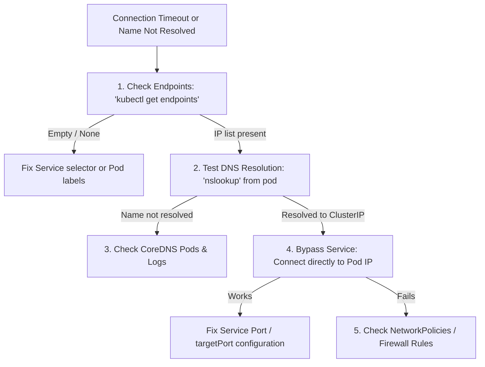

# Debugging: Troubleshooting DNS & Service Routing

If a client container fails to connect to another workload within a cluster using its service name, the issue is typically a Service misconfiguration, DNS failure, or a network policy block. 

This guide provides a systematic workflow to diagnose and resolve service connection errors.

---

## 1. Diagnostic workflow



---

## 2. Troubleshooting Steps

### Step 1: Verify Service Endpoints
Ensure the Service is successfully pointing to healthy Pods. If the Service cannot find any Pods matching its selector, it will have no endpoints.
```bash
kubectl get endpoints <service-name>
```
* **If it says `<none>` or is empty:** The selector in the Service's `spec.selector` does not match the labels in the Pod's `metadata.labels`, or the Pods are not in a `Running` and `Ready` state (failing readiness probes).

### Step 2: Test DNS Resolution
Deploy a temporary test container inside the cluster to check if DNS is functioning.
```bash
# Launch a curl-enabled test pod
kubectl run net-test --rm -it --image=radial/busyboxplus:curl --restart=Never
```
Once inside the shell, test DNS resolution:
```bash
# Resolve local service
nslookup <service-name>

# Resolve cross-namespace service
nslookup <service-name>.<namespace>.svc.cluster.local
```

### Step 3: Check CoreDNS Health
If `nslookup` fails completely, the cluster's internal DNS daemon (CoreDNS) may be down or experiencing issues.
```bash
# Verify CoreDNS pods are running
kubectl get pods -n kube-system -l k8s-app=kube-dns

# Inspect CoreDNS logs
kubectl logs -n kube-system -l k8s-app=kube-dns
```

### Step 4: Bypass the Service
Retrieve the raw IP of one of the backend Pods:
```bash
kubectl get pods -o wide
```
From your test container, try connecting to the Pod IP directly (e.g. `curl http://<pod-ip>:<container-port>`).

* **If direct connection works but Service fails:** You have a port mismatch in your Service definition (`port` vs `targetPort`).
* **If direct connection fails:** The containerized application is not running on that port, has crashed, or is blocked by network policies.

### Step 5: Check Network Policies
Network Policies act as firewalls inside the cluster. Check if there are active policies blocking ingress or egress communication:
```bash
kubectl get networkpolicies -A
```

---

## Hands-on Lab: Fix a Broken Service Selector

Let's simulate a broken connection scenario caused by mismatched labels, diagnose it, and patch it.

### Step 1: Deploy the broken setup
Save the following configuration to `broken-service.yaml` and apply it:

```yaml
apiVersion: apps/v1
kind: Deployment
metadata:
  name: billing-api
spec:
  replicas: 1
  selector:
    matchLabels:
      app: billing-backend
  template:
    metadata:
      labels:
        app: billing-backend
    spec:
      containers:
      - name: web
        image: hashicorp/http-echo
        args: ["-text", "Billing API Active"]
        ports:
        - containerPort: 5678
---
apiVersion: v1
kind: Service
metadata:
  name: billing-service
spec:
  selector:
    app: billing-wrong-label # Label mismatch!
  ports:
  - port: 80
    targetPort: 5678
```

```bash
kubectl apply -f broken-service.yaml
```

### Step 2: Diagnosing the endpoint mismatch
Check the endpoints for the service:
```bash
kubectl get endpoints billing-service
```
Notice the `ENDPOINTS` output is empty.

### Step 3: Fix the Service Selector
Edit the service inside `broken-service.yaml` to fix the selector:
```diff
-   app: billing-wrong-label
+   app: billing-backend
```
Apply the fix:
```bash
kubectl apply -f broken-service.yaml
```
Verify endpoints are now populated:
```bash
kubectl get endpoints billing-service
```
You should now see the Pod IP registered.

### Step 4: Clean up
```bash
kubectl delete -f broken-service.yaml
```

---

## Test Your Knowledge

### 1. If 'kubectl get endpoints web-service' returns '<none>', which command helps you inspect the current labels applied to your running pods?
- [ ] **A.** `kubectl get pods --show-labels`
- [ ] **B.** `kubectl describe service web-service`
- [ ] **C.** `kubectl get pods -o json`

<details>
<summary><b>Answer & Explanation</b></summary>

**Correct Answer:** A

**Explanation:** The `--show-labels` flag displays all active key-value labels attached to each Pod, allowing you to easily cross-reference them with the Service selector.
</details>

---

[← CrashLoopBackOff Troubleshooting](./0001-debugging-crashloopbackoff.md) | [Cheatsheets Index](../cheatsheet/index.md)
