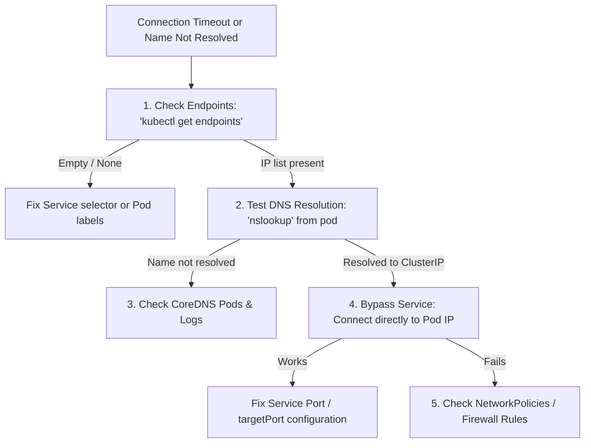

# Troubleshooting DNS and service routing

When a client container fails to connect to another workload using its service name, the cause is usually a Service selector mismatch, CoreDNS failure, port configuration error, or NetworkPolicy block.

This guide provides a step-by-step diagnostic sequence to isolate service connection errors.

---

## 1. Diagnostic workflow


```mermaid
graph TD
    Start[Connection Timeout or Name Not Resolved] --> Step1["1. Check Endpoints: 'kubectl get endpoints'"]
    Step1 -->|Empty / None| FixLabels["Fix Service selector or Pod labels"]
    Step1 -->|IP list present| Step2["2. Test DNS Resolution: 'nslookup' from pod"]
    
    Step2 -->|Name not resolved| CheckDNS["3. Check CoreDNS Pods & Logs"]
    Step2 -->|Resolved to ClusterIP| Step4["4. Bypass Service: Connect directly to Pod IP"]
    
    Step4 -->|Works| CheckPorts["Fix Service Port / targetPort configuration"]
    Step4 -->|Fails| CheckNet["5. Check NetworkPolicies / Firewall Rules"]
```

---

## 2. Troubleshooting steps

### Step 1: Verify Service endpoints
Check if the Service is pointing to healthy Pods. If the Service cannot find any Pods matching its selector, its endpoint list remains empty:
```bash
kubectl get endpoints <service-name>
```
If output displays `<none>` or is empty:
- The `spec.selector` in the Service manifest does not match the `metadata.labels` on the target Pods.
- Or the matching Pods are not in `Running` and `Ready` state (such as failing readiness probes).

### Step 2: Test DNS resolution
Deploy a test container inside the cluster to check DNS resolution:
```bash
# Launch a curl-enabled test pod
kubectl run net-test --rm -it --image=radial/busyboxplus:curl --restart=Never
```
From inside the test container:
```bash
# Resolve local service
nslookup <service-name>

# Resolve cross-namespace service
nslookup <service-name>.<namespace>.svc.cluster.local
```

### Step 3: Check CoreDNS health
If `nslookup` fails completely, check the cluster internal DNS deployment:
```bash
# Verify CoreDNS pods are running
kubectl get pods -n kube-system -l k8s-app=kube-dns

# Inspect CoreDNS logs
kubectl logs -n kube-system -l k8s-app=kube-dns
```

### Step 4: Bypass the Service
Retrieve the direct IP address of a backend Pod:
```bash
kubectl get pods -o wide
```
From the test container, attempt a direct connection to the Pod IP (for example, `curl http://<pod-ip>:<container-port>`).

* **If direct connection succeeds but Service fails:** Check for a port mismatch between `spec.ports[].port` and `spec.ports[].targetPort` in the Service manifest.
* **If direct connection fails:** The target process is not listening on that port, has crashed, or is blocked by firewall rules or network policies.

### Step 5: Check network policies
Check if any NetworkPolicies enforce default-deny or block ingress/egress:
```bash
kubectl get networkpolicies -A
```

---

## Hands-on practice: Fix a broken Service selector

### Step 1: Deploy the broken setup
Save the following manifest as `broken-service.yaml`:

```yaml
apiVersion: apps/v1
kind: Deployment
metadata:
  name: billing-api
spec:
  replicas: 1
  selector:
    matchLabels:
      app: billing-backend
  template:
    metadata:
      labels:
        app: billing-backend
    spec:
      containers:
      - name: web
        image: hashicorp/http-echo
        args: ["-text", "Billing API Active"]
        ports:
        - containerPort: 5678
---
apiVersion: v1
kind: Service
metadata:
  name: billing-service
spec:
  selector:
    app: billing-wrong-label # Label mismatch
  ports:
  - port: 80
    targetPort: 5678
```

```bash
kubectl apply -f broken-service.yaml
```

### Step 2: Diagnose the endpoint mismatch
Check the endpoints for the service:
```bash
kubectl get endpoints billing-service
```
The `ENDPOINTS` column will be `<none>`.

### Step 3: Fix the Service selector
Update the service selector inside `broken-service.yaml`:
```diff
-   app: billing-wrong-label
+   app: billing-backend
```
Apply the update:
```bash
kubectl apply -f broken-service.yaml
```
Verify the endpoint is registered:
```bash
kubectl get endpoints billing-service
```

### Step 4: Clean up
```bash
kubectl delete -f broken-service.yaml
```

---

## Test your knowledge

1. If `kubectl get endpoints web-service` returns `<none>`, which command displays the active labels on running pods?
   - [ ] A) `kubectl get pods --show-labels`
   - [ ] B) `kubectl describe service web-service`
   - [ ] C) `kubectl get pods -o json`

   Answer: A. The `--show-labels` flag displays active labels on each Pod, allowing direct comparison with the Service selector.

---

[← Troubleshooting CrashLoopBackOff](./0001-debugging-crashloopbackoff.md) | [Troubleshooting ImagePullBackOff →](./0003-debugging-imagepullbackoff.md)
