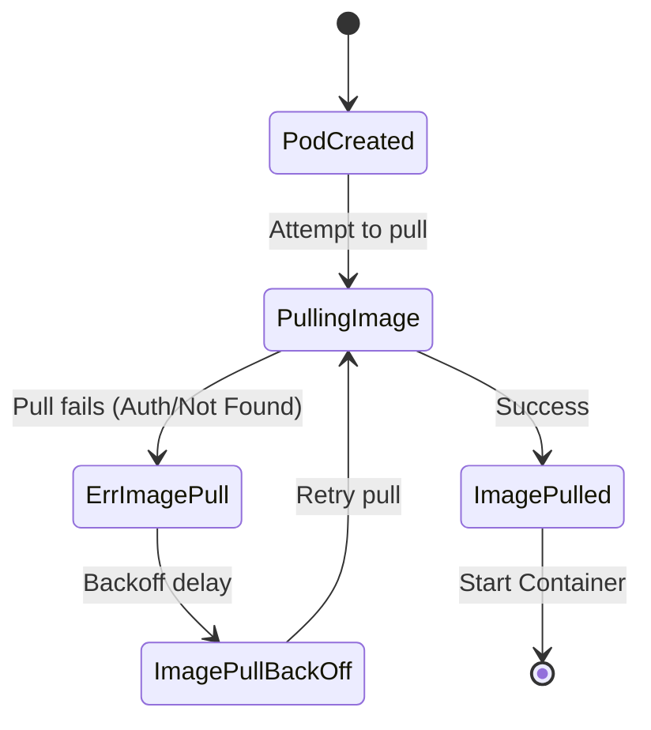

# Debugging: Troubleshooting ImagePullBackOff

One of the most frequent errors encountered when deploying new workloads in a Kubernetes cluster is **`ImagePullBackOff`** (or its precursor, **`ErrImagePull`**). This guide covers what this status actually means, how to run the diagnostic sequence, and how to fix the underlying issues.

---

## 1. What is ImagePullBackOff?

`ImagePullBackOff` is a status message from Kubernetes indicating that the kubelet on a worker node is unable to pull the requested container image from the container registry. 

When a pod is scheduled, the process looks like this:
1. The node attempts to pull the container image.
2. The pull fails, and the status is set to `ErrImagePull`.
3. Kubernetes waits, then tries to pull the image again.
4. The pull fails again.
5. Kubernetes enters a **backoff** loop (`ImagePullBackOff`), exponentially increasing the delay between retry attempts (up to 5 minutes) to avoid overloading the registry or network.



---

## 2. The 3-Step Diagnostic Workflow

When a Pod is stuck in `ImagePullBackOff`, execute this command sequence in your terminal to pinpoint the root cause:

### Step A: Identify the failing Pod
List the pods in your namespace and check the `STATUS`:
```bash
kubectl get pods
```

### Step B: Inspect Pod Lifecycle & Events
Look at the metadata, state changes, and events of the Pod:
```bash
kubectl describe pod <pod-name>
```
Scroll to the **Events** section at the bottom. This is where the kubelet logs why the image pull failed. Look for reasons like:
* `Failed to pull image "my-image:tag": rpc error: code = Unknown desc = Error response from daemon: manifest for my-image:tag not found`
* `pull access denied for my-image, repository does not exist or may require 'docker login'`

### Step C: Verify the Image Name and Tag
Check the container specification in your deployment or pod definition. 
```bash
kubectl get pod <pod-name> -o=jsonpath='{.spec.containers[*].image}'
```
Ensure there are no typos in the registry URL, image name, or the tag.

---

## 3. Common Root Causes

* **Invalid Image Name or Tag:** A typo in the image name or specifying a tag that hasn't been pushed to the registry (e.g., `v1.0.0` instead of `v1.0`).
* **Missing Authentication (Private Registry):** The image is hosted in a private registry, but the Pod is missing the `imagePullSecrets` configuration, or the secret contains expired/invalid credentials.
* **Network Issues / Air-gapped Cluster:** The worker node doesn't have internet access to reach external registries like Docker Hub or Quay.
* **Rate Limiting:** Pulling images from public registries like Docker Hub anonymously can hit rate limits (`toomanyrequests`), causing temporary pull failures.

---

## Hands-on Lab: Deploy & Resolve a Broken Pod

Let's deploy a container deliberately configured with a non-existent image tag to trigger this error.

### Step 1: Deploy the broken container
Save the following configuration to `broken-image-pod.yaml` and apply it:

```yaml
apiVersion: v1
kind: Pod
metadata:
  name: debug-imagepull-pod
spec:
  containers:
  - name: test-app
    image: nginx:999.999.999-nonexistent
```

```bash
kubectl apply -f broken-image-pod.yaml
```

### Step 2: Run diagnostic steps
Monitor the status until it enters `ErrImagePull` and then `ImagePullBackOff`:
```bash
kubectl get pods -w
```
Run `kubectl describe` to see the exact error in the Events section:
```bash
kubectl describe pod debug-imagepull-pod
```
You should see a message indicating the manifest is not found.

### Step 3: Clean up
```bash
kubectl delete -f broken-image-pod.yaml
```

---

## Test Your Knowledge

### 1. Where is the best place to look to find the exact reason why an image pull failed?
- [ ] **A.** `kubectl logs <pod-name>`
- [ ] **B.** `kubectl describe pod <pod-name>`
- [ ] **C.** `kubectl get pod <pod-name> -o yaml`

<details>
<summary><b>Answer & Explanation</b></summary>

**Correct Answer:** B

**Explanation:** `kubectl describe pod <pod-name>` shows the Kubernetes Events for the pod at the bottom of the output. This is where the kubelet reports exactly why it failed to pull the image (e.g., authorization failure, not found). `kubectl logs` will not work because the container hasn't started running yet.
</details>

---

[← DNS & Network Troubleshooting](./0002-dns-networking-troubleshooting.md) | [Cheatsheets Index →](../cheatsheet/index.md)
