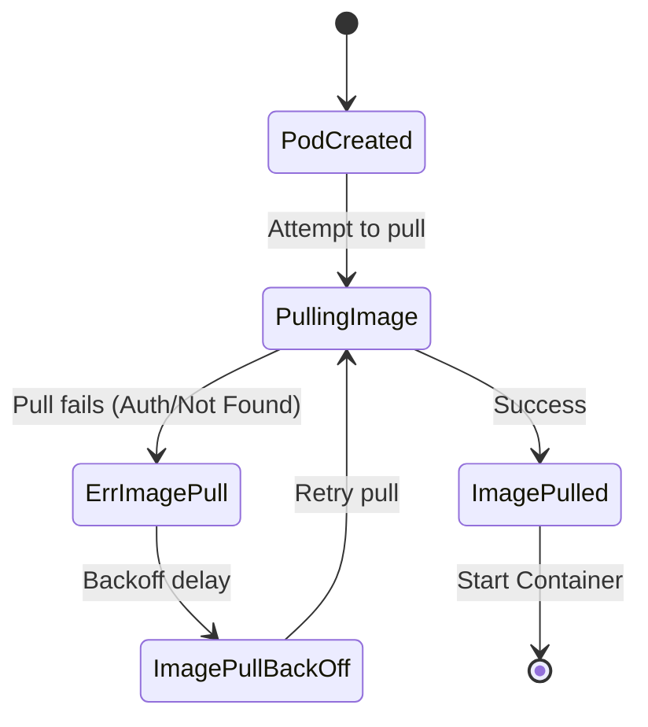

# Troubleshooting ImagePullBackOff

`ImagePullBackOff` (and its precursor, `ErrImagePull`) occurs when a node cannot pull a requested container image from the container registry. This guide covers how to inspect pull failures, verify credentials, and resolve image errors.

---

## 1. What is ImagePullBackOff?

`ImagePullBackOff` indicates that the `kubelet` on a worker node failed to pull the requested container image from a registry.

The process unfolds in these stages:
1. The node attempts to pull the container image.
2. The pull fails, transitioning the Pod status to `ErrImagePull`.
3. Kubernetes waits and retries the pull.
4. If the retry fails, Kubernetes enters an exponential backoff loop (`ImagePullBackOff`), increasing delays between retries up to 5 minutes to avoid overwhelming the container registry.



---

## 2. Three-step diagnostic workflow

When a Pod enters `ImagePullBackOff`, use this diagnostic sequence:

### Step A: Identify the failing Pod
List pods in your namespace and check the `STATUS` column:
```bash
kubectl get pods
```

### Step B: Inspect Pod lifecycle and events
Inspect the metadata and event stream of the Pod:
```bash
kubectl describe pod <pod-name>
```
Scroll to the **Events** section at the bottom to find the exact error message from `kubelet`:
* `Failed to pull image "my-image:tag": rpc error: code = Unknown desc = Error response from daemon: manifest for my-image:tag not found`
* `pull access denied for my-image, repository does not exist or may require 'docker login'`

### Step C: Verify the image name and tag
Check the exact image specification requested by the workload:
```bash
kubectl get pod <pod-name> -o=jsonpath='{.spec.containers[*].image}'
```
Check for typos in the registry hostname, repository path, or tag string.

---

## 3. Common root causes

* **Invalid image name or tag:** Typo in the repository path or specifying a tag that has not been pushed.
* **Missing authentication (private registry):** The image is hosted in a private registry and the Pod lacks `imagePullSecrets`, or the secret credentials expired.
* **Network routing and firewalls:** The worker node lacks internet egress or VPC routing to connect to external registries (Docker Hub, Quay, Artifact Registry).
* **Registry rate limits:** Pulling anonymously from public registries can hit IP-based rate limits (`toomanyrequests`).

---

## Hands-on practice: Deploy and resolve a broken Pod

### Step 1: Deploy the broken container
Save the configuration as `broken-image-pod.yaml`:

```yaml
apiVersion: v1
kind: Pod
metadata:
  name: debug-imagepull-pod
spec:
  containers:
  - name: test-app
    image: nginx:999.999.999-nonexistent
```

```bash
kubectl apply -f broken-image-pod.yaml
```

### Step 2: Run diagnostic steps
Watch the status transition into `ImagePullBackOff`:
```bash
kubectl get pods -w
```
Inspect the events to view the missing manifest error:
```bash
kubectl describe pod debug-imagepull-pod
```

### Step 3: Clean up
```bash
kubectl delete -f broken-image-pod.yaml
```

---

## Test your knowledge

1. Where should you look to find the exact failure reason when an image pull fails?
   - [ ] A) `kubectl logs <pod-name>`
   - [ ] B) `kubectl describe pod <pod-name>`
   - [ ] C) `kubectl get pod <pod-name> -o yaml`

   Answer: B. `kubectl describe pod <pod-name>` displays the Kubernetes Events at the bottom of the output, where `kubelet` records registry errors and pull failures. `kubectl logs` does not work because the container has not started.

---

[← Troubleshooting DNS and service routing](./0002-dns-networking-troubleshooting.md) | [Troubleshooting database connectivity on GKE →](./0004-database-connectivity-gke.md)
