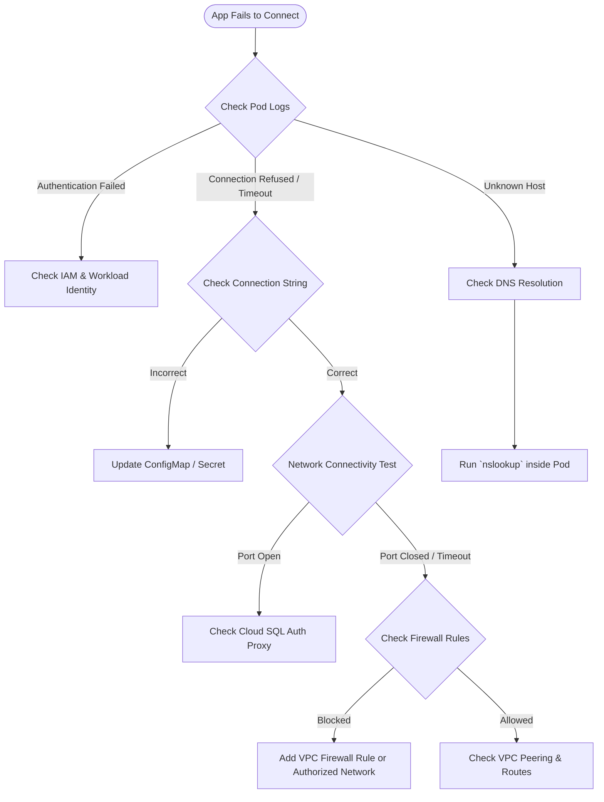

# Debugging Database Connectivity from GKE

When an application running in a Google Kubernetes Engine (GKE) cluster fails to connect to a database (such as Cloud SQL, AlloyDB, or a self-hosted database on Compute Engine), the issue typically falls into one of three categories: Configuration, Networking, or Authentication.

Use this guide to systematically diagnose and fix database connection errors.

## Diagnostic Flowchart

Follow this process to isolate the root cause of the connectivity failure:



## Step 1: Verify the Application Error
First, look at the exact error message the application is throwing.

```bash
kubectl logs <pod-name> -n <namespace>
```
- **"Unknown host" or "Name or service not known"**: Points to a DNS issue.
- **"Connection timed out"**: Points to a network routing or firewall issue.
- **"Connection refused"**: The network reached the destination, but the database port is closed or not listening on that IP.
- **"Access denied" / "Authentication failed"**: Network is fine, but credentials or IAM permissions are incorrect.

## Step 2: Validate the Connection String
Ensure the Pod is receiving the correct connection string, username, and password. These are typically injected via ConfigMaps and Secrets.

```bash
kubectl get secret db-credentials -o yaml
# Decode the base64 value
echo "YmFzZTY0c3RyaW5n" | base64 --decode
```
Verify the IP address, port, and credentials match the database configuration.

## Step 3: Network Diagnostics from the Pod
Exec into the pod (or use an ephemeral debug container) to test the connection exactly as the application experiences it.

```bash
kubectl exec -it <pod-name> -- /bin/sh
```

**1. Test DNS Resolution:**
```bash
nslookup <database-hostname>
```
If this fails, ensure the Kubernetes CoreDNS is functioning, or verify the Cloud DNS configuration if using a private GCP DNS zone.

**2. Test Port Connectivity:**
Use `nc` (netcat), `telnet`, or `curl` to check if the port is reachable.
```bash
# Example for PostgreSQL (5432) or MySQL (3306)
nc -zv <database-ip> 5432
```
If the connection times out:
- Check GCP VPC Firewall Rules (does the rule allow ingress from the GKE Pod CIDR?).
- If using a Public IP for Cloud SQL, check the "Authorized Networks" tab in Cloud SQL.
- If using Private Services Access (VPC Peering), ensure the GKE Pod ranges are correctly exported/imported.

## Step 4: Authentication & Cloud SQL Auth Proxy (If Applicable)
If connecting to Cloud SQL, the recommended method is using the **Cloud SQL Auth Proxy** as a sidecar container.

1. **Check Proxy Logs:**
   If the proxy is failing, the app will get "Connection Refused" when trying to hit `127.0.0.1`.
   ```bash
   kubectl logs <pod-name> -c cloud-sql-proxy
   ```
2. **Workload Identity:**
   The proxy needs IAM permissions (`roles/cloudsql.client`). Verify Workload Identity is configured correctly:
   - Does the Kubernetes Service Account (KSA) have the `iam.gke.io/gcp-service-account` annotation?
   - Does the GCP Service Account (GSA) have the `roles/iam.workloadIdentityUser` binding granting access to the KSA?
   - Can you impersonate the GSA from the pod?

## Step 5: Network Policies
If your cluster uses Kubernetes Network Policies, ensure there isn't an egress rule blocking traffic from your application namespace to the database IP range.

```bash
kubectl get networkpolicies -n <namespace>
```
