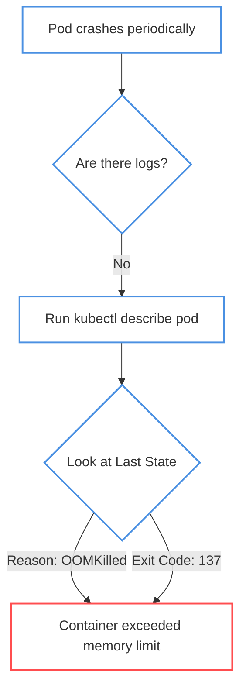
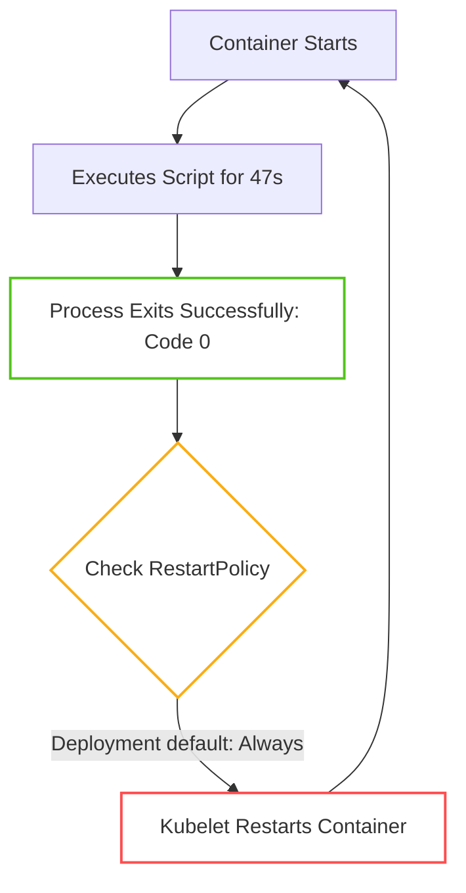
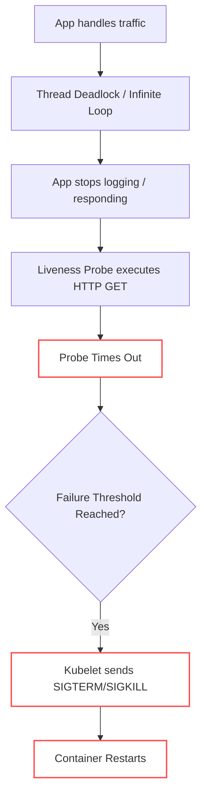

# Tricky Pod Restarts & Silent Crashes

This section covers interview questions involving Pods that crash or restart in non-obvious ways. These scenarios test your ability to look past simple log files and understand the underlying Kubernetes control loop and Linux kernel interactions.

---

## Scenario 1: The "Silent" OOMKilled

> **The Question:**
> "You deploy an application, and it crashes roughly every 60 seconds. You run `kubectl logs <pod-name>`, but the logs say absolutely nothing—not a single error line or stack trace. Why is this happening, and how do you solve it?"

### 🔍 Troubleshooting Steps
If an application is crashing but leaving zero traces in standard output, it means the process was terminated instantly by the host's kernel, skipping the application's internal error handling.

1. Run `kubectl describe pod <pod-name>` and look specifically at the `Containers -> State` section.
2. Check the `Reason` and `Exit Code` of the `Last State`.

### 💡 Root Cause
The container exceeded its `resources.limits.memory`. When this happens, the Linux kernel invokes the OOM (Out of Memory) Killer, which terminates the container process immediately using a `SIGKILL` (Signal 9). 

Because `SIGKILL` cannot be intercepted by the application, it has absolutely no time to write a final log or stack trace. The exit code will be `137` (128 + 9).

### 🛠️ The Fix
* **Immediate Mitigation:** Increase the `resources.limits.memory` in the Pod manifest.
* **Long-term Fix:** Profile the application code for memory leaks (e.g., using a heap dump) and ensure it's properly garbage collecting.

---

## Scenario 2: The "Successful" Crash Loop

> **The Question:**
> "A Pod keeps restarting exactly every 47 seconds. You check `kubectl logs` and it's empty. You run `kubectl describe` and there are no errors or OOM events. The liveness probe looks perfectly fine. What do you check first to reveal the root cause, and how do you fix it?"

### 🔍 Troubleshooting Steps
When a Pod restarts on a highly predictable, exact interval with *no errors*, it usually means the application isn't actually crashing—it's finishing its job.

1. Run `kubectl describe pod <pod-name>` and check the `Exit Code` of the `Last State`.
2. Look for `Exit Code: 0` and `Reason: Completed`.

### 💡 Root Cause
The container is executing a finite task (like a database migration script, a backup routine, or a simple batch script). Once the script finishes, it exits gracefully with an exit code of `0`.

However, the user deployed this container as a `Deployment` (or a raw `Pod` with default settings). A `Deployment` enforces a `RestartPolicy` of `Always`. Kubernetes assumes the container is a long-running web server that stopped unexpectedly, so it immediately restarts it, creating an infinite, "successful" crash loop.

### 🛠️ The Fix
Change the workload type from a `Deployment` to a `Job` (or a `CronJob` if it needs to run on a schedule). A `Job` controller has a `RestartPolicy` of `OnFailure` or `Never`, meaning once the script exits with `0`, the Pod enters a `Completed` state and stays there.

---

## Scenario 3: Liveness Probe Masking a Deadlock

> **The Question:**
> "A Pod is in a restart loop. The application logs show that it handles traffic normally for a few minutes, but then the logs just abruptly stop—no crash, no errors. `kubectl describe` shows Liveness Probe failures. Why isn't the application logging any internal errors?"

### 🔍 Troubleshooting Steps
If an application stops processing but doesn't crash on its own, it is likely frozen.

### 💡 Root Cause
The application has entered a **thread deadlock**, an **infinite loop**, or its connection pool has been completely exhausted. The process is still technically running (so the kernel doesn't kill it), but it's completely locked up and cannot execute the code required to throw an error or print a log.

Because it's locked up, the Kubernetes Liveness Probe times out. After reaching the `failureThreshold`, Kubernetes decides the container is unrecoverable and forcibly restarts it. The probe is actually *saving* the system, but hiding the deadlock from the logs.

### 🛠️ The Fix
* **To Debug:** Temporarily disable or increase the threshold of the Liveness Probe. Exec into the container while it's frozen and trigger a thread dump (e.g., `jstack` for Java, `py-spy` for Python) to see exactly which function the threads are stuck on.
* **To Fix:** Refactor the application code to eliminate the deadlock, implement proper connection pool timeouts, or add circuit breakers.
