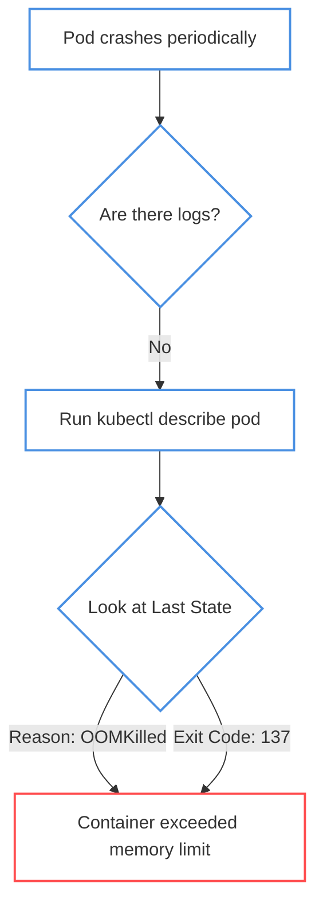
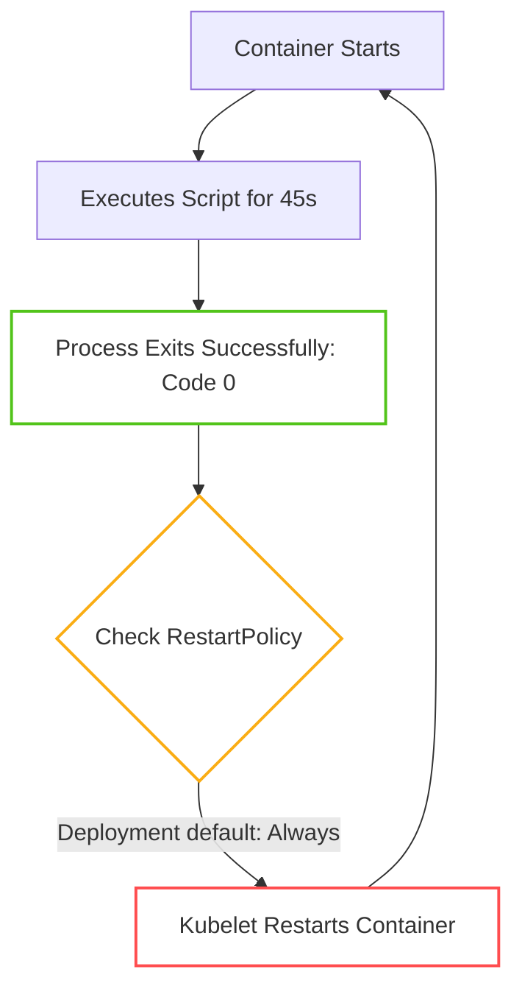
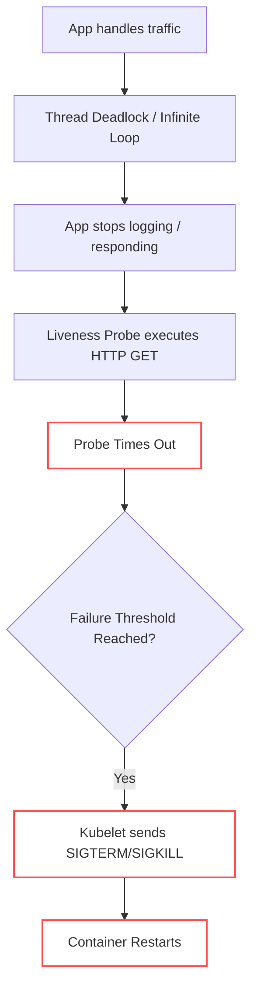

# Tricky Pod restarts and silent crashes

Interview scenarios involving Pods that crash or restart in non-obvious ways, testing your understanding of Kubernetes controllers, signals, and Linux kernel behavior.

---

## Scenario 1: The silent OOMKilled

> **The question:**
> "You deploy an application, and it crashes roughly every 60 seconds. You run `kubectl logs <pod-name>`, but the logs show no output and no stack trace. Why is this happening, and how do you solve it?"

### Troubleshooting steps
When an application crashes leaving zero output in stdout or stderr, the process was terminated directly by the Linux kernel, bypassing application-level signal handlers and logging frameworks:

1. Run `kubectl describe pod <pod-name>` and check the `Containers -> State` section.
2. Inspect the `Reason` and `Exit Code` of the `Last State`.

```mermaid
graph TD
    A[Pod crashes periodically] --> B{Are there logs?}
    B -->|No| C[Run kubectl describe pod]
    C --> D{Look at Last State}
    D -->|Reason: OOMKilled| E[Container exceeded memory limit]
    D -->|Exit Code: 137| E

    classDef standard fill:none,stroke:#4a90e2,stroke-width:2px;
    classDef highlight fill:none,stroke:#ff4d4f,stroke-width:2px;
    class A,B,C,D standard;
    class E highlight;
```

### Root cause
The container exceeded its `resources.limits.memory`. When memory reaches this boundary, the Linux kernel Out-Of-Memory (OOM) Killer terminates the container process immediately with `SIGKILL` (Signal 9).

Because `SIGKILL` cannot be caught or handled by user code, the application cannot flush logs or write stack traces. The resulting exit code is `137` (128 + 9).

### The fix
* **Immediate mitigation:** Increase the `resources.limits.memory` in the Pod or Deployment manifest.
* **Long-term fix:** Profile application memory usage (e.g. heap dumps or memory profilers) to locate leaks or unconstrained cache growth.

---

## Scenario 2: The successful crash loop

> **The question:**
> "A Pod keeps restarting at an exact 45-second interval. `kubectl logs` is empty, and `kubectl describe` shows no errors or OOM events. The liveness probe is healthy. What do you check first to identify the root cause?"

### Troubleshooting steps
When a Pod restarts repeatedly on a predictable schedule with clean exits, the process is completing its execution rather than failing:

1. Run `kubectl describe pod <pod-name>` and check the `Exit Code` of the `Last State`.
2. Check for `Exit Code: 0` and `Reason: Completed`.

```mermaid
graph TD
    Start[Container Starts] --> Process[Executes Script for 45s]
    Process --> ExitZero[Process Exits Successfully: Code 0]
    
    ExitZero --> ControlLoop{Check RestartPolicy}
    ControlLoop -->|Deployment default: Always| Restart[Kubelet Restarts Container]
    
    Restart --> Start
    
    classDef process fill:none,stroke:#52c41a,stroke-width:2px;
    classDef error fill:none,stroke:#ff4d4f,stroke-width:2px;
    classDef warning fill:none,stroke:#faad14,stroke-width:2px;
    
    class ExitZero process;
    class Restart error;
    class ControlLoop warning;
```

### Root cause
The container runs a finite script (such as a database schema migration or batch backup). When the script finishes, the process exits cleanly with exit code `0`.

However, the workload was created as a `Deployment` (which enforces `restartPolicy: Always`). Kubernetes treats an exited process as a stopped service and restarts it immediately, producing a recurring restart loop.

### The fix
Change the workload resource from a `Deployment` to a `Job` (or a `CronJob` for periodic tasks). A `Job` supports `restartPolicy: OnFailure` or `restartPolicy: Never`, moving the Pod to `Completed` upon exit code 0.

---

## Scenario 3: Liveness probe masking a deadlock

> **The question:**
> "A Pod enters a restart loop. Application logs show normal request handling for a few minutes, after which logging stops abruptly with no stack trace or crash report. `kubectl describe` shows liveness probe failures. Why does the application fail to log errors?"

### Troubleshooting steps
When a process remains active in the process table but stops responding to network requests, the runtime is likely blocked on a deadlock or starvation condition:

```mermaid
graph TD
    Traffic[App handles traffic] --> Deadlock[Thread Deadlock / Infinite Loop]
    Deadlock --> Blocked[App stops logging / responding]
    
    Blocked --> Probe[Liveness Probe executes HTTP GET]
    Probe --> Timeout[Probe Times Out]
    
    Timeout --> Threshold{Failure Threshold Reached?}
    Threshold -->|Yes| Kill[Kubelet sends SIGTERM/SIGKILL]
    Kill --> Restart[Container Restarts]

    classDef error fill:none,stroke:#ff4d4f,stroke-width:2px;
    class Timeout,Kill,Restart error;
```

### Root cause
The application entered a **thread deadlock**, an **infinite loop**, or exhausted its database connection pool. The process remains alive in the operating system, but worker threads are blocked from executing request handlers or writing logs.

Because the HTTP health endpoint is unresponsive, the kubelet liveness probe times out. Once consecutive failures reach `failureThreshold`, the kubelet sends `SIGTERM` followed by `SIGKILL` to restart the unresponsive container.

### The fix
* **Diagnostic step:** Temporarily increase `failureThreshold` or `timeoutSeconds` on the liveness probe. Exec into the container during the hang and take a thread dump (`jstack`, `gdb`, or language profiler) to pinpoint where execution is blocked.
* **Remediation:** Fix thread synchronization locks, configure explicit connection pool checkout timeouts, and add health probe endpoints on dedicated background threads.

---

[← Interview scenarios overview](./index.md) | [Networking blackholes and DNS mysteries →](./02-networking-blackholes.md)
