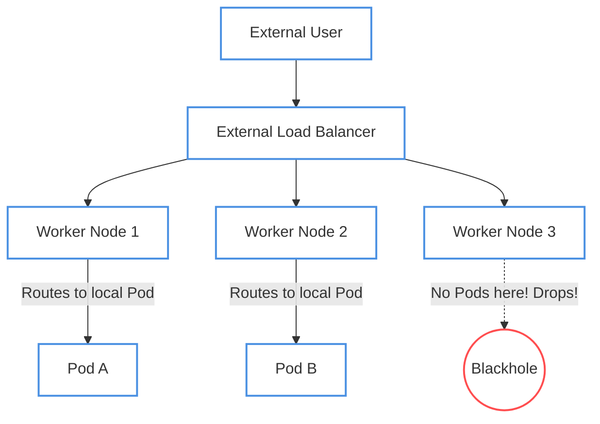

# Networking Blackholes & DNS Mysteries

This section covers interview questions related to Kubernetes Services, networking quirks, and DNS resolution issues. These range from simple misconfigurations to deeply complex Linux kernel and DNS protocol interactions.

---

## Scenario 1: The Disconnected Service (Simple)

> **The Question:**
> "You've deployed a backend Pod and exposed it via a `ClusterIP` Service. When you `curl` the Service IP from another Pod, the connection immediately refuses or times out. However, if you `curl` the backend Pod's IP directly, it works perfectly. What is the most likely cause?"

### 🔍 Troubleshooting Steps
If connecting directly to the Pod works, the network fabric (CNI) is healthy. The issue exists strictly within the routing rules managed by the Service.

1. Check the endpoints of the Service: `kubectl get endpoints <service-name>`
2. You will likely see `<none>` under the endpoints column.

### 💡 Root Cause
A **Selector Mismatch**. The `selector` labels defined in the Service YAML do not perfectly match the `labels` defined in the Pod's metadata. Services do not automatically route traffic; they dynamically look for Pods with matching labels and add their IPs to an `Endpoints` object. If the labels don't match, the Service has nowhere to route the traffic.

### 🛠️ The Fix
Compare `kubectl get pods --show-labels` with the selector in `kubectl get service <service-name> -o yaml`. Ensure the keys and values match exactly.

---

## Scenario 2: The Dropped NodePort (Medium)

> **The Question:**
> "You expose an application via a `NodePort` Service to the outside world. When external traffic hits the nodes, it works fine about 70% of the time. The other 30% of the time, the connection just hangs and eventually drops. What is happening?"

### 🔍 Troubleshooting Steps
Intermittent network failures usually point to load-balancing across unevenly distributed replicas.

### 💡 Root Cause
The Service is configured with `externalTrafficPolicy: Local`, but you have fewer Pod replicas than you have Worker Nodes. 

By default, Kubernetes uses `externalTrafficPolicy: Cluster`, meaning if a request hits Node 3 (which has no Pods), `kube-proxy` will forward the traffic to Node 1 or Node 2. However, when set to `Local`, the node drops the connection if it doesn't host a replica of the Pod locally. If an external Load Balancer round-robins traffic across all 3 nodes, the requests hitting Node 3 will be silently dropped.

### 🛠️ The Fix
Either scale the Deployment to run a replica on every node (often handled via a `DaemonSet` instead of a Deployment), or configure the external Load Balancer's health checks to only route traffic to nodes that are actively reporting healthy Pod endpoints.

---

## Scenario 3: The 5-Second DNS Delay (Complex)

> **The Question:**
> "A microservice built on an Alpine Linux base image is making HTTP requests to an external API. Intermittently, requests take exactly 5 seconds longer than usual. You've confirmed the external API is fast, and network latency is low. What is causing this exact 5-second delay?"

### 🔍 Troubleshooting Steps
A precise, reproducible 5-second delay is a massive clue. It strongly points to a hardcoded network timeout, most notoriously the DNS resolution timeout in the Linux kernel (`resolv.conf`).

### 💡 Root Cause
This is the infamous **ndots:5 & A/AAAA Race Condition**. 

1. By default, Kubernetes configures container `/etc/resolv.conf` with `ndots:5`. This means any domain with fewer than 5 dots (e.g., `api.external.com`) will append the cluster's internal search domains (`.default.svc.cluster.local`, etc.) before trying the external name.
2. Alpine Linux uses the `musl` libc library, which sends both IPv4 (`A`) and IPv6 (`AAAA`) DNS requests **in parallel**.
3. Due to a bug in older versions of CoreDNS or race conditions in `musl` libc, the DNS responses overlap, causing the `musl` resolver to drop the response.
4. The resolver waits for a timeout. The default DNS timeout in Linux? **Exactly 5 seconds**. After 5 seconds, it retries, and the second attempt usually succeeds.

### 🛠️ The Fix
There are several ways to fix this depending on the environment:
1. **The App Fix:** Change the base image from `alpine` to a `debian` or `ubuntu` based image (which uses `glibc` instead of `musl`).
2. **The Config Fix:** Change the `dnsConfig` in the Pod spec to reduce the `ndots` value from `5` to `2` (if you don't need heavy internal cluster DNS resolution).
3. **The DNS Fix:** Enable the `NodeLocal DNSCache` addon in the cluster to cache resolutions locally on the node, drastically reducing UDP packet loss.
