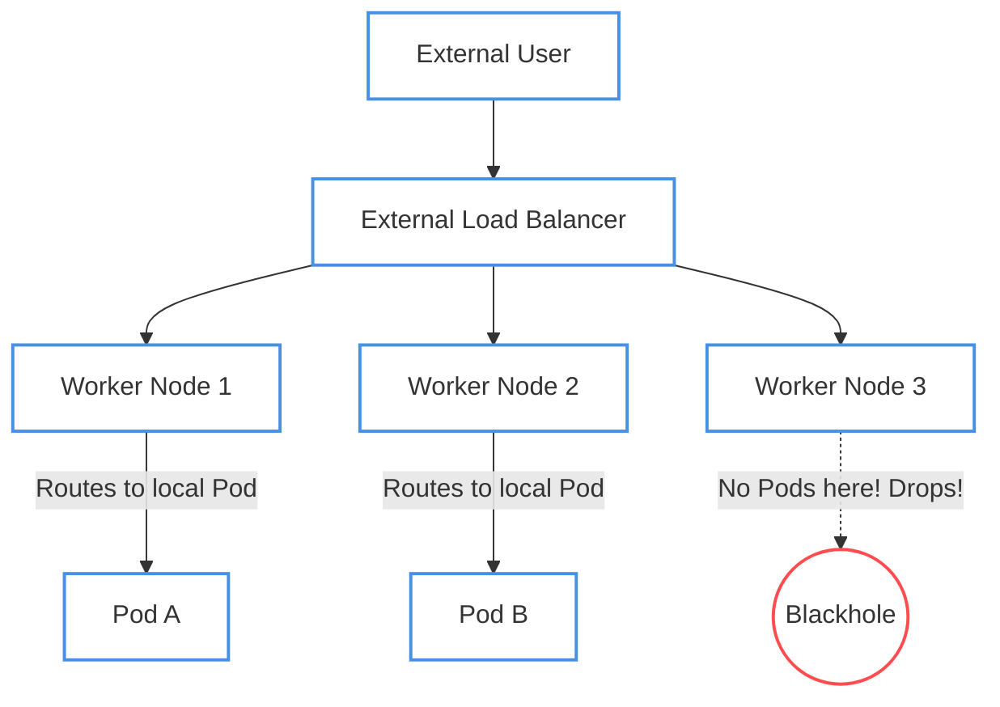

# Networking blackholes and DNS mysteries

Interview scenarios involving Kubernetes Services, packet routing, CoreDNS resolution timeouts, and Linux networking stack behavior.

---

## Scenario 1: The disconnected Service

> **The question:**
> "You deploy a backend Pod and expose it with a `ClusterIP` Service. When you `curl` the Service IP from another Pod, the request times out or receives connection refused. However, connecting directly to the backend Pod IP succeeds. What is the cause?"

### Troubleshooting steps
If connecting directly to the Pod IP succeeds, CNI routing between nodes is healthy. The issue lies in the Service routing configuration:

1. Check the endpoints of the Service: `kubectl get endpoints <service-name>`.
2. Inspect if `<none>` is displayed in the endpoints column.


```mermaid
graph LR
    Client[Client Pod] -->|Traffic| Service[ClusterIP Service]
    Service -.->|Missing Link!| Pods[Backend Pods]
    
    classDef missing fill:none,stroke:#ff4d4f,stroke-width:2px,stroke-dasharray: 5 5;
    classDef healthy fill:none,stroke:#52c41a,stroke-width:2px;
    
    class Service,Pods healthy;
    linkStyle 1 stroke:#ff4d4f,stroke-width:2px;
```

### Root cause
A **selector mismatch**. The labels defined in `spec.selector` on the Service manifest do not match the `metadata.labels` on the target Pods. Services populate `Endpoints` and `EndpointSlices` dynamically by matching these labels. Without a match, the Service has no destination IP addresses to route to.

### The fix
Compare `kubectl get pods --show-labels` with `kubectl get service <service-name> -o yaml` and align the label key-value pairs.

---

## Scenario 2: The dropped NodePort connection

> **The question:**
> "You expose an application through a `NodePort` Service. External client requests succeed approximately 70% of the time, while the remaining 30% of requests hang and time out. What causes this asymmetric behavior?"

### Troubleshooting steps
Intermittent network timeouts across nodes point to load balancing across nodes that lack local Pod replicas:


```mermaid
graph TD
    User[External User] --> LB[External Load Balancer]
    LB --> Node1[Worker Node 1]
    LB --> Node2[Worker Node 2]
    LB --> Node3[Worker Node 3]
    
    Node1 -->|Routes to local Pod| Pod1[Pod A]
    Node2 -->|Routes to local Pod| Pod2[Pod B]
    Node3 -.->|No Pods here! Drops!| Blackhole((Blackhole))
    
    classDef node fill:none,stroke:#4a90e2,stroke-width:2px;
    classDef error fill:none,stroke:#ff4d4f,stroke-width:2px;
    
    class Node1,Node2,Node3 node;
    class Blackhole error;
```

### Root cause
The Service is configured with `externalTrafficPolicy: Local`, and the number of Pod replicas is smaller than the number of worker nodes.

With `externalTrafficPolicy: Local`, a node does not forward incoming NodePort traffic to other nodes in the cluster. If an external load balancer directs traffic to Node 3 (which hosts no replica for that service), the node drops the connection.

### The fix
* Configure the external load balancer health checks to query the node health-check port (`healthCheckNodePort`), routing only to nodes with active local replicas.
* Or change `externalTrafficPolicy` back to `Cluster` if source IP preservation is not required.
* Or scale the workload with a `DaemonSet` to guarantee a replica on every node.

---

## Scenario 3: The 5-second DNS delay

> **The question:**
> "A microservice built on Alpine Linux makes HTTP calls to external APIs. Intermittently, DNS requests add an exact 5-second delay to response latency. The external API and network links are fast. What causes this 5-second delay?"

### Troubleshooting steps
An exact 5-second delay is the default DNS resolver query timeout in the Linux standard library.

### Root cause
This issue stems from the **`ndots:5` setting combined with parallel A and AAAA DNS queries**:

1. By default, Kubernetes sets `ndots:5` in container `/etc/resolv.conf`. Any hostname with fewer than 5 dots (such as `api.github.com`) first searches through internal search domains (`.default.svc.cluster.local`, `.svc.cluster.local`, `.cluster.local`) before querying the fully qualified name.
2. Alpine Linux uses the `musl` libc resolver, which issues IPv4 (`A`) and IPv6 (`AAAA`) queries simultaneously over UDP.
3. In earlier versions of CoreDNS or conntrack tables with race conditions, parallel queries sharing the same source port cause one reply packet to be dropped by Linux netfilter.
4. The resolver waits for the query timeout, which is **5 seconds**. After 5 seconds, the resolver retries and succeeds.

### The fix
1. **Container image change:** Switch the base image to a Debian or Ubuntu base image using `glibc` instead of `musl`.
2. **Pod DNS configuration:** Override `dnsConfig` in the Pod spec to lower `ndots` (e.g., `ndots: 2`) when heavy internal Service suffix searching is not needed:
   ```yaml
   spec:
     dnsConfig:
       options:
         - name: ndots
           value: "2"
   ```
3. **Cluster addon:** Enable `NodeLocal DNSCache` to run a caching DNS daemon on each node, avoiding iptables conntrack race conditions for UDP queries.

---

[← Tricky Pod restarts and silent crashes](./01-tricky-pod-restarts.md) | [Scheduling and storage anomalies →](./03-scheduling-storage.md)
