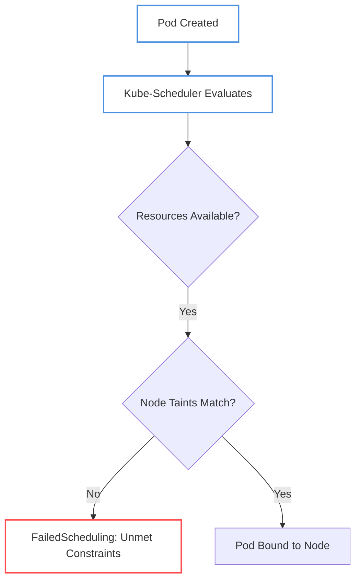
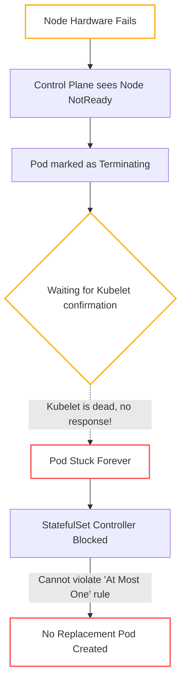

# Scheduling & Storage Anomalies

This section covers interview questions regarding the Kubernetes scheduler, node affinity, taints, and persistent storage. These questions evaluate your understanding of how Kubernetes allocates resources and handles infrastructure state.

---

## Scenario 1: The Ghost Pending Pod (Simple)

> **The Question:**
> "You deploy a Pod, but it stays permanently in the `Pending` state. You run `kubectl describe nodes` and verify that the cluster has plenty of free CPU and Memory available. Why is the Pod not being scheduled?"

### 🔍 Troubleshooting Steps
If resources are available but a Pod isn't scheduling, the Kubernetes Scheduler is explicitly rejecting the assignment based on constraints.

1. Run `kubectl describe pod <pod-name>`.
2. Look at the `Events` at the bottom of the output. You will likely see a `FailedScheduling` warning generated by the `default-scheduler`.



### 💡 Root Cause
There are a few common constraints that block scheduling even when resources are free:
1. **Node Taints:** The node has a Taint (e.g., `node-role.kubernetes.io/master:NoSchedule`) and the Pod does not have the corresponding `Toleration`.
2. **Node Selector / Affinity:** The Pod explicitly requests to be scheduled on a node with specific labels (e.g., `disktype: ssd`), but no nodes in the cluster have that label.
3. **PVC Not Bound:** The Pod is requesting a `PersistentVolumeClaim` that hasn't been provisioned yet.

### 🛠️ The Fix
Read the explicit error in the `FailedScheduling` event. If it mentions taints, add the correct `tolerations` to the Pod spec. If it mentions node selectors, ensure your node labels match the Pod's `nodeAffinity` requirements.

---

## Scenario 2: The Stuck PersistentVolumeClaim (Medium)

> **The Question:**
> "You create a `PersistentVolumeClaim` (PVC) requesting 10GB of storage. However, the PVC is stuck in the `Pending` state indefinitely. What is causing this?"

### 🔍 Troubleshooting Steps
Storage in modern Kubernetes is usually provisioned dynamically via a StorageClass. If a PVC is pending, the dynamic provisioner is either missing, misconfigured, or intentionally waiting.

### 💡 Root Cause
1. **Missing StorageClass:** The PVC requests a `storageClassName` that does not exist in the cluster.
2. **Missing CSI Driver:** The cluster is requesting cloud storage (like AWS EBS or GCP Persistent Disk), but the corresponding Container Storage Interface (CSI) driver is not installed on the cluster.
3. **VolumeBindingMode:** The StorageClass is configured with `volumeBindingMode: WaitForFirstConsumer`. 

The `WaitForFirstConsumer` scenario is the most common trick question. In this mode, the PVC *intentionally* stays in the `Pending` state until a Pod that uses the PVC is actually created and scheduled to a specific node. It does this to ensure the cloud volume is created in the exact same Availability Zone (AZ) as the Node the Pod gets scheduled on.

### 🛠️ The Fix
Run `kubectl get storageclass`. If the binding mode is `WaitForFirstConsumer`, simply deploy a Pod that mounts the PVC. The PVC will immediately bind once the Pod is scheduled. If the StorageClass is entirely missing, deploy the appropriate CSI driver.

---

## Scenario 3: The Zombie StatefulSet (Complex)

> **The Question:**
> "A node in your cluster suffers a catastrophic hardware failure. You have a `StatefulSet` running a database Pod on that dead node. The Pod transitions to `Terminating` but gets completely stuck there. The StatefulSet refuses to spin up a replacement Pod on a healthy node. Why is this happening and how do you recover it safely?"

### 🔍 Troubleshooting Steps
StatefulSets provide strict guarantees: *no two Pods with the same identity will ever run concurrently*. This is to prevent split-brain scenarios and data corruption.



### 💡 Root Cause
When a node dies completely, its `kubelet` process dies with it. The Kubernetes control plane marks the Pod as `Terminating`, but it requires confirmation from the local `kubelet` that the container process has actually stopped before it completely deletes the Pod object.

Because the `kubelet` is dead, that confirmation never arrives. The Pod stays stuck in `Terminating`. Because the Pod object technically still exists, the `StatefulSet` controller's strict "At Most One" guarantee kicks in. It refuses to spin up a replacement because it cannot 100% guarantee that the original database process isn't still secretly writing to the storage volume.

### 🛠️ The Fix
You must forcibly delete the Pod from the control plane using `--force`. 
```bash
kubectl delete pod <pod-name> --grace-period=0 --force
```
**CRITICAL WARNING:** Before running this command in a real interview or production scenario, you must explicitly state that you have physically verified the node is dead (e.g., powered off at the hypervisor or AWS console). If the node is merely network-partitioned but the database is still running, force-deleting the Pod will cause the StatefulSet to spin up a second database, leading to dual-writers and catastrophic storage corruption.
