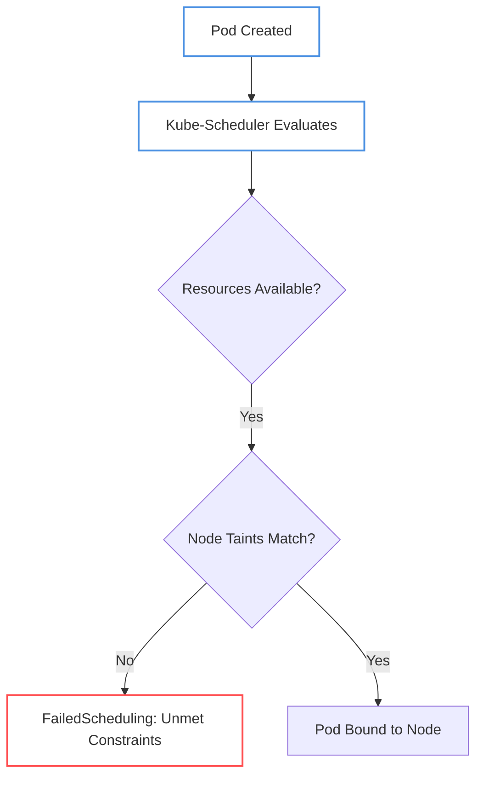
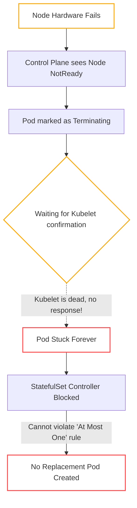

# Scheduling and storage anomalies

Interview scenarios covering the Kubernetes scheduler, node affinity, taints, volume binding modes, and StatefulSet pod identity guarantees.

---

## Scenario 1: The ghost Pending Pod

> **The question:**
> "You deploy a Pod, but it remains indefinitely in the `Pending` state. `kubectl describe nodes` confirms that all cluster nodes have substantial unallocated CPU and memory. Why is the Pod not scheduling?"

### Troubleshooting steps
When cluster compute capacity is available but a Pod fails to schedule, the scheduler rejected the Pod against explicit placement constraints:

1. Run `kubectl describe pod <pod-name>`.
2. Inspect the `Events` section at the bottom for `FailedScheduling` events emitted by `default-scheduler`.


```mermaid
graph TD
    Pod[Pod Created] --> Scheduler[Kube-Scheduler Evaluates]
    Scheduler --> CheckRes{Resources Available?}
    CheckRes -->|Yes| CheckTaints{Node Taints Match?}
    
    CheckTaints -->|No| Reject[FailedScheduling: Unmet Constraints]
    CheckTaints -->|Yes| Schedule[Pod Bound to Node]
    
    classDef standard fill:none,stroke:#4a90e2,stroke-width:2px;
    classDef error fill:none,stroke:#ff4d4f,stroke-width:2px;
    
    class Pod,Scheduler standard;
    class Reject error;
```

### Root cause
Common constraints that block scheduling regardless of CPU/memory capacity include:
1. **Node taints:** Nodes have taints applied (such as `node-role.kubernetes.io/control-plane:NoSchedule`) and the Pod lacks matching `tolerations`.
2. **Node selectors and affinity:** The Pod defines `nodeSelector` or `nodeAffinity` matching labels (e.g. `topology.kubernetes.io/zone: us-central1-a`) that no available node possesses.
3. **Unbound PVCs:** The Pod references a `PersistentVolumeClaim` that has not yet bound to a storage volume.

### The fix
Check the detailed reason in the `FailedScheduling` event:
* If node taints caused the rejection, add matching tolerations to the Pod template.
* If node selector labels mismatch, label the target nodes or adjust the Pod manifest.

---

## Scenario 2: The stuck PersistentVolumeClaim

> **The question:**
> "You create a `PersistentVolumeClaim` (PVC) requesting 10Gi of storage. The PVC remains in the `Pending` state indefinitely. What causes this?"

### Troubleshooting steps
Storage in Kubernetes is dynamically provisioned through a StorageClass. A pending PVC indicates either a missing driver or deferred volume binding.

### Root cause
1. **Missing StorageClass:** The requested `storageClassName` is not registered in the cluster.
2. **Missing CSI driver:** The cloud storage provisioner plugin (such as AWS EBS CSI or GCP PD CSI) is not installed or unhealthy.
3. **Volume binding mode:** The StorageClass sets `volumeBindingMode: WaitForFirstConsumer`.

`WaitForFirstConsumer` is intentional behavior. The storage provisioner delays disk creation until a Pod referencing the PVC is scheduled to a specific node. This guarantees the cloud block storage volume is provisioned in the same availability zone as the scheduled node.

### The fix
Check the StorageClass configuration: `kubectl get storageclass <class-name> -o yaml`. If `volumeBindingMode` is `WaitForFirstConsumer`, deploy the Pod that mounts the PVC; the volume will bind immediately during pod scheduling. If the provisioner is missing, install the required CSI driver.

---

## Scenario 3: The terminating StatefulSet Pod on a failed node

> **The question:**
> "A worker node experiences complete hardware failure. A `StatefulSet` running a database Pod on that dead node marks the Pod as `Terminating`, but it stays stuck indefinitely. The StatefulSet controller does not create a replacement Pod on a healthy node. Why does this happen, and how do you resolve it safely?"

### Troubleshooting steps
StatefulSets enforce strict single-instance guarantees: **at most one Pod with a given ordinal identity may run at any time**.


```mermaid
graph TD
    NodeDead[Node Hardware Fails] --> ControlPlane[Control Plane sees Node NotReady]
    ControlPlane --> MarkTerminating[Pod marked as Terminating]
    
    MarkTerminating --> KubeletWait{Waiting for Kubelet confirmation}
    KubeletWait -.->|Kubelet is dead, no response!| Stuck[Pod Stuck Forever]
    
    Stuck --> StatefulSet[StatefulSet Controller Blocked]
    StatefulSet -->|Cannot violate 'At Most One' rule| NoReplacement[No Replacement Pod Created]
    
    classDef error fill:none,stroke:#ff4d4f,stroke-width:2px;
    classDef warning fill:none,stroke:#faad14,stroke-width:2px;
    
    class Stuck,NoReplacement error;
    class NodeDead,KubeletWait warning;
```

### Root cause
When a worker node experiences sudden power loss or failure, the node `kubelet` stops communicating. The Kubernetes control plane transitions the Pod status to `Terminating`, but it waits for the node `kubelet` to acknowledge container deletion before removing the Pod from `etcd`.

Because the node is dead, that confirmation is never sent. The StatefulSet controller cannot create `db-0` on another node because it cannot verify that the original database process on the failed node is no longer writing to the underlying storage volume (avoiding split-brain data corruption).

### The fix
After verifying that the failed host node is powered off at the infrastructure layer (e.g. AWS console or hypervisor):
```bash
kubectl delete pod <pod-name> --grace-period=0 --force
```
Force deletion removes the Pod record from the API server, enabling the StatefulSet controller to spawn the replacement Pod on an active node.

---

[← Networking blackholes and DNS mysteries](./02-networking-blackholes.md) | [Interview scenarios overview](./index.md)
