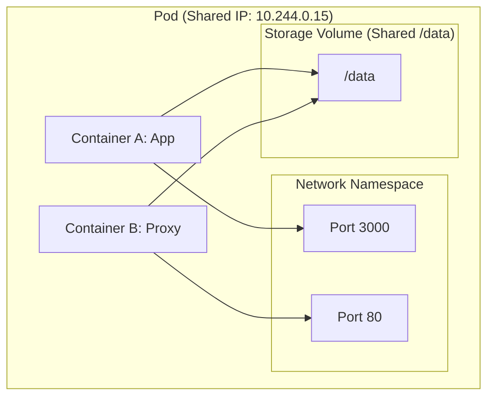

# Lesson 0001: Pod Anatomy & Debugging CrashLoopBackOff

## 1. What is a Pod?

A  **Pod**  is the smallest deployable unit in Kubernetes. Unlike Docker where you manage individual containers directly, Kubernetes manages Pods, which act as a wrapper around one or more containers.

Containers inside the same Pod share:

* **Network Namespace:**  They share an IP address and port space. They can talk to each other via `localhost`.
* **Storage Volumes:**  You can mount shared storage to be accessed by multiple containers in the same Pod.

!!! note "Analogy: Pods vs. Servers"
    Think of a Pod as a physical server or VM. The containers inside it are separate processes running on that server. They share the host resource boundaries.

### Pod Anatomy Diagram



## 2. Demystifying CrashLoopBackOff

One of the most common issues you will face in your job is a Pod status showing `CrashLoopBackOff`. This is  **not**  an error code from your container. It is Kubernetes telling you:

> "I started your container, but it exited or crashed. I tried restarting it, but it crashed again. I am now waiting before trying again to avoid overloading the node."

The time Kubernetes waits between restarts (the backoff delay) increases exponentially (10s, 20s, 40s, up to a limit of 5 minutes).

## 3. The 3-Step Debugging Workflow

When a pod crashes, use the following sequence in your terminal:

### Step A: Find the broken pod

```bash
kubectl get pods
```

### Step B: Inspect the lifecycle events

```bash
kubectl describe pod <pod-name>
```

Look at the  **Events**  section at the bottom. Check the `Exit Code` in the container status. If the exit code is non-zero (e.g., 1 or 137), your application crashed.

### Step C: Read the previous logs

```bash
kubectl logs <pod-name> --previous
```

!!! tip "Key Tip: Inspecting Previous Runs"
    Standard `kubectl logs` shows the logs of the *current* container run. Since the container crashed and restarted, the current run might be empty or just starting up. Passing `--previous` retrieves the logs of the run that actually crashed.

## Test Your Knowledge

### 1. Which command outputs the events indicating why a pod failed to start?

- [ ] **A.** kubectl describe pod web
- [ ] **B.** kubectl retrieve pod web

<details>
<summary><b>Answer & Explanation</b></summary>

**Correct Answer:** A

Correct! "kubectl describe pod web" displays configuration and event history for the pod. "retrieve" is not a valid kubectl command.
</details>

### 2. If a Pod is restarting due to CrashLoopBackOff, how do you see the crash reason?

- [ ] **A.** kubectl logs pod --previous
- [ ] **B.** kubectl logs pod --tracking

<details>
<summary><b>Answer & Explanation</b></summary>

**Correct Answer:** A

Correct! "--previous" retrieves logs from the previous instance of the container, allowing you to see the crash details. "--tracking" is invalid.
</details>

## Interactive Win: Hands-on Exercise

Let's create a broken pod in your GKE cluster and debug it using your new skills.

**Step 1:**  Save the following YAML to a file named `broken-pod.yaml` in your workspace:

```yaml
apiVersion: v1
kind: Pod
metadata:
  name: challenge-pod
spec:
  containers:
  - name: app-container
    image: alpine:latest
    command: ["/bin/sh", "-c"]
    args:
    - "echo 'Starting server...'; sleep 3; echo 'Fatal Error: DB_PASSWORD is not set!'; exit 1;"
```

**Step 2:**  Apply the file to your GKE cluster:

```bash
kubectl apply -f broken-pod.yaml
```

**Step 3:**  Use `kubectl get pods`, `kubectl describe pod challenge-pod`, and `kubectl logs challenge-pod --previous` to discover why it crashed.

## Recommended Resource

Read the official guide on [Determining the Reason for Pod Failure](https://kubernetes.io/docs/tasks/debug/debug-application/determine-reason-pod-failure/) in the Kubernetes Documentation.

**Got stuck or have a question?**  Just type your question or share your terminal error in our chat, and we'll troubleshoot it together!

---

[← Home](../index.md) | [Lesson 2: Node Scheduling & Deployments →](./0002-node-scheduling-deployment-strategies-autoscaling.md)
