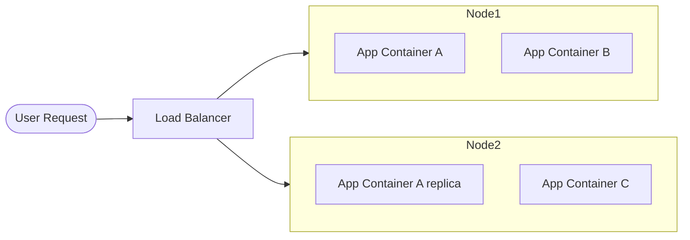
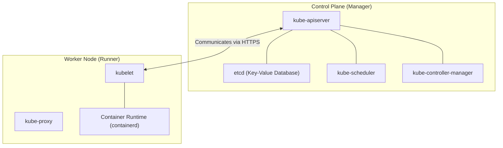

# Lesson 0001: Introduction to Kubernetes & Prerequisites

Before diving into deploying containerized workloads, it is essential to understand what container orchestration is, why Kubernetes has become the industry standard, and the conceptual baseline required to learn it.

---

## 1. What is Kubernetes?

**Kubernetes** (often abbreviated as **K8s**, replacing the 8 letters between "K" and "s") is an open-source container orchestration engine. It automates the deployment, scaling, management, and networking of containerized applications.

### The Containerization Shift
In traditional hosting, apps ran directly on virtual or physical servers. If an app crashed or needed more resources, you had to manage the virtual machine. Containers (like Docker) isolated applications from the underlying host OS. However, managing hundreds of containers across multiple servers manually is impossible. 

This is where Kubernetes fits: it acts as a cluster manager, coordinating which host runs which container.

### Core Value Propositions:
* **High Availability (Self-Healing):** If a container crashes, K8s automatically restarts it. If a host node dies, K8s reschedules its containers onto healthy nodes.
* **Horizontal Scaling:** Scales container replicas up or down dynamically based on CPU/Memory usage or manual commands.
* **Service Discovery & Load Balancing:** Gives containers their own IP addresses and a single DNS name for a set of containers, load-balancing traffic between them.
* **Automated Rollouts/Rollbacks:** Deploys new application versions progressively while monitoring health, rolling back automatically if failures occur.

---

## 2. Kubernetes High-Level Architecture

A Kubernetes cluster is divided into two main parts: the **Control Plane** and the **Worker Nodes**.

### The Control Plane (The Brain)
Responsible for maintaining the desired state of the cluster:

* **`kube-apiserver`:** The entry point for all administrative requests (via `kubectl` or API calls).
* **`etcd`:** A distributed key-value store that serves as the single source of truth for cluster state.
* **`kube-scheduler`:** Watches for newly created Pods and assigns them to worker nodes based on resource availability.
* **`kube-controller-manager`:** Runs daemon controllers that regulate cluster state (e.g., node status, replica count).

### Worker Nodes (The Muscle)
Responsible for running the containerized workloads:

* **`kubelet`:** An agent that runs on each node, ensuring that containers are running and healthy inside their Pods.
* **`kube-proxy`:** A network proxy that maintains network rules on nodes, enabling service-to-service communication.
* **Container Runtime:** The software responsible for running containers (e.g., `containerd` or Docker).

---

## 3. Learning Prerequisites

To successfully learn Kubernetes, you should be comfortable with the following foundational concepts:

### A. Docker & Container Basics
You should know how to package apps into containers.

* **Prerequisite check:** Can you write a basic `Dockerfile`? Do you know the difference between an image (read-only blueprint) and a container (running instance)? Can you run multi-container setups locally using `docker-compose`?
* *Recommended read:* [Docker Get Started Guide](https://docs.docker.com/get-started/).

### B. Basic Networking Concepts
K8s handles complex networking automatically, but you must know:

* **IP Addresses & Ports:** How processes bind to ports and communicate.
* **DNS (Domain Name System):** Resolving hostnames to IP addresses.
* **HTTP Protocols:** Request headers, status codes (2xx, 3xx, 4xx, 5xx).

### C. Command Line (CLI) Familiarity
Most interactions with Kubernetes happen via `kubectl` (the command-line interface).

* You should be comfortable running terminal commands, navigating directories, and editing text files (YAML/JSON formatting).

---

## Test Your Knowledge

### 1. Which component in the Kubernetes control plane is responsible for selecting the worker node that will host a new container workload?
- [ ] **A.** kube-controller-manager
- [ ] **B.** kube-scheduler
- [ ] **C.** etcd

<b>Answer & Explanation</b>

**Correct Answer:** B

**Explanation:** The scheduler watches for Pods with no node assigned, and selects the best node for them based on resource requests and scheduling taints/tolerations.

### 2. What is the database used by the Control Plane to store the absolute state and configuration of the cluster?
- [ ] **A.** PostgreSQL
- [ ] **B.** Redis
- [ ] **C.** etcd

<b>Answer & Explanation</b>

**Correct Answer:** C

**Explanation:** `etcd` is a highly-available, distributed key-value store used exclusively by Kubernetes to persist all cluster configuration and state.

---

[← Home](../index.md) | [Lesson 2: Pod Anatomy & Configuration →](./0002-pod-anatomy.md)
