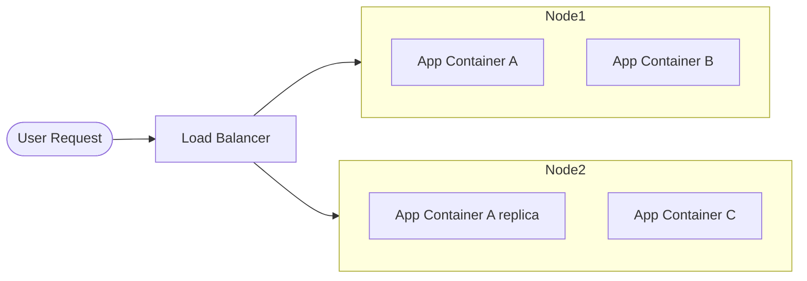
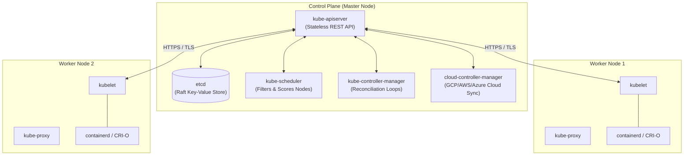
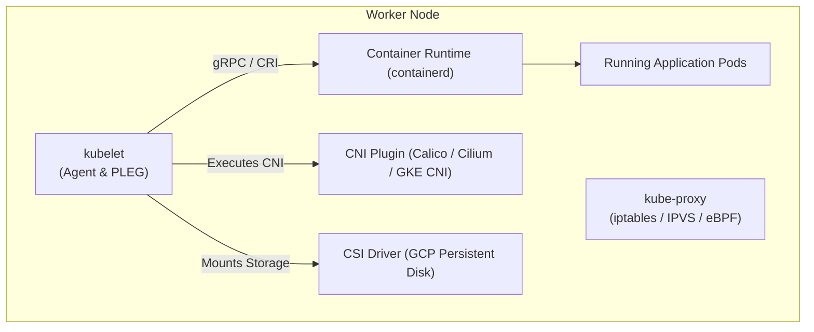

# Lesson 0001: Introduction to Kubernetes architecture and prerequisites

## Fast interview summary and cheatsheet

| Component | Layer | Primary responsibility | Key technical fact |
| :--- | :--- | :--- | :--- |
| **`kube-apiserver`** | Control Plane | REST API gateway, AuthN/AuthZ, admission control | Only component that reads and writes directly to `etcd`. Stateless and scales horizontally. |
| **`etcd`** | Control Plane | Distributed key-value database | Uses Raft consensus. Quorum = $\lfloor N/2 \rfloor + 1$. Requires odd numbers of nodes (3, 5). |
| **`kube-scheduler`** | Control Plane | Assigns unscheduled Pods to optimal nodes | Two-phase cycle: filtering (predicates) and scoring (priorities). |
| **`kube-controller-manager`** | Control Plane | Runs control loops to enforce desired state | Bundles Node, ReplicaSet, Deployment, and EndpointSlice controllers. |
| **`kubelet`** | Worker Node | Node agent; manages container lifecycles | Communicates with container runtime via CRI, networking via CNI, storage via CSI. |
| **`kube-proxy`** | Worker Node | Implements Service networking and load balancing | Operates in `iptables`, `IPVS`, or `eBPF` modes. |
| **Container Runtime** | Worker Node | Executes containers (e.g. `containerd`, `CRI-O`) | Complies with OCI runtime specification (`runc`). |

---

## 1. What is Kubernetes?

Kubernetes (often abbreviated as K8s, replacing the 8 letters between "K" and "s") is an open-source container orchestration engine that automates deployment, scaling, management, and networking of containerized applications across distributed worker nodes.


```mermaid
graph LR
    User([User Request]) --> LB[Load Balancer]
    LB --> Node1[Worker Node 1]
    LB --> Node2[Worker Node 2]
    subgraph Node1
        PodA[App Container A]
        PodB[App Container B]
    end
    subgraph Node2
        PodC[App Container A replica]
        PodD[App Container C]
    end
```

### Core features
* **High availability and self-healing:** Restarts failed containers, reschedules Pods when worker nodes fail, and replaces unresponsive nodes.
* **Horizontal autoscaling:** Scales container replicas dynamically based on CPU, memory, or custom external metrics through HPA and KEDA.
* **Service discovery and load balancing:** Assigns each Pod its own IP address and exposes a single DNS name for a set of containers, balancing traffic across healthy endpoints.
* **Automated rollouts and rollbacks:** Coordinates progressive releases (RollingUpdate, Blue/Green, Canary) and rolls back if health checks fail.

---

## 2. Kubernetes control plane architecture

The control plane makes global decisions about the cluster, detects and responds to cluster events, and maintains desired state.


```mermaid
graph TD
    subgraph ControlPlane ["Control Plane (Master Node)"]
        APIServer["kube-apiserver\n(Stateless REST API)"]
        Etcd[("etcd\n(Raft Key-Value Store)")]
        Scheduler["kube-scheduler\n(Filters & Scores Nodes)"]
        Controller["kube-controller-manager\n(Reconciliation Loops)"]
        CloudController["cloud-controller-manager\n(GCP/AWS/Azure Cloud Sync)"]
        
        APIServer <--> Etcd
        APIServer <--> Scheduler
        APIServer <--> Controller
        APIServer <--> CloudController
    end
    
    subgraph WorkerNode1 ["Worker Node 1"]
        Kubelet1["kubelet"]
        Proxy1["kube-proxy"]
        Runtime1["containerd / CRI-O"]
        Kubelet1 --- Runtime1
    end

    subgraph WorkerNode2 ["Worker Node 2"]
        Kubelet2["kubelet"]
        Proxy2["kube-proxy"]
        Runtime2["containerd / CRI-O"]
        Kubelet2 --- Runtime2
    end
    
    APIServer <-->|HTTPS / TLS| Kubelet1
    APIServer <-->|HTTPS / TLS| Kubelet2
```

### Control plane components

1. **`kube-apiserver` (API Gateway):**
   - Serves as the communication hub. Every internal and external component communicates exclusively through the API Server over HTTPS.
   - Runs three validation stages in order: authentication (certificates, OIDC, webhooks), authorization (RBAC, ABAC), and admission control (mutating and validating webhooks).

2. **`etcd` (State Storage):**
   - A strongly consistent, distributed key-value store using the Raft consensus algorithm.
   - Stores the complete state and specifications of all cluster objects. Only `kube-apiserver` reads or writes directly to `etcd`.

3. **`kube-scheduler` (Pod Placement):**
   - Assigns unscheduled Pods (`spec.nodeName` is empty) to healthy nodes.
   - Evaluates node fit in two phases:
     - **Filtering (Predicates):** Removes nodes that lack required CPU/memory, ports, or matching taints and tolerations.
     - **Scoring (Priorities):** Ranks the remaining nodes to find the best match, such as spreading Pods evenly across failure domains.

4. **`kube-controller-manager` (Reconciliation Loops):**
   - Runs continuous control loops that compare desired state in `etcd` with actual state reported by nodes, executing mutations to reconcile drift.
   - Bundles the Node, Deployment, ReplicaSet, EndpointSlice, and Job controllers.

---

## 3. Worker node architecture

Worker nodes host application containers and execute commands issued by the control plane.


```mermaid
graph TD
    subgraph Worker["Worker Node"]
        Kubelet["kubelet\n(Agent & PLEG)"]
        Proxy["kube-proxy\n(iptables / IPVS / eBPF)"]
        CRI["Container Runtime (containerd)"]
        CNI["CNI Plugin (Calico / Cilium / GKE CNI)"]
        CSI["CSI Driver (GCP Persistent Disk)"]
        
        Kubelet -->|gRPC / CRI| CRI
        Kubelet -->|Executes CNI| CNI
        Kubelet -->|Mounts Storage| CSI
        CRI --> Pods["Running Application Pods"]
    end
```

1. **`kubelet`:**
   - The node agent registered with the API server. It receives `PodSpec` objects and keeps the corresponding containers running and healthy.
   - Implements PLEG (Pod Lifecycle Event Generator) to inspect container runtime states periodically and report health status back to the control plane.

2. **`kube-proxy`:**
   - A network proxy on each node. It maintains network routing rules using `iptables`, `IPVS`, or eBPF so connections to Service virtual IPs route to healthy backend Pods.

3. **Container Runtime (`CRI`):**
   - The low-level software that executes containers. Modern clusters use `containerd` or `CRI-O` through the gRPC Container Runtime Interface (`CRI`).

---

## Interview deep-dives and scenarios

??? question "Interview scenario: What happens under the hood when you run `kubectl apply -f deployment.yaml`?"
    **Step-by-step architectural execution:**
    1. **Client side:** `kubectl` parses the YAML, validates syntax locally, and sends an HTTP POST or PUT request to `kube-apiserver`.
    2. **API server processing:**
       - **Authentication:** Validates caller identity using client TLS certificates, bearer tokens, or OIDC.
       - **Authorization:** Checks RBAC permissions to verify the caller can create Deployments in the target namespace.
       - **Mutating admission controllers:** Injects default values, sidecars, or storage classes.
       - **Schema validation:** Verifies structural correctness against the OpenAPI schema.
       - **Validating admission controllers:** Enforces cluster security policies (such as Gatekeeper or Kyverno).
    3. **Persistence:** `kube-apiserver` writes the `Deployment` record into `etcd`.
    4. **Deployment controller:** Watches the API server, notices the new `Deployment`, and generates a child `ReplicaSet` object.
    5. **ReplicaSet controller:** Notices the `ReplicaSet` and creates the requested number of `Pod` objects with `spec.nodeName` left empty.
    6. **kube-scheduler:** Filters and scores available nodes for unbound Pods, picks the best node, and writes a binding back to `kube-apiserver` to update `spec.nodeName`.
    7. **kubelet (target node):** Detects Pods assigned to its node.
       - Invokes the CSI plugin to attach and mount required storage volumes.
       - Invokes the CNI plugin to configure networking and assign an IP address to the Pod network namespace.
       - Calls the container runtime (containerd) over CRI to pull images and start containers.
    8. **Status update:** `kubelet` reports Pod status (`Running`) back to `kube-apiserver`, which updates `etcd`.

??? question "Interview question: What happens if `etcd` loses quorum or one etcd member fails?"
    **Quorum formula:** $Q = \lfloor N/2 \rfloor + 1$.
    - In a 3-node cluster, quorum is 2. The cluster tolerates 1 node failure.
    - In a 5-node cluster, quorum is 3. The cluster tolerates 2 node failures.

    **If one node fails (quorum maintained):**
    - The remaining nodes elect a new leader if the failed node was the leader, and continue serving read and write operations without interruption.

    **If quorum is lost (more than $N/2$ nodes down):**
    - `etcd` drops into read-only mode to prevent split-brain data corruption.
    - `kube-apiserver` rejects all write requests (`kubectl apply`, scaling, scheduling new Pods).
    - Existing application Pods continue running on worker nodes without disruption, but the cluster cannot heal, restart dead pods, or schedule workloads until quorum returns.

??? question "Interview question: What happens to running workloads if the entire control plane crashes?"
    **Data plane isolation:** Worker nodes operate independently from the control plane. Existing Pods, containers, and network routing rules (`iptables` or `IPVS` written by `kube-proxy`) remain active in kernel space.

    **Impact:**
    - Traffic to existing Pods continues flowing normally.
    - The cluster loses all orchestration capabilities: no new Pods can be scheduled, crashing Pods will not restart, autoscaling freezes, and `kubectl` commands fail with connection errors.

??? question "Interview question: Differentiate Docker, containerd, CRI, OCI, and runc."
    - **OCI (Open Container Initiative):** The open specification defining container image formats (`image-spec`) and runtime execution (`runtime-spec`).
    - **runc:** The reference CLI tool that interacts directly with Linux kernel cgroups and namespaces to spawn containers.
    - **CRI (Container Runtime Interface):** The gRPC interface Kubernetes uses to decouple `kubelet` from specific container runtimes.
    - **containerd / CRI-O:** High-level container runtimes that implement the CRI gRPC API, download images, unpack storage snapshots, and call `runc` to execute containers.
    - **Docker:** A developer platform that bundles `containerd`, networking, build tools (`buildx`), and a daemon. Kubernetes dropped direct Dockershim support in v1.24 in favor of direct CRI runtimes.

---

## Common production pitfalls and interview traps

??? warning "Production trap: Running an even number of `etcd` nodes"
    Adding an even node increases failure surface without increasing fault tolerance.
    - A 3-node cluster needs 2 nodes for quorum (tolerates 1 failure).
    - A 4-node cluster needs 3 nodes for quorum (tolerates only 1 failure, but introduces 4 possible points of failure).
    - Always run 3 or 5 `etcd` nodes.

??? warning "Production trap: Assuming `kubectl` communicates directly with worker nodes"
    `kubectl` never communicates with worker nodes or `kubelet` directly (unless using sub-commands mediated through the API server). All client requests are authenticated and processed exclusively by `kube-apiserver`.

---

## Hands-on verification and diagnostics

```bash
# 1. Check control plane component health
kubectl get componentstatuses # (Legacy clusters)
kubectl cluster-info

# 2. Inspect node health and status
kubectl get nodes -o wide

# 3. View node allocatable resources and capacity
kubectl describe node <NODE_NAME> | grep -A 8 "Allocatable:"

# 4. View API Server real-time logs (Control Plane)
kubectl logs -n kube-system -l component=kube-apiserver --tail=50
```

---

## Test your knowledge

1. Which Kubernetes component is the only service permitted to read and write directly to `etcd`?
   - [ ] A) The kube-apiserver component
   - [ ] B) The kube-scheduler component
   
   Answer: A. `kube-apiserver` is the single gateway to `etcd`. All other components (scheduler, controller-manager, kubelet) communicate through the API server.

2. In a 5-node `etcd` cluster, what is the minimum quorum required to accept state writes, and how many node failures can it tolerate?
   - [ ] A) Quorum is 3 nodes and it tolerates 2 node failures
   - [ ] B) Quorum is 4 nodes and it tolerates 1 node failure
   
   Answer: A. The quorum formula is $\lfloor 5/2 \rfloor + 1 = 3$. The cluster can lose up to 2 nodes while maintaining write availability.

---

## Recommended primary resources
- [Kubernetes architecture concepts](https://kubernetes.io/docs/concepts/architecture/)
- [etcd Raft consensus algorithm FAQ](https://etcd.io/docs/v3.5/learning/why/)

---

[← Home](../index.md) | [Lesson 2: Pod anatomy, multi-container patterns, and lifecycle →](./0002-pod-anatomy.md)
