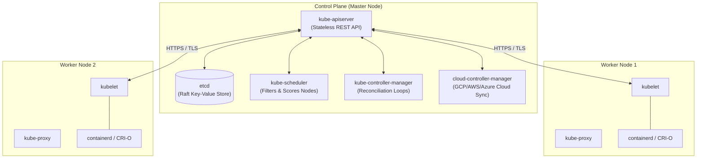
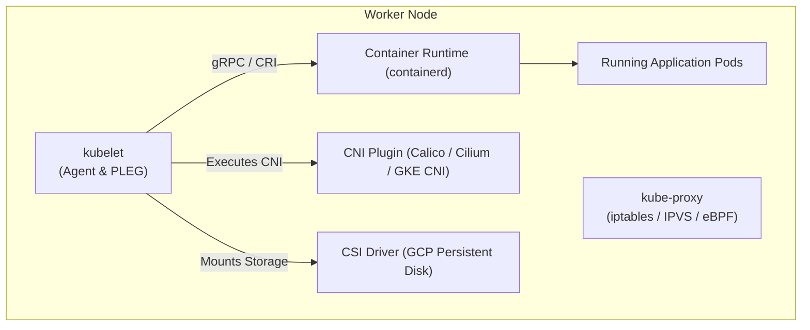

# Lesson 0001: Introduction to Kubernetes Architecture & Prerequisites

## 🚀 Fast Interview Summary & Cheatsheet

| Component | Layer | Primary Responsibility | Critical Interview Fact |
| :--- | :--- | :--- | :--- |
| **`kube-apiserver`** | Control Plane | REST API gateway, AuthN/AuthZ, Admission Control | **Only component that reads/writes directly to `etcd`**. Stateless and scales horizontally. |
| **`etcd`** | Control Plane | Consistent, distributed key-value database | Uses **Raft Consensus**. Quorum = $\lfloor N/2 \rfloor + 1$. Requires odd numbers (3, 5). |
| **`kube-scheduler`** | Control Plane | Assigns unscheduled Pods to optimal Nodes | Two-phase cycle: **Filtering** (Predicates) and **Scoring** (Priorities). |
| **`kube-controller-manager`** | Control Plane | Runs control loops to enforce desired state | Bundles Node, ReplicaSet, Deployment, and EndpointSlice controllers. |
| **`kubelet`** | Worker Node | Primary node agent; manages container lifecycles | Communicates with container runtime via **CRI**, network via **CNI**, storage via **CSI**. |
| **`kube-proxy`** | Worker Node | Implements Service networking & load balancing | Operates in **`iptables`**, **`IPVS`**, or **`eBPF`** modes. |
| **Container Runtime** | Worker Node | Executes containers (e.g. `containerd`, `CRI-O`) | Complies with OCI (Open Container Initiative) runtime spec (`runc`). |

---

## 1. What is Kubernetes?

**Kubernetes** (often abbreviated as **K8s**, replacing the 8 letters between "K" and "s") is an open-source container orchestration engine that automates deployment, scaling, management, and networking of containerized applications across distributed clusters.


```mermaid
graph LR
    User([User Request]) --> LB[Load Balancer]
    LB --> Node1[Worker Node 1]
    LB --> Node2[Worker Node 2]
    subgraph Node1
        PodA[App Container A]
        PodB[App Container B]
    end
    subgraph Node2
        PodC[App Container A replica]
        PodD[App Container C]
    end
```

### Core Value Propositions:
* **High Availability & Self-Healing:** Automatically restarts failed containers, reschedules Pods when worker nodes fail, and replaces unresponsive nodes.
* **Horizontal Autoscaling:** Scales container replicas dynamically based on CPU, memory, or custom external metrics (via HPA/KEDA).
* **Service Discovery & Load Balancing:** Assigns Pods their own IP addresses and exposes a single DNS name for a set of containers, balancing traffic across healthy endpoints.
* **Automated Rollouts & Rollbacks:** Manages progressive releases (RollingUpdate, Blue/Green, Canary) and rolls back instantly if health checks fail.

---

## 2. Kubernetes Control Plane Architecture

The Control Plane makes global decisions about the cluster (e.g., scheduling), detects and responds to cluster events, and maintains the desired state.


```mermaid
graph TD
    subgraph ControlPlane ["Control Plane (Master Node)"]
        APIServer["kube-apiserver\n(Stateless REST API)"]
        Etcd[("etcd\n(Raft Key-Value Store)")]
        Scheduler["kube-scheduler\n(Filters & Scores Nodes)"]
        Controller["kube-controller-manager\n(Reconciliation Loops)"]
        CloudController["cloud-controller-manager\n(GCP/AWS/Azure Cloud Sync)"]
        
        APIServer <--> Etcd
        APIServer <--> Scheduler
        APIServer <--> Controller
        APIServer <--> CloudController
    end
    
    subgraph WorkerNode1 ["Worker Node 1"]
        Kubelet1["kubelet"]
        Proxy1["kube-proxy"]
        Runtime1["containerd / CRI-O"]
        Kubelet1 --- Runtime1
    end

    subgraph WorkerNode2 ["Worker Node 2"]
        Kubelet2["kubelet"]
        Proxy2["kube-proxy"]
        Runtime2["containerd / CRI-O"]
        Kubelet2 --- Runtime2
    end
    
    APIServer <-->|HTTPS / TLS| Kubelet1
    APIServer <-->|HTTPS / TLS| Kubelet2
```

### Control Plane Components Explained

1. **`kube-apiserver` (The Front Door):**
   - The central nervous system of Kubernetes. Every internal and external component communicates exclusively through the API Server over JSON/YAML over HTTPS.
   - It executes three validation stages: **Authentication** (Certificates, OIDC, Webhooks) $\to$ **Authorization** (RBAC, ABAC) $\to$ **Admission Control** (Mutating & Validating webhooks).

2. **`etcd` (The Source of Truth):**
   - A strongly consistent, distributed key-value store using the **Raft consensus algorithm**.
   - Stores the complete state and specifications of all cluster objects. Only `kube-apiserver` is permitted to communicate directly with `etcd`.

3. **`kube-scheduler` (The Placement Engine):**
   - Assigns unscheduled Pods (`spec.nodeName` is blank) to healthy nodes.
   - Evaluates node fit in two phases:
     - **Filtering (Predicates):** Filters out nodes lacking resources, ports, or matching taints/tolerations.
     - **Scoring (Priorities):** Scores the remaining nodes to find the optimal match (e.g., spreading Pods across failure domains).

4. **`kube-controller-manager` (The Enforcer):**
   - Runs continuous control loops (reconciliation loops) that compare **desired state** (from `etcd`) with **actual state** (reported by nodes) and executes mutations to fix drift.
   - Contains: *Node Controller*, *Deployment Controller*, *ReplicaSet Controller*, *EndpointSlice Controller*, *Job Controller*.

---

## 3. Worker Node Architecture

Worker nodes host the application containers and execute commands issued by the Control Plane.


```mermaid
graph TD
    subgraph Worker["Worker Node"]
        Kubelet["kubelet\n(Agent & PLEG)"]
        Proxy["kube-proxy\n(iptables / IPVS / eBPF)"]
        CRI["Container Runtime (containerd)"]
        CNI["CNI Plugin (Calico / Cilium / GKE CNI)"]
        CSI["CSI Driver (GCP Persistent Disk)"]
        
        Kubelet -->|gRPC / CRI| CRI
        Kubelet -->|Executes CNI| CNI
        Kubelet -->|Mounts Storage| CSI
        CRI --> Pods["Running Application Pods"]
    end
```

1. **`kubelet`:**
   - The node agent registered with the API Server. It receives `PodSpec` definitions and ensures that the corresponding containers are running and healthy.
   - Implements **PLEG (Pod Lifecycle Event Generator)** to periodically check container runtime states and report health back to the control plane.

2. **`kube-proxy`:**
   - A network proxy that runs on each node. It maintains network routing rules (using `iptables`, `IPVS`, or eBPF) so that connections to Kubernetes `Service` virtual IPs reach the correct backend Pods.

3. **Container Runtime (`CRI`):**
   - The low-level software that executes containers. Modern Kubernetes uses **containerd** or **CRI-O** via the gRPC Container Runtime Interface (`CRI`).

---

## 🎯 Interview Deep-Dives & Scenarios

??? question "Interview Scenario: What happens under the hood when you run `kubectl apply -f deployment.yaml`?"
    **Step-by-Step Architectural Execution:**
    1. **Client-Side:** `kubectl` parses the YAML, validates client-side syntax, and sends an HTTP POST/PUT request to `kube-apiserver`.
    2. **API Server Processing:**
       - **Authentication:** Validates the caller's identity (e.g., client TLS certificate, bearer token).
       - **Authorization:** Checks RBAC permissions (can this user create Deployments in this namespace?).
       - **Mutating Admission Controllers:** Mutates default fields (e.g., injects default storage classes or sidecars).
       - **Schema Validation:** Verifies structural correctness.
       - **Validating Admission Controllers:** Enforces cluster security policies (e.g., Gatekeeper/OPA).
    3. **Persistence:** `kube-apiserver` writes the `Deployment` manifest into `etcd`.
    4. **Deployment Controller:** Watches the API Server, detects the new `Deployment`, and generates a child `ReplicaSet` object.
    5. **ReplicaSet Controller:** Detects the `ReplicaSet` and creates the requested number of `Pod` objects with `spec.nodeName: ""` (unscheduled).
    6. **kube-scheduler:** Watches for unbound Pods, filters and scores available nodes, selects the best node, and sends a *Binding* request to `kube-apiserver` (writing `spec.nodeName`).
    7. **kubelet (Target Node):** Watches the API server for Pods assigned to its node.
       - Calls the **CSI plugin** to mount required persistent storage volumes.
       - Calls the **CNI plugin** to assign an IP and create the Pod network namespace.
       - Calls the **CRI runtime (containerd)** to pull the container image and start the containers.
    8. **Status Update:** `kubelet` reports Pod status (`Running`) back to `kube-apiserver`, which updates `etcd`.

??? question "Interview Question: What happens if `etcd` loses quorum or one etcd member fails?"
    **Answer:**
    - **Quorum Formula:** $Q = \lfloor N/2 \rfloor + 1$.
      - In a **3-node cluster**, quorum is 2. The cluster can tolerate **1 failure**.
      - In a **5-node cluster**, quorum is 3. The cluster can tolerate **2 failures**.
    - **If 1 node fails (Quorum preserved):**
      - The remaining nodes elect a leader if needed and continue serving read/write operations normally with zero downtime.
    - **If Quorum is lost ($> N/2$ nodes down):**
      - `etcd` transitions into **read-only emergency mode** to prevent split-brain data corruption.
      - `kube-apiserver` rejects all write requests (`kubectl apply`, scaling, scheduling new Pods).
      - **Existing running application Pods continue running** without interruption on worker nodes, but the cluster cannot heal, restart failed pods, or schedule new workloads until quorum is restored.

??? question "Interview Question: What happens to running workloads if the entire Control Plane crashes?"
    **Answer:**
    - **Data Plane Isolation:** Worker nodes are decoupled from the Control Plane. Existing Pods, containers, and network routing rules (`iptables`/`IPVS` configured by `kube-proxy`) remain active in kernel space.
    - **Impact:**
      - In-flight user traffic to active Pods continues flowing normally.
      - However, the cluster loses **orchestration capabilities**: no new Pods can be scheduled, crashing Pods cannot be restarted, auto-scaling is frozen, and `kubectl` commands will fail with connection errors.

??? question "Interview Question: Differentiate Docker, containerd, CRI, OCI, and runc."
    **Answer:**
    - **OCI (Open Container Initiative):** The open governance standard defining container image formats (`image-spec`) and runtime execution (`runtime-spec`).
    - **runc:** The reference low-level CLI tool that interacts directly with Linux kernel cgroups and namespaces to spawn a container.
    - **CRI (Container Runtime Interface):** The gRPC interface created by Kubernetes to decouple `kubelet` from specific container runtimes.
    - **containerd / CRI-O:** High-level container runtimes that implement the CRI gRPC API, manage image downloads, unpack storage snapshots, and invoke `runc` to execute containers.
    - **Docker:** A full developer platform that wraps `containerd`, networking, build tools (`buildx`), and a daemon. Kubernetes deprecated direct Docker support (Dockershim) in v1.24 in favor of direct CRI integration (`containerd`).

---

## ⚠️ Common Production Pitfalls & Interview Traps

??? warning "Production Trap: Running an Even Number of `etcd` Nodes"
    **Why it's dangerous:** Adding an even node increases failure risk without increasing fault tolerance.
    - A 3-node cluster requires 2 nodes for quorum (tolerates 1 failure).
    - A 4-node cluster requires 3 nodes for quorum (tolerates only 1 failure, but has 4 nodes that could fail!).
    - **Rule of Thumb:** Always run 3 or 5 `etcd` nodes.

??? warning "Production Trap: Assuming `kubectl` Talks to Worker Nodes"
    `kubectl` **never** communicates directly with worker nodes or `kubelet` directly (unless executing proxy/port-forward sub-commands mediated by the API Server). All client requests are authenticated and handled exclusively by `kube-apiserver`.

---

## 💻 Hands-on Verification & Diagnostic Toolkit

```bash
# 1. Check control plane component health
kubectl get componentstatuses # (Legacy clusters)
kubectl cluster-info

# 2. Inspect node health and status
kubectl get nodes -o wide

# 3. View low-level node capacity and allocatable resources
kubectl describe node <NODE_NAME> | grep -A 8 "Allocatable:"

# 4. View API Server real-time logs (Control Plane)
kubectl logs -n kube-system -l component=kube-apiserver --tail=50
```

---

## Test Your Knowledge

1. Which Kubernetes component is the ONLY service permitted to read and write directly to `etcd`?
   - [ ] A) The kube-apiserver component
   - [ ] B) The kube-scheduler component
   
   *Answer:* A) The kube-apiserver component - Correct! `kube-apiserver` is the single gateway to `etcd`. All other components (scheduler, controller-manager, kubelet) communicate through the API server.

2. In a 5-node `etcd` cluster, what is the minimum quorum required to accept state writes, and how many node failures can it tolerate?
   - [ ] A) Quorum is 3 nodes and it tolerates 2 node failures
   - [ ] B) Quorum is 4 nodes and it tolerates 1 node failure
   
   *Answer:* A) Quorum is 3 nodes and it tolerates 2 node failures - Correct! The quorum formula is $\lfloor 5/2 \rfloor + 1 = 3$. It can lose up to 2 nodes while maintaining write availability.

---

## Recommended Primary Resource
- [Kubernetes Official Architecture Concepts](https://kubernetes.io/docs/concepts/architecture/)
- [etcd Raft Consensus Algorithm FAQ](https://etcd.io/docs/v3.5/learning/why/)

---
**Preparing for a platform engineering interview?** Ask in the chat, and we can simulate a control plane failure scenario!

[← Home](../index.md) | [Lesson 2: Pod Anatomy & Configuration →](./0002-pod-anatomy.md)
