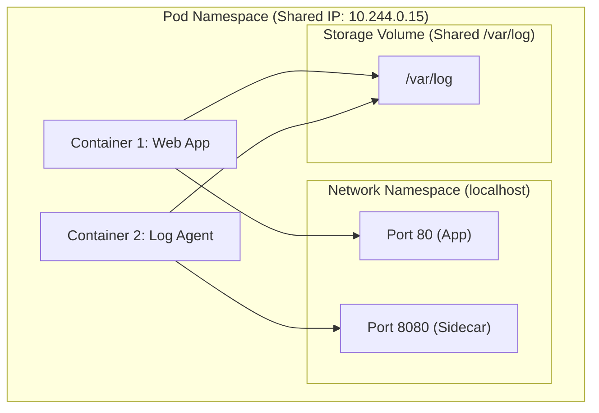

# Lesson 0002: Pod Anatomy & Configuration

The fundamental unit of execution in Kubernetes is the **Pod**. In this lesson, we will explore Pod architecture, why Kubernetes uses Pods instead of bare containers, how multi-container Pods share resources, and the lifecycles of Pod workloads.

---

## 1. What is a Pod?

A **Pod** is the smallest deployable computing unit you can create and manage in Kubernetes. 

Unlike standard container engines (like Docker) where you run individual containers directly, Kubernetes wraps one or more containers into a single abstraction called a Pod.

### Why not run containers directly?
Containers are isolated environments. However, in real-world applications, processes often need to work closely together. A Pod provides a way to group tightly coupled containers and run them on the same host, sharing network and storage boundaries.



---

## 2. Resource Sharing inside a Pod

All containers inside a Pod are guaranteed to run on the **same physical or virtual worker node**. They share:

### A. Network Namespace
Containers in a Pod share the same network IP address and port space. 

* They can communicate with each other using **`localhost`** (e.g. the app container talks to a sidecar container on `localhost:8080`).
* Containers must not bind to the same port, or they will collide.
* External traffic hits the Pod IP first, which is then mapped to the correct container port.

### B. Storage Volumes
You can define one or more storage volumes at the Pod level, which can then be mounted into any of the containers inside the Pod. This allows containers to share files easily.

---

## 3. The Multi-Container Pod (Sidecar Pattern)

While most Pods contain a single container, running multiple containers is a common design pattern. The helper container is often called a **Sidecar**.

### Common Use Cases:
1. **Log Forwarders:** A helper container reads logs written by the main application to a shared volume and ships them to a central system (e.g. Elasticsearch or Cloud Logging).
2. **Proxies/Adapters:** A sidecar intercepts incoming traffic, performs authentication/security checks, and routes it to the main container.
3. **Config Watchers:** A sidecar detects configurations changes in a remote repository and signals the main application to reload.

---

## 4. Pod Lifecycle States

As a Pod runs, its health is categorized into several phases:

| Phase | Description |
| :--- | :--- |
| **Pending** | The Pod manifest has been accepted by the cluster, but the scheduler is finding a node, or the container images are downloading. |
| **Running** | The Pod has been bound to a node, and all containers have been created. At least one container is currently starting or running. |
| **Succeeded** | All containers in the Pod have terminated successfully (exit code 0) and will not be restarted (common for Jobs). |
| **Failed** | All containers have terminated, and at least one container has terminated in failure (non-zero exit code). |
| **Unknown** | The state cannot be obtained, typically due to a communication failure between the control plane and the node's kubelet. |

---

## Hands-on Exercise: Deploy a Multi-Container Pod

Let's deploy a Pod that demonstrates storage sharing between a main web server container (Nginx) and a sidecar container that writes content.

**Step 1:** Save the following manifest to `multi-container-pod.yaml`:

```yaml
apiVersion: v1
kind: Pod
metadata:
  name: shared-volume-demo
  labels:
    app: multi-container
spec:
  # Define the shared volume at the Pod level
  volumes:
  - name: shared-data
    emptyDir: {} # Temporary empty directory sharing the node's disk

  containers:
  # Container 1: The Main Web Server
  - name: web-server
    image: nginx:alpine
    volumeMounts:
    - name: shared-data
      mountPath: /usr/share/nginx/html # Nginx reads static files here
    ports:
    - containerPort: 80

  # Container 2: The Sidecar Writer
  - name: content-writer
    image: alpine
    command: ["/bin/sh", "-c"]
    args:
    - |
      while true; do
        echo "Hello from the content-writer sidecar container! Time: $(date)" > /data/index.html;
        sleep 10;
      done
    volumeMounts:
    - name: shared-data
      mountPath: /data # Mounts to write files
```

**Step 2:** Apply the Pod:
```bash
kubectl apply -f multi-container-pod.yaml
```

**Step 3:** Access the web page served by Nginx to verify it reads the sidecar's written files:
```bash
# Port-forward the Pod port to your local machine
kubectl port-forward shared-volume-demo 8080:80
```
Open your browser and navigate to [http://localhost:8080](http://localhost:8080) to see the message.

---

## Test Your Knowledge

### 1. How do two containers running in the same Pod communicate with each other?
- [ ] **A.** By sending requests to the cluster's API Server.
- [ ] **B.** Using the Node's public IP address.
- [ ] **C.** Via localhost, using different ports.

<details>
<summary><b>Answer & Explanation</b></summary>

**Correct Answer:** C

**Explanation:** Containers in the same Pod share the network namespace and can communicate directly over `localhost` using separate port numbers.
</details>

### 2. If a worker node loses power and shuts down, what happens to the status of the Pods running on it?
- [ ] **A.** They transition to the Failed state.
- [ ] **B.** They transition to the Unknown state.
- [ ] **C.** They automatically migrate to another node instantly.

<details>
<summary><b>Answer & Explanation</b></summary>

**Correct Answer:** B

**Explanation:** If the kubelet on the node stops communicating with the control plane, the Pods' phase transitions to `Unknown`. The controllers will reschedule new instances on healthy nodes after a timeout.
</details>

---

[← Lesson 1: Intro to Kubernetes](./0001-what-is-kubernetes-and-prerequisites.md) | [Lesson 3: Node Scheduling & Deployments →](./0003-node-scheduling-deployment-strategies-autoscaling.md)
