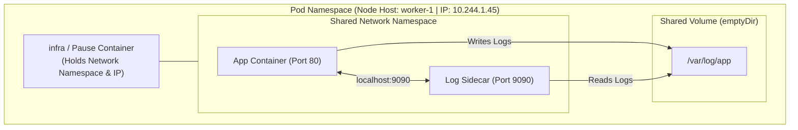
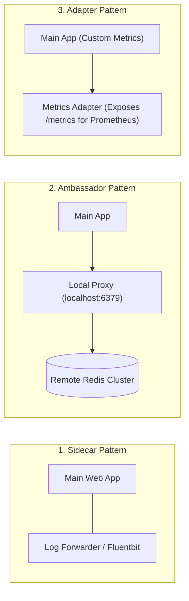
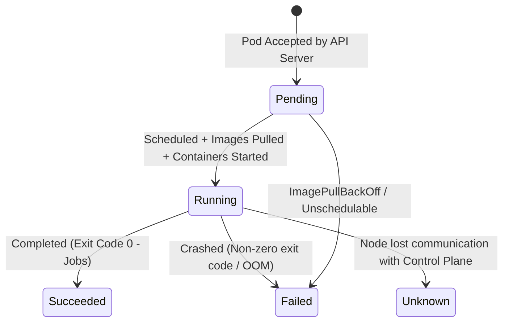

# Lesson 0002: Pod Anatomy, Multi-Container Patterns & Lifecycle

## 🚀 Fast Interview Summary & Cheatsheet

| Concept | Architectural Reality | Interview Must-Know |
| :--- | :--- | :--- |
| **Pod** | Smallest deployable unit in Kubernetes | Wraps 1+ containers on the **same worker node** sharing IPC, Network, and Storage. |
| **Pause Container** | Hidden container created first in every Pod | Holds the network namespace (`netns`) and IP so app containers can restart without losing connectivity. |
| **Inter-Container Comms** | Shared Network Namespace | Containers talk over **`localhost`** on distinct ports. Shared files via `emptyDir` volumes. |
| **Native Sidecars** | `initContainers` with `restartPolicy: Always` | Introduced in K8s 1.28+. Starts before app containers and runs throughout the entire Pod lifecycle. |
| **CrashLoopBackOff** | Container keeps crashing after start | Exponential backoff delay: 10s $\to$ 20s $\to$ 40s $\to$ 80s $\to$ 160s $\to$ **300s (max 5 min)**. |
| **Exit Code 137** | Process killed by OS ($128 + 9$ SIGKILL) | **OOMKilled:** Container exceeded memory limits or node experienced kernel Out-Of-Memory. |
| **Exit Code 143** | Graceful termination ($128 + 15$ SIGTERM) | Normal Kubernetes shutdown during rollout or node drain. |

---

## 1. What is a Pod & The Pause Container

A **Pod** represents a single instance of a running process in your cluster. It encapsulates application containers, storage resources, a unique network IP, and runtime options.


```mermaid
graph TD
    subgraph Pod ["Pod Namespace (Node Host: worker-1 | IP: 10.244.1.45)"]
        Pause["infra / Pause Container\n(Holds Network Namespace & IP)"]
        
        subgraph SharedNet ["Shared Network Namespace"]
            AppPort["App Container (Port 80)"]
            SidecarPort["Log Sidecar (Port 9090)"]
        end
        
        subgraph SharedStorage ["Shared Volume (emptyDir)"]
            Vol["/var/log/app"]
        end
        
        Pause --- SharedNet
        AppPort -->|Writes Logs| Vol
        SidecarPort -->|Reads Logs| Vol
        AppPort <-->|localhost:9090| SidecarPort
    end
```

### The Role of the "Pause Container" (`infra` container)
When `kubelet` creates a Pod on a worker node:
1. It first launches a tiny, dormant container called the **Pause container** (`k8s.gcr.io/pause`).
2. The Pause container creates and owns the Linux **network namespace**, IPC namespace, and UTS namespace for the Pod.
3. When your actual application and sidecar containers start, they join the namespaces owned by the Pause container.
4. **Why this matters for interviews:** If your application container crashes or restarts, the Pod’s IP address and network sockets do **not** die—the Pause container keeps them open!

---

## 2. Multi-Container Design Patterns

While most Pods run a single container, Kubernetes supports multi-container patterns:


```mermaid
graph LR
    subgraph SidecarPattern ["1. Sidecar Pattern"]
        App1["Main Web App"] --- Sidecar["Log Forwarder / Fluentbit"]
    end

    subgraph AmbassadorPattern ["2. Ambassador Pattern"]
        App2["Main App"] --> Proxy["Local Proxy (localhost:6379)"] --> RemoteDB[("Remote Redis Cluster")]
    end

    subgraph AdapterPattern ["3. Adapter Pattern"]
        App3["Main App (Custom Metrics)"] --> Adapter["Metrics Adapter (Exposes /metrics for Prometheus)"]
    end
```

1. **Sidecar Pattern:** Extends the main container’s functionality without modifying application code (e.g., shipping logs with Fluentbit, syncing secrets with Vault).
2. **Ambassador Pattern:** A proxy container that hides network complexity from the main container (e.g., routing database calls to a sharded database).
3. **Adapter Pattern:** Standardizes output or monitoring formats (e.g., translating proprietary application logs into standardized Prometheus formats).
4. **Init Containers:** Specialized containers that run **to completion sequentially** *before* app containers start. Used for database migrations or waiting for dependencies.

---

## 3. Pod Phases, Container States & Conditions


```mermaid
stateDiagram-v2
    [*] --> Pending: Pod Accepted by API Server
    Pending --> Running: Scheduled + Images Pulled + Containers Started
    Running --> Succeeded: Completed (Exit Code 0 - Jobs)
    Running --> Failed: Crashed (Non-zero exit code / OOM)
    Pending --> Failed: ImagePullBackOff / Unschedulable
    Running --> Unknown: Node lost communication with Control Plane
```

### Pod Phases vs Container States
- **Pod Phase:** High-level summary (`Pending`, `Running`, `Succeeded`, `Failed`, `Unknown`).
- **Container States:** The exact low-level status of each individual container in the Pod:
  - **`Waiting`:** Performing setup, pulling images (`ImagePullBackOff`, `ErrImagePull`), or in `CrashLoopBackOff`.
  - **`Running`:** Executing without issues.
  - **`Terminated`:** Process finished execution (`Completed`) or was killed (`OOMKilled`).

### Pod Conditions (Readiness Gates)
For a Pod to accept user traffic, its conditions must be `True`:
1. `PodScheduled`: The Pod has been bound to a node.
2. `Initialized`: All `initContainers` have completed successfully.
3. `ContainersReady`: All containers in the Pod have passed their startup/readiness probes.
4. `Ready`: The Pod is ready to receive traffic from Services.

---

## 🎯 Interview Deep-Dives & Scenarios

??? question "Interview Scenario: How do Native Sidecars (K8s 1.28+) solve the legacy sidecar lifecycle problem?"
    **The Legacy Problem:**
    Prior to Kubernetes 1.28, sidecars were declared as standard containers in `spec.containers`. This caused two critical bugs:
    1. **Startup Race Condition:** The main app container could start *before* the logging/proxy sidecar was ready, dropping initial requests.
    2. **Job Termination Failure:** In batch `Jobs`, the main container would complete, but the sidecar kept running forever, preventing the `Job` from reaching `Succeeded` state.

    **The Native Sidecar Solution:**
    Declare sidecars inside `spec.initContainers` with `restartPolicy: Always`:
    ```yaml
    spec:
      initContainers:
        - name: vault-agent-sidecar
          image: hashicorp/vault:1.15.0
          restartPolicy: Always          # Indicates a Native Sidecar!
    ```
    - Kubelet starts this init container first and waits until it passes its startup probe.
    - It continues running throughout the Pod’s life.
    - When all main containers exit in a Job, `kubelet` automatically sends `SIGTERM` to the native sidecar to allow the Job to finish!

??? question "Interview Question: What is the difference between Exit Code 137 and Exit Code 143?"
    **Answer:**
    - **Exit Code 137 ($128 + 9$):** The process received `SIGKILL` (Signal 9). It was forcibly terminated by the Linux kernel.
      - **Most Common Cause:** **OOMKilled (Out Of Memory)**. The container exceeded its configured `resources.limits.memory`, or the host node ran out of memory.
    - **Exit Code 143 ($128 + 15$):** The process received `SIGTERM` (Signal 15).
      - **Most Common Cause:** **Graceful Termination**. Kubernetes signaled the container to stop during a rolling update, scaling down, or node drain.

??? question "Interview Question: If one container in a multi-container Pod crashes, does the whole Pod restart?"
    **Answer:**
    - **No.** Containers within a Pod are managed individually by `kubelet`.
    - If Container A crashes, `kubelet` restarts *only Container A* based on the Pod’s `spec.restartPolicy` (`Always`, `OnFailure`, `Never`).
    - Container B continues running undisturbed, and the shared storage and network namespace remain intact.

---

## ⚠️ Common Production Pitfalls & Interview Traps

??? warning "Production Trap: Port Collisions in Multi-Container Pods"
    Because containers share the same network namespace (`localhost`), two containers **cannot listen on the same port**.
    - If Container A binds to port `8080` and Container B also tries to bind to `8080`, Container B will crash with `bind: address already in use`.

??? warning "Production Trap: Assuming `emptyDir` Volumes Persist Across Pod Restarts"
    - An `emptyDir` volume persists when a container inside the Pod crashes and restarts.
    - However, if the **Pod itself is deleted or rescheduled to another node**, the data inside `emptyDir` is **permanently deleted**.

---

## 💻 Hands-on Verification & Diagnostic Toolkit

```bash
# 1. Inspect container states and termination reasons (OOMKilled, CrashLoop)
kubectl get pod <POD_NAME> -o jsonpath='{range .status.containerStatuses[*]}{.name}{": "}{.state}{"\n"}{end}'

# 2. View logs of a previously crashed container instance
kubectl logs <POD_NAME> -c <CONTAINER_NAME> --previous

# 3. Check exact exit codes and last termination state
kubectl get pod <POD_NAME> -o jsonpath='{.status.containerStatuses[*].lastState.terminated}'

# 4. Stream logs from all containers in a multi-container Pod simultaneously
kubectl logs <POD_NAME> --all-containers=true -f
```

---

## Test Your Knowledge

1. Why does the Pause container initialize first when a Pod is scheduled on a worker node?
   - [ ] A) It establishes and holds the shared network and IPC namespaces for all containers
   - [ ] B) It downloads and compiles the container source code before the main app launches
   
   *Answer:* A) It establishes and holds the shared network and IPC namespaces for all containers - Correct! The pause container owns the network namespace so that application containers can crash and restart without losing their assigned Pod IP address.

2. A container in your Pod terminates with Exit Code 137. What is the root cause?
   - [ ] A) The container was killed by the kernel because it exceeded its memory limit (OOMKilled)
   - [ ] B) The container finished processing its batch tasks successfully and exited cleanly
   
   *Answer:* A) The container was killed by the kernel because it exceeded its memory limit (OOMKilled) - Correct! Exit code 137 represents $128 + 9$ (SIGKILL), which Kubernetes triggers when memory limits are breached.

---

## Recommended Primary Resource
- [Kubernetes Pod Lifecycle & Container States](https://kubernetes.io/docs/concepts/workloads/pods/pod-lifecycle/)
- [Kubernetes Native Sidecar Containers (KEP-753)](https://kubernetes.io/docs/concepts/workloads/pods/sidecar-containers/)

---
**Troubleshooting an OOMKilled or CrashLoopBackOff container?** Ask in the chat, and we'll analyze the termination logs together!

[← Lesson 1: Intro to Kubernetes](./0001-what-is-kubernetes-and-prerequisites.md) | [Lesson 3: Node Scheduling & Deployments →](./0003-node-scheduling-deployment-strategies-autoscaling.md)
