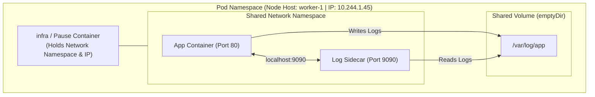
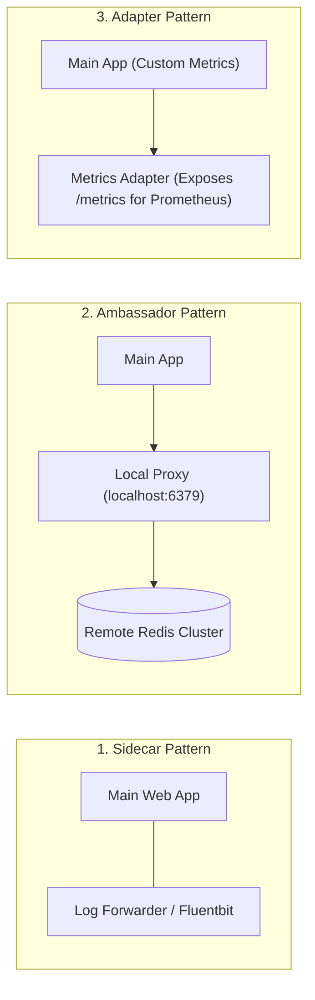
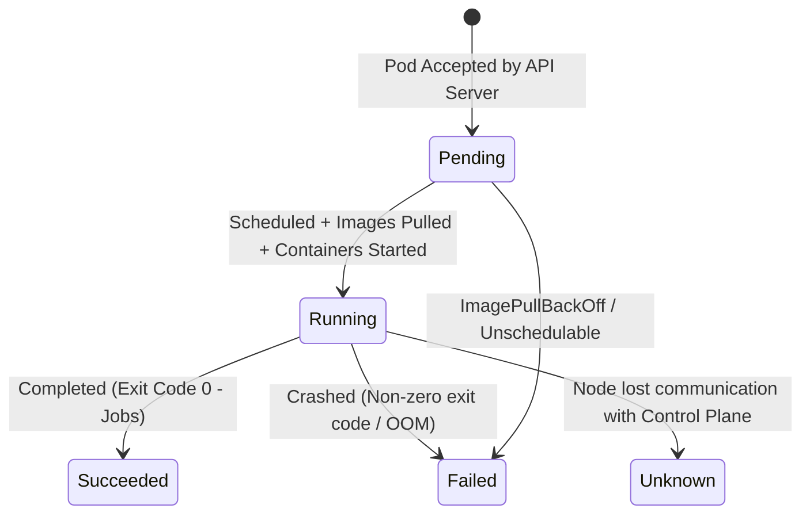

# Lesson 0002: Pod anatomy, multi-container patterns, and lifecycle

## Fast interview summary and cheatsheet

| Concept | Architectural reality | Interview must-know |
| :--- | :--- | :--- |
| **Pod** | Smallest deployable unit in Kubernetes | Wraps one or more containers on the **same worker node** sharing IPC, network, and storage. |
| **Pause container** | Initial container created in every Pod | Holds the network namespace (`netns`) and IP so application containers can restart without losing connectivity. |
| **Inter-container communication** | Shared network namespace | Containers talk over **`localhost`** on distinct ports. Shared files use `emptyDir` volumes. |
| **Native sidecars** | `initContainers` with `restartPolicy: Always` | Introduced in Kubernetes 1.28+. Starts before application containers and runs throughout the Pod lifecycle. |
| **CrashLoopBackOff** | Container keeps crashing after start | Exponential backoff delay: 10s $\to$ 20s $\to$ 40s $\to$ 80s $\to$ 160s $\to$ **300s (max 5 min)**. |
| **Exit code 137** | Process killed by OS ($128 + 9$ SIGKILL) | **OOMKilled:** Container exceeded memory limits or node experienced kernel Out-Of-Memory. |
| **Exit code 143** | Graceful termination ($128 + 15$ SIGTERM) | Standard Kubernetes shutdown during rollout or node drain. |

---

## 1. What is a Pod and the pause container

A Pod represents a single instance of a running process in your cluster. It wraps application containers, storage resources, a unique network IP, and runtime options.


```mermaid
graph TD
    subgraph Pod ["Pod Namespace (Node Host: worker-1 | IP: 10.244.1.45)"]
        Pause["infra / Pause Container\n(Holds Network Namespace & IP)"]
        
        subgraph SharedNet ["Shared Network Namespace"]
            AppPort["App Container (Port 80)"]
            SidecarPort["Log Sidecar (Port 9090)"]
        end
        
        subgraph SharedStorage ["Shared Volume (emptyDir)"]
            Vol["/var/log/app"]
        end
        
        Pause --- SharedNet
        AppPort -->|Writes Logs| Vol
        SidecarPort -->|Reads Logs| Vol
        AppPort <-->|localhost:9090| SidecarPort
    end
```

### How the pause container works
When `kubelet` creates a Pod on a worker node:
1. It first launches a dormant container called the **pause container** (`k8s.gcr.io/pause` or `registry.k8s.io/pause`).
2. The pause container creates and owns the Linux network, IPC, and UTS namespaces for the Pod.
3. When application and sidecar containers start, they join the namespaces owned by the pause container.
4. If an application container crashes or restarts, the Pod's IP address and network sockets stay open because the pause container keeps running.

---

## 2. Multi-container design patterns

Most Pods run a single container, but Kubernetes supports several multi-container arrangements:


```mermaid
graph LR
    subgraph SidecarPattern ["1. Sidecar Pattern"]
        App1["Main Web App"] --- Sidecar["Log Forwarder / Fluentbit"]
    end

    subgraph AmbassadorPattern ["2. Ambassador Pattern"]
        App2["Main App"] --> Proxy["Local Proxy (localhost:6379)"] --> RemoteDB[("Remote Redis Cluster")]
    end

    subgraph AdapterPattern ["3. Adapter Pattern"]
        App3["Main App (Custom Metrics)"] --> Adapter["Metrics Adapter (Exposes /metrics for Prometheus)"]
    end
```

1. **Sidecar pattern:** Extends the main container's functionality without modifying application code (such as forwarding logs with Fluent Bit or syncing secrets with Vault).
2. **Ambassador pattern:** A proxy container that hides network complexity from the main container (such as routing database queries to a sharded cluster).
3. **Adapter pattern:** Standardizes output or monitoring formats (such as translating custom application logs into Prometheus metrics).
4. **Init containers:** Containers that run sequentially to completion before application containers start. Common uses include running database schema migrations or waiting for dependencies to become available.

---

## 3. Pod phases, container states, and conditions


```mermaid
stateDiagram-v2
    [*] --> Pending: Pod Accepted by API Server
    Pending --> Running: Scheduled + Images Pulled + Containers Started
    Running --> Succeeded: Completed (Exit Code 0 - Jobs)
    Running --> Failed: Crashed (Non-zero exit code / OOM)
    Pending --> Failed: ImagePullBackOff / Unschedulable
    Running --> Unknown: Node lost communication with Control Plane
```

### Pod phases versus container states
- **Pod phase:** High-level summary (`Pending`, `Running`, `Succeeded`, `Failed`, `Unknown`).
- **Container states:** The exact low-level status of each individual container in the Pod:
  - **`Waiting`:** Performing setup, pulling images (`ImagePullBackOff`, `ErrImagePull`), or paused in `CrashLoopBackOff`.
  - **`Running`:** Executing without errors.
  - **`Terminated`:** Process finished execution (`Completed`) or was killed (`OOMKilled`).

### Pod conditions (readiness gates)
For a Pod to accept user traffic, its conditions must be `True`:
1. `PodScheduled`: The Pod has been bound to a node.
2. `Initialized`: All `initContainers` completed successfully.
3. `ContainersReady`: All containers in the Pod passed their startup and readiness probes.
4. `Ready`: The Pod is ready to receive traffic from Services.

---

## Interview deep-dives and scenarios

??? question "Interview scenario: How do native sidecars (K8s 1.28+) solve the legacy sidecar lifecycle problem?"
    **The legacy problem:**
    Before Kubernetes 1.28, sidecars were declared as standard containers in `spec.containers`. This caused two persistent bugs:
    1. **Startup race condition:** The main application container could start before the logging or proxy sidecar was ready, dropping initial requests.
    2. **Job termination failure:** In batch `Jobs`, the main container would complete, but the sidecar continued running indefinitely, preventing the `Job` from reaching `Succeeded` state.

    **The native sidecar solution:**
    Declare sidecars inside `spec.initContainers` with `restartPolicy: Always`:
    ```yaml
    spec:
      initContainers:
        - name: vault-agent-sidecar
          image: hashicorp/vault:1.15.0
          restartPolicy: Always          # Indicates a Native Sidecar
    ```
    - Kubelet starts this init container first and waits until it passes its startup probe.
    - It continues running throughout the lifecycle of the Pod.
    - When all main containers exit in a Job, `kubelet` sends `SIGTERM` to the native sidecar so the Job can finish cleanly.

??? question "Interview question: What is the difference between exit code 137 and exit code 143?"
    - **Exit code 137 ($128 + 9$):** The process received `SIGKILL` (Signal 9). The Linux kernel terminated it immediately.
      - **Most common cause:** **OOMKilled (Out Of Memory)**. The container exceeded its configured `resources.limits.memory`, or the host node ran out of memory.
    - **Exit code 143 ($128 + 15$):** The process received `SIGTERM` (Signal 15).
      - **Most common cause:** **Graceful termination**. Kubernetes signaled the container to stop during a rolling update, scale down, or node drain.

??? question "Interview question: If one container in a multi-container Pod crashes, does the whole Pod restart?"
    No. Containers within a Pod are managed individually by `kubelet`.
    - If Container A crashes, `kubelet` restarts only Container A based on the Pod's `spec.restartPolicy` (`Always`, `OnFailure`, `Never`).
    - Container B continues running without interruption, and the shared storage and network namespace stay intact.

---

## Common production pitfalls and interview traps

??? warning "Production trap: Port collisions in multi-container Pods"
    Because containers share the same network namespace (`localhost`), two containers cannot listen on the same port.
    - If Container A binds to port `8080` and Container B also attempts to bind to `8080`, Container B crashes with `bind: address already in use`.

??? warning "Production trap: Assuming emptyDir volumes persist across Pod restarts"
    - An `emptyDir` volume persists when a container inside the Pod crashes and restarts.
    - If the Pod itself is deleted or rescheduled to another node, all data inside `emptyDir` is deleted permanently.

---

## Hands-on verification and diagnostics

```bash
# 1. Inspect container states and termination reasons (OOMKilled, CrashLoop)
kubectl get pod <POD_NAME> -o jsonpath='{range .status.containerStatuses[*]}{.name}{": "}{.state}{"\n"}{end}'

# 2. View logs of a previously crashed container instance
kubectl logs <POD_NAME> -c <CONTAINER_NAME> --previous

# 3. Check exact exit codes and last termination state
kubectl get pod <POD_NAME> -o jsonpath='{.status.containerStatuses[*].lastState.terminated}'

# 4. Stream logs from all containers in a multi-container Pod simultaneously
kubectl logs <POD_NAME> --all-containers=true -f
```

---

## Test your knowledge

1. Why does the pause container initialize first when a Pod is scheduled on a worker node?
   - [ ] A) It establishes and holds the shared network and IPC namespaces for all containers
   - [ ] B) It downloads and compiles the container source code before the main app launches
   
   Answer: A. The pause container owns the network namespace so application containers can crash and restart without losing their assigned Pod IP address.

2. A container in your Pod terminates with exit code 137. What is the root cause?
   - [ ] A) The container was killed by the kernel because it exceeded its memory limit (OOMKilled)
   - [ ] B) The container finished processing its batch tasks successfully and exited cleanly
   
   Answer: A. Exit code 137 represents $128 + 9$ (SIGKILL), which Kubernetes triggers when memory limits are exceeded.

---

## Recommended primary resources
- [Kubernetes Pod lifecycle and container states](https://kubernetes.io/docs/concepts/workloads/pods/pod-lifecycle/)
- [Kubernetes native sidecar containers (KEP-753)](https://kubernetes.io/docs/concepts/workloads/pods/sidecar-containers/)

---

[← Lesson 1: Intro to Kubernetes](./0001-what-is-kubernetes-and-prerequisites.md) | [Lesson 3: Node scheduling and deployments →](./0003-node-scheduling-deployment-strategies-autoscaling.md)
