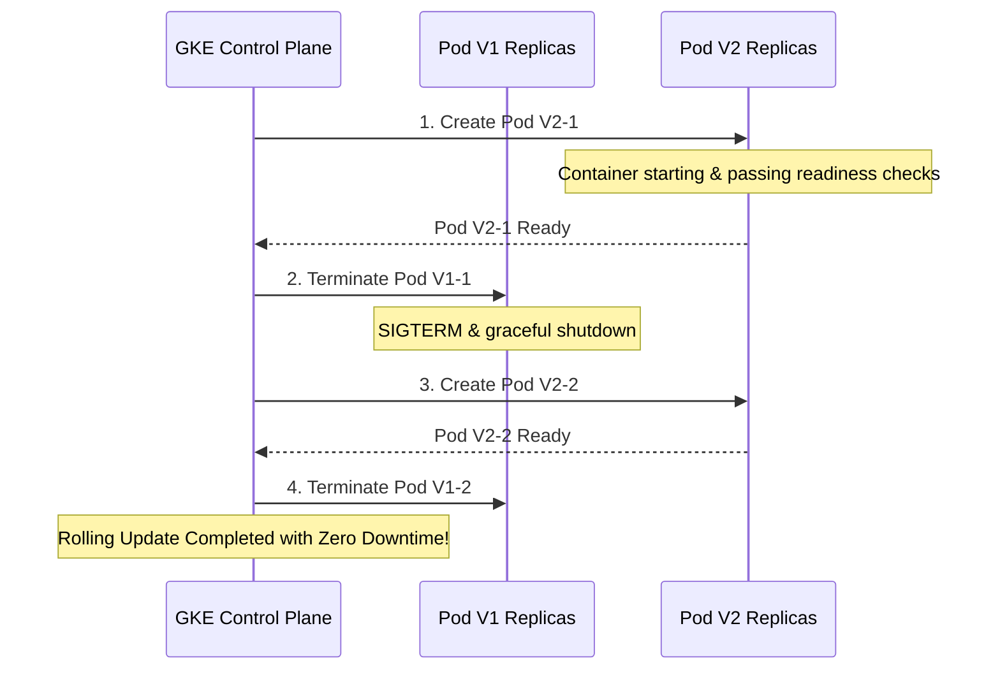

# Lesson 0002: Advanced Deployments, Node Scheduling & Autoscaling

## 1. Only Deploy on Certain Nodes (Node Scheduling)

In production clusters, you often need to control which physical or virtual nodes your Pods land on. For example, database Pods should run on nodes with SSDs, or ML workloads need nodes with GPUs.

### A. `nodeSelector` (Simplest Match)

A simple key-value matching mechanism. The node must have the exact label matching the selector.

```yaml
spec:
  containers:
  - name: nginx
    image: nginx
  nodeSelector:
    disktype: ssd # Node must have label "disktype=ssd"
```

### B. Node Affinity (Flexible & Powerful)

Affinity expands on `nodeSelector` by supporting logic operators (e.g., `In`, `NotIn`, `Exists`) and hard/soft constraints:

* **Hard Limit (Required):**  `requiredDuringSchedulingIgnoredDuringExecution` - Pod won't schedule if rules aren't met.
* **Soft Preference (Preferred):**  `preferredDuringSchedulingIgnoredDuringExecution` - Scheduler tries its best, but will fall back to other nodes if needed.

```yaml
spec:
  affinity:
    nodeAffinity:
      requiredDuringSchedulingIgnoredDuringExecution:
        nodeSelectorTerms:
        - matchExpressions:
          - key: topology.kubernetes.io/zone
            operator: In
            values:
            - us-central1-a
            - us-central1-b
```

### C. Pod Affinity & Anti-Affinity (Co-location or Separation)

Allows scheduling Pods relative to other Pods that are already running on a node. The classic use case is  **Anti-Affinity**  to ensure that replicas of the same service do not run on the same node, protecting against node failures.

```yaml
spec:
  affinity:
    podAntiAffinity:
      requiredDuringSchedulingIgnoredDuringExecution:
      - labelSelector:
          matchExpressions:
          - key: app
            operator: In
            values:
            - web-frontend
        topologyKey: "kubernetes.io/hostname" # Ensures no two "web-frontend" pods share the same host
```

### D. Taints and Tolerations (Repelling Pods)

While Affinity attracts Pods to nodes,  **Taints**  allow a node to repel a set of Pods.

* You place a  **Taint**  on a Node: `kubectl taint nodes node1 gpu=true:NoSchedule`
* Only Pods that have a matching  **Toleration**  can schedule there:

```yaml
spec:
  tolerations:
  - key: "gpu"
    operator: "Equal"
    value: "true"
    effect: "NoSchedule"
```

## 2. Deployment Strategies

Updating applications without breaking production requires different release patterns.

### A. RollingUpdate (Default, Zero Downtime)

Kubernetes updates Pods incrementally. You control the speed using two variables under `strategy.rollingUpdate`:

* `maxSurge`: How many extra Pods can be created above the desired replica count (e.g., `25%` or `1`).
* `maxUnavailable`: How many Pods can be down during the update process (e.g., `25%` or `0`).

```yaml
spec:
  replicas: 4
  strategy:
    type: RollingUpdate
    rollingUpdate:
      maxSurge: 1
      maxUnavailable: 0 # Zero downtime guarantee: keep at least 4 pods alive
```

#### Rolling Update Lifecycle Diagram



### B. Recreate (Downtime)

All existing Pods are killed before new ones are started. Useful if your application cannot run two different versions concurrently (e.g., database schema incompatibility).

```yaml
spec:
  strategy:
    type: Recreate
```

### C. Blue-Green & Canary (External Orchestration)

* **Blue-Green:**  Deploy version 2 (Green) alongside version 1 (Blue). Once Green is ready and verified, edit the Kubernetes `Service` selector to switch traffic instantly to Green.
* **Canary:**  Deploy version 2 to a tiny subset of pods (e.g., 1 out of 10) and route a fraction of traffic to it. Monitor error rates before scaling version 2 to 100%.

## 3. Autoscaling

Kubernetes scales workloads at three distinct levels:

### A. Horizontal Pod Autoscaler (HPA)

Scales the  **number of Pods**  up or down based on metrics like CPU usage, memory usage, or custom metrics.

!!! important "Requirements for HPA"
    To use HPA, your Pods must have resource `requests` defined, and the cluster must have the Metrics Server installed.

```yaml
apiVersion: autoscaling/v2
kind: HorizontalPodAutoscaler
metadata:
  name: php-apache-hpa
spec:
  scaleTargetRef:
    apiVersion: apps/v1
    kind: Deployment
    name: php-apache
  minReplicas: 1
  maxReplicas: 10
  metrics:
  - type: Resource
    resource:
      name: cpu
      target:
        type: Utilization
        averageUtilization: 50
```

### B. Vertical Pod Autoscaler (VPA)

Adjusts the  **CPU and memory resource limits/requests**  of existing containers automatically. Great for database and stateful workloads where scaling out horizontally is difficult.

### C. Cluster Autoscaler (CA)

Scales the **number of Nodes** in the cluster. If HPA schedules too many Pods and the existing nodes run out of memory/CPU, Pods will remain in a `Pending` state. Cluster Autoscaler notices this and provisions new VM instances automatically.

## Test Your Knowledge

### 1. Which scheduling mechanism is used to completely repel pods from running on specific nodes unless explicitly allowed?

- [ ] **A.** Node Affinity (Hard Constraint)
- [ ] **B.** Taints and Tolerations
- [ ] **C.** podAntiAffinity

<details>
<summary><b>Answer & Explanation</b></summary>

**Correct Answer:** B

Correct! Taints are applied to nodes to repel pods, and Tolerations allow pods to schedule on tainted nodes. Affinity is used to attract pods.
</details>

### 2. If you want zero downtime during a deployment update, what is the safest setting for 'maxUnavailable'?

- [ ] **A.** maxUnavailable: 0
- [ ] **B.** maxUnavailable: 100%
- [ ] **C.** maxUnavailable: 1

<details>
<summary><b>Answer & Explanation</b></summary>

**Correct Answer:** A

Correct! Setting maxUnavailable: 0 ensures that Kubernetes does not terminate any active pods before the new replacement pods are running and ready.
</details>

## Interactive Hands-on Practice

Let's deploy a self-healing application with strict Anti-Affinity and custom Rolling Update parameters.

**Step 1:**  Save the following manifest as `production-deployment.yaml` in your workspace:

```yaml
apiVersion: apps/v1
kind: Deployment
metadata:
  name: resilient-web
spec:
  replicas: 3
  strategy:
    type: RollingUpdate
    rollingUpdate:
      maxSurge: 1
      maxUnavailable: 0
  selector:
    matchLabels:
      app: web-app
  template:
    metadata:
      labels:
        app: web-app
    spec:
      affinity:
        podAntiAffinity:
          preferredDuringSchedulingIgnoredDuringExecution:
          - weight: 100
            podAffinityTerm:
              labelSelector:
                matchExpressions:
                - key: app
                  operator: In
                  values:
                  - web-app
              topologyKey: "kubernetes.io/hostname"
      containers:
      - name: nginx
        image: nginx:1.25.1
        resources:
          requests:
            cpu: 100m
            memory: 128Mi
          limits:
            cpu: 200m
            memory: 256Mi
        ports:
        - containerPort: 80
```

**Step 2:**  Apply the file: `kubectl apply -f production-deployment.yaml`

**Step 3:**  Trigger a rolling update by updating the container image: 

`kubectl set image deployment/resilient-web nginx=nginx:1.25.2`

**Step 4:**  Monitor the update: `kubectl rollout status deployment/resilient-web`

---

[← Lesson 2: Pod Anatomy & Configuration](./0002-pod-anatomy.md) | [Lesson 4: Service-to-Service Communication & DNS →](./0004-service-communication.md)
