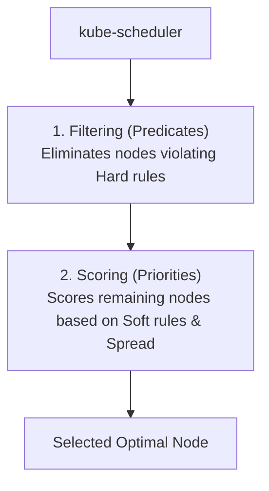
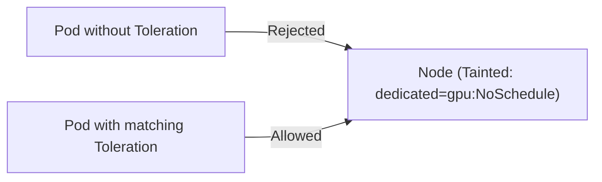
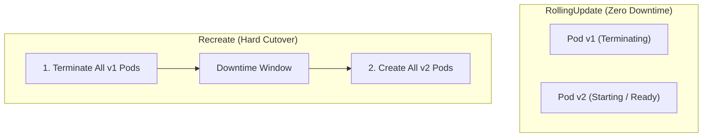
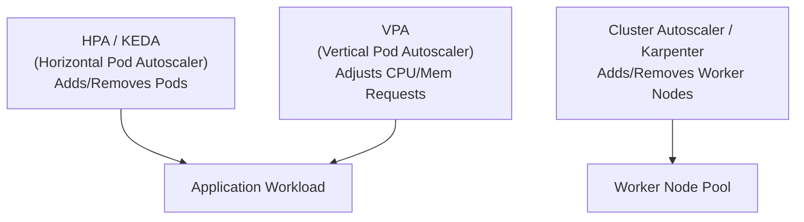

# Lesson 0003: Advanced Node Scheduling, Deployment Strategies & Autoscaling

## 🚀 Fast Interview Summary & Cheatsheet

| Mechanism | Purpose | Hard / Soft | Key Parameters |
| :--- | :--- | :--- | :--- |
| **`nodeSelector`** | Simple key-value label matching | Hard only | `spec.nodeSelector` |
| **Node Affinity** | Advanced node placement rules | Hard & Soft | `requiredDuringScheduling...` (Hard) / `preferredDuringScheduling...` (Soft) |
| **Pod Anti-Affinity** | Prevent co-locating Pods on same host/zone | Hard & Soft | `topologyKey: kubernetes.io/hostname` or `topology.kubernetes.io/zone` |
| **Topology Spread** | Evenly spread replicas across failure domains | Hard & Soft | `maxSkew: 1`, `topologyKey`, `whenUnsatisfiable: DoNotSchedule` |
| **Taints & Tolerations** | Nodes repel Pods unless tolerated | Hard & Soft | `NoSchedule`, `PreferNoSchedule`, **`NoExecute` (Evicts running Pods!)** |
| **RollingUpdate** | Zero-downtime version replacement | Tunable | `maxSurge: 25%`, `maxUnavailable: 0` (Zero dropped requests) |
| **Recreate** | Kills all old pods before starting new ones | Hard cutover | Downtime during rollout; avoids dual-version database collisions |

---

## 1. Node Placement & Advanced Scheduling

Kubernetes provides multiple mechanisms to direct Pods to specific worker nodes (e.g. SSD nodes, GPU nodes, specific availability zones):


```mermaid
graph TD
    Scheduler["kube-scheduler"] --> Phase1["1. Filtering (Predicates)\nEliminates nodes violating Hard rules"]
    Phase1 --> Phase2["2. Scoring (Priorities)\nScores remaining nodes based on Soft rules & Spread"]
    Phase2 --> Node["Selected Optimal Node"]
```

### A. Node Affinity vs. Pod Anti-Affinity
- **Node Affinity (Node-to-Pod):** Rules based on the labels of the *Node* (e.g., `disktype=ssd`, `cloud.google.com/gke-nodepool=gpu-pool`).
- **Pod Anti-Affinity (Pod-to-Pod):** Rules based on the labels of *other Pods* already running on that host or zone. Essential for high availability so multiple replicas of your frontend do not share a single failing server.

```yaml
spec:
  affinity:
    # 1. Hard Rule: Must land in us-central1-a or us-central1-b
    nodeAffinity:
      requiredDuringSchedulingIgnoredDuringExecution:
        nodeSelectorTerms:
          - matchExpressions:
              - key: topology.kubernetes.io/zone
                operator: In
                values: ["us-central1-a", "us-central1-b"]
    # 2. Hard Rule: No two replicas on the same physical host
    podAntiAffinity:
      requiredDuringSchedulingIgnoredDuringExecution:
        - labelSelector:
            matchLabels:
              app: payment-api
          topologyKey: "kubernetes.io/hostname"
```

---

### B. Topology Spread Constraints (The Modern Standard)

While Pod Anti-Affinity is binary (yes/no), **Topology Spread Constraints** allow you to balance Pods evenly across failure domains (Zones, Racks, Nodes):

```yaml
spec:
  topologySpreadConstraints:
    - maxSkew: 1                      # Max difference in pod count between zones
      topologyKey: topology.kubernetes.io/zone
      whenUnsatisfiable: DoNotSchedule # Hard enforcement
      labelSelector:
        matchLabels:
          app: web-server
```

---

### C. Taints and Tolerations (Repelling Pods)

While Affinity **attracts** Pods to nodes, **Taints** allow a node to **repel** Pods unless the Pod has a matching **Toleration**.


```mermaid
graph LR
    PodNoTol["Pod without Toleration"] -->|Rejected| TaintedNode["Node (Tainted: dedicated=gpu:NoSchedule)"]
    PodWithTol["Pod with matching Toleration"] -->|Allowed| TaintedNode
```

#### The 3 Taint Effects:
1. **`NoSchedule`:** New Pods without matching tolerations will **not** be scheduled on this node. Existing running pods are not affected.
2. **`PreferNoSchedule`:** Soft rule; the scheduler tries to avoid the node, but will place pods there if no other nodes are available.
3. **`NoExecute`:** **Evicts running Pods immediately** if they do not tolerate the taint (used during node maintenance or when a node becomes unhealthy).

---

## 2. Deployment Update Strategies


```mermaid
graph TD
    subgraph RollingUpdateStrategy ["RollingUpdate (Zero Downtime)"]
        OldV1["Pod v1 (Terminating)"]
        NewV2["Pod v2 (Starting / Ready)"]
    end

    subgraph RecreateStrategy ["Recreate (Hard Cutover)"]
        Step1["1. Terminate All v1 Pods"] --> Step2["Downtime Window"] --> Step3["2. Create All v2 Pods"]
    end
```

### A. `RollingUpdate` Configuration
- **`maxSurge`:** How many extra Pods can be created above `replicas` during update (e.g. `25%`).
- **`maxUnavailable`:** How many Pods can be unavailable during update (e.g. `0` or `25%`).

```yaml
spec:
  strategy:
    type: RollingUpdate
    rollingUpdate:
      maxSurge: 25%                  # Allow 25% extra pods during rollout
      maxUnavailable: 0              # Guarantee 100% capacity remains active!
```

---

## 3. The Kubernetes Autoscaling Ecosystem


```mermaid
graph TD
    Workload["Application Workload"]
    HPA["HPA / KEDA\n(Horizontal Pod Autoscaler)\nAdds/Removes Pods"] --> Workload
    VPA["VPA\n(Vertical Pod Autoscaler)\nAdjusts CPU/Mem Requests"] --> Workload
    CA["Cluster Autoscaler / Karpenter\nAdds/Removes Worker Nodes"] --> Nodes["Worker Node Pool"]
```

1. **Horizontal Pod Autoscaler (HPA / KEDA):** Scales the number of Pod replicas based on CPU, memory, or external queue/cron metrics.
2. **Vertical Pod Autoscaler (VPA):** Automatically resizes container CPU and memory requests/limits based on historical usage.
3. **Cluster Autoscaler & Karpenter:** Provisions new physical/virtual cloud nodes when Pods cannot schedule due to insufficient cluster capacity (`Pending`).

---

## 🎯 Interview Deep-Dives & Scenarios

??? question "Interview Question: What is the difference between `NoSchedule` and `NoExecute` taints?"
    **Answer:**
    - **`NoSchedule`:** Only affects **future** scheduling decisions. Pods currently running on the node remain untouched even if they lack a toleration.
    - **`NoExecute`:** Affects both **future** scheduling AND **currently running** Pods. If a running Pod lacks a matching toleration, `kubelet` immediately evicts the Pod from the node.
    - **`tolerationSeconds` with NoExecute:** You can specify `tolerationSeconds: 300` on a Pod. If a node becomes `Unreachable` (tainted with `node.kubernetes.io/unreachable:NoExecute`), the Pod is granted a 5-minute grace period before eviction, preventing unnecessary rescheduling during brief network blips.

??? question "Interview Scenario: Can you run HPA and VPA together on the same Deployment?"
    **The Classic Interview Trap:**
    - **Rule:** **No, you cannot run standard HPA and VPA together on the same resource metrics (CPU/Memory).**
    - **Why:** They will enter an **infinte reconciliation conflict**. When traffic spikes, VPA will try to increase CPU requests (restarting the pod), while HPA will try to scale out replica counts.
    - **The Exception:** You **can** combine them if HPA scales on **custom/external metrics** (e.g. KEDA queue depth, Prometheus RPS) while VPA manages container CPU and Memory limits.

??? question "Interview Scenario: How do you achieve true zero-downtime rollouts with zero dropped packets?"
    **Answer:**
    1. Set `strategy.rollingUpdate.maxUnavailable: 0` so no active replicas are terminated before new ones are ready.
    2. Set a strict **`readinessProbe`** on the container so Kubernetes does not route traffic until the app is fully initialized.
    3. Configure a **`preStop` hook** (`sleep 10`) and proper `terminationGracePeriodSeconds` to allow in-flight connections to drain before the container receives `SIGKILL`.

---

## ⚠️ Common Production Pitfalls & Interview Traps

??? warning "Production Trap: Using `maxUnavailable: 100%`"
    If you set `maxUnavailable: 100%` in a `RollingUpdate`, Kubernetes will terminate all existing Pods simultaneously before launching new ones, turning your zero-downtime rollout into a complete service outage.

??? warning "Production Trap: Missing Zone Topology Spread in Cloud Deployments"
    Without `topologySpreadConstraints` or zone anti-affinity, the scheduler might place all replicas of your mission-critical service into a single cloud availability zone (e.g., `us-central1-a`). If that zone experiences an outage, your entire service goes offline despite having 10 replicas.

---

## 💻 Hands-on Verification & Diagnostic Toolkit

```bash
# 1. Check pod distribution across nodes and zones
kubectl get pods -o wide --sort-by='.spec.nodeName'

# 2. Monitor rollout status in real-time
kubectl rollout status deployment/web-app

# 3. View deployment rollout history and revision annotations
kubectl rollout history deployment/web-app

# 4. Instant rollback to previous revision
kubectl rollout undo deployment/web-app --to-revision=2

# 5. Inspect node taints
kubectl get nodes -o jsonpath='{range .items[*]}{.metadata.name}{": "}{.spec.taints}{"\n"}{end}'
```

---

## Test Your Knowledge

1. If you taint a worker node with `maintenance=true:NoExecute`, what happens to Pods currently running on that node that lack a matching toleration?
   - [ ] A) They are evicted and terminated immediately by the kubelet
   - [ ] B) They continue running until their existing processes complete
   
   *Answer:* A) They are evicted and terminated immediately by the kubelet - Correct! Unlike `NoSchedule`, the `NoExecute` effect actively evicts non-tolerating Pods currently running on the node.

2. To guarantee that a `RollingUpdate` never drops below 100% required server capacity during deployment, which configuration is mandatory?
   - [ ] A) Set maxUnavailable to 0 in the rolling update strategy block
   - [ ] B) Set maxSurge to 0 in the rolling update strategy block
   
   *Answer:* A) Set maxUnavailable to 0 in the rolling update strategy block - Correct! Setting `maxUnavailable: 0` ensures new pods are fully created and passing readiness checks before any old pods are terminated.

---

## Recommended Primary Resource
- [Kubernetes Assigning Pods to Nodes](https://kubernetes.io/docs/concepts/scheduling-eviction/assign-pod-node/)
- [Kubernetes Topology Spread Constraints](https://kubernetes.io/docs/concepts/scheduling-eviction/topology-spread-constraints/)

---
**Simulating a multi-zone scheduling failure or designing a rollout strategy?** Ask in chat, and we'll review your manifest!

[← Lesson 2: Pod Anatomy & Configuration](./0002-pod-anatomy.md) | [Lesson 4: Service Communication & DNS →](./0004-service-communication.md)
