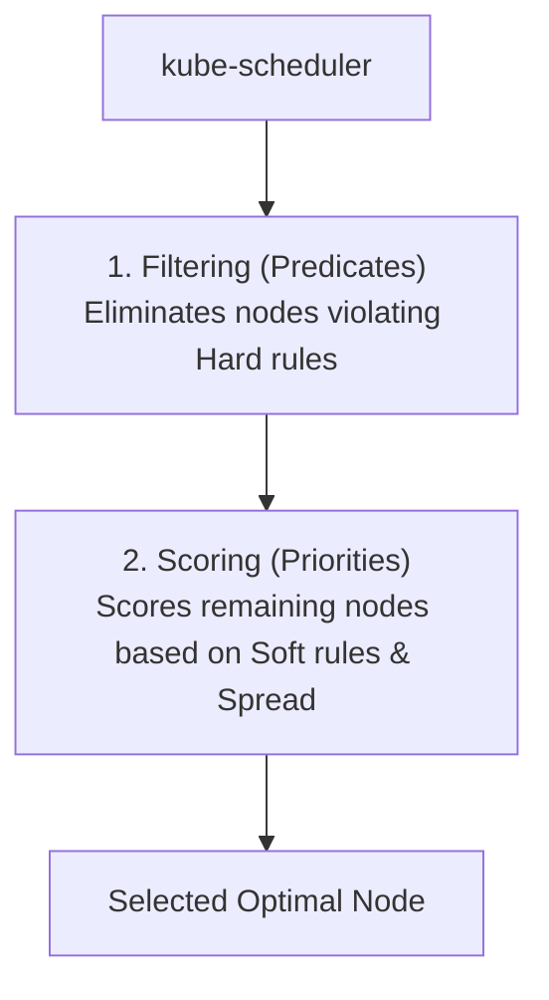
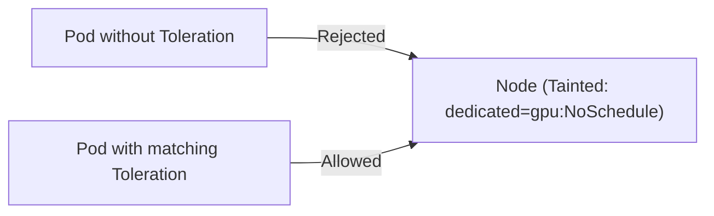
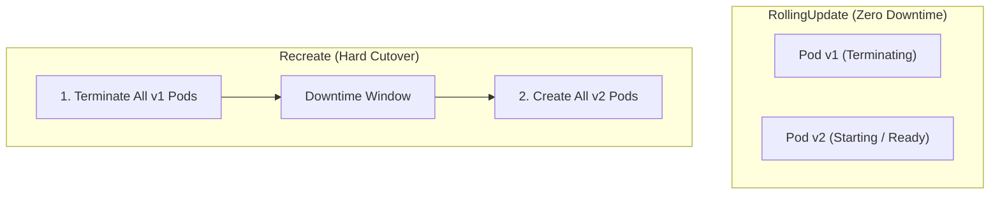
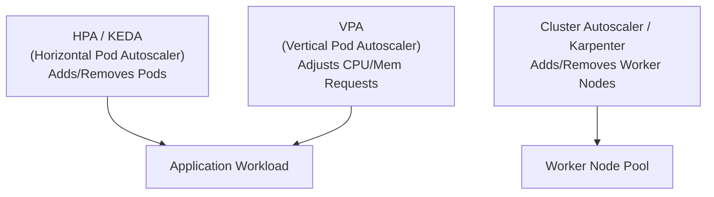

# Lesson 0003: Advanced node scheduling, deployment strategies, and autoscaling

## Fast interview summary and cheatsheet

| Mechanism | Purpose | Hard / Soft | Key parameters |
| :--- | :--- | :--- | :--- |
| **`nodeSelector`** | Simple key-value label matching | Hard only | `spec.nodeSelector` |
| **Node affinity** | Node placement rules with operators | Hard & Soft | `requiredDuringScheduling...` (Hard) / `preferredDuringScheduling...` (Soft) |
| **Pod anti-affinity** | Prevent co-locating Pods on same host or zone | Hard & Soft | `topologyKey: kubernetes.io/hostname` or `topology.kubernetes.io/zone` |
| **Topology spread** | Evenly spread replicas across failure domains | Hard & Soft | `maxSkew: 1`, `topologyKey`, `whenUnsatisfiable: DoNotSchedule` |
| **Taints and tolerations** | Nodes repel Pods unless tolerated | Hard & Soft | `NoSchedule`, `PreferNoSchedule`, **`NoExecute` (Evicts running Pods)** |
| **RollingUpdate** | Zero-downtime version replacement | Tunable | `maxSurge: 25%`, `maxUnavailable: 0` (guarantees capacity) |
| **Recreate** | Stops old pods before starting new ones | Hard cutover | Causes downtime; prevents multi-version database conflicts |

---

## 1. Node placement and advanced scheduling

Kubernetes provides mechanisms to direct Pods to specific worker nodes, including high-memory nodes, GPU nodes, and specific availability zones:


```mermaid
graph TD
    Scheduler["kube-scheduler"] --> Phase1["1. Filtering (Predicates)\nEliminates nodes violating Hard rules"]
    Phase1 --> Phase2["2. Scoring (Priorities)\nScores remaining nodes based on Soft rules & Spread"]
    Phase2 --> Node["Selected Optimal Node"]
```

### A. Node affinity versus Pod anti-affinity
- **Node affinity (Node-to-Pod):** Rules based on the labels of the *Node* (such as `disktype=ssd` or `cloud.google.com/gke-nodepool=gpu-pool`).
- **Pod anti-affinity (Pod-to-Pod):** Rules based on the labels of *other Pods* already running on that host or zone. This prevents multiple replicas of the same service from sharing a single physical host or failure domain.

```yaml
spec:
  affinity:
    # 1. Hard Rule: Must land in us-central1-a or us-central1-b
    nodeAffinity:
      requiredDuringSchedulingIgnoredDuringExecution:
        nodeSelectorTerms:
          - matchExpressions:
              - key: topology.kubernetes.io/zone
                operator: In
                values: ["us-central1-a", "us-central1-b"]
    # 2. Hard Rule: No two replicas on the same physical host
    podAntiAffinity:
      requiredDuringSchedulingIgnoredDuringExecution:
        - labelSelector:
            matchLabels:
              app: payment-api
          topologyKey: "kubernetes.io/hostname"
```

---

### B. Topology spread constraints

While Pod anti-affinity acts as a binary match, **Topology spread constraints** balance Pods evenly across failure domains (Zones, Racks, Nodes):

```yaml
spec:
  topologySpreadConstraints:
    - maxSkew: 1                      # Max difference in pod count between zones
      topologyKey: topology.kubernetes.io/zone
      whenUnsatisfiable: DoNotSchedule # Hard enforcement
      labelSelector:
        matchLabels:
          app: web-server
```

---

### C. Taints and tolerations

While affinity attracts Pods to nodes, **taints** allow a node to **repel** Pods unless the Pod specifies a matching **toleration**.


```mermaid
graph LR
    PodNoTol["Pod without Toleration"] -->|Rejected| TaintedNode["Node (Tainted: dedicated=gpu:NoSchedule)"]
    PodWithTol["Pod with matching Toleration"] -->|Allowed| TaintedNode
```

#### Three taint effects
1. **`NoSchedule`:** New Pods without matching tolerations will not be scheduled on this node. Existing running pods remain untouched.
2. **`PreferNoSchedule`:** Soft rule; the scheduler avoids the node, but places pods there if no alternative exists.
3. **`NoExecute`:** Evicts running Pods immediately if they do not tolerate the taint (used during node maintenance or hardware faults).

---

## 2. Deployment update strategies


```mermaid
graph TD
    subgraph RollingUpdateStrategy ["RollingUpdate (Zero Downtime)"]
        OldV1["Pod v1 (Terminating)"]
        NewV2["Pod v2 (Starting / Ready)"]
    end

    subgraph RecreateStrategy ["Recreate (Hard Cutover)"]
        Step1["1. Terminate All v1 Pods"] --> Step2["Downtime Window"] --> Step3["2. Create All v2 Pods"]
    end
```

### A. RollingUpdate configuration
- **`maxSurge`:** How many extra Pods can be created above `replicas` during an update (such as `25%`).
- **`maxUnavailable`:** How many Pods can be unavailable during an update (such as `0` or `25%`).

```yaml
spec:
  strategy:
    type: RollingUpdate
    rollingUpdate:
      maxSurge: 25%                  # Allow 25% extra pods during rollout
      maxUnavailable: 0              # Guarantee 100% capacity remains active
```

---

## 3. The Kubernetes autoscaling ecosystem


```mermaid
graph TD
    Workload["Application Workload"]
    HPA["HPA / KEDA\n(Horizontal Pod Autoscaler)\nAdds/Removes Pods"] --> Workload
    VPA["VPA\n(Vertical Pod Autoscaler)\nAdjusts CPU/Mem Requests"] --> Workload
    CA["Cluster Autoscaler / Karpenter\nAdds/Removes Worker Nodes"] --> Nodes["Worker Node Pool"]
```

1. **Horizontal Pod Autoscaler (HPA / KEDA):** Scales the number of Pod replicas based on CPU, memory, or external queue depth and metrics.
2. **Vertical Pod Autoscaler (VPA):** Resizes container CPU and memory requests and limits automatically based on historical usage.
3. **Cluster Autoscaler & Karpenter:** Provisions new cloud worker nodes when Pods cannot schedule due to insufficient cluster capacity (`Pending`).

---

## Interview deep-dives and scenarios

??? question "Interview question: What is the difference between `NoSchedule` and `NoExecute` taints?"
    - **`NoSchedule`:** Only affects future scheduling decisions. Pods currently running on the node remain untouched even without a toleration.
    - **`NoExecute`:** Affects both future scheduling and currently running Pods. If a running Pod lacks a matching toleration, `kubelet` evicts it immediately.
    - **`tolerationSeconds` with NoExecute:** You can specify `tolerationSeconds: 300` on a Pod. If a node transitions to `Unreachable` (tainted with `node.kubernetes.io/unreachable:NoExecute`), the Pod receives a 5-minute grace period before eviction, avoiding churn during short network partitions.

??? question "Interview scenario: Can you run HPA and VPA together on the same Deployment?"
    No, you cannot run standard HPA and VPA together when both scale on the same resource metrics (CPU or Memory).
    
    They enter an infinite reconciliation conflict: when traffic spikes, VPA attempts to increase CPU requests (restarting the pod), while HPA attempts to scale out replica counts.
    
    You can combine them only if HPA scales on custom or external metrics (such as queue depth or request rate) while VPA manages container CPU and memory requests.

??? question "Interview scenario: How do you achieve true zero-downtime rollouts with zero dropped packets?"
    1. Set `strategy.rollingUpdate.maxUnavailable: 0` so no active replicas terminate before new ones are ready.
    2. Define an accurate **`readinessProbe`** on the container so Kubernetes does not route traffic until the application completes initialization.
    3. Configure a **`preStop` hook** (`sleep 10`) and a realistic `terminationGracePeriodSeconds` so in-flight requests finish before the container receives `SIGKILL`.

---

## Common production pitfalls and interview traps

??? warning "Production trap: Using `maxUnavailable: 100%`"
    Setting `maxUnavailable: 100%` in a `RollingUpdate` tells Kubernetes to terminate all existing Pods at once before launching replacements, causing a complete service outage.

??? warning "Production trap: Missing zone topology spread in cloud deployments"
    Without `topologySpreadConstraints` or zone anti-affinity, the scheduler can place every replica of a critical service into a single availability zone. If that zone experiences an outage, the entire service goes down despite running multiple replicas.

---

## Hands-on verification and diagnostics

```bash
# 1. Check pod distribution across nodes and zones
kubectl get pods -o wide --sort-by='.spec.nodeName'

# 2. Monitor rollout status in real-time
kubectl rollout status deployment/web-app

# 3. View deployment rollout history and revision annotations
kubectl rollout history deployment/web-app

# 4. Instant rollback to previous revision
kubectl rollout undo deployment/web-app --to-revision=2

# 5. Inspect node taints
kubectl get nodes -o jsonpath='{range .items[*]}{.metadata.name}{": "}{.spec.taints}{"\n"}{end}'
```

---

## Test your knowledge

1. If you taint a worker node with `maintenance=true:NoExecute`, what happens to Pods currently running on that node that lack a matching toleration?
   - [ ] A) They are evicted and terminated immediately by the kubelet
   - [ ] B) They continue running until their existing processes complete
   
   Answer: A. Unlike `NoSchedule`, the `NoExecute` effect actively evicts non-tolerating Pods currently running on the node.

2. To guarantee that a `RollingUpdate` never drops below 100% required server capacity during deployment, which configuration is mandatory?
   - [ ] A) Set maxUnavailable to 0 in the rolling update strategy block
   - [ ] B) Set maxSurge to 0 in the rolling update strategy block
   
   Answer: A. Setting `maxUnavailable: 0` ensures new pods are fully running and passing readiness checks before old pods terminate.

---

## Recommended primary resources
- [Kubernetes assigning Pods to nodes](https://kubernetes.io/docs/concepts/scheduling-eviction/assign-pod-node/)
- [Kubernetes topology spread constraints](https://kubernetes.io/docs/concepts/scheduling-eviction/topology-spread-constraints/)

---

[← Lesson 2: Pod anatomy, multi-container patterns, and lifecycle](./0002-pod-anatomy.md) | [Lesson 4: Service-to-service communication and DNS →](./0004-service-communication.md)
