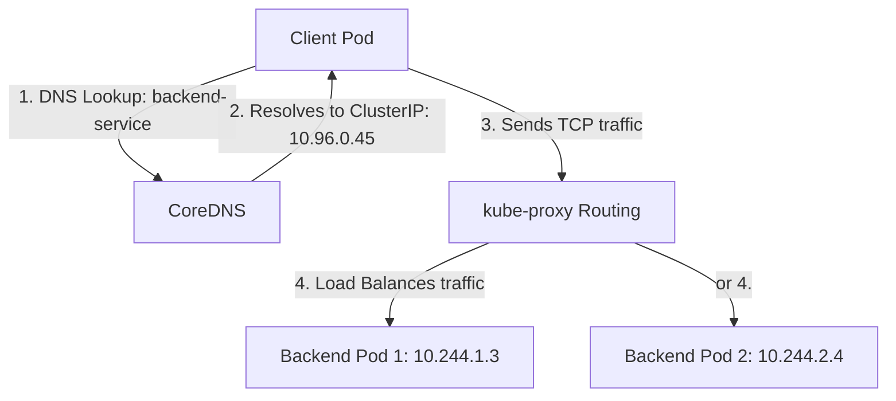

# Lesson 0004: Service-to-Service Communication & DNS

Kubernetes Pods are ephemeral. If a Pod is rescheduled, it receives a new IP address. Because Pod IPs are unpredictable and continually changing, client Pods cannot connect to them directly. 

Kubernetes solves this with **Services**: a logical abstraction that groups replica Pods and exposes them under a single, stable IP and DNS name.

---

## 1. How Cluster Services Communicate

A Service uses selector labels to match and identify target Pods. It exposes a single, virtual IP address inside the cluster (the **ClusterIP**). Requests sent to this IP are load-balanced across the matching healthy Pods using local node iptables/IPVS rules managed by `kube-proxy`.

### DNS Resolution Mechanics
Every cluster runs an internal DNS service (usually **CoreDNS**). When a container attempts to connect to a hostname, CoreDNS resolves it.

The fully qualified domain name (FQDN) for a Service is structured as:
`[service-name].[namespace].svc.cluster.local`

* **Same Namespace Shortcut:** If Pod A and Service B are in the same namespace, you can simply use the Service name (e.g., `http://backend-service:[port]`).
* **Cross-Namespace Connection:** If they are in different namespaces, you must append the namespace (e.g., `http://backend-service.prod.svc.cluster.local`).



---

## 2. Kubernetes Service Types

Kubernetes offers different types of Services depending on how you want to expose them:

1. **`ClusterIP` (Default):** Exposes the Service on an internal IP. It is only reachable from within the cluster.
2. **`NodePort`:** Exposes the Service on each Node's IP at a static port (in the range `30000-32767`). You can connect to it from outside the cluster at `<NodeIP>:<NodePort>`.
3. **`LoadBalancer`:** Integrates with cloud provider load balancers (like Google Cloud Load Balancing) to expose the Service externally with a dedicated public IP address.
4. **`ExternalName`:** Maps the Service to a DNS name outside the cluster (e.g. an external database) by returning a CNAME record.

---

## 3. Code Examples: Service Types in Action

Below are the manifest configurations and explanations for each of the four Kubernetes Service types.

### Common Backend Deployment (`backend-deployment.yaml`)
To demonstrate how these services connect to an application, we use a simple backend deployment:

```yaml
apiVersion: apps/v1
kind: Deployment
metadata:
  name: backend-app
spec:
  replicas: 2
  selector:
    matchLabels:
      app: backend-api
  template:
    metadata:
      labels:
        app: backend-api
    spec:
      containers:
      - name: api
        image: hashicorp/http-echo:latest
        args: ["-text", "Response from Backend API"]
        ports:
        - containerPort: 5678
```

---

### Type 1: `ClusterIP` Service (Default)
Exposes the Service on an internal IP address. It is only accessible from within the cluster (e.g., frontend pod connecting to backend pod).

**Manifest Setup (`service-clusterip.yaml` & `frontend.yaml`):**

```yaml
apiVersion: v1
kind: Service
metadata:
  name: backend-service
spec:
  type: ClusterIP
  selector:
    app: backend-api # Must match the Pod labels in the deployment
  ports:
  - port: 80         # Port clients target on the Service
    targetPort: 5678 # Port the container process actually listens on
```

```yaml
apiVersion: apps/v1
kind: Deployment
metadata:
  name: frontend-client
spec:
  replicas: 1
  selector:
    matchLabels:
      app: web-client
  template:
    metadata:
      labels:
        app: web-client
    spec:
      containers:
      - name: client
        image: curlimages/curl:latest
        command: ["/bin/sh", "-c"]
        # Connects to 'backend-service' DNS name on port 80
        args:
        - "while true; do curl -s http://backend-service:80; sleep 10; done"
```

---

### Type 2: `NodePort` Service
Exposes the Service on each Node's IP address at a static port (in the range `30000-32767`). Traffic sent to `<NodeIP>:<NodePort>` is automatically routed to the target Pods.

**Manifest Setup (`service-nodeport.yaml`):**

```yaml
apiVersion: v1
kind: Service
metadata:
  name: backend-nodeport-service
spec:
  type: NodePort
  selector:
    app: backend-api
  ports:
  - port: 80         # Port clients target inside the cluster
    targetPort: 5678 # Port the container process listens on
    nodePort: 30080  # Optional: Static port exposed on all Nodes. If omitted, a random port in range 30000-32767 is assigned.
```

> [!NOTE]
> You can connect to it from outside the cluster at `<AnyNodePublicIP>:30080`.

---

### Type 3: `LoadBalancer` Service
Integrates with cloud provider load balancers (like Google Cloud Load Balancing on GKE) to expose the Service externally with a dedicated public IP address.

**Manifest Setup (`service-loadbalancer.yaml`):**

```yaml
apiVersion: v1
kind: Service
metadata:
  name: backend-loadbalancer-service
spec:
  type: LoadBalancer
  selector:
    app: backend-api
  ports:
  - port: 80         # Port exposed on the external load balancer
    targetPort: 5678 # Port the container process listens on
```

> [!TIP]
> After applying this service, running `kubectl get svc` will show an `EXTERNAL-IP` once provisioned by the cloud provider. You can reach the service externally at `http://<EXTERNAL-IP>:80`.

---

### Type 4: `ExternalName` Service
Maps the Service to a DNS name outside the cluster (e.g. an external database) by returning a CNAME record. It does not use selectors or select pods.

**Manifest Setup (`service-externalname.yaml`):**

```yaml
apiVersion: v1
kind: Service
metadata:
  name: external-db-service
spec:
  type: ExternalName
  externalName: prod-db.example.com # CoreDNS returns a CNAME record pointing here
```

> [!NOTE]
> This is useful when you want workloads inside the cluster to refer to an external database using a stable local alias (`external-db-service`), allowing you to change the external endpoint later without updating application configurations.

---

## 4. Key Concepts to Remember

!!! warning "Port vs. TargetPort"
    * **`port`:** The port number client containers use to send traffic to the Service.
    * **`targetPort`:** The port number the container application listens on (e.g. `containerPort` in the container spec).
    If these are mismatched, connections to the Service will time out or be refused.

!!! warning "Selectors and Labels"
    If the Service's `selector` labels do not match the Pod's labels exactly, no Pods will register with the Service, leaving the Service endpoint pool empty.

---

## Test Your Knowledge

### 1. If you run a Pod and a Service in the 'default' namespace, and you want to connect to a Service named 'database' in the 'prod' namespace, which FQDN should you use?
- [ ] **A.** database
- [ ] **B.** database.prod
- [ ] **C.** database.prod.svc.cluster.local

<details>
<summary><b>Answer & Explanation</b></summary>

**Correct Answer:** C

**Explanation:** Since the client Pod is in a different namespace, it must specify the target namespace in the connection hostname. The full FQDN format is required: `database.prod.svc.cluster.local`.
</details>

### 2. What happens to a Service if all matching Pods fail their readiness checks?
- [ ] **A.** The Service is deleted by the control plane.
- [ ] **B.** The Service remains active, but its endpoints pool becomes empty and requests to the Service fail.
- [ ] **C.** The Service redirects traffic to CoreDNS.

<details>
<summary><b>Answer & Explanation</b></summary>

**Correct Answer:** B

**Explanation:** If Pods fail readiness checks, they are temporarily removed from the Service's endpoints list. The Service still exists, but has no healthy backends to route traffic to, resulting in connection timeouts.
</details>

---

[← Lesson 3: Node Scheduling](./0003-node-scheduling-deployment-strategies-autoscaling.md) | [Lesson 5: Stateless vs. Stateful Workloads →](./0005-stateless-stateful-secrets-gcp.md)
