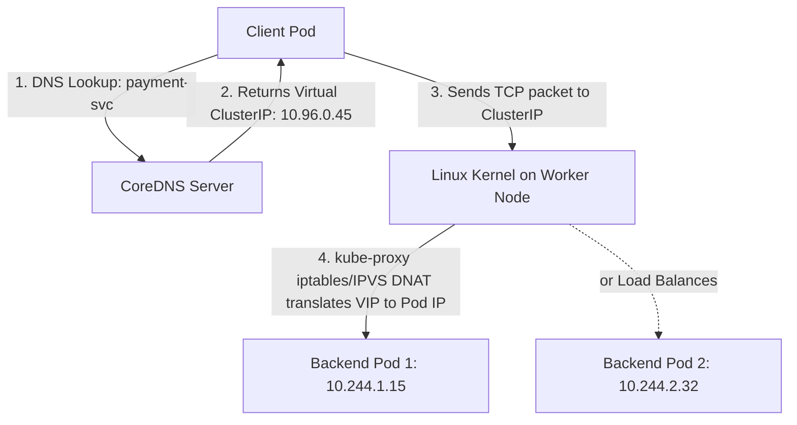

# Lesson 0004: Service-to-Service Communication, Kube-Proxy & CoreDNS

## 🚀 Fast Interview Summary & Cheatsheet

| Service Type | Scope & Routing | IP Assigned? | Default Port Range |
| :--- | :--- | :--- | :--- |
| **`ClusterIP`** | Internal only (Default) | Virtual ClusterIP (VIP) | Internal cluster port |
| **`NodePort`** | Accessible via `<NodeIP>:<NodePort>` | NodePort on every node + ClusterIP | **`30000–32767`** |
| **`LoadBalancer`** | Public/Internal Cloud LB (L4) | Cloud External IP + NodePort + ClusterIP | Any standard port (80, 443) |
| **`ExternalName`** | Maps internal name to external DNS | **No IP** (Returns CNAME record) | N/A |
| **`Headless Service`** | Direct Pod IP discovery (`clusterIP: None`) | **No ClusterIP** (Returns list of Pod IPs) | Target container port |

---

## 1. How Cluster Networking & Services Work

Kubernetes Pods are ephemeral; their IP addresses change every time they are recreated. **Services** provide a stable abstraction layer, giving a static virtual IP and DNS name to a dynamic set of backend Pods.


```mermaid
graph TD
    Client[Client Pod] -->|1. DNS Lookup: payment-svc| DNS[CoreDNS Server]
    DNS -->|2. Returns Virtual ClusterIP: 10.96.0.45| Client
    Client -->|3. Sends TCP packet to ClusterIP| Kernel[Linux Kernel on Worker Node]
    Kernel -->|4. kube-proxy iptables/IPVS DNAT translates VIP to Pod IP| Pod1[Backend Pod 1: 10.244.1.15]
    Kernel -.->|or Load Balances| Pod2[Backend Pod 2: 10.244.2.32]
```

### The Architectural Truth About `ClusterIP`
* A **ClusterIP is NOT a real IP address** attached to any physical network interface or NIC.
* It is a virtual routing rule stored in the Linux kernel on every worker node.
* When a packet is addressed to a ClusterIP, the node's packet filter (configured by `kube-proxy`) intercepts the packet and performs **DNAT (Destination Network Address Translation)**, rewriting the destination IP to a healthy Pod's IP address.

---

## 2. Kube-Proxy Execution Modes

`kube-proxy` runs on every worker node to synchronize Service definitions and Endpoints into kernel packet-filtering rules.

```mermaid
graph LR
    subgraph iptablesMode ["1. iptables Mode (Default)"]
        Packet1[Packet] --> Chain1[Rule 1] --> Chain2[Rule 2] --> ChainN[Rule N (Sequential O(N))]
    end

    subgraph ipvsMode ["2. IPVS Mode (High Performance)"]
        Packet2[Packet] --> Hash[IPVS Hash Table Lookups (O(1))]
    end

    subgraph ebpfMode ["3. eBPF Mode (Cilium - Modern)"]
        Packet3[Packet] --> Socket[Socket-Level BPF Kernel Hook]
    end
```

| Mode | Complexity | Scale Limit | Load Balancing Algorithms |
| :--- | :--- | :--- | :--- |
| **`iptables`** | $O(N)$ sequential rule evaluation | Degrades around ~5,000 Services / 20k Pods | Random round-robin only |
| **`IPVS`** | $O(1)$ ipset hash table lookups | Scales to 100,000+ Services with low CPU | 8 algorithms: Round-Robin, Least Connections, Source/Dest Hashing, etc. |
| **`eBPF`** | $O(1)$ Direct socket programs | Extreme line-rate throughput; bypasses Netfilter | Dynamic latency-aware routing |

---

## 3. Endpoints vs. EndpointSlices

When a Service matches Pods using `spec.selector`, the control plane tracks the active Pod IPs:

* **`Endpoints` (Legacy):** A single `Endpoints` resource stores all IP addresses for a Service. If a deployment has 5,000 Pods, any single Pod change generates a massive 5,000-entry update broadcasted to every node in the cluster, causing `etcd` network saturation.
* **`EndpointSlices` (Modern Standard):** Splits large lists of endpoints into chunks of **100 endpoints per slice**. When a Pod restarts, only 1 tiny slice updates, dramatically reducing network and CPU overhead.

---

## 4. Headless Services (`clusterIP: None`)

A **Headless Service** is defined by setting `spec.clusterIP: None`.

```yaml
apiVersion: v1
kind: Service
metadata:
  name: cassandra-headless
spec:
  clusterIP: None                     # Headless Service!
  selector:
    app: cassandra
  ports:
    - port: 9042
      name: cql
```

### How DNS Differs for Headless Services:
- **Standard Service:** CoreDNS returns the single virtual **ClusterIP**.
- **Headless Service:** CoreDNS returns **multiple A/AAAA records containing the direct IP addresses of all backing Pods**.
- **Use Cases:** StatefulSets (Kafka, Cassandra, Redis), client-side load balancing, and direct peer-to-peer clustering.

---

## 🎯 Interview Deep-Dives & Scenarios

??? question "Interview Question: What is the `ndots: 5` DNS problem, and how does it cause cluster latency?"
    **The Problem:**
    In Kubernetes, `/etc/resolv.conf` inside every Pod defaults to `ndots: 5` and includes 3-4 search domains:
    ```text
    search default.svc.cluster.local svc.cluster.local cluster.local
    options ndots:5
    ```
    - When your application queries an external domain like `api.github.com` (which contains 2 dots), the DNS resolver considers it an incomplete name because $2 < 5$.
    - It sequentially issues failing DNS queries to CoreDNS:
      1. `api.github.com.default.svc.cluster.local` (NXDOMAIN)
      2. `api.github.com.svc.cluster.local` (NXDOMAIN)
      3. `api.github.com.cluster.local` (NXDOMAIN)
      4. `api.github.com` (Resolved!)
    - **Result:** Every external HTTP call generates **4 unnecessary CoreDNS round-trips**, hammering CoreDNS under heavy traffic.

    **The Solution:**
    1. Append a trailing dot in external URLs: `https://api.github.com./` (forces FQDN treatment).
    2. Or customize Pod `dnsConfig`:
       ```yaml
       dnsConfig:
         options:
           - name: ndots
             value: "2"
       ```

??? question "Interview Question: What happens when a Service has no matching Pods (Endpoints is empty)?"
    **Answer:**
    - The Service resource exists and is allocated a ClusterIP by the API Server.
    - However, `kube-proxy` creates no backend routing entries for that ClusterIP.
    - Any client Pod attempting to connect to the Service will experience **immediate connection refused (`RST`) or connection timeout** because the packet has no target Pod IP to be rewritten to.

??? question "Interview Question: Explain `Port` vs. `TargetPort` vs. `NodePort`."
    **Answer:**
    - **`Port`:** The port number exposed **on the Service** inside the cluster (what client Pods connect to: `service-ip:80`).
    - **`TargetPort`:** The port number the application container is **actually listening on** inside the Pod (e.g. `8080`).
    - **`NodePort`:** The port exposed **on the host network interface of every worker node** (e.g. `31250`).

---

## ⚠️ Common Production Pitfalls & Interview Traps

??? warning "Production Trap: Selector Label Mismatch"
    The most common bug in Kubernetes service deployment:
    - Service selector: `app: my-api`
    - Deployment template labels: `app: my-api`, `tier: backend`
    - If there is a typo (`app: my_api`), the Service will be created, but `kubectl get endpoints` will display `<none>`, causing all traffic to drop silently.

??? warning "Production Trap: Using NodePort for Production Ingress"
    `NodePort` opens high ports (`30000-32767`) directly on all worker nodes. This exposes host node IP topology, requires custom external routing or firewall openings, and lacks TLS certificate management. Always prefer **Ingress** or **Gateway API** for HTTP/HTTPS edge routing.

---

## 💻 Hands-on Verification & Diagnostic Toolkit

```bash
# 1. Verify that a Service has active backing Pod endpoints
kubectl get endpoints <SERVICE_NAME>
kubectl get endpointslices -l kubernetes.io/service-name=<SERVICE_NAME>

# 2. Test DNS resolution from inside a diagnostic container
kubectl run dnsutils --image=tutum/dnsutils --restart=Never -- sleep 3600
kubectl exec -it dnsutils -- nslookup <SERVICE_NAME>.<NAMESPACE>.svc.cluster.local

# 3. Check CoreDNS server logs for resolution errors
kubectl logs -n kube-system -l k8s-app=kube-dns --tail=50
```

---

## Test Your Knowledge

1. Why does a Headless Service (`clusterIP: None`) not have an assigned virtual ClusterIP?
   - [ ] A) It delegates traffic distribution by returning direct backing Pod IPs via DNS
   - [ ] B) It forces worker nodes to route packets exclusively through the API Server
   
   *Answer:* A) It delegates traffic distribution by returning direct backing Pod IPs via DNS - Correct! CoreDNS returns individual Pod IPs directly, allowing clients (like Kafka or Cassandra) to connect to specific replicas.

2. Why does `kube-proxy` in `IPVS` mode perform better than `iptables` in clusters with thousands of services?
   - [ ] A) IPVS uses O(1) hash tables while iptables sequentially evaluates O(N) chains
   - [ ] B) IPVS runs in user space while iptables executes inside container namespaces
   
   *Answer:* A) IPVS uses O(1) hash tables while iptables sequentially evaluates O(N) chains - Correct! `iptables` requires sequential packet matching across every rule ($O(N)$), while `IPVS` uses hash tables for instant $O(1)$ lookups.

---

## Recommended Primary Resource
- [Kubernetes Services & Networking Documentation](https://kubernetes.io/docs/concepts/services-networking/service/)
- [Kubernetes EndpointSlices Specification](https://kubernetes.io/docs/concepts/services-networking/endpoint-slices/)

---
**Debugging a mysterious DNS failure or tuning CoreDNS performance?** Ask in chat, and we'll analyze your `/etc/resolv.conf`!

[← Lesson 3: Node Scheduling & Deployments](./0003-node-scheduling-deployment-strategies-autoscaling.md) | [Lesson 5: StatefulSets, ConfigMaps & Secrets →](./0005-stateless-stateful-secrets-gcp.md)
