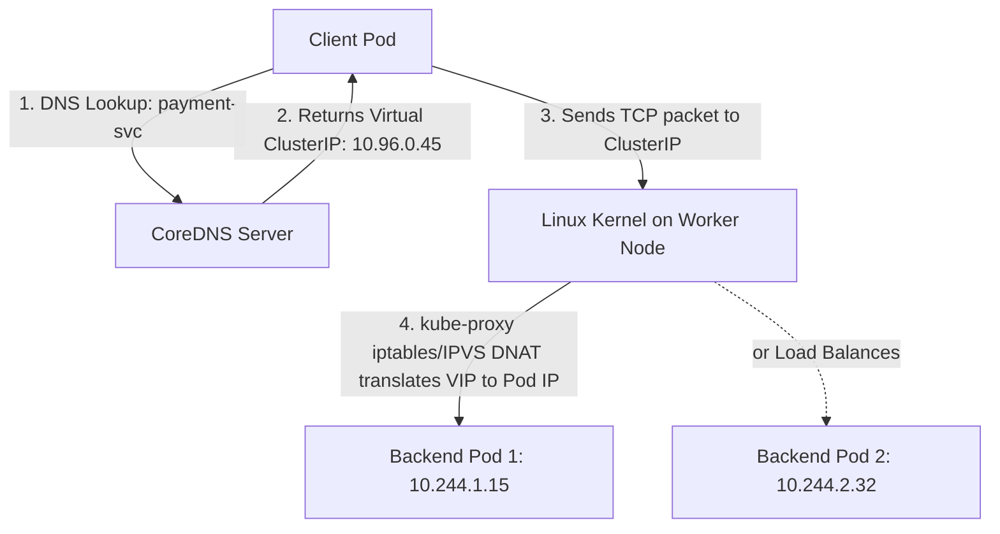

# Lesson 0004: Service-to-service communication, kube-proxy, and CoreDNS

## Fast interview summary and cheatsheet

| Service type | Scope and routing | IP assigned? | Default port range |
| :--- | :--- | :--- | :--- |
| **`ClusterIP`** | Internal only (Default) | Virtual ClusterIP (VIP) | Internal cluster port |
| **`NodePort`** | Accessible via `<NodeIP>:<NodePort>` | NodePort on every node + ClusterIP | **`30000-32767`** |
| **`LoadBalancer`** | Public/Internal Cloud LB (L4) | Cloud External IP + NodePort + ClusterIP | Any standard port (80, 443) |
| **`ExternalName`** | Maps internal name to external DNS | No IP (Returns CNAME record) | N/A |
| **`Headless Service`** | Direct Pod IP discovery (`clusterIP: None`) | No ClusterIP (Returns list of Pod IPs) | Target container port |

---

## 1. How cluster networking and Services work

Kubernetes Pods are ephemeral; their IP addresses change whenever they restart or reschedule. **Services** provide a stable abstraction layer, giving a static virtual IP and DNS name to a dynamic set of backend Pods.


```mermaid
graph TD
    Client[Client Pod] -->|1. DNS Lookup: payment-svc| DNS[CoreDNS Server]
    DNS -->|2. Returns Virtual ClusterIP: 10.96.0.45| Client
    Client -->|3. Sends TCP packet to ClusterIP| Kernel[Linux Kernel on Worker Node]
    Kernel -->|4. kube-proxy iptables/IPVS DNAT translates VIP to Pod IP| Pod1[Backend Pod 1: 10.244.1.15]
    Kernel -.->|or Load Balances| Pod2[Backend Pod 2: 10.244.2.32]
```

### How ClusterIP works in the kernel
* A **ClusterIP is not a physical IP address** attached to a network interface.
* It is a virtual routing rule configured in the Linux kernel on every worker node.
* When a packet is addressed to a ClusterIP, the node packet filter (configured by `kube-proxy`) intercepts the packet and performs **DNAT (Destination Network Address Translation)**, rewriting the destination IP to a healthy Pod IP address.

---

## 2. Kube-proxy execution modes

`kube-proxy` runs on every worker node to synchronize Service definitions and Endpoints into kernel packet-filtering rules.

```mermaid
graph LR
    subgraph iptablesMode ["1. iptables Mode (Default)"]
        Packet1[Packet] --> Chain1[Rule 1] --> Chain2[Rule 2] --> ChainN[Rule N (Sequential O(N))]
    end

    subgraph ipvsMode ["2. IPVS Mode (High Performance)"]
        Packet2[Packet] --> Hash[IPVS Hash Table Lookups (O(1))]
    end

    subgraph ebpfMode ["3. eBPF Mode (Cilium - Modern)"]
        Packet3[Packet] --> Socket[Socket-Level BPF Kernel Hook]
    end
```

| Mode | Complexity | Scale limit | Load balancing algorithms |
| :--- | :--- | :--- | :--- |
| **`iptables`** | $O(N)$ sequential rule evaluation | Degrades around ~5,000 Services / 20k Pods | Random round-robin only |
| **`IPVS`** | $O(1)$ ipset hash table lookups | Scales to 100,000+ Services with low CPU | 8 algorithms: Round-Robin, Least Connections, Source/Dest Hashing |
| **`eBPF`** | $O(1)$ socket-level programs | High throughput; bypasses netfilter | Dynamic latency-aware routing |

---

## 3. Endpoints versus EndpointSlices

When a Service matches Pods using `spec.selector`, the control plane tracks the active Pod IPs:

* **`Endpoints` (Legacy):** A single `Endpoints` resource stores all IP addresses for a Service. In a deployment with 5,000 Pods, any single Pod change generates a 5,000-entry update broadcast to every node in the cluster, driving up `etcd` network traffic and CPU.
* **`EndpointSlices` (Modern standard):** Splits large lists of endpoints into chunks of **100 endpoints per slice**. When a Pod restarts, only one slice updates, reducing control plane and network overhead.

---

## 4. Headless Services (clusterIP: None)

A **Headless Service** is defined by setting `spec.clusterIP: None`.

```yaml
apiVersion: v1
kind: Service
metadata:
  name: cassandra-headless
spec:
  clusterIP: None                     # Headless Service
  selector:
    app: cassandra
  ports:
    - port: 9042
      name: cql
```

### How DNS behaves for Headless Services
- **Standard Service:** CoreDNS returns the single virtual **ClusterIP**.
- **Headless Service:** CoreDNS returns **multiple A/AAAA records containing the direct IP addresses of all backing Pods**.
- **Common use cases:** StatefulSets (Kafka, Cassandra, Redis), client-side load balancing, and direct peer-to-peer clustering.

---

## Interview deep-dives and scenarios

??? question "Interview question: What is the `ndots: 5` DNS problem, and how does it cause cluster latency?"
    **The problem:**
    In Kubernetes, `/etc/resolv.conf` inside every Pod defaults to `ndots: 5` with several search domains:
    ```text
    search default.svc.cluster.local svc.cluster.local cluster.local
    options ndots:5
    ```
    - When your application queries an external domain like `api.github.com` (which contains 2 dots), the DNS resolver treats it as an incomplete name because $2 < 5$.
    - It sequentially issues failing DNS queries to CoreDNS:
      1. `api.github.com.default.svc.cluster.local` (NXDOMAIN)
      2. `api.github.com.svc.cluster.local` (NXDOMAIN)
      3. `api.github.com.cluster.local` (NXDOMAIN)
      4. `api.github.com` (Resolved)
    - Under high traffic, every external HTTP call creates multiple extra CoreDNS round-trips.

    **The solution:**
    1. Append a trailing dot in external URLs: `https://api.github.com./` (forces FQDN treatment).
    2. Or customize Pod `dnsConfig`:
       ```yaml
       dnsConfig:
         options:
           - name: ndots
             value: "2"
       ```

??? question "Interview question: What happens when a Service has no matching Pods (Endpoints is empty)?"
    - The Service resource exists and is allocated a ClusterIP by the API server.
    - `kube-proxy` creates no backend routing entries for that ClusterIP.
    - Any client Pod attempting to connect to the Service experiences an immediate connection reset (`RST`) or connection timeout because the packet has no destination Pod IP.

??? question "Interview question: Differentiate `Port`, `TargetPort`, and `NodePort`."
    - **`Port`:** The port exposed **on the Service** inside the cluster (what client Pods connect to: `service-ip:80`).
    - **`TargetPort`:** The port number the application container is **listening on** inside the Pod (such as `8080`).
    - **`NodePort`:** The port opened **on the host network interface of every worker node** (such as `31250`).

---

## Common production pitfalls and interview traps

??? warning "Production trap: Selector label mismatch"
    A frequent source of deployment issues:
    - Service selector: `app: my-api`
    - Deployment template labels: `app: my-app`, `tier: backend`
    - If there is a label mismatch, the Service is created, but `kubectl get endpoints` shows `<none>`, causing requests to drop silently.

??? warning "Production trap: Using NodePort for production external traffic"
    `NodePort` opens ports in the `30000-32767` range directly on all worker nodes. This exposes host node IP topology, requires custom external routing or firewall openings, and lacks automated TLS certificate management. Use **Ingress** or **Gateway API** for HTTP and HTTPS edge routing.

---

## Hands-on verification and diagnostics

```bash
# 1. Verify that a Service has active backing Pod endpoints
kubectl get endpoints <SERVICE_NAME>
kubectl get endpointslices -l kubernetes.io/service-name=<SERVICE_NAME>

# 2. Test DNS resolution from inside a diagnostic container
kubectl run dnsutils --image=tutum/dnsutils --restart=Never -- sleep 3600
kubectl exec -it dnsutils -- nslookup <SERVICE_NAME>.<NAMESPACE>.svc.cluster.local

# 3. Check CoreDNS server logs for resolution errors
kubectl logs -n kube-system -l k8s-app=kube-dns --tail=50
```

---

## Test your knowledge

1. Why does a Headless Service (`clusterIP: None`) not have an assigned virtual ClusterIP?
   - [ ] A) It delegates traffic distribution by returning direct backing Pod IPs via DNS
   - [ ] B) It forces worker nodes to route packets exclusively through the API Server
   
   Answer: A. CoreDNS returns individual Pod IPs directly, allowing clients (like Kafka or Cassandra) to connect to specific replicas.

2. Why does `kube-proxy` in `IPVS` mode perform better than `iptables` in clusters with thousands of services?
   - [ ] A) IPVS uses O(1) hash tables while iptables sequentially evaluates O(N) chains
   - [ ] B) IPVS runs in user space while iptables executes inside container namespaces
   
   Answer: A. `iptables` requires sequential packet matching across every rule ($O(N)$), while `IPVS` uses hash tables for $O(1)$ lookups.

---

## Recommended primary resources
- [Kubernetes Services and networking](https://kubernetes.io/docs/concepts/services-networking/service/)
- [Kubernetes EndpointSlices specification](https://kubernetes.io/docs/concepts/services-networking/endpoint-slices/)

---

[← Lesson 3: Node scheduling and deployments](./0003-node-scheduling-deployment-strategies-autoscaling.md) | [Lesson 5: StatefulSets, ConfigMaps, and Secrets →](./0005-stateless-stateful-secrets-gcp.md)
