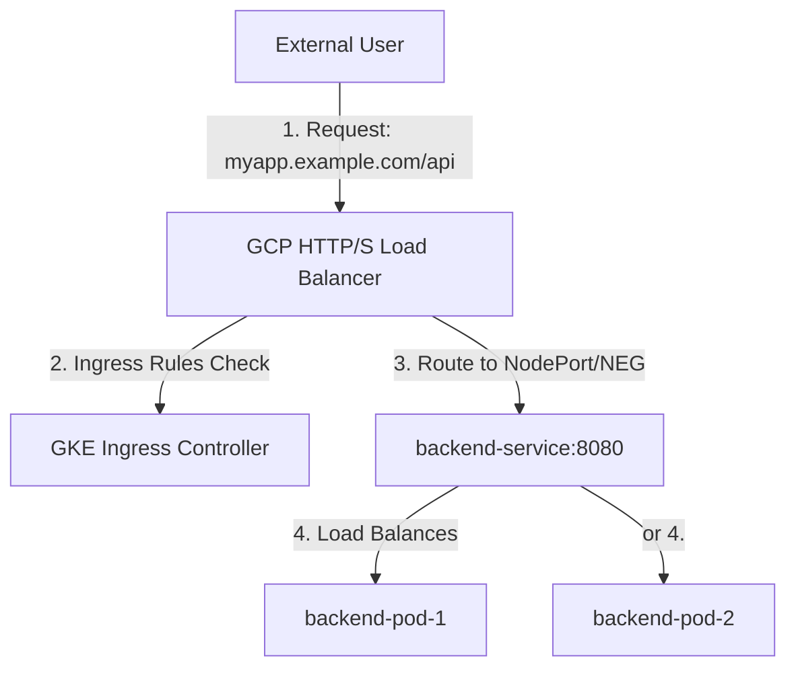

# Lesson 5: Networking & Routing: Ingress & GKE Load Balancing

## Understanding External Traffic Options

How do we expose services to users outside the cluster? In Kubernetes, there are three primary service types/APIs to handle external ingress:

* **NodePort:**  Exposes the service on each Node's IP at a static port (typically between 30000-32767). It is quick but insecure (requires exposing node IPs directly) and lacks intelligent routing.
* **LoadBalancer:**  Provisions an external Cloud Load Balancer (like Google Cloud Network Load Balancer) pointing to the nodes. The issue is that  *each*  LoadBalancer service gets its own IP and incurs significant monthly cost.
* **Ingress:**  Acts as an intelligent API gateway. It runs as a single point of entry, handles SSL termination, performs host/path-based routing, and shares a single cloud load balancer IP among dozens of backend services.

!!! note "Analogy: Services vs. Ingress"
    Think of a `Service` as a specific office phone extension, and an `Ingress` as the main receptionist at the building front desk routing visitors based on their query or identity.

### GKE Ingress Traffic Flow



## Ingress Controller vs. Ingress Resource

A crucial point of confusion for beginners is the separation of specification and implementation:

* **Ingress Resource:**  A declarative YAML file where you define the routing rules (e.g., send traffic for `example.com/api` to `api-service`).
* **Ingress Controller:**  The active component (daemon/controller) running in the cluster that watches for Ingress resources and actually configures the routing engine (e.g., Nginx, Envoy, or GCP Load Balancer).

On  **Google Kubernetes Engine (GKE)** , GKE comes out-of-the-box with the  **GKE Ingress Controller** . When you apply an Ingress manifest, this controller interacts with Google Cloud APIs to provision a fully-managed **Cloud HTTP(S) Load Balancer**.

## Writing a GKE Ingress Manifest

Here is a production-ready template for a path-based GKE Ingress configuration:

```yaml
apiVersion: networking.k8s.io/v1
kind: Ingress
metadata:
  name: main-ingress
  annotations:
    # Use GKE External HTTP(S) Load Balancer
    kubernetes.io/ingress.class: "gce"
    # GKE supports automatically provisioning Google-managed SSL Certificates
    networking.gke.io/managed-certificates: "my-managed-ssl-cert"
spec:
  rules:
  - host: myapp.example.com
    http:
      paths:
      - path: /api
        pathType: Prefix
        backend:
          service:
            name: backend-service
            port:
              number: 8080
      - path: /
        pathType: Prefix
        backend:
          service:
            name: frontend-service
            port:
              number: 80
```

!!! warning "GKE Backend Requirement"
    For GKE's default GCE Ingress controller to route traffic successfully, the target backend Services must be configured as either type `NodePort` or utilize **Container-Native Load Balancing** (using Network Endpoint Groups / NEGs) via ClusterIP. If using standard ClusterIP without NEGs, GKE Ingress will fail to synchronize.

## Advanced GKE Customizations (Frontend & Backend Configs)

GKE provides Custom Resource Definitions (CRDs) to attach advanced cloud load balancer properties directly to your Kubernetes resources:

### 1. HTTP to HTTPS Redirection (FrontendConfig)

To automatically redirect all HTTP traffic to HTTPS, define a `FrontendConfig` and link it via annotations in the Ingress resource.

```yaml
apiVersion: networking.gke.io/v1beta1
kind: FrontendConfig
metadata:
  name: secure-frontend-config
spec:
  redirectToHttps:
    enabled: true
    responseCodeName: MOVED_PERMANENTLY_DEFAULT
```

Annotation to add to your Ingress:

```yaml
metadata:
  annotations:
    networking.gke.io/v1beta1.FrontendConfig: "secure-frontend-config"
```

### 2. Cloud Armor, CDN, & Custom Health Checks (BackendConfig)

To configure Cloud Armor (WAF/DDoS protection), Cloud CDN caching, or customized load balancer health check paths, define a `BackendConfig` and link it in your backend  **Service**  annotation.

```yaml
apiVersion: cloud.google.com/v1
kind: BackendConfig
metadata:
  name: api-backend-config
spec:
  healthCheck:
    checkIntervalSec: 15
    timeoutSec: 5
    port: 8080
    requestPath: /healthz
  securityPolicy:
    name: "my-cloud-armor-waf-policy"
```

Link it inside your `Service` spec:

```yaml
apiVersion: v1
kind: Service
metadata:
  name: backend-service
  annotations:
    cloud.google.com/backend-config: '{"default": "api-backend-config"}'
spec:
  type: ClusterIP # Or NodePort
  ports:
  - port: 8080
    targetPort: 8080
```

## Troubleshooting GKE Ingress

Ingress components interact heavily with GCP cloud infrastructure, making troubleshooting slightly different than internal Kubernetes debugging:

### 1. Deciphering "502 Bad Gateway"

* **Causes:**  The GCP Load Balancer cannot reach the pods. This usually means the backend pods are failing their readiness probes, or the `BackendConfig` health check path (e.g. `/healthz`) is returning a non-200 response.
* **Fix:**  Run `kubectl get pods` to verify container health, and check the path specified in your application's health endpoints.

### 2. Checking Ingress Sync Events

To see what the GKE Ingress controller is doing in the background (e.g., creating IP addresses, attaching certificates, configuring target pools):

```bash
kubectl describe ingress main-ingress
```

Look at the bottom of the output in the **Events** section. It will flag critical errors like `TranslateFailed` or `SyncFailed`.

## Test Your Knowledge

### 1. What is the fundamental difference between an Ingress Resource and an Ingress Controller?

- [ ] **A.** The resource is the declarative routing configuration; the controller is the actual system driving GCP/reverse-proxy changes.
- [ ] **B.** The resource handles internal communication, whereas the controller handles external traffic.
- [ ] **C.** The resource runs on master nodes, while the controller runs on worker nodes.

<details>
<summary><b>Answer & Explanation</b></summary>

**Correct Answer:** A

Correct! The Ingress resource defines the rules, and the Ingress controller is the actual active controller/daemon executing those rules in the cluster or infrastructure.
</details>

### 2. If you want to enable Google Cloud Armor WAF protections or customize Cloud CDN for a service routed via GKE Ingress, where do you configure these settings?

- [ ] **A.** Inside the Ingress resource spec definition.
- [ ] **B.** In a FrontendConfig CRD applied to the ingress host rules.
- [ ] **C.** In a BackendConfig CRD associated with the target backend Service annotation.

<details>
<summary><b>Answer & Explanation</b></summary>

**Correct Answer:** C

Correct! Customizations to individual services (like CDN, Cloud Armor, health check paths) are specified in a BackendConfig resource and referenced inside the target Service annotations.
</details>

---

[← Lesson 4](./0004-stateless-stateful-secrets-gcp.md) | [Lesson 6: Persistent Volumes, PVCs & StorageClasses →](./0006-pv-pvc-storageclasses.md)
