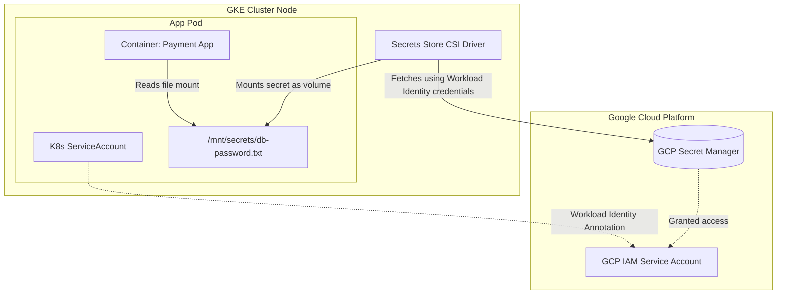

# Lesson 0004: Stateless vs. Stateful Workloads & Secrets Management

## 1. Stateless vs. Stateful Workloads

### Stateless Services (Deployments)

Stateless applications do not store client session data or persistent state locally. Replicas are interchangeable.

* **Identities:**  Dynamic names (e.g. `frontend-867cbd-abcde`). If a Pod dies, it is replaced by a completely new one with a new IP.
* **Scaling:**  Pods can start and terminate in any order.
* **Storage:**  Typically ephemeral (emptyDir) or remote (databases, object storage).

### Stateful Services (StatefulSets)

Stateful applications (databases like PostgreSQL, Redis, Kafka) require unique identities and dedicated persistent disk storage per replica.

* **Identities:**  Stable, predictable names starting from index 0 (e.g. `mysql-0`, `mysql-1`). These identities persist across restarts.
* **Scaling:**  Ordinal scaling. Pods are started from 0 to N-1, and deleted from N-1 down to 0 sequentially.
* **Storage:**  Uses a `volumeClaimTemplates` block to automatically provision a separate Persistent Volume (PV) for *each* pod replica. `mysql-0` always mounts `pvc-mysql-0`.

!!! warning "Crucial StatefulSet Gotchas"
    * **Headless Service:** StatefulSets require a Headless Service (a service with `clusterIP: None`) to manage the network domain of individual pods directly for clustering (e.g. `mysql-0.mysql-service`).
    * **Volume Retention:** Deleting a StatefulSet or scaling it down does *not* automatically delete the provisioned PVCs. This prevents accidental data loss. You must delete PVCs manually if no longer needed.

### Manifest Comparison

```yaml
# StatefulSet Example
apiVersion: apps/v1
kind: StatefulSet
metadata:
  name: database
spec:
  serviceName: "database-headless" # Links to headless service
  replicas: 3
  selector:
    matchLabels:
      app: database
  template:
    metadata:
      labels:
        app: database
    spec:
      containers:
      - name: mysql
        image: mysql:8.0
        env:
        - name: MYSQL_ROOT_PASSWORD
          valueFrom:
            secretKeyRef:
              name: db-credentials
              key: root-password
        volumeMounts:
        - name: data-volume
          mountPath: /var/lib/mysql
  volumeClaimTemplates: # Automatically creates PVCs for each replica
  - metadata:
      name: data-volume
    spec:
      accessModes: [ "ReadWriteOnce" ]
      resources:
        requests:
          storage: 10Gi
```

## 2. Injecting & Consuming Secrets (K8s & CI/CD)

CI/CD pipelines (e.g. GitHub Actions, GitLab CI) inject variables at deploy time. There are two primary methods for managing secrets in Kubernetes.

### Approach A: Native Kubernetes Secrets

A native K8s Secret stores data as base64-encoded strings. The CI/CD pipeline creates the Secret in the namespace before applying the deployments.

#### 1. K8s Secret Manifest (Generated or Applied by CI/CD)

```yaml
apiVersion: v1
kind: Secret
metadata:
  name: api-secrets
type: Opaque
data:
  API_KEY: dGhpc2lzYXNlY3JldGtleQ== # base64 encoded value of "thisisasecretkey"
```

#### 2. Injecting into Deployment Containers

```yaml
spec:
  containers:
  - name: web-app
    image: my-app:latest
    env:
    # Option 1: Map specific secret key to env variable
    - name: THIRD_PARTY_API_KEY
      valueFrom:
        secretKeyRef:
          name: api-secrets
          key: API_KEY
    # Option 2: Mount as secret files on filesystem
    volumeMounts:
    - name: secrets-volume
      mountPath: "/etc/secrets"
      readOnly: true
  volumes:
  - name: secrets-volume
    secret:
      secretName: api-secrets
```

## 3. Externalized Secrets: GCP Secret Manager Integration

Storing secrets directly in Git (even base64 encoded) or manually syncing native secrets is a security risk. In production (GKE), the best practice is to load secrets from **GCP Secret Manager** dynamically.

### The GKE Secrets Store CSI Driver Pattern

The **Secrets Store CSI Driver** allows GKE to mount secrets stored in GCP Secret Manager directly as a volume inside the container, utilizing **Workload Identity** (mapping a K8s ServiceAccount to a GCP IAM Service Account).

#### Step 1: Define the `SecretProviderClass`

This resource instructs the CSI driver which secrets to pull from GCP Secret Manager.

```yaml
apiVersion: secrets-store.csi.x-k8s.io/v1
apiVersion: secrets-store.csi.x-k8s.io/v1
kind: SecretProviderClass
metadata:
  name: gcp-secrets-provider
spec:
  provider: gcedriver
  parameters:
    secrets: |
      - resourceName: "projects/my-gcp-project/secrets/database-password/versions/latest"
        fileName: "db-password.txt"
```

#### Step 2: Mount CSI Secret Volume in Deployment

Mount the SecretProviderClass as a volume. The CSI driver fetches the secret at Pod startup and mounts it to the specified path.

```yaml
apiVersion: apps/v1
kind: Deployment
metadata:
  name: payment-service
spec:
  template:
    spec:
      serviceAccountName: workload-identity-sa # Bound to GCP IAM role with Secret Manager Access
      containers:
      - name: app
        image: payment-app:v1
        volumeMounts:
        - name: secrets-store-inline
          mountPath: "/mnt/secrets"
          readOnly: true
      volumes:
      - name: secrets-store-inline
        csi:
          driver: secrets-store.csi.k8s.io
          readOnly: true
          volumeAttributes:
            secretProviderClass: "gcp-secrets-provider"
```

!!! note "Workload Identity is Key"
    Ensure the Kubernetes ServiceAccount is annotated with your GCP IAM Service Account:
    `iam.gke.io/gcp-service-account: <gcp-sa-name>@<project-id>.iam.gserviceaccount.com`

### GKE Secret Store CSI Driver Workflow



## Test Your Knowledge

### 1. When a StatefulSet with 3 replicas is scaled down to 0, what happens to the associated PersistentVolumeClaims (PVCs)?

- [ ] **A.** They are automatically deleted to save cloud storage costs.
- [ ] **B.** They are retained (kept) in the cluster to prevent accidental data loss.

<details>
<summary><b>Answer & Explanation</b></summary>

**Correct Answer:** B

Correct! By default, PVCs created by StatefulSets are NOT deleted when the statefulset is deleted or scaled down, safeguarding critical storage state.
</details>

### 2. Which driver/plugin enables GKE to fetch secrets directly from GCP Secret Manager and mount them as volumes?

- [ ] **A.** The Secrets Store CSI Driver
- [ ] **B.** The CoreDNS Resolving Agent
- [ ] **C.** The Horizontal Pod Autoscaler (HPA)

<details>
<summary><b>Answer & Explanation</b></summary>

**Correct Answer:** A

Correct! The Secrets Store CSI Driver (specifically with the Google Cloud provider plugin) pulls secrets from GCP Secret Manager and mounts them into your Pods securely.
</details>

---

[← Lesson 4: Service-to-Service Communication & DNS](./0004-service-communication.md) | [Lesson 6: Ingress & GKE Load Balancing →](./0006-ingress-gke-load-balancing.md)
