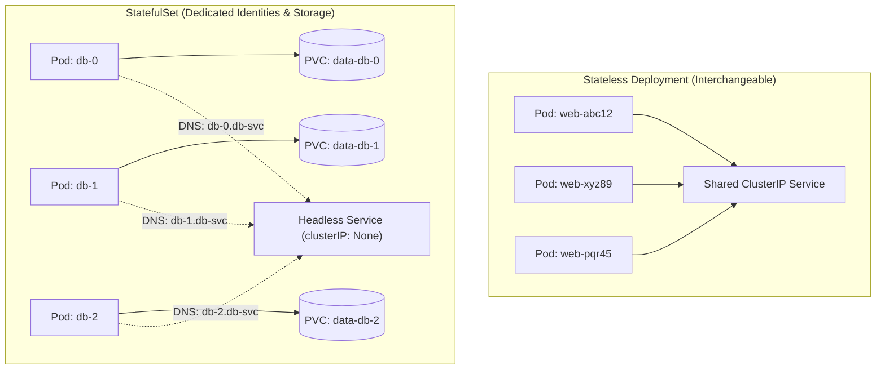
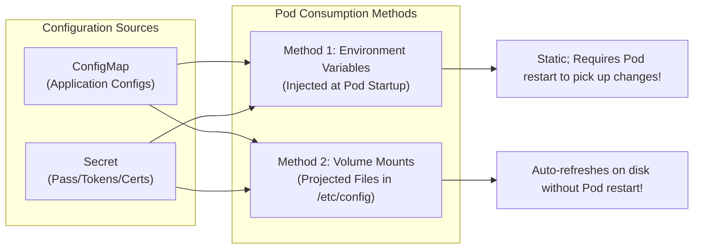
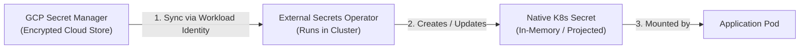

# Lesson 0005: Stateless vs. Stateful Workloads, ConfigMaps & Secrets

## 🚀 Fast Interview Summary & Cheatsheet

| Characteristic | Stateless (`Deployment`) | Stateful (`StatefulSet`) |
| :--- | :--- | :--- |
| **Pod Identity** | Random hash (e.g. `web-78bfd8b67f-9x2jk`) | Deterministic ordinal (e.g. `redis-0`, `redis-1`, `redis-2`) |
| **Storage Binding** | Shared volume or ephemeral disk | Dedicated PV per replica via **`volumeClaimTemplates`** |
| **Startup / Teardown** | Concurrent / Random | Sequential (0 $\to$ N-1 on start; N-1 $\to$ 0 on stop) |
| **Network Identity** | Shared Service ClusterIP | Dedicated DNS via **Headless Service** (`redis-0.redis-svc`) |
| **Scaling Down PVCs** | N/A | **PVCs are NEVER deleted automatically** (Data protection) |

---

## 1. Deployments vs. StatefulSets Architecture


```mermaid
graph TD
    subgraph DeploymentArch ["Stateless Deployment (Interchangeable)"]
        D1["Pod: web-abc12"]
        D2["Pod: web-xyz89"]
        D3["Pod: web-pqr45"]
        D1 & D2 & D3 --> Svc["Shared ClusterIP Service"]
    end

    subgraph StatefulSetArch ["StatefulSet (Dedicated Identities & Storage)"]
        S0["Pod: db-0"] --> PVC0[("PVC: data-db-0")]
        S1["Pod: db-1"] --> PVC1[("PVC: data-db-1")]
        S2["Pod: db-2"] --> PVC2[("PVC: data-db-2")]
        
        Headless["Headless Service (clusterIP: None)"]
        S0 -.->|DNS: db-0.db-svc| Headless
        S1 -.->|DNS: db-1.db-svc| Headless
        S2 -.->|DNS: db-2.db-svc| Headless
    end
```

### Key StatefulSet Primitives:
1. **Deterministic Ordinal Index:** If `db-1` crashes, the replacement Pod is guaranteed to be named `db-1` and scheduled with the exact same hostname and storage attachment.
2. **`volumeClaimTemplates`:** Unlike Deployments where all replicas share the same PVC definition, a StatefulSet dynamically synthesizes an isolated `PersistentVolumeClaim` for each replica: `<claim-name>-<statefulset-name>-<index>`.
3. **Headless Service Association:** Required by the `serviceName` field in the StatefulSet spec to generate predictable DNS A-records for every individual Pod.

---

## 2. ConfigMaps & Secrets Management

Kubernetes decouples configuration and sensitive credentials from container image builds using **ConfigMaps** (plain configuration) and **Secrets** (confidential tokens, passwords, TLS certificates).


```mermaid
graph LR
    subgraph Storage ["Configuration Sources"]
        CM["ConfigMap\n(Application Configs)"]
        Sec["Secret\n(Pass/Tokens/Certs)"]
    end

    subgraph Consumption ["Pod Consumption Methods"]
        Env["Method 1: Environment Variables\n(Injected at Pod Startup)"]
        Vol["Method 2: Volume Mounts\n(Projected Files in /etc/config)"]
    end

    CM --> Env
    CM --> Vol
    Sec --> Env
    Sec --> Vol
    Vol --> LiveUpdate["Auto-refreshes on disk without Pod restart!"]
    Env --> Static["Static; Requires Pod restart to pick up changes!"]
```

### Consuming Secrets in a Pod Manifest

```yaml
apiVersion: v1
kind: Pod
metadata:
  name: api-service
spec:
  containers:
    - name: api
      image: my-org/api:v1.2.0
      # 1. Injected as Environment Variables
      env:
        - name: DB_PASSWORD
          valueFrom:
            secretKeyRef:
              name: db-secrets
              key: password
      # 2. Injected as Volume Mounts (Live Reloading)
      volumeMounts:
        - name: config-dir
          mountPath: /etc/app/config
          readOnly: true
  volumes:
    - name: config-dir
      configMap:
        name: app-config
```

---

## 3. Production Secrets: External Secrets Operator (ESO) & GCP Secret Manager

In enterprise GitOps, **base64-encoded Kubernetes Secrets must never be stored in Git**.

The **External Secrets Operator (ESO)** bridges Kubernetes with external secret managers (GCP Secret Manager, AWS Secrets Manager, HashiCorp Vault):


```mermaid
graph LR
    GCP["GCP Secret Manager\n(Encrypted Cloud Store)"] -->|1. Sync via Workload Identity| ESO["External Secrets Operator\n(Runs in Cluster)"]
    ESO -->|2. Creates / Updates| K8sSecret["Native K8s Secret\n(In-Memory / Projected)"]
    K8sSecret -->|3. Mounted by| AppPod["Application Pod"]
```

```yaml
apiVersion: external-secrets.io/v1beta1
kind: ExternalSecret
metadata:
  name: gcp-db-credentials
spec:
  refreshInterval: 1h                 # Polling interval from GCP
  secretStoreRef:
    name: gcp-secret-store
    kind: ClusterSecretStore
  target:
    name: app-db-secret               # Name of K8s Secret generated automatically
  data:
    - secretKey: DB_PASSWORD
      remoteRef:
        key: production-db-password   # Secret name in GCP Secret Manager
```

---

## 🎯 Interview Deep-Dives & Scenarios

??? question "Interview Question: Why do StatefulSets require a Headless Service?"
    **Answer:**
    - A standard Service provides a single virtual ClusterIP that randomly load-balances requests across all replicas.
    - Stateful applications (e.g., MySQL Leader-Follower, Kafka Brokers, Elasticsearch) require clients to target a **specific replica directly** (e.g., writing to the Leader on `mysql-0` while reading from Followers on `mysql-1` and `mysql-2`).
    - By associating a Headless Service (`clusterIP: None`), CoreDNS creates direct A-records for each ordinal:
      `<pod-name>.<service-name>.<namespace>.svc.cluster.local` (e.g. `mysql-0.mysql-svc.prod.svc.cluster.local`).

??? question "Interview Scenario: If you update a Secret/ConfigMap, why does a Volume Mount update but an Environment Variable does not?"
    **The Mechanism:**
    - **Environment Variables:** Evaluated and set by the OS kernel when the container process starts (`fork/exec`). There is no mechanism in POSIX systems to alter an active process’s environment without restarting the container.
    - **Mounted Volumes:** `kubelet` regularly watches for ConfigMap/Secret changes and updates the projected files on the host disk using atomic symlinks.
    - **Interview Pro-Tip:** Applications watching file modifications (e.g. using `inotify` or Spring Cloud Watcher) can reload configurations on the fly with **zero downtime and zero Pod restarts**!

??? question "Interview Question: Is a standard Kubernetes Secret encrypted by default?"
    **Answer:**
    - **No.** By default, native Kubernetes Secrets are merely **base64-encoded strings** stored as plaintext in `etcd`. Anyone with read access to the namespace or `etcd` disk can decode them trivially (`echo <BASE64> | base64 -d`).
    - **Production Hardening Requirements:**
      1. Enable **Encryption at Rest** in `kube-apiserver` using KMS (Cloud KMS, AWS KMS, HashiCorp Vault).
      2. Enforce strict **RBAC policies** preventing unauthorized Secret reads.
      3. Use tools like **External Secrets Operator (ESO)** or **Sealed Secrets** to prevent secrets from being checked into Git repositories.

---

## ⚠️ Common Production Pitfalls & Interview Traps

??? warning "Production Trap: Accidental Storage Deletion vs StatefulSet Retention"
    When you scale down a StatefulSet from 3 to 1 replica or delete the StatefulSet, **Kubernetes intentionally DOES NOT delete the PVCs (`data-db-1`, `data-db-2`)**.
    - **Why:** To prevent catastrophic accidental data loss.
    - **Gotcha:** If you re-scale the StatefulSet back to 3 replicas later, it automatically re-attaches to the existing historical PVCs. If you wanted fresh disks, you must manually delete the historical PVCs!

??? warning "Production Trap: `subPath` Volume Mounts Break Live Updates"
    If you mount a single key from a ConfigMap using `subPath` (e.g. `mountPath: /etc/app.conf`, `subPath: app.conf`), **Kubernetes will NOT automatically update the file** when the ConfigMap changes. `subPath` mounts bypass symlink updates.

---

## 💻 Hands-on Verification & Diagnostic Toolkit

```bash
# 1. Decode all keys inside a Kubernetes Secret
kubectl get secret db-secrets -o jsonpath='{.data}' | jq 'map_values(@base64d)'

# 2. View individual StatefulSet Pod DNS resolutions
kubectl exec -it <POD_NAME> -- nslookup db-0.db-headless.default.svc.cluster.local

# 3. List all PVCs generated by StatefulSet volumeClaimTemplates
kubectl get pvc -l app=database

# 4. Trigger rolling restart of a StatefulSet to pick up updated Env Vars
kubectl rollout restart statefulset/database
```

---

## Test Your Knowledge

1. When scaling down a StatefulSet from 5 replicas to 2, what happens to the PersistentVolumeClaims (PVCs) attached to replicas 3 and 4?
   - [ ] A) The PVCs are preserved intact on the cluster to prevent accidental data loss
   - [ ] B) The PVCs and their underlying cloud disks are immediately deleted permanently
   
   *Answer:* A) The PVCs are preserved intact on the cluster to prevent accidental data loss - Correct! Kubernetes never automatically deletes PVCs created by StatefulSets during scale-down operations.

2. Why are ConfigMaps mounted as volumes preferred over environment variables for dynamic applications?
   - [ ] A) Mounted volume files automatically sync live updates without requiring Pod restarts
   - [ ] B) Mounted volumes consume significantly less node memory than environment variables
   
   *Answer:* A) Mounted volume files automatically sync live updates without requiring Pod restarts - Correct! `kubelet` updates mounted volume files dynamically, allowing applications to hot-reload configuration changes.

---

## Recommended Primary Resource
- [Kubernetes StatefulSets Concept Guide](https://kubernetes.io/docs/concepts/workloads/controllers/statefulset/)
- [External Secrets Operator Documentation](https://external-secrets.io/latest/)

---
**Architecting a high-availability database cluster or managing cloud secrets?** Ask in chat, and we'll configure your SecretStore!

[← Lesson 4: Service Communication & DNS](./0004-service-communication.md) | [Lesson 6: Ingress & GKE Load Balancing →](./0006-ingress-gke-load-balancing.md)
