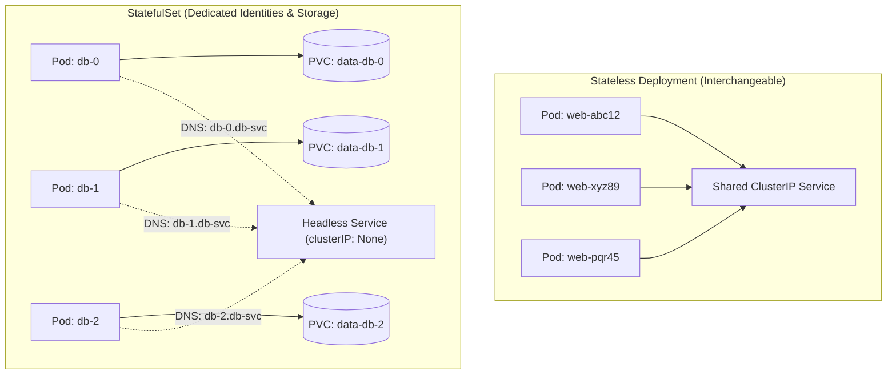
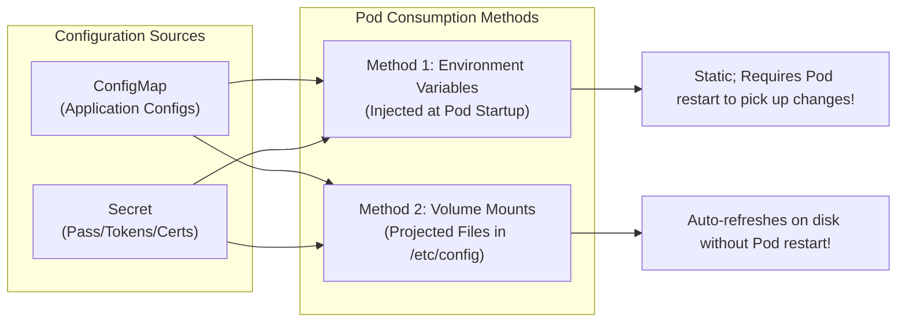
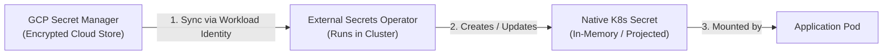

# Lesson 0005: Stateless versus stateful workloads, ConfigMaps, and Secrets

## Fast interview summary and cheatsheet

| Characteristic | Stateless (`Deployment`) | Stateful (`StatefulSet`) |
| :--- | :--- | :--- |
| **Pod identity** | Random hash (such as `web-78bfd8b67f-9x2jk`) | Deterministic ordinal (such as `redis-0`, `redis-1`, `redis-2`) |
| **Storage binding** | Shared volume or ephemeral disk | Dedicated PV per replica via `volumeClaimTemplates` |
| **Startup and teardown** | Concurrent | Sequential (0 $\to$ N-1 on start; N-1 $\to$ 0 on stop) |
| **Network identity** | Shared Service ClusterIP | Dedicated DNS via Headless Service (`redis-0.redis-svc`) |
| **Scale down PVC retention** | N/A | PVCs are never deleted automatically to protect data |

---

## 1. Deployments versus StatefulSets architecture


```mermaid
graph TD
    subgraph DeploymentArch ["Stateless Deployment (Interchangeable)"]
        D1["Pod: web-abc12"]
        D2["Pod: web-xyz89"]
        D3["Pod: web-pqr45"]
        D1 & D2 & D3 --> Svc["Shared ClusterIP Service"]
    end

    subgraph StatefulSetArch ["StatefulSet (Dedicated Identities & Storage)"]
        S0["Pod: db-0"] --> PVC0[("PVC: data-db-0")]
        S1["Pod: db-1"] --> PVC1[("PVC: data-db-1")]
        S2["Pod: db-2"] --> PVC2[("PVC: data-db-2")]
        
        Headless["Headless Service (clusterIP: None)"]
        S0 -.->|DNS: db-0.db-svc| Headless
        S1 -.->|DNS: db-1.db-svc| Headless
        S2 -.->|DNS: db-2.db-svc| Headless
    end
```

### StatefulSet components
1. **Deterministic ordinal index:** If `db-1` crashes, the replacement Pod is guaranteed to be named `db-1` and scheduled with the exact same hostname and storage attachment.
2. **`volumeClaimTemplates`:** Unlike Deployments where all replicas share the same PVC definition, a StatefulSet provisions an isolated `PersistentVolumeClaim` for each replica: `<claim-name>-<statefulset-name>-<index>`.
3. **Headless Service association:** The `serviceName` field in the StatefulSet spec creates direct DNS A-records for each individual Pod.

---

## 2. ConfigMaps and Secrets management

Kubernetes decouples configuration and sensitive credentials from container image builds using **ConfigMaps** (plain configuration) and **Secrets** (confidential tokens, passwords, TLS certificates).


```mermaid
graph LR
    subgraph Storage ["Configuration Sources"]
        CM["ConfigMap\n(Application Configs)"]
        Sec["Secret\n(Pass/Tokens/Certs)"]
    end

    subgraph Consumption ["Pod Consumption Methods"]
        Env["Method 1: Environment Variables\n(Injected at Pod Startup)"]
        Vol["Method 2: Volume Mounts\n(Projected Files in /etc/config)"]
    end

    CM --> Env
    CM --> Vol
    Sec --> Env
    Sec --> Vol
    Vol --> LiveUpdate["Auto-refreshes on disk without Pod restart!"]
    Env --> Static["Static; Requires Pod restart to pick up changes!"]
```

### Consuming Secrets in a Pod manifest

```yaml
apiVersion: v1
kind: Pod
metadata:
  name: api-service
spec:
  containers:
    - name: api
      image: my-org/api:v1.2.0
      # 1. Injected as Environment Variables
      env:
        - name: DB_PASSWORD
          valueFrom:
            secretKeyRef:
              name: db-secrets
              key: password
      # 2. Injected as Volume Mounts (Live Reloading)
      volumeMounts:
        - name: config-dir
          mountPath: /etc/app/config
          readOnly: true
  volumes:
    - name: config-dir
      configMap:
        name: app-config
```

---

## 3. Production secrets: External Secrets Operator and GCP Secret Manager

In enterprise GitOps setups, base64-encoded Kubernetes Secrets must never be committed to Git repositories.

The **External Secrets Operator (ESO)** synchronizes Kubernetes Secrets from external secret managers (GCP Secret Manager, AWS Secrets Manager, HashiCorp Vault):


```mermaid
graph LR
    GCP["GCP Secret Manager\n(Encrypted Cloud Store)"] -->|1. Sync via Workload Identity| ESO["External Secrets Operator\n(Runs in Cluster)"]
    ESO -->|2. Creates / Updates| K8sSecret["Native K8s Secret\n(In-Memory / Projected)"]
    K8sSecret -->|3. Mounted by| AppPod["Application Pod"]
```

```yaml
apiVersion: external-secrets.io/v1beta1
kind: ExternalSecret
metadata:
  name: gcp-db-credentials
spec:
  refreshInterval: 1h                 # Polling interval from GCP
  secretStoreRef:
    name: gcp-secret-store
    kind: ClusterSecretStore
  target:
    name: app-db-secret               # Name of K8s Secret generated automatically
  data:
    - secretKey: DB_PASSWORD
      remoteRef:
        key: production-db-password   # Secret name in GCP Secret Manager
```

---

## Interview deep-dives and scenarios

??? question "Interview question: Why do StatefulSets require a Headless Service?"
    A standard Service provides a single virtual ClusterIP that load-balances requests across all replicas.
    
    Stateful applications (such as MySQL Primary/Replica, Kafka Brokers, Elasticsearch) require clients to target a specific replica directly (such as writing to the primary on `mysql-0` while reading from replicas on `mysql-1` and `mysql-2`).
    
    By associating a Headless Service (`clusterIP: None`), CoreDNS creates direct A-records for each ordinal:
    `<pod-name>.<service-name>.<namespace>.svc.cluster.local` (such as `mysql-0.mysql-svc.prod.svc.cluster.local`).

??? question "Interview scenario: If you update a Secret or ConfigMap, why does a Volume Mount update while an Environment Variable does not?"
    - **Environment variables:** Evaluated and set by the OS kernel when the container process starts (`fork`/`exec`). POSIX operating systems do not allow changing an active process's environment without restarting the process.
    - **Mounted volumes:** `kubelet` watches for ConfigMap and Secret changes and updates the projected files on the host disk using atomic symlinks.
    - Applications watching file modifications (using `inotify` or library watchers) can reload configurations on the fly without Pod restarts.

??? question "Interview question: Is a standard Kubernetes Secret encrypted by default?"
    No. By default, native Kubernetes Secrets are base64-encoded strings stored as plaintext in `etcd`. Anyone with read access to the namespace or `etcd` disk can decode them directly (`echo <BASE64> | base64 -d`).
    
    **Production hardening steps:**
    1. Enable encryption at rest in `kube-apiserver` using KMS (Cloud KMS, AWS KMS, HashiCorp Vault).
    2. Enforce RBAC policies preventing unauthorized Secret reads.
    3. Use External Secrets Operator (ESO) or Sealed Secrets to keep secrets out of Git repositories.

---

## Common production pitfalls and interview traps

??? warning "Production trap: Accidental storage retention versus StatefulSet scale-down"
    When you scale down a StatefulSet from 3 to 1 replica or delete the StatefulSet, Kubernetes does not delete the PVCs (`data-db-1`, `data-db-2`).
    - This prevents accidental data loss.
    - If you scale the StatefulSet back to 3 replicas later, it automatically re-attaches to the existing PVCs. If you need fresh disks, you must delete the historical PVCs manually.

??? warning "Production trap: subPath volume mounts disable live updates"
    If you mount a single key from a ConfigMap using `subPath` (such as `mountPath: /etc/app.conf`, `subPath: app.conf`), Kubernetes will not update the file when the ConfigMap changes. `subPath` mounts bypass symlink updates.

---

## Hands-on verification and diagnostics

```bash
# 1. Decode all keys inside a Kubernetes Secret
kubectl get secret db-secrets -o jsonpath='{.data}' | jq 'map_values(@base64d)'

# 2. View individual StatefulSet Pod DNS resolutions
kubectl exec -it <POD_NAME> -- nslookup db-0.db-headless.default.svc.cluster.local

# 3. List all PVCs generated by StatefulSet volumeClaimTemplates
kubectl get pvc -l app=database

# 4. Trigger rolling restart of a StatefulSet to pick up updated environment variables
kubectl rollout restart statefulset/database
```

---

## Test your knowledge

1. When scaling down a StatefulSet from 5 replicas to 2, what happens to the PersistentVolumeClaims (PVCs) attached to replicas 3 and 4?
   - [ ] A) The PVCs are preserved intact on the cluster to prevent accidental data loss
   - [ ] B) The PVCs and their underlying cloud disks are immediately deleted permanently
   
   Answer: A. Kubernetes never automatically deletes PVCs created by StatefulSets during scale-down operations.

2. Why are ConfigMaps mounted as volumes preferred over environment variables for dynamic applications?
   - [ ] A) Mounted volume files automatically sync live updates without requiring Pod restarts
   - [ ] B) Mounted volumes consume significantly less node memory than environment variables
   
   Answer: A. `kubelet` updates mounted volume files dynamically, allowing applications to reload configuration changes without restarting.

---

## Recommended primary resources
- [Kubernetes StatefulSets guide](https://kubernetes.io/docs/concepts/workloads/controllers/statefulset/)
- [External Secrets Operator documentation](https://external-secrets.io/latest/)

---

[← Lesson 4: Service-to-service communication and DNS](./0004-service-communication.md) | [Lesson 6: Ingress and GKE load balancing →](./0006-ingress-gke-load-balancing.md)
