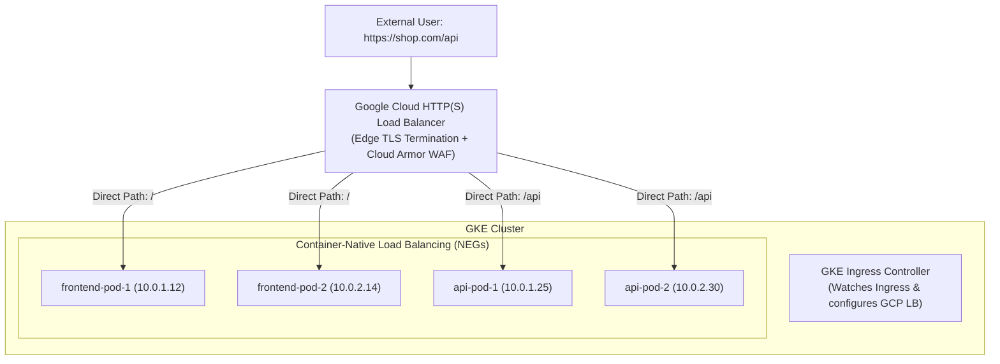
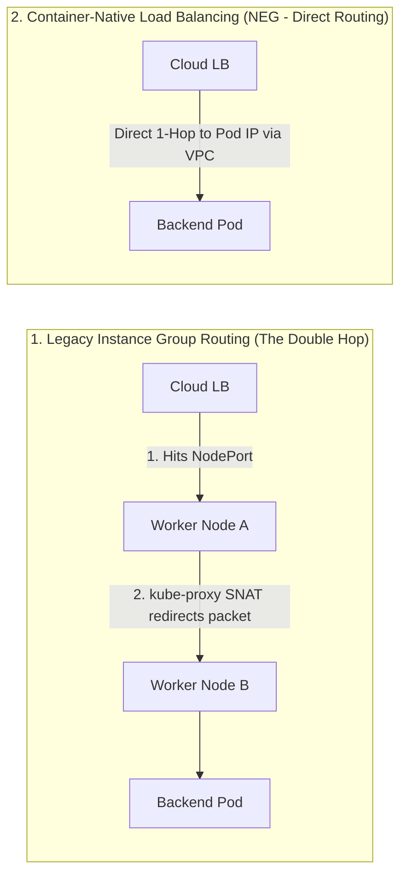

# Lesson 0006: Ingress Controllers & Cloud Load Balancing on GKE

## 🚀 Fast Interview Summary & Cheatsheet

| Feature | Layer 4 (`Service: LoadBalancer`) | Layer 7 (`Ingress`) |
| :--- | :--- | :--- |
| **OSI Layer** | Transport Layer (TCP / UDP) | Application Layer (HTTP / HTTPS / gRPC) |
| **Routing Logic** | Port / IP based only | Host-based (`api.domain.com`) & Path-based (`/v1/*`) |
| **Cloud Cost** | 1 Cloud LB + 1 Public IP **per service** ($\$\$\$$) | **1 Shared Cloud LB IP** for dozens of backend services |
| **TLS / SSL** | Passed through to backend pods | **Terminated at the Edge** with managed SSL certs |
| **GKE Integration** | Cloud Network Load Balancer (Pass-through) | **Cloud HTTP(S) Load Balancer** with Cloud Armor & CDN |

---

## 1. Ingress Architecture & The Controller Model

In Kubernetes, external routing is split into two distinct concepts:
1. **Ingress Resource:** The declarative YAML manifest defining routing rules (hosts, paths, backends, TLS).
2. **Ingress Controller:** The controller daemon (e.g. NGINX Ingress, Envoy, or Google Cloud HTTP(S) Load Balancer) that watches Ingress resources and programs the physical/cloud load balancer.



---

## 2. Container-Native Load Balancing (NEGs)

Historically, cloud load balancers routed traffic to **NodePorts on VM instances**, causing an inefficient **"double-hop"**:



### Why Network Endpoint Groups (NEGs) are Superior:
* **Zero Double-Hops:** The Google Cloud Load Balancer routes packets directly to the Pod IP in the VPC network.
* **Preserves Client Source IP:** Eliminates SNAT so backend logs see the real user IP address.
* **True Pod-Level Health Checks:** The cloud load balancer performs health checks directly against individual Pods rather than whole worker nodes.

To enable NEGs on a Service in GKE, annotate the Service:
```yaml
apiVersion: v1
kind: Service
metadata:
  name: api-service
  annotations:
    cloud.google.com/neg: '{"ingress": true}' # Enables Container-Native NEG!
spec:
  type: ClusterIP
  selector:
    app: api
  ports:
    - port: 80
      targetPort: 8080
```

---

## 3. Production GKE Ingress Manifest

Here is a complete, production-ready GKE Ingress manifest featuring managed SSL certificates and path-based routing:

```yaml
apiVersion: networking.k8s.io/v1
kind: Ingress
metadata:
  name: production-ingress
  annotations:
    # Use GKE External Application Load Balancer
    kubernetes.io/ingress.class: "gce"
    # Attach Google-managed SSL certificate
    networking.gke.io/managed-certificates: "shop-ssl-certificate"
    # Attach HTTP-to-HTTPS redirect & TLS policies
    networking.gke.io/v1beta1.FrontendConfig: "http-to-https-frontend-config"
spec:
  rules:
    - host: shop.example.com
      http:
        paths:
          # Route 1: API Service
          - path: /api
            pathType: Prefix
            backend:
              service:
                name: api-service
                port:
                  number: 80
          # Route 2: Default Web Frontend
          - path: /
            pathType: Prefix
            backend:
              service:
                name: frontend-service
                port:
                  number: 80
```

---

## 4. GKE Enterprise CRDs: FrontendConfig & BackendConfig

GKE exposes native cloud features through dedicated CRDs:

### A. `FrontendConfig` (HTTP to HTTPS Redirect)
```yaml
apiVersion: networking.gke.io/v1beta1
kind: FrontendConfig
metadata:
  name: http-to-https-frontend-config
spec:
  redirectToHttps:
    enabled: true
    responseCodeName: MOVED_PERMANENTLY_DEFAULT # 301 Redirect
```

### B. `BackendConfig` (Cloud Armor WAF & Cloud CDN)
```yaml
apiVersion: cloud.google.com/v1
kind: BackendConfig
metadata:
  name: api-backend-config
spec:
  securityPolicy:
    name: "cloud-armor-ddos-protection" # Attaches Cloud Armor WAF rules
  cdn:
    enabled: true
  timeoutSec: 60                      # Upstream backend timeout
```

---

## 🎯 Interview Deep-Dives & Scenarios

??? question "Interview Question: What is Container-Native Load Balancing (NEGs), and why does GKE use it?"
    **Answer:**
    - **Traditional NodePort Routing:** Cloud LB targets worker node VMs on high ports (`30000-32767`). `kube-proxy` on that node receives the packet and often forwards it across the network to a *different* node hosting the Pod (double-hop). This adds latency, wastes bandwidth, and obscures the client's source IP via SNAT.
    - **Container-Native Routing (NEGs):** GKE assigns each Pod an alias IP from the VPC subnet. GKE creates a **Network Endpoint Group (NEG)** in Google Cloud containing the actual Pod IPs.
    - **The Cloud LB routes traffic directly to the target Pod IP in a single hop**, preserving the true client source IP and enabling accurate pod-level health checks.

??? question "Interview Scenario: Your GKE Ingress is returning `502 Bad Gateway`. How do you troubleshoot it?"
    **Systematic Troubleshooting Checklist:**
    1. **Check Backend Service NEGs:** Run `kubectl describe service <NAME>` and ensure `cloud.google.com/neg: {"ingress": true}` is present and healthy.
    2. **Inspect GKE Ingress Events:** Run `kubectl describe ingress <INGRESS_NAME>`. Look for `Sync / Create` errors or health check configuration failures.
    3. **Verify Health Check Endpoint:** GKE Load Balancers send health checks to `/` by default. If your API expects `/healthz` and returns `404` or `401 Unauthorized` on `/`, the GCP Load Balancer will mark the backend as **UNHEALTHY** and serve a `502 Server Error`.
       - *Fix:* Configure a `BackendConfig` specifying `healthCheck.requestPath: /healthz`.
    4. **Verify ManagedCertificate Status:** Run `kubectl get managedcertificate` and verify the status is `Active` rather than `Provisioning` or `FailedNotVisible`.

---

## ⚠️ Common Production Pitfalls & Interview Traps

??? warning "Production Trap: Default Health Check Path Returns 404/401"
    Google Cloud HTTP(S) Load Balancer expects an HTTP `200 OK` on `/` by default. If your backend is an API that requires authentication on `/` (returning `401`) or only responds to `/api/v1`, the GCP load balancer considers the pods dead and drops all ingress traffic. Always attach a `BackendConfig` to specify the exact unauthenticated health probe endpoint.

??? warning "Production Trap: DNS Propagation Delays with Managed Certificates"
    Google-managed SSL certificates require your public DNS A-record to point to the Ingress VIP *before* Google's CA can validate domain ownership via ACME HTTP challenges. If DNS is not pointed to the IP, the certificate will remain in `Provisioning` state for hours.

---

## 💻 Hands-on Verification & Diagnostic Toolkit

```bash
# 1. Check external Ingress IP and target rules
kubectl get ingress production-ingress -o wide

# 2. Inspect Ingress controller sync events and Google Cloud forwarding rules
kubectl describe ingress production-ingress

# 3. Check Google-managed SSL certificate provisioning status
kubectl get managedcertificate

# 4. View active Network Endpoint Groups in the namespace
kubectl get svc -o custom-columns=NAME:.metadata.name,NEG:.metadata.annotations."cloud\.google\.com/neg"
```

---

## Test Your Knowledge

1. Why does Container-Native Load Balancing with Network Endpoint Groups (NEGs) eliminate the "double-hop" problem in GKE?
   - [ ] A) The cloud load balancer routes traffic directly to individual Pod VPC IPs
   - [ ] B) The kube-proxy daemon rewrites external domain headers in user space
   
   *Answer:* A) The cloud load balancer routes traffic directly to individual Pod VPC IPs - Correct! NEGs allow Google Cloud Load Balancing to route directly to Pod IPs, bypassing NodePorts and intermediate kube-proxy routing hops.

2. In GKE, which custom resource is used to attach Google Cloud Armor DDoS security policies and custom backend timeout settings to a Service?
   - [ ] A) The BackendConfig custom resource definition
   - [ ] B) The FrontendConfig custom resource definition
   
   *Answer:* A) The BackendConfig custom resource definition - Correct! `BackendConfig` controls upstream backend parameters like Cloud Armor WAF policies, health check paths, timeouts, and Cloud CDN.

---

## Recommended Primary Resource
- [GKE Ingress for HTTP(S) Load Balancing Guide](https://cloud.google.com/kubernetes-engine/docs/concepts/ingress)
- [GKE Container-Native Load Balancing with NEGs](https://cloud.google.com/kubernetes-engine/docs/how-to/container-native-load-balancing)

---
**Setting up multi-domain routing or debugging Google-managed SSL certificates?** Ask in chat, and we'll inspect your Ingress together!

[← Lesson 5: StatefulSets, ConfigMaps & Secrets](./0005-stateless-stateful-secrets-gcp.md) | [Lesson 7: Persistent Volumes & StorageClasses →](./0007-pv-pvc-storageclasses.md)
