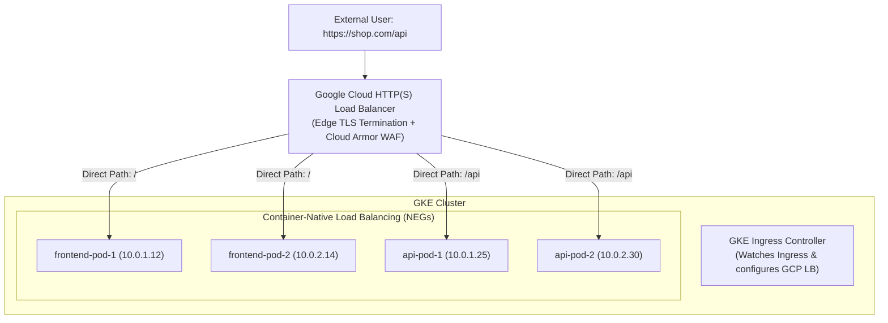
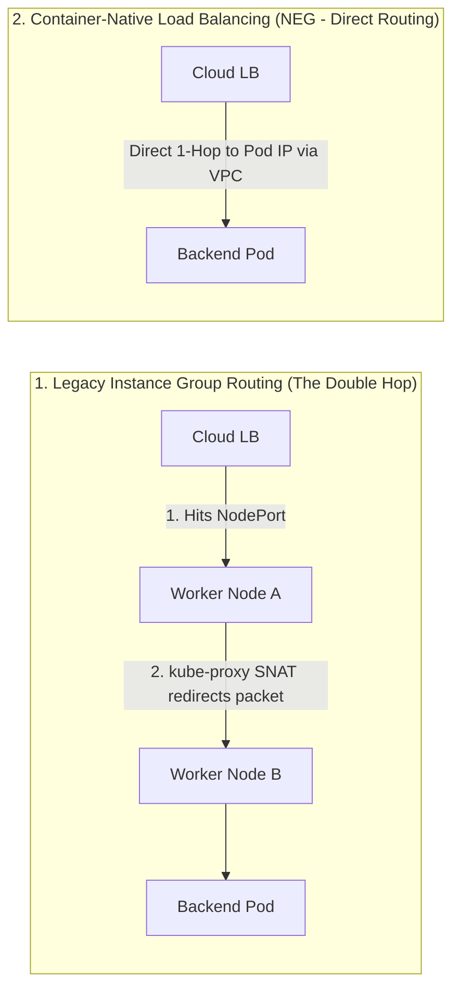

# Lesson 0006: Ingress controllers and cloud load balancing on GKE

## Fast interview summary and cheatsheet

| Feature | Layer 4 (`Service: LoadBalancer`) | Layer 7 (`Ingress`) |
| :--- | :--- | :--- |
| **OSI Layer** | Transport Layer (TCP / UDP) | Application Layer (HTTP / HTTPS / gRPC) |
| **Routing logic** | Port / IP based only | Host-based (`api.domain.com`) and Path-based (`/v1/*`) |
| **Cloud cost** | 1 Cloud LB + 1 Public IP per service | 1 Shared Cloud LB IP for multiple backend services |
| **TLS / SSL** | Passed through to backend pods | Terminated at the edge with managed SSL certificates |
| **GKE integration** | Cloud Network Load Balancer (Pass-through) | Cloud HTTP(S) Load Balancer with Cloud Armor and Cloud CDN |

---

## 1. Ingress architecture and the controller model

In Kubernetes, external routing is split into two components:
1. **Ingress resource:** The declarative manifest defining routing rules (hosts, paths, backends, TLS).
2. **Ingress controller:** The controller daemon (such as NGINX Ingress, Envoy, or Google Cloud HTTP(S) Load Balancer) that monitors Ingress resources and configures the load balancer.



---

## 2. Container-native load balancing (NEGs)

Historically, cloud load balancers routed traffic to **NodePorts on VM instances**, causing an inefficient second hop:



### Why Network Endpoint Groups (NEGs) improve routing
* **Eliminates node hops:** The Google Cloud Load Balancer routes packets directly to the Pod IP in the VPC network.
* **Preserves client source IP:** Eliminates SNAT so backend logs capture real client IP addresses.
* **Direct Pod health checks:** The cloud load balancer performs health checks directly against individual Pods rather than whole worker nodes.

To enable NEGs on a Service in GKE, add the annotation:
```yaml
apiVersion: v1
kind: Service
metadata:
  name: api-service
  annotations:
    cloud.google.com/neg: '{"ingress": true}' # Enables Container-Native NEG
spec:
  type: ClusterIP
  selector:
    app: api
  ports:
    - port: 80
      targetPort: 8080
```

---

## 3. Production GKE Ingress manifest

Below is a production GKE Ingress manifest featuring managed SSL certificates and path-based routing:

```yaml
apiVersion: networking.k8s.io/v1
kind: Ingress
metadata:
  name: production-ingress
  annotations:
    # Use GKE External Application Load Balancer
    kubernetes.io/ingress.class: "gce"
    # Attach Google-managed SSL certificate
    networking.gke.io/managed-certificates: "shop-ssl-certificate"
    # Attach HTTP-to-HTTPS redirect & TLS policies
    networking.gke.io/v1beta1.FrontendConfig: "http-to-https-frontend-config"
spec:
  rules:
    - host: shop.example.com
      http:
        paths:
          # Route 1: API Service
          - path: /api
            pathType: Prefix
            backend:
              service:
                name: api-service
                port:
                  number: 80
          # Route 2: Default Web Frontend
          - path: /
            pathType: Prefix
            backend:
              service:
                name: frontend-service
                port:
                  number: 80
```

---

## 4. GKE custom resources: FrontendConfig and BackendConfig

GKE exposes cloud features through custom resource definitions:

### A. FrontendConfig (HTTP to HTTPS redirect)
```yaml
apiVersion: networking.gke.io/v1beta1
kind: FrontendConfig
metadata:
  name: http-to-https-frontend-config
spec:
  redirectToHttps:
    enabled: true
    responseCodeName: MOVED_PERMANENTLY_DEFAULT # 301 Redirect
```

### B. BackendConfig (Cloud Armor WAF and Cloud CDN)
```yaml
apiVersion: cloud.google.com/v1
kind: BackendConfig
metadata:
  name: api-backend-config
spec:
  securityPolicy:
    name: "cloud-armor-ddos-protection" # Attaches Cloud Armor WAF rules
  cdn:
    enabled: true
  timeoutSec: 60                      # Upstream backend timeout
```

---

## Interview deep-dives and scenarios

??? question "Interview question: What is Container-Native Load Balancing (NEGs), and why does GKE use it?"
    - **Traditional NodePort routing:** Cloud load balancers target worker node VMs on high ports (`30000-32767`). `kube-proxy` on that node receives the packet and often forwards it across the network to a different node hosting the Pod (double-hop). This adds latency, wastes bandwidth, and obscures the client's source IP with SNAT.
    - **Container-Native routing (NEGs):** GKE assigns each Pod an alias IP from the VPC subnet. GKE creates a **Network Endpoint Group (NEG)** in Google Cloud containing the actual Pod IPs.
    - The cloud load balancer routes traffic directly to the target Pod IP in a single hop, preserving client IP addresses and allowing accurate pod-level health checks.

??? question "Interview scenario: Your GKE Ingress is returning `502 Bad Gateway`. How do you troubleshoot it?"
    **Troubleshooting checklist:**
    1. **Check Backend Service NEGs:** Run `kubectl describe service <NAME>` and verify `cloud.google.com/neg: {"ingress": true}` is present and healthy.
    2. **Inspect GKE Ingress events:** Run `kubectl describe ingress <INGRESS_NAME>`. Check for sync errors or health check configuration failures.
    3. **Verify health check endpoint:** GKE Load Balancers send health checks to `/` by default. If your API requires authentication on `/` (returning `401`) or only responds on `/healthz`, the load balancer marks the backend as unhealthy and serves a `502 Bad Gateway`.
       - *Fix:* Configure a `BackendConfig` specifying `healthCheck.requestPath: /healthz`.
    4. **Verify ManagedCertificate status:** Run `kubectl get managedcertificate` and verify the status is `Active` rather than `Provisioning` or `FailedNotVisible`.

---

## Common production pitfalls and interview traps

??? warning "Production trap: Default health check path returns 404 or 401"
    Google Cloud HTTP(S) Load Balancers expect an HTTP `200 OK` on `/` by default. If your backend is an API that requires authentication on `/` (returning `401`) or only responds to `/api/v1`, the GCP load balancer considers the pods dead and drops all ingress traffic. Attach a `BackendConfig` to specify the exact unauthenticated health probe endpoint.

??? warning "Production trap: DNS propagation delays with managed certificates"
    Google-managed SSL certificates require your public DNS A-record to point to the Ingress VIP before Google's CA can validate domain ownership via ACME HTTP challenges. If DNS does not resolve to the IP, the certificate remains in `Provisioning` status.

---

## Hands-on verification and diagnostics

```bash
# 1. Check external Ingress IP and target rules
kubectl get ingress production-ingress -o wide

# 2. Inspect Ingress controller sync events and Google Cloud forwarding rules
kubectl describe ingress production-ingress

# 3. Check Google-managed SSL certificate provisioning status
kubectl get managedcertificate

# 4. View active Network Endpoint Groups in the namespace
kubectl get svc -o custom-columns=NAME:.metadata.name,NEG:.metadata.annotations."cloud\.google\.com/neg"
```

---

## Test your knowledge

1. Why does Container-Native Load Balancing with Network Endpoint Groups (NEGs) eliminate the intermediate hop in GKE?
   - [ ] A) The cloud load balancer routes traffic directly to individual Pod VPC IPs
   - [ ] B) The kube-proxy daemon rewrites external domain headers in user space
   
   Answer: A. NEGs allow Google Cloud Load Balancing to route directly to Pod IPs, bypassing NodePorts and intermediate kube-proxy routing hops.

2. In GKE, which custom resource is used to attach Google Cloud Armor DDoS security policies and custom backend timeout settings to a Service?
   - [ ] A) The BackendConfig custom resource definition
   - [ ] B) The FrontendConfig custom resource definition
   
   Answer: A. `BackendConfig` controls upstream backend parameters like Cloud Armor WAF policies, health check paths, timeouts, and Cloud CDN.

---

## Recommended primary resources
- [GKE Ingress for HTTP(S) load balancing](https://cloud.google.com/kubernetes-engine/docs/concepts/ingress)
- [GKE container-native load balancing with NEGs](https://cloud.google.com/kubernetes-engine/docs/how-to/container-native-load-balancing)

---

[← Lesson 5: StatefulSets, ConfigMaps, and Secrets](./0005-stateless-stateful-secrets-gcp.md) | [Lesson 7: Persistent volumes and StorageClasses →](./0007-pv-pvc-storageclasses.md)
