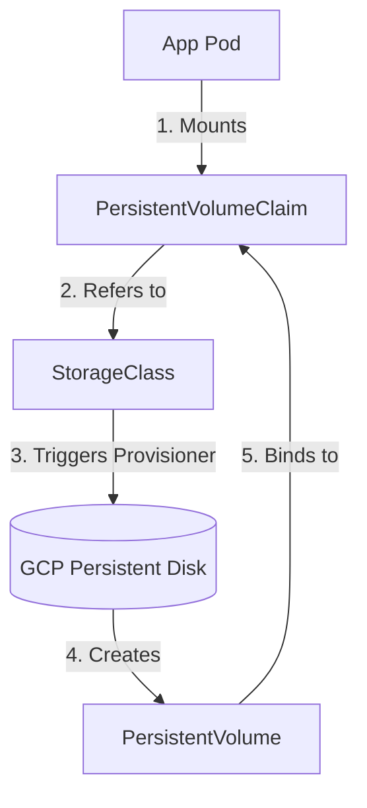

# Lesson 0007: Storage & State Management: Persistent Volumes & StorageClasses on GKE

## Introduction to Kubernetes Storage

By default, the filesystem inside a container is ephemeral. If a container crashes, the kubelet restarts it, but any changes or local files are lost. To solve this for stateful databases (like PostgreSQL, MySQL, or MongoDB), Kubernetes provides a persistent storage subsystem decoupled from the Pod lifecycle.

We manage storage using three key API primitives:

* **PersistentVolume (PV):**  A piece of storage in the cluster that has been provisioned by an administrator or dynamically provisioned using StorageClasses. It maps to actual underlying physical storage (e.g., a Google Cloud Persistent Disk).
* **PersistentVolumeClaim (PVC):**  A request for storage by a user/developer. It is similar to a Pod; while Pods consume Node compute resources, PVCs consume PV storage resources. PVCs specify size, access modes, and storage classes.
* **StorageClass (SC):**  A blueprint that describes the "classes" of storage available. StorageClasses allow administrators to configure dynamic provisioning so that a PV is automatically created in GCP the moment a user requests a PVC.

!!! note "Analogy: Storage Primitives"
    Think of a `StorageClass` as a vending machine template, a `PVC` as inserting coins and selecting a specific soda size, and a `PV` as the actual soda bottle dispensed to you.

### Dynamic Provisioning Flow



## Static vs. Dynamic Provisioning

Historically, admins had to manually create PVs in the cloud, matching their exact capacities, and then developers would claim them. Today, we rely on **Dynamic Provisioning**:

1. A developer requests a PVC citing a `StorageClass` (e.g., `standard-rwo` on GKE).
2. The GKE Control Plane reads the request, reaches out to Google Cloud Engine APIs, and automatically provisions a GCP Persistent Disk.
3. The system automatically creates a matching `PersistentVolume` in Kubernetes and binds the PVC to the PV.

## Access Modes & Reclaim Policies

### Access Modes

Access modes define how many nodes can mount the volume concurrently:

* **ReadWriteOnce (RWO):**  The volume can be mounted as read-write by a single Node. (Standard for Block Storage like Google Cloud Persistent Disks).
* **ReadOnlyMany (ROX):**  The volume can be mounted as read-only by many Nodes.
* **ReadWriteMany (RWX):**  The volume can be mounted as read-write by many Nodes (requires Shared File Systems like Google Cloud Filestore or NFS).

### Reclaim Policies

Reclaim policies tell the cluster what to do with the PV when its associated PVC is deleted:

* **Delete:**  The underlying storage asset (e.g., the GCP disk) is immediately deleted from the cloud. (Default for dynamic provisioning).
* **Retain:**  The underlying storage asset is kept. The PV remains in the cluster but is marked "Released", allowing administrators to manually recover data.

## Hands-on Storage Manifests

### 1. The StorageClass (GKE Default)

GKE automatically comes with pre-configured storage classes. Here is what custom SSD storage class config looks like:

```yaml
apiVersion: storage.k8s.io/v1
kind: StorageClass
metadata:
  name: premium-ssd
provisioner: pd.csi.storage.gke.io # GKE Persistent Disk CSI Driver
volumeBindingMode: WaitForFirstConsumer # Important: provisions the disk in the zone where the pod gets scheduled
parameters:
  type: pd-ssd # Use SSD instead of standard HDD
```

### 2. The PersistentVolumeClaim (PVC)

Next, the developer writes a PVC asking for 10Gi of premium SSD storage:

```yaml
apiVersion: v1
kind: PersistentVolumeClaim
metadata:
  name: database-pvc
spec:
  accessModes:
    - ReadWriteOnce
  storageClassName: premium-ssd
  resources:
    requests:
      storage: 10Gi
```

### 3. Mounting the PVC in a Deployment Pod

Finally, reference the PVC in your Pod configuration under `volumes`, and mount it in the container:

```yaml
apiVersion: apps/v1
kind: Deployment
metadata:
  name: database-deployment
spec:
  replicas: 1
  selector:
    matchLabels:
      app: database
  template:
    metadata:
      labels:
        app: database
    spec:
      containers:
      - name: db-engine
        image: postgres:15
        volumeMounts:
        - name: db-data-volume
          mountPath: /var/lib/postgresql/data
      volumes:
      - name: db-data-volume
        persistentVolumeClaim:
          claimName: database-pvc
```

## Troubleshooting Common Storage Issues

### 1. PVC stuck in `Pending` state

* **Diagnosis:**  Run `kubectl describe pvc <pvc-name>`.
* **Common Causes:** 

* Incorrect `storageClassName` specified (typos).
* Cloud provider quota exceeded (e.g., you hit the limit of SSD disks in your GCP region).
* If `volumeBindingMode: WaitForFirstConsumer` is set, the PVC will remain `Pending` until a Pod that mounts it is scheduled. This is normal behavior!

### 2. Multi-Attach Error for RWO Volumes

* **Symptom:**  A new Pod cannot start because the volume is already locked by an old terminating Pod.
* **Cause:**  `ReadWriteOnce` volumes can only mount to a single VM Node. If a deployment scales down on one Node and scales up on another, the cloud provider takes a minute to detach and re-attach the volume.
* **Fix:**  Set deployment update strategy to `Recreate` instead of `RollingUpdate` for single-replica stateful databases to force the old Pod to exit fully before the new one is launched.

## Test Your Knowledge

### 1. What does the `volumeBindingMode: WaitForFirstConsumer` setting inside a StorageClass do?

- [ ] **A.** It prevents pods from accessing the storage until they have authenticated.
- [ ] **B.** It delays the provisioning of the PersistentVolume (PV) until the Pod is scheduled, ensuring the disk is created in the same zone/region as the Node hosting the Pod.
- [ ] **C.** It deletes the disk if no Pod mounts it within 30 minutes.

<details>
<summary><b>Answer & Explanation</b></summary>

**Correct Answer:** B

Correct! Delaying the binding prevents a common scheduling deadlock where a disk is provisioned in Zone A, but the scheduler places the Pod on a Node in Zone B due to resources.
</details>

### 2. If you delete a PVC that is bound to a PV configured with the `Retain` reclaim policy, what happens to the underlying cloud storage disk?

- [ ] **A.** It is immediately deleted from Google Cloud.
- [ ] **B.** It is kept intact in GCP, and the PV enters a "Released" state, allowing manual data recovery or administrative deletion.
- [ ] **C.** It is reformatted and assigned to the next pending pod automatically.

<details>
<summary><b>Answer & Explanation</b></summary>

**Correct Answer:** B

Correct! The Retain policy preserves the storage volume, requiring an administrator to manually delete the backing GCP resource once data integrity has been verified.
</details>

---

[← Lesson 6: Ingress & GKE Load Balancing](./0006-ingress-gke-load-balancing.md) | [Lesson 8: GKE Gateway API →](./0008-gke-gateway-api.md)
