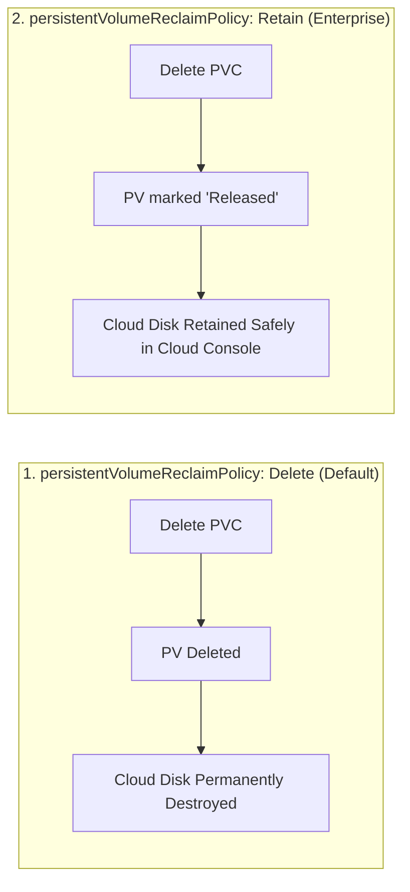
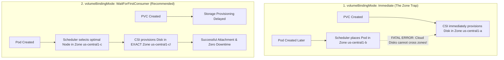

# Lesson 0007: Persistent Volumes, PVCs & StorageClasses

## 🚀 Fast Interview Summary & Cheatsheet

| Primitive | Analogy | Scope | Responsibility |
| :--- | :--- | :--- | :--- |
| **`StorageClass`** | Storage Blueprint / Factory | Cluster-wide | Defines the CSI provisioner, disk type (SSD/HDD), and `volumeBindingMode`. |
| **`PersistentVolumeClaim` (PVC)** | Storage Ticket / Request | Namespace-scoped | Developer's request for storage capacity (e.g. `50Gi`) and access mode. |
| **`PersistentVolume` (PV)** | Actual Disk Asset | Cluster-wide | Physical or cloud disk provisioned by CSI driver and bound to a PVC. |
| **`CSI Driver`** | Storage Adapter Plugin | Node / Cluster | Standardized gRPC interface (Container Storage Interface) to attach/mount disks. |

---

## 1. Storage Abstraction Architecture

Kubernetes separates storage infrastructure from application deployment via a 3-tier declarative architecture:

```mermaid
graph TD
    Developer["Developer / Application Manifest"] -->|1. Creates| PVC["PersistentVolumeClaim (PVC)\n(Requests 20Gi SSD, RWO)"]
    PVC -->|2. References| SC["StorageClass (SC)\n(provisioner: pd.csi.storage.gke.io\nvolumeBindingMode: WaitForFirstConsumer)"]
    
    subgraph ControlPlane ["Storage Controller & Cloud CSI"]
        SC -->|3. Triggers Cloud API| CSI["GCP Persistent Disk CSI Driver"]
        CSI -->|4. Provisions Disk in GCP| CloudDisk[("Google Cloud Persistent Disk (pd-ssd)")]
        CSI -->|5. Creates & Binds| PV["PersistentVolume (PV)"]
    end
    
    PV -->|6. Bound (1:1 Mapping)| PVC
    Pod["Application Pod"] -->|7. Mounts Volume| PVC
```

---

## 2. Access Modes & Reclaim Policies

### A. Volume Access Modes

| Access Mode | CLI Abbr | Description | Common Storage Backends |
| :--- | :--- | :--- | :--- |
| **`ReadWriteOnce`** | `RWO` | Mounted read-write by a **single worker node** at a time. | GCP Persistent Disk, AWS EBS, Azure Disk (Block Storage) |
| **`ReadOnlyMany`** | `ROX` | Mounted read-only concurrently by **many worker nodes**. | GCS Fuse, Read-only NFS |
| **`ReadWriteMany`** | `RWX` | Mounted read-write concurrently by **many worker nodes**. | GCP Filestore, AWS EFS, NFS, CephFS (Shared File Storage) |
| **`ReadWriteOncePod`** | `RWOP` | Mounted read-write by **strictly one single Pod** (K8s 1.27+). | Prevents dual-container corruption on the same node |

---

### B. Volume Reclaim Policies

What happens to the actual underlying disk in the cloud when a developer deletes the PVC?


```mermaid
graph LR
    subgraph DeletePolicy ["1. persistentVolumeReclaimPolicy: Delete (Default)"]
        PVC1[Delete PVC] --> PV1[PV Deleted] --> CloudDisk1[Cloud Disk Permanently Destroyed]
    end

    subgraph RetainPolicy ["2. persistentVolumeReclaimPolicy: Retain (Enterprise)"]
        PVC2[Delete PVC] --> PV2["PV marked 'Released'"] --> CloudDisk2[Cloud Disk Retained Safely in Cloud Console]
    end
```

* **`Delete` (Default for dynamic provisioning):** Automatically deletes the `PersistentVolume` object and wipes the underlying cloud disk in GCP/AWS.
* **`Retain`:** Retains the `PersistentVolume` and physical cloud disk. The PV transitions to the **`Released`** status, allowing administrators to recover or scrub data manually.

---

## 3. The `volumeBindingMode` Dilemma: Immediate vs. WaitForFirstConsumer

This is one of the most frequently asked Kubernetes storage interview questions:


```mermaid
graph TD
    subgraph ImmediateMode ["1. volumeBindingMode: Immediate (The Zone Trap)"]
        PVC_A[PVC Created] --> DiskA[CSI immediately provisions Disk in Zone us-central1-a]
        Pod_A[Pod Created Later] --> SchedA[Scheduler places Pod in Zone us-central1-b]
        SchedA -.->|FATAL ERROR: Cloud Disks cannot cross zones!| DiskA
    end

    subgraph WaitForFirstConsumerMode ["2. volumeBindingMode: WaitForFirstConsumer (Recommended)"]
        PVC_B[PVC Created] --> WaitState[Storage Provisioning Delayed]
        Pod_B[Pod Created] --> SchedB[Scheduler selects optimal Node in Zone us-central1-c]
        SchedB --> DiskB[CSI provisions Disk in EXACT Zone us-central1-c!]
        DiskB --> Bound[Successful Attachment & Zero Downtime]
    end
```

### Production StorageClass Definition:
```yaml
apiVersion: storage.k8s.io/v1
kind: StorageClass
metadata:
  name: premium-rwo-ssd
provisioner: pd.csi.storage.gke.io
volumeBindingMode: WaitForFirstConsumer # Delays provisioning until Pod is scheduled
allowVolumeExpansion: true            # Allows dynamic resizing of disks
parameters:
  type: pd-ssd                        # High IOPS solid-state drive
```

---

## 🎯 Interview Deep-Dives & Scenarios

??? question "Interview Question: Why is `volumeBindingMode: WaitForFirstConsumer` mandatory in multi-zone clusters?"
    **Answer:**
    - Cloud block storage disks (like Google Cloud Persistent Disks or AWS EBS volumes) are **zone-locked**; they cannot be attached to a virtual machine running in a different availability zone.
    - If `volumeBindingMode: Immediate` is used, the CSI driver creates the disk immediately in an arbitrary zone (e.g. `zone-a`) before the Pod is scheduled.
    - If the scheduler later decides to place the Pod in `zone-b` (due to CPU availability or zone anti-affinity), the Pod will remain permanently stuck in `FailedScheduling / VolumeNodeAffinityConflict` because the disk cannot cross zones.
    - **`WaitForFirstConsumer` solves this:** It tells the CSI driver to wait until `kube-scheduler` chooses the exact node and zone for the Pod, guaranteeing the disk is provisioned in the identical zone.

??? question "Interview Scenario: What happens when you delete a PVC whose PV has a `Retain` reclaim policy?"
    **Answer:**
    1. The PVC is deleted.
    2. The underlying PV object is **NOT deleted**; its status transitions to **`Released`**.
    3. The physical disk in the cloud console remains completely intact with all its data.
    4. **The Trap:** Another PVC *cannot immediately claim this released PV* because `PV.spec.claimRef` still points to the deleted PVC UID.
    5. **To re-use the PV:** An administrator must manually edit the PV and remove the `claimRef` field, or take a snapshot and recreate the PVC.

??? question "Interview Question: Can you dynamically resize a PersistentVolume without downtime?"
    **Answer:**
    - **Yes**, provided the `StorageClass` has `allowVolumeExpansion: true`.
    - You simply edit the existing PVC manifest and increase `spec.resources.requests.storage` (e.g. from `50Gi` to `100Gi`).
    - The CSI driver automatically resizes the underlying cloud disk, and `kubelet` expands the filesystem inside the running container without requiring a Pod restart!
    - *Note:* Disks can only be expanded; Kubernetes does **not** support shrinking volume sizes.

---

## ⚠️ Common Production Pitfalls & Interview Traps

??? warning "Production Trap: Multi-Replica Deployment Mounting a ReadWriteOnce (RWO) Disk"
    - `ReadWriteOnce` means the volume can be mounted by **only one worker node**.
    - If you configure a stateless `Deployment` with `replicas: 3` and attach a single `RWO` PVC, all 3 Pods must land on the **exact same worker node**.
    - If the scheduler attempts to place Replica 2 on a different node, the Pod will fail with `Multi-Attach error for volume`.
    - **Fix:** Use a `StatefulSet` with `volumeClaimTemplates` (each replica gets its own disk) or use a Shared File System (NFS / Filestore) with `ReadWriteMany (RWX)`.

---

## 💻 Hands-on Verification & Diagnostic Toolkit

```bash
# 1. Inspect all PersistentVolumes and their status (Bound, Released, Available)
kubectl get pv

# 2. View PVC binding status and assigned StorageClass
kubectl get pvc -n <NAMESPACE>

# 3. Check CSI volume attachment status on a worker node
kubectl get volumeattachment

# 4. Describe PVC to troubleshoot binding errors (e.g. WaitingForFirstConsumer)
kubectl describe pvc <PVC_NAME>
```

---

## Test Your Knowledge

1. Why does `volumeBindingMode: WaitForFirstConsumer` prevent volume scheduling failures in multi-zone cloud clusters?
   - [ ] A) It provisions the cloud disk in the exact zone where the scheduler places the Pod
   - [ ] B) It forces worker nodes to replicate block storage data across all cloud regions
   
   *Answer:* A) It provisions the cloud disk in the exact zone where the scheduler places the Pod - Correct! By delaying disk provisioning until the Pod is placed, the disk is created in the matching availability zone.

2. A PersistentVolume with `persistentVolumeReclaimPolicy: Retain` enters which status after its associated PVC is deleted?
   - [ ] A) The Released status
   - [ ] B) The Available status
   
   *Answer:* A) The Released status - Correct! The PV enters `Released` status to prevent other claims from overwriting historical data until an administrator scrubs it.

---

## Recommended Primary Resource
- [Kubernetes Persistent Volumes & Claims](https://kubernetes.io/docs/concepts/storage/persistent-volumes/)
- [Kubernetes Storage Classes Specification](https://kubernetes.io/docs/concepts/storage/storage-classes/)

---
**Troubleshooting a VolumeNodeAffinity conflict or expanding a database disk?** Ask in chat, and we'll resolve the storage binding!

[← Lesson 6: Ingress & GKE Load Balancing](./0006-ingress-gke-load-balancing.md) | [Lesson 8: GKE Gateway API →](./0008-gke-gateway-api.md)
