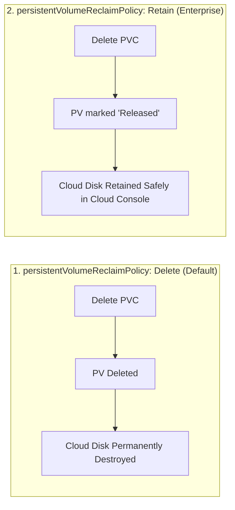
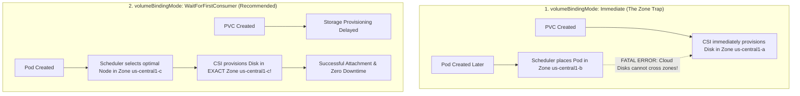

# Lesson 0007: Persistent volumes, PVCs, and StorageClasses

## Fast interview summary and cheatsheet

| Object | Analogy | Scope | Responsibility |
| :--- | :--- | :--- | :--- |
| **`StorageClass`** | Storage template | Cluster-wide | Defines the CSI provisioner, disk type (SSD/HDD), and `volumeBindingMode`. |
| **`PersistentVolumeClaim` (PVC)** | Storage request | Namespace-scoped | Developer's request for storage capacity (such as `50Gi`) and access mode. |
| **`PersistentVolume` (PV)** | Storage asset | Cluster-wide | Physical or cloud disk provisioned by CSI driver and bound to a PVC. |
| **`CSI Driver`** | Storage plugin | Node / Cluster | Standardized gRPC interface (Container Storage Interface) to attach and mount disks. |

---

## 1. Storage abstraction architecture

Kubernetes separates storage infrastructure from application deployment through a three-layer architecture:

```mermaid
graph TD
    Developer["Developer / Application Manifest"] -->|1. Creates| PVC["PersistentVolumeClaim (PVC)\n(Requests 20Gi SSD, RWO)"]
    PVC -->|2. References| SC["StorageClass (SC)\n(provisioner: pd.csi.storage.gke.io\nvolumeBindingMode: WaitForFirstConsumer)"]
    
    subgraph ControlPlane ["Storage Controller & Cloud CSI"]
        SC -->|3. Triggers Cloud API| CSI["GCP Persistent Disk CSI Driver"]
        CSI -->|4. Provisions Disk in GCP| CloudDisk[("Google Cloud Persistent Disk (pd-ssd)")]
        CSI -->|5. Creates & Binds| PV["PersistentVolume (PV)"]
    end
    
    PV -->|6. Bound (1:1 Mapping)| PVC
    Pod["Application Pod"] -->|7. Mounts Volume| PVC
```

---

## 2. Access modes and reclaim policies

### A. Volume access modes

| Access mode | CLI abbreviation | Description | Common storage backends |
| :--- | :--- | :--- | :--- |
| **`ReadWriteOnce`** | `RWO` | Mounted read-write by a **single worker node** at a time. | GCP Persistent Disk, AWS EBS, Azure Disk (Block Storage) |
| **`ReadOnlyMany`** | `ROX` | Mounted read-only concurrently by **many worker nodes**. | GCS Fuse, Read-only NFS |
| **`ReadWriteMany`** | `RWX` | Mounted read-write concurrently by **many worker nodes**. | GCP Filestore, AWS EFS, NFS, CephFS (Shared Filesystem) |
| **`ReadWriteOncePod`** | `RWOP` | Mounted read-write by **strictly one single Pod** (K8s 1.27+). | Prevents multiple containers from corrupting the same volume |

---

### B. Volume reclaim policies

When a user deletes a PVC, the reclaim policy determines what happens to the underlying storage disk:


```mermaid
graph LR
    subgraph DeletePolicy ["1. persistentVolumeReclaimPolicy: Delete (Default)"]
        PVC1[Delete PVC] --> PV1[PV Deleted] --> CloudDisk1[Cloud Disk Permanently Destroyed]
    end

    subgraph RetainPolicy ["2. persistentVolumeReclaimPolicy: Retain (Enterprise)"]
        PVC2[Delete PVC] --> PV2["PV marked 'Released'"] --> CloudDisk2[Cloud Disk Retained Safely in Cloud Console]
    end
```

* **`Delete` (Default for dynamic provisioning):** Deletes the `PersistentVolume` object and removes the underlying cloud disk in GCP/AWS.
* **`Retain`:** Retains the `PersistentVolume` and cloud disk. The PV transitions to **`Released`** status, allowing administrators to recover or scrub data manually.

---

## 3. Volume binding modes: Immediate versus WaitForFirstConsumer


```mermaid
graph TD
    subgraph ImmediateMode ["1. volumeBindingMode: Immediate (The Zone Trap)"]
        PVC_A[PVC Created] --> DiskA[CSI immediately provisions Disk in Zone us-central1-a]
        Pod_A[Pod Created Later] --> SchedA[Scheduler places Pod in Zone us-central1-b]
        SchedA -.->|FATAL ERROR: Cloud Disks cannot cross zones!| DiskA
    end

    subgraph WaitForFirstConsumerMode ["2. volumeBindingMode: WaitForFirstConsumer (Recommended)"]
        PVC_B[PVC Created] --> WaitState[Storage Provisioning Delayed]
        Pod_B[Pod Created] --> SchedB[Scheduler selects optimal Node in Zone us-central1-c]
        SchedB --> DiskB[CSI provisions Disk in EXACT Zone us-central1-c!]
        DiskB --> Bound[Successful Attachment & Zero Downtime]
    end
```

### Production StorageClass definition

```yaml
apiVersion: storage.k8s.io/v1
kind: StorageClass
metadata:
  name: premium-rwo-ssd
provisioner: pd.csi.storage.gke.io
volumeBindingMode: WaitForFirstConsumer # Delays provisioning until Pod is scheduled
allowVolumeExpansion: true            # Allows dynamic resizing of disks
parameters:
  type: pd-ssd                        # High IOPS solid-state drive
```

---

## Interview deep-dives and scenarios

??? question "Interview question: Why is `volumeBindingMode: WaitForFirstConsumer` mandatory in multi-zone clusters?"
    Cloud block storage disks (such as Google Cloud Persistent Disks or AWS EBS volumes) are tied to a single availability zone. They cannot attach to a virtual machine in a different zone.
    
    If you use `volumeBindingMode: Immediate`, the CSI driver creates the disk immediately in an arbitrary zone before the Pod schedules.
    
    If the scheduler later places the Pod in a different zone, the Pod stays permanently stuck in `FailedScheduling / VolumeNodeAffinityConflict`.
    
    `WaitForFirstConsumer` prevents this by waiting until `kube-scheduler` assigns the Pod to a node and zone before creating the disk, ensuring matching placement.

??? question "Interview scenario: What happens when you delete a PVC whose PV has a `Retain` reclaim policy?"
    1. The PVC is deleted.
    2. The underlying PV object is not deleted; its status transitions to `Released`.
    3. The physical disk in the cloud remains intact with all data.
    4. Another PVC cannot claim this released PV immediately because `PV.spec.claimRef` still points to the deleted PVC UID.
    5. To reuse the PV, an administrator must remove the `claimRef` field from the PV manifest or take a snapshot and create a new PVC.

??? question "Interview question: Can you dynamically resize a PersistentVolume without downtime?"
    Yes, provided the `StorageClass` has `allowVolumeExpansion: true`.
    
    Edit the existing PVC manifest and increase `spec.resources.requests.storage` (for example from `50Gi` to `100Gi`).
    
    The CSI driver expands the underlying cloud disk, and `kubelet` resizes the filesystem inside the running container without requiring a Pod restart. Disks can only grow; Kubernetes does not support shrinking volumes.

---

## Common production pitfalls and interview traps

??? warning "Production trap: Multi-replica Deployment mounting a ReadWriteOnce (RWO) disk"
    `ReadWriteOnce` means the volume can be mounted by only one worker node at a time.
    
    If you configure a `Deployment` with `replicas: 3` and attach a single `RWO` PVC, all 3 Pods must schedule onto the same worker node.
    
    If the scheduler places any replica on a different node, the Pod fails with a `Multi-Attach error for volume`.
    
    Use a `StatefulSet` with `volumeClaimTemplates` (giving each replica its own disk) or a shared filesystem (NFS / Cloud Filestore) with `ReadWriteMany` (RWX).

---

## Hands-on verification and diagnostics

```bash
# 1. Inspect all PersistentVolumes and their status (Bound, Released, Available)
kubectl get pv

# 2. View PVC binding status and assigned StorageClass
kubectl get pvc -n <NAMESPACE>

# 3. Check CSI volume attachment status on a worker node
kubectl get volumeattachment

# 4. Describe PVC to troubleshoot binding errors
kubectl describe pvc <PVC_NAME>
```

---

## Test your knowledge

1. Why does `volumeBindingMode: WaitForFirstConsumer` prevent volume scheduling failures in multi-zone cloud clusters?
   - [ ] A) It provisions the cloud disk in the exact zone where the scheduler places the Pod
   - [ ] B) It forces worker nodes to replicate block storage data across all cloud regions
   
   Answer: A. By delaying disk provisioning until the Pod is placed, the disk is created in the matching availability zone.

2. A PersistentVolume with `persistentVolumeReclaimPolicy: Retain` enters which status after its associated PVC is deleted?
   - [ ] A) The Released status
   - [ ] B) The Available status
   
   Answer: A. The PV enters `Released` status to prevent other claims from overwriting historical data until an administrator scrubs it.

---

## Recommended primary resources
- [Kubernetes Persistent Volumes and Claims](https://kubernetes.io/docs/concepts/storage/persistent-volumes/)
- [Kubernetes Storage Classes specification](https://kubernetes.io/docs/concepts/storage/storage-classes/)

---

[← Lesson 6: Ingress and GKE load balancing](./0006-ingress-gke-load-balancing.md) | [Lesson 8: GKE Gateway API →](./0008-gke-gateway-api.md)
