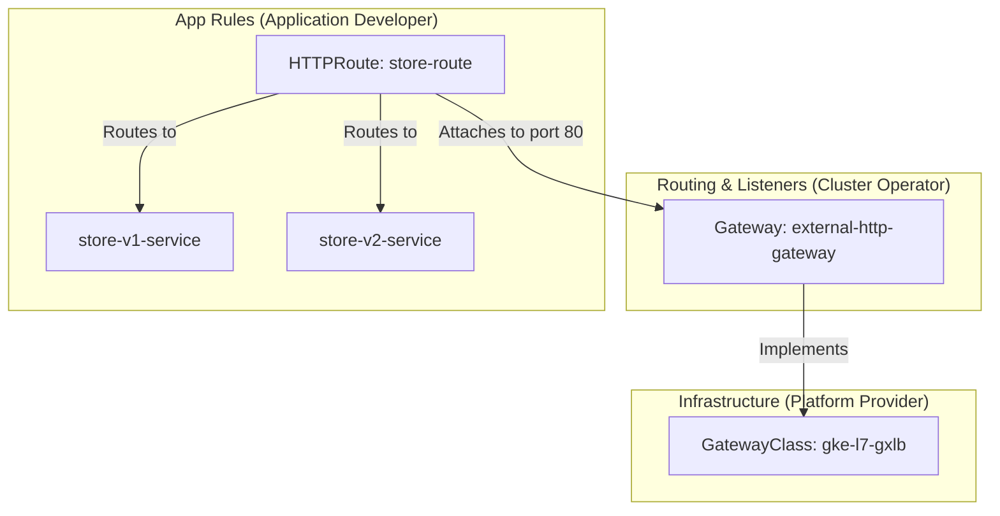

# Lesson 0008: Advanced Networking: Kubernetes Gateway API & GKE GatewayClass

## What is the Gateway API?

The **Gateway API** (`gateway.networking.k8s.io`) is the next-generation Kubernetes routing standard, designed to replace the aging `Ingress` API. While Ingress packed all configuration (load balancers, routing rules, SSL, hostnames) into a single monolithic manifest, Gateway API breaks these elements apart to align with distinct organizational roles.

### Why Ingress fell short:

* **Lack of role separation:**  In Ingress, the same manifest was edited by platform teams (defining SSL/IPs) and app developers (defining routing paths), creating governance challenges.
* **Heavy reliance on Annotations:**  Advanced functions (like URL rewrites, redirects, header manipulation, and canary weighting) were not standardized. Each controller (Nginx, GKE, Traefik) used its own ad-hoc annotations, making configurations highly vendor-locked.
* **Extensibility:**  Ingress was hard to scale for protocols other than HTTP/HTTPS (like gRPC, TCP, or UDP).

## The Role-Oriented Resources

The Gateway API introduces a modular schema split across three distinct resources:

* **GatewayClass (Infrastructure):**  Defines the type of load balancer controller that implements the Gateway API (e.g., GKE External HTTP(S) Load Balancer). Managed by **Cloud/Platform Admins**.
* **Gateway (Cluster Operator):**  Instantiates the load balancer. Defines IP configurations, listeners (ports like 80/443), and TLS certificates. Managed by **Cluster/Platform Operators**.
* **HTTPRoute / GRPCRoute (App Developer):**  Binds to a Gateway to define routing rules (paths, query parameters, hostnames, redirects) and backend destinations. Managed by **App Developers**.

!!! note "Analogy: Gateway API Components"
    Think of a `GatewayClass` as a network router brand (e.g. Cisco), the `Gateway` as the physical router box plugged into the wall with ports open, and the `HTTPRoute` as the software routing rules deciding which packet goes to which device.

### Gateway API Architecture



## GKE GatewayClasses

On GKE, the Gateway API controller is built-in. GKE provides several pre-installed `GatewayClass` resources that automatically provision Google Cloud Load Balancers:

GatewayClass Name
Type of GCP Load Balancer Created

`gke-l7-gxlb`
Global External Application Load Balancer (HTTP/S)

`gke-l7-rilb`
Regional Internal Application Load Balancer (HTTP/S)

`gke-l7-gxlb-mc`
Multi-Cluster Global External Application Load Balancer

## Hands-on Gateway API Manifests

### 1. The Gateway (Operator Config)

This resource instructs GKE to provision a Global External L7 Application Load Balancer listening on port 80:

```yaml
apiVersion: gateway.networking.k8s.io/v1
kind: Gateway
metadata:
  name: external-http-gateway
spec:
  gatewayClassName: gke-l7-gxlb # Matches the GKE Global External class
  listeners:
  - name: http
    protocol: HTTP
    port: 80
    allowedRoutes:
      namespaces:
        from: All # Allows routes from any namespace to attach to this Gateway
```

### 2. The HTTPRoute (Developer Config)

An application developer can now deploy a route mapping hostnames and paths to Services. Notice the native support for traffic splitting (Canary routing) without annotations:

```yaml
apiVersion: gateway.networking.k8s.io/v1
kind: HTTPRoute
metadata:
  name: store-route
spec:
  parentRefs:
  - name: external-http-gateway # Attaches this route to the Gateway above
    sectionName: http
  hostnames:
  - "store.example.com"
  rules:
  - matches:
    - path:
        type: PathPrefix
        value: /items
    backendRefs:
    # Canary split: 90% traffic to stable, 10% to new version
    - name: store-v1-service
      port: 8080
      weight: 90
    - name: store-v2-service
      port: 8080
      weight: 10
```

### 3. Direct URL Redirects & Rewrites (Native Features)

Unlike Ingress, redirects are native to the spec. Here is how to write a simple HTTP to HTTPS redirect route:

```yaml
apiVersion: gateway.networking.k8s.io/v1
kind: HTTPRoute
metadata:
  name: ssl-redirect-route
spec:
  parentRefs:
  - name: external-http-gateway
  rules:
  - filters:
    - type: RequestRedirect
      requestRedirect:
        scheme: https
        statusCode: 301
```

## Attaching GKE Policies (Advanced)

Similar to Ingress's `BackendConfig`, GKE Gateway API uses Policy resources to configure advanced load-balancing properties:

* **GCPGatewayPolicy:**  Configures security settings like SSL Policies or Client TLS settings on the Gateway listener.
* **GCPBackendPolicy:**  Configures backend features like Session Affinity, Cloud Armor WAF policies, or Cloud CDN on target Services.

## Troubleshooting Gateway API

Gateway API uses a rich `Status` object to report operational health:

### 1. Check Gateway Provisioning

```bash
kubectl describe gateway external-http-gateway
```

Check the `Status.Conditions` block. You want to see:

* `Accepted: True` (The GKE controller read and validated the Gateway definition).
* `Programmed: True` (The actual Google Cloud Load Balancer was successfully created in GCP and assigned an IP).

### 2. Check HTTPRoute Attachment

```bash
kubectl describe httproute store-route
```

Check the `ParentRefs` status block. If the Gateway rejected the route (e.g. namespace routing restrictions or invalid service targets), the errors will display in the route's conditions.

## Test Your Knowledge

### 1. Which Gateway API resource represents the physical cloud load balancer instance (with its IP address and ports) in the cluster?

- [ ] **A.** GatewayClass
- [ ] **B.** Gateway
- [ ] **C.** HTTPRoute

<details>
<summary><b>Answer & Explanation</b></summary>

**Correct Answer:** B

Correct! The Gateway resource represents the specific configuration mapping to the instantiated cloud load balancer itself.
</details>

### 2. Which GKE GatewayClass name should you choose to provision a managed INTERNAL L7 load balancer inside your VPC?

- [ ] **A.** gke-l7-gxlb
- [ ] **B.** gke-l7-rilb
- [ ] **C.** gke-l4-ilb

<details>
<summary><b>Answer & Explanation</b></summary>

**Correct Answer:** B

Correct! gke-l7-rilb represents GKE L7 Regional Internal Load Balancing.
</details>

---

[← Lesson 7: Persistent Volumes, PVCs & StorageClasses](./0007-pv-pvc-storageclasses.md) | [Lesson 9: Pod Lifecycle, Resource Allocation, and Health Probes →](./0009-resources-probes-graceful-shutdown.md)
