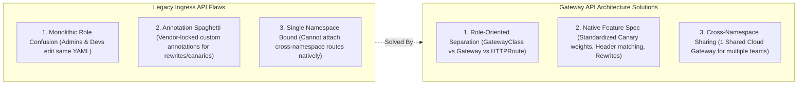
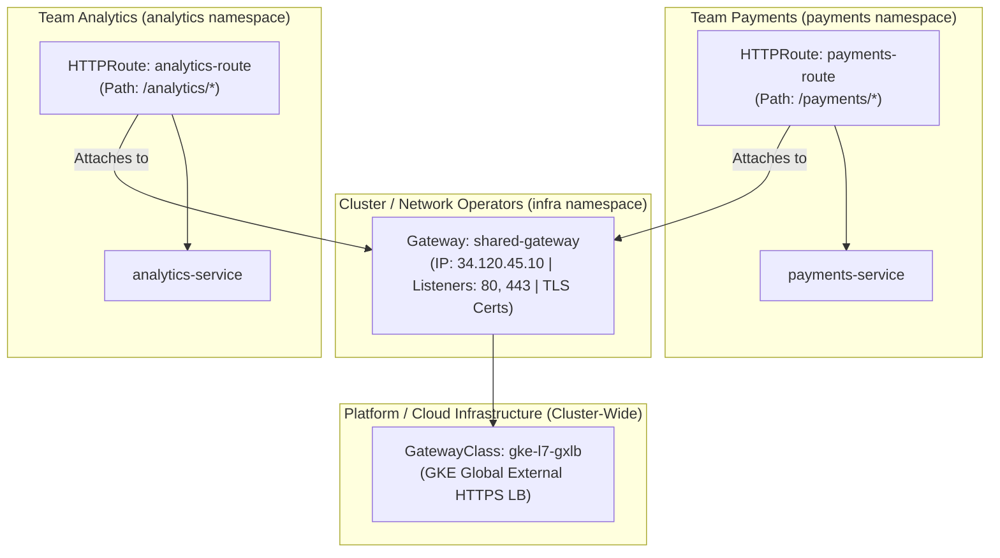

# Lesson 0008: Next-Gen Networking: Kubernetes & GKE Gateway API

## 🚀 Fast Interview Summary & Cheatsheet

| Resource | Persona / Role | Scope | Key Configuration |
| :--- | :--- | :--- | :--- |
| **`GatewayClass`** | Infrastructure Provider | Cluster-wide | Defines the underlying controller implementation (e.g. `gke-l7-gxlb`). |
| **`Gateway`** | Platform / Cluster Ops | Namespace-scoped | Defines VIPs, listening ports (`80/443`), TLS certificates, and allowed namespaces. |
| **`HTTPRoute`** | Application Developer | Namespace-scoped | Defines path/header rules, canary weights, URL rewrites, and target backend Services. |
| **`ReferenceGrant`** | Target Service Owner | Namespace-scoped | Explicitly authorizes cross-namespace route attachments for strict multi-tenancy. |

---

## 1. Why Gateway API Replaces Ingress

The standard **Ingress API** was designed in the early days of Kubernetes as a monolithic manifest. In production enterprise environments, Ingress created three major bottlenecks:


```mermaid
graph LR
    subgraph IngressFlaws ["Legacy Ingress API Flaws"]
        F1["1. Monolithic Role Confusion (Admins & Devs edit same YAML)"]
        F2["2. Annotation Spaghetti (Vendor-locked custom annotations for rewrites/canaries)"]
        F3["3. Single Namespace Bound (Cannot attach cross-namespace routes natively)"]
    end

    subgraph GatewaySolutions ["Gateway API Architecture Solutions"]
        S1["1. Role-Oriented Separation (GatewayClass vs Gateway vs HTTPRoute)"]
        S2["2. Native Feature Spec (Standardized Canary weights, Header matching, Rewrites)"]
        S3["3. Cross-Namespace Sharing (1 Shared Cloud Gateway for multiple teams)"]
    end

    IngressFlaws -.->|Solved By| GatewaySolutions
```

---

## 2. Role-Oriented Resource Hierarchy


```mermaid
graph TD
    subgraph PlatformTeam ["Platform / Cloud Infrastructure (Cluster-Wide)"]
        GC["GatewayClass: gke-l7-gxlb\n(GKE Global External HTTPS LB)"]
    end

    subgraph OpsTeam ["Cluster / Network Operators (infra namespace)"]
        GW["Gateway: shared-gateway\n(IP: 34.120.45.10 | Listeners: 80, 443 | TLS Certs)"] --> GC
    end

    subgraph AppTeam1 ["Team Payments (payments namespace)"]
        Route1["HTTPRoute: payments-route\n(Path: /payments/*)"] -->|Attaches to| GW
        Route1 --> Svc1["payments-service"]
    end

    subgraph AppTeam2 ["Team Analytics (analytics namespace)"]
        Route2["HTTPRoute: analytics-route\n(Path: /analytics/*)"] -->|Attaches to| GW
        Route2 --> Svc2["analytics-service"]
    end
```

---

## 3. Advanced Traffic Management: Canary Splitting & Header Matching

One of the biggest strengths of the Gateway API is native **Canary Weighting** and **Header Routing** without needing a Service Mesh like Istio.

```yaml
apiVersion: gateway.networking.k8s.io/v1
kind: HTTPRoute
metadata:
  name: payment-canary-route
  namespace: payments
spec:
  parentRefs:
    - name: shared-gateway
      namespace: infra
      sectionName: https-listener
  hostnames:
    - "api.mycompany.com"
  rules:
    # Rule 1: Beta testers with custom header route 100% to v2
    - matches:
        - headers:
            - name: "X-Beta-Tester"
              value: "true"
      backendRefs:
        - name: payment-service-v2
          port: 8080

    # Rule 2: Production traffic split: 90% to v1, 10% to v2
    - matches:
        - path:
            type: PathPrefix
            value: /api/v1/checkout
      backendRefs:
        - name: payment-service-v1
          port: 8080
          weight: 90                   # 90% of traffic
        - name: payment-service-v2
          port: 8080
          weight: 10                   # 10% Canary traffic
```

---

## 4. Cross-Namespace Security: `ReferenceGrant`

In a multi-tenant cluster, Team A should not be able to route traffic to Team B’s private backend services without permission.

If an `HTTPRoute` in the `marketing` namespace points to a Service in the `payments` namespace, the connection is **blocked by default** until the Payments team explicitly deploys a **`ReferenceGrant`**:

```yaml
apiVersion: gateway.networking.k8s.io/v1beta1
kind: ReferenceGrant
metadata:
  name: allow-marketing-to-payments
  namespace: payments                 # Deployed by Payments team
spec:
  from:
    - group: gateway.networking.k8s.io
      kind: HTTPRoute
      namespace: marketing            # Grants permission specifically to marketing
  to:
    - group: ""
      kind: Service
      name: payment-service
```

---

## 🎯 Interview Deep-Dives & Scenarios

??? question "Interview Question: How does the Gateway API solve the 'Annotation Sprawl' problem of the Ingress API?"
    **Answer:**
    - Under the Ingress API, advanced features were never codified in the core specification.
    - To perform a simple URL rewrite or canary split, engineers had to use vendor-specific annotations:
      - NGINX: `nginx.ingress.kubernetes.io/rewrite-target: /`
      - GKE: `networking.gke.io/v1beta1.FrontendConfig`
      - Traefik: `traefik.ingress.kubernetes.io/router.middlewares`
    - This caused severe vendor lock-in and made migrating between cloud providers painful.
    - **Gateway API standardizes these features directly into core YAML fields** (`rules.filters.type: URLRewrite`, `rules.backendRefs[].weight`, `rules.matches[].headers`), making routing manifests fully portable across GKE, AWS, Azure, Envoy, and Istio.

??? question "Interview Scenario: How do you configure a shared Gateway that allows developer teams to attach routes from their own namespaces?"
    **Answer:**
    In the `Gateway` manifest, configure `listeners.allowedRoutes.namespaces`:
    ```yaml
    listeners:
      - name: https
        protocol: HTTPS
        port: 443
        allowedRoutes:
          namespaces:
            from: Selector
            selector:
              matchLabels:
                tenant: enabled       # Any namespace with label tenant=enabled can attach routes!
    ```

---

## ⚠️ Common Production Pitfalls & Interview Traps

??? warning "Production Trap: `RouteReasonNotAllowed` Status"
    If an application developer deploys an `HTTPRoute` referencing a shared Gateway, but the Gateway’s `allowedRoutes` rejects the developer's namespace, the route will deploy successfully but remain **inactive** with condition `Accepted: False` (`Reason: RouteReasonNotAllowed`). Always check `kubectl describe httproute <NAME>`.

---

## 💻 Hands-on Verification & Diagnostic Toolkit

```bash
# 1. Check Gateway status and assigned External IP
kubectl get gateway -A

# 2. Inspect all HTTPRoutes and their parent Gateway bindings
kubectl get httproutes -A

# 3. Check detailed route conditions and validation errors
kubectl describe httproute payment-canary-route -n payments

# 4. View available GatewayClasses supported on the cluster
kubectl get gatewayclasses
```

---

## Test Your Knowledge

1. Which Gateway API resource is managed by application developers to define path matches and canary traffic weights?
   - [ ] A) The HTTPRoute custom resource definition
   - [ ] B) The GatewayClass custom resource definition
   
   *Answer:* A) The HTTPRoute custom resource definition - Correct! `HTTPRoute` defines routing rules, path matching, and canary weights for application developers.

2. In a multi-tenant cluster, what custom resource must a backend service owner create to authorize cross-namespace traffic from a separate team's HTTPRoute?
   - [ ] A) The ReferenceGrant custom resource definition
   - [ ] B) The IngressClass custom resource definition
   
   *Answer:* A) The ReferenceGrant custom resource definition - Correct! `ReferenceGrant` provides explicit, namespace-level authorization for cross-namespace Gateway API routing.

---

## Recommended Primary Resource
- [Kubernetes Gateway API Concepts](https://gateway-api.sigs.k8s.io/concepts/)
- [GKE Gateway Controller Documentation](https://cloud.google.com/kubernetes-engine/docs/concepts/gateway-api)

---
**Migrating from legacy Ingress to the Gateway API?** Ask in chat, and we'll convert your Ingress rules into clean HTTPRoutes!

[← Lesson 7: Persistent Volumes & StorageClasses](./0007-pv-pvc-storageclasses.md) | [Lesson 9: Resources, Probes & Graceful Shutdown →](./0009-resources-probes-graceful-shutdown.md)
