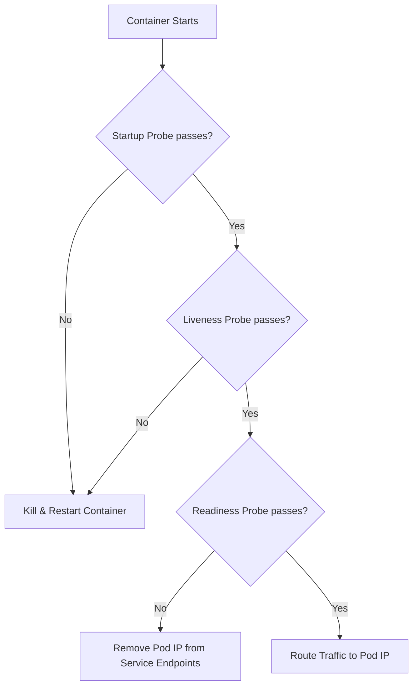

# Lesson 8: Compute Management & Lifecycle: Resource Management, Health Probes, & Graceful Shutdown

## 1. CPU & Memory: Requests vs. Limits

When running applications in production GKE clusters, you must specify how much CPU and memory they require. This is done via **Requests** and **Limits** inside the container definition:

* **Requests (Scheduling):**  The minimum amount of CPU/Memory guaranteed to the container. The Kubernetes scheduler uses this value to find a Node with enough available resources to host the Pod.
* **Limits (Enforcement):**  The maximum ceiling of CPU/Memory the container is allowed to consume.

### CPU (Compressible Resource)

Measured in cores or millicores (e.g., `500m` = 0.5 cores). If a container goes over its CPU limit, it is **throttled** (slowed down), but it is  **not**  terminated.

### Memory (Incompressible Resource)

Measured in bytes (typically Mi/Gi, e.g., `256Mi`, `2Gi`). If a container exceeds its memory limit, the Linux kernel terminates the process, causing Kubernetes to flag the container as  **OOMKilled**  (Out of Memory, Exit Code 137).

```
resources:
  requests:
    memory: "256Mi"
    cpu: "200m"
  limits:
    memory: "512Mi"
    cpu: "500m"
```

## 2. App Health Checks: The Three Probes

Kubernetes uses **Probes** to monitor container health and react accordingly. All probes support HTTP checks, TCP checks, or CLI Exec commands:

### Probes Lifecycle Diagram



### A. Startup Probe

Used for slow-starting applications. It tells Kubernetes to delay the liveness and readiness checks until the container is fully initialized. If this fails, the container is restarted.

### B. Liveness Probe

Determines if a container is alive and running properly. If it fails, Kubernetes kills the container and restarts it according to its `restartPolicy`.

### C. Readiness Probe

Determines if a container is ready to accept incoming user network traffic. If it fails, the Pod is removed from the Service's Endpoints pool, ensuring no users see a 502/503 error.

```
# Example probe configuration inside container spec
startupProbe:
  httpGet:
    path: /initialize
    port: 8080
  failureThreshold: 30
  periodSeconds: 10 # Wait up to 300s (30 * 10) for slow start

livenessProbe:
  httpGet:
    path: /healthz
    port: 8080
  initialDelaySeconds: 15
  periodSeconds: 20

readinessProbe:
  httpGet:
    path: /ready
    port: 8080
  initialDelaySeconds: 5
  periodSeconds: 10
```

## 3. Graceful Shutdown & Zero-Downtime Rollouts

When you trigger a rolling deployment update (e.g., updating a container image), Kubernetes kills old Pods and spawns new ones. To achieve **zero-downtime**, Pods must terminate gracefully:

### The Shutdown Lifecycle Flow:

1. The Pod status transitions to `Terminating`.
2. The Endpoint controller removes the Pod's IP from all Services and Cloud Load Balancers.
3. The **preStop Lifecycle Hook** (if defined) executes.
4. The container is sent a `SIGTERM` signal telling it to stop accepting new requests and finish existing ones.
5. Kubernetes waits for the duration of `terminationGracePeriodSeconds` (default: 30 seconds).
6. If the container is still running after the grace period, it is forcibly killed with a `SIGKILL` signal.

!!! warning "The Race Condition"
    There is a slight latency between when a Pod is marked for termination and when routers/load-balancers actually stop sending traffic to it. If your app exits immediately on SIGTERM, users might get connection failures.

### Fixing the Race with a preStop Hook

Adding a short sleep in the `preStop` hook gives network routers enough time to withdraw the Pod's IP before the application process stops:

```yaml
spec:
  terminationGracePeriodSeconds: 40
  containers:
  - name: web-app
    image: my-web-app:v1.1
    lifecycle:
      preStop:
        exec:
          command: ["/bin/sh", "-c", "sleep 15"]
```

## Test Your Knowledge

### 1. What happens to a container that exceeds its allocated Memory Limit?

- [ ] **A.** It is throttled and slowed down but remains running.
- [ ] **B.** It is immediately terminated by the kernel with Exit Code 137 (OOMKilled).
- [ ] **C.** It triggers the HPA to immediately add more nodes.

<details>
<summary><b>Answer & Explanation</b></summary>

**Correct Answer:** B

Correct! Memory is an incompressible resource, so reaching the limit results in an immediate Out-Of-Memory (OOM) termination (Exit Code 137).
</details>

### 2. If your application takes 2 minutes to initialize on startup, but needs quick liveness checking once running, what is the best probe strategy?

- [ ] **A.** Set a high `initialDelaySeconds` on the Liveness Probe.
- [ ] **B.** Configure a `Startup Probe` with a high failure threshold to protect the container during startup, alongside a standard Liveness Probe.
- [ ] **C.** Disable all probes and let GKE manage health checks outside the cluster.

<details>
<summary><b>Answer & Explanation</b></summary>

**Correct Answer:** B

Correct! The Startup Probe runs first and disables liveness and readiness checks until it succeeds, preventing the container from getting stuck in a crash loop before it can finish loading.
</details>

---

[← Lesson 7](./0007-gke-gateway-api.md) | [Lesson 9: Capstone Exercise: Multi-Tier Application Workflow →](./0009-capstone-project.md)
