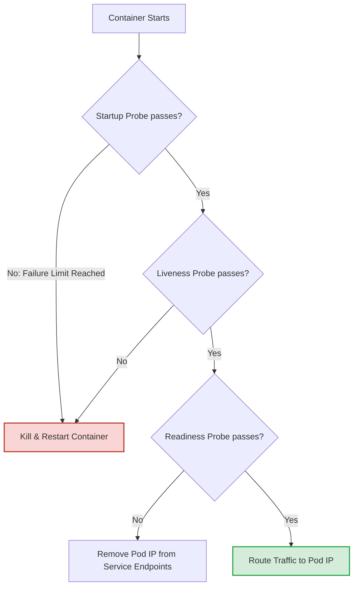

# Lesson 0008: Pod Lifecycle, Resource Allocation, and Health Probes

In a production Kubernetes environment, containers are dynamic and ephemeral. To run workloads reliably at scale, the cluster needs to know two things:

1. **How many resources** your containers need to operate without crashing.
2. **How to determine** if a container is starting up, healthy, or ready to accept user traffic.

This lesson covers CPU/Memory scheduling, configuring the four probe handlers, understanding the three probe lifecycles, and implementing graceful termination.

---

## 1. CPU & Memory: Requests vs. Limits

Kubernetes separates resource specification into **Requests** (used for scheduling) and **Limits** (used for runtime enforcement).

| Resource Attribute | Requests (Scheduler) | Limits (Runtime Enforcement) |
| :--- | :--- | :--- |
| **CPU** (Compressible) | Minimum CPU reserved on a node. Used to decide where to run the Pod. | Maximum CPU the container can use. If exceeded, the container is **throttled** but not killed. |
| **Memory** (Incompressible) | Minimum RAM reserved on a node. | Maximum RAM allowed. If exceeded, the container is terminated by the kernel (`OOMKilled`, Exit Code 137). |

### Example Manifest Configuration
```yaml
resources:
  requests:
    memory: "256Mi"  # Megabytes (binary)
    cpu: "200m"      # 200 millicores (0.2 cores)
  limits:
    memory: "512Mi"
    cpu: "1"         # 1 full CPU core
```

---

## 2. Health Probes: What They Unlock

Kubernetes uses three distinct probes to manage container lifecycles. Configuring these correctly is what unlocks **self-healing** and **zero-downtime rolling updates**.



### 1. Startup Probe
* **What it unlocks:** Protection for slow-starting legacy applications or JVMs.
* **Behavior:** It disables all liveness and readiness checks until the container has initialized. Once it passes, it terminates itself and lets the liveness/readiness probes take over.
* **Why it matters:** Without it, a slow-starting container might trigger the liveness probe to restart it repeatedly before it even finishes booting, putting the Pod into a permanent crash loop.

### 2. Liveness Probe
* **What it unlocks:** Self-healing.
* **Behavior:** Monitors if the application process is deadlocked, frozen, or in an unrecoverable state. If the probe fails consecutively, Kubernetes kills the container and restarts it.
* **Why it matters:** Automatically recovers applications that hang or experience memory leaks without human intervention.

### 3. Readiness Probe
* **What it unlocks:** Zero-downtime routing and load balancer membership.
* **Behavior:** Monitors if the container is ready to handle incoming user requests. If it fails, Kubernetes withdraws the Pod's IP from the Endpoints list of all matching Services.
* **Why it matters:** Ensures users never hit a `502 Bad Gateway` or `503 Service Unavailable` error during rolling updates or backend restarts.

---

## 3. The 4 Probe Handlers

Kubernetes allows you to check container health using four distinct handler mechanisms:

### A. HTTP Get Request (`httpGet`)
Best for web applications, REST APIs, or microservices. It sends an HTTP GET request to a specified path and port. A status code **greater than or equal to 200 and less than 400** indicates success.
```yaml
readinessProbe:
  httpGet:
    path: /healthz/ready
    port: 8080
    httpHeaders:
    - name: X-Custom-Header
      value: ProbeMonitor
```

### B. TCP Socket Check (`tcpSocket`)
Best for database servers (MySQL, Redis, PostgreSQL) or non-HTTP network services. It attempts to open a TCP socket connection on the specified port. If a connection is successfully established, the probe passes.
```yaml
livenessProbe:
  tcpSocket:
    port: 6379
```

### C. Exec Command (`exec`)
Best for legacy apps, utility jobs, or checking database status file flags. It runs a command inside the container. An exit status of **`0`** indicates success; non-zero indicates failure.
```yaml
livenessProbe:
  exec:
    command:
    - cat
    - /tmp/healthy
```

### D. gRPC Health Check (`grpc`)
Best for modern microservices running over gRPC. Added as a built-in feature in v1.24+, it makes a gRPC health check call using the standard gRPC health protocol.
```yaml
livenessProbe:
  grpc:
    port: 50051
    service: "" # Optional service name (defaults to empty)
```

---

## 4. Advanced Probe Parameters

To prevent false alarms or flapping, tune your probes using these settings:

```yaml
livenessProbe:
  httpGet:
    path: /healthz
    port: 8080
  initialDelaySeconds: 15     # Wait 15s after startup before first check
  periodSeconds: 10           # Probe every 10 seconds
  timeoutSeconds: 2           # Fail if no response within 2 seconds
  successThreshold: 1         # Must succeed 1 time to be deemed healthy
  failureThreshold: 3         # Must fail 3 consecutive times to trigger restart
```

---

## 5. Real-World Best Practices & Anti-Patterns

### ❌ The Cascading Database Outage Anti-Pattern
**Never** write a readiness probe that checks external dependencies like databases, third-party APIs, or cache clusters.

* **Why it is dangerous:** If your database becomes slow or experiences a brief network blip, all your frontend Pods will fail their readiness checks. Kubernetes will remove all of them from the Service endpoints. Your entire application website goes down completely, and the database is hit with a thundering herd of reconnects once it tries to recover.
* **The Fix:** Readiness probes should only verify local container initialization and ability to process tasks (e.g., "is the server listening?").

### ❌ Identical Liveness & Readiness Probes
Do not point your liveness probe and readiness probe to the exact same logic path (e.g., `/healthz`).

* **Why it is dangerous:** If your app is overloaded and requests queue up, both probes will time out. The readiness probe would correctly take the Pod out of the load balancer. However, the identical liveness probe will fail and force a **restart**, which terminates active requests and makes the outage worse.
* **The Fix:** Keep the liveness probe lightweight and local, checking only process existence or memory deadlocks. Point the readiness probe to a route verifying capacity.

---

## 6. Graceful Shutdown & Zero-Downtime Rollouts

When updating deployments, Kubernetes terminates old Pods. To prevent dropped connections, follow this graceful shutdown lifecycle:

1. **Pod Terminating:** Pod state changes to `Terminating`.
2. **Endpoints Removed:** The Pod's IP is removed from all Service Endpoint lists (stopping new traffic).
3. **preStop Hook Runs:** If configured, the `preStop` hook executes (e.g., a small pause).
4. **SIGTERM Sent:** The container process receives `SIGTERM` to shut down gracefully.
5. **Grace Period Clock:** Kubernetes waits for `terminationGracePeriodSeconds` (default: 30s).
6. **SIGKILL Sent:** Forcible termination (`SIGKILL`) is sent if the process is still running.

### Mitigating the Routing Latency Race Condition
There is a slight latency between when a Pod is marked for termination and when kube-proxy updates iptables/IPVS routing tables. If your container stops instantly on `SIGTERM`, it might receive requests that were already in transit, resulting in dropped packets.

We can solve this by adding a `preStop` hook to delay shutdown:

```yaml
spec:
  terminationGracePeriodSeconds: 40
  containers:
  - name: web-server
    image: nginx:alpine
    lifecycle:
      preStop:
        exec:
          command: ["/bin/sh", "-c", "sleep 15"] # Give routing tables 15s to update
```

---

## Interactive Exercise: Configure and Deploy

Let's deploy a Pod in your GKE cluster configured with a Startup Probe, TCP Liveness probe, and HTTP Readiness probe.

**Step 1:** Save the following YAML to `probe-test-pod.yaml`:

```yaml
apiVersion: v1
kind: Pod
metadata:
  name: health-probe-demo
  labels:
    app: health-demo
spec:
  terminationGracePeriodSeconds: 30
  containers:
  - name: app-container
    image: nginx:alpine
    resources:
      requests:
        memory: "64Mi"
        cpu: "100m"
      limits:
        memory: "128Mi"
        cpu: "250m"
    ports:
    - containerPort: 80
    # Startup probe handles slow web-server startup
    startupProbe:
      httpGet:
        path: /
        port: 80
      failureThreshold: 5
      periodSeconds: 5
    # Liveness probe monitors connection status
    livenessProbe:
      tcpSocket:
        port: 80
      initialDelaySeconds: 10
      periodSeconds: 15
    # Readiness probe checks application page loading
    readinessProbe:
      httpGet:
        path: /
        port: 80
      initialDelaySeconds: 5
      periodSeconds: 10
```

**Step 2:** Apply the configuration to the cluster:
```bash
kubectl apply -f probe-test-pod.yaml
```

**Step 3:** Watch the Pod initialize and inspect the probes:
```bash
kubectl get pods health-probe-demo -w
kubectl describe pod health-probe-demo
```

---

## Test Your Knowledge

### 1. Which probe should you use to check if an application is experiencing a deadlock and needs to be restarted?
- [ ] **A.** Readiness Probe
- [ ] **B.** Liveness Probe
- [ ] **C.** Startup Probe

<details>
<summary><b>Answer & Explanation</b></summary>

**Correct Answer:** B

**Explanation:** The Liveness Probe determines if a container needs to be restarted. If it fails, Kubernetes terminates and restarts the container to self-heal.
</details>

### 2. Why is checking external databases inside a Readiness Probe considered an anti-pattern?
- [ ] **A.** It consumes too much CPU on the host worker node.
- [ ] **B.** If the database goes down, all replicas fail their readiness checks and drop off the Service, causing a complete cascading site outage.
- [ ] **C.** Kubernetes will automatically delete the database if the probe fails.

<details>
<summary><b>Answer & Explanation</b></summary>

**Correct Answer:** B

**Explanation:** A transient dependency failure would take all backend endpoints offline simultaneously. Keep readiness probes localized to the container's operational state.
</details>

---

[← Lesson 8: GKE Gateway API](./0008-gke-gateway-api.md) | [Lesson 10: Capstone Project →](./0010-capstone-project.md)
