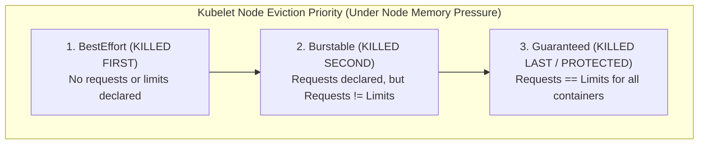
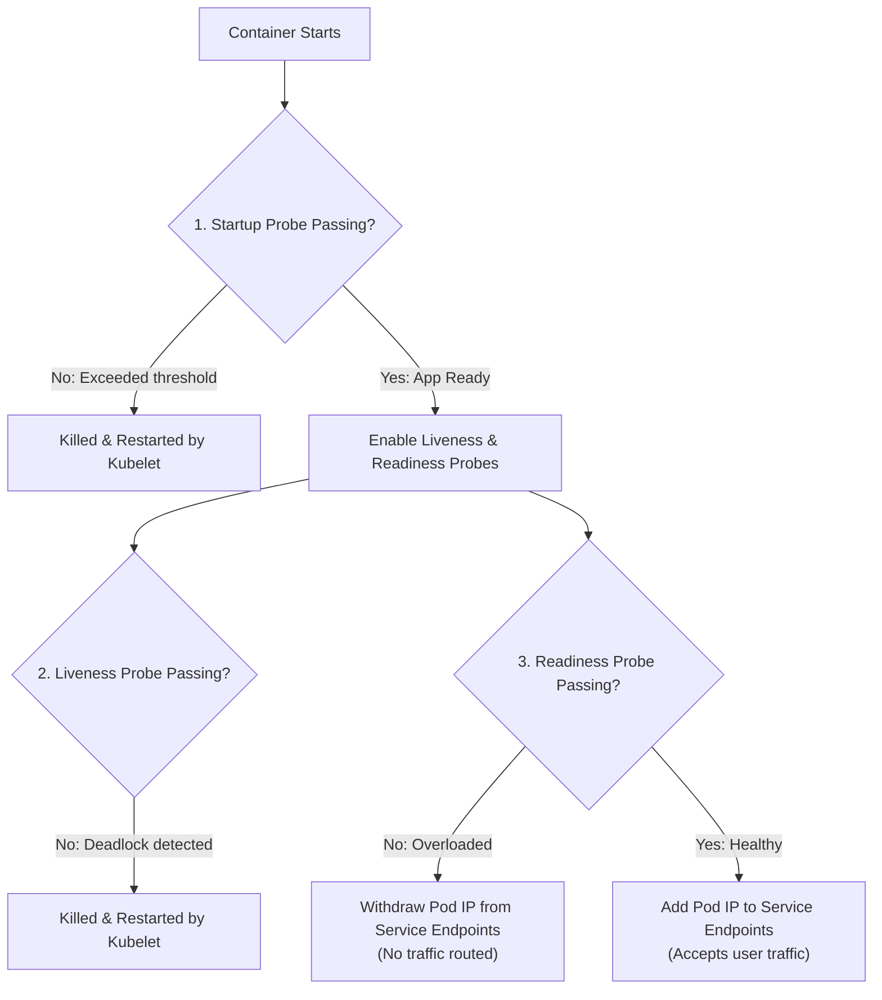
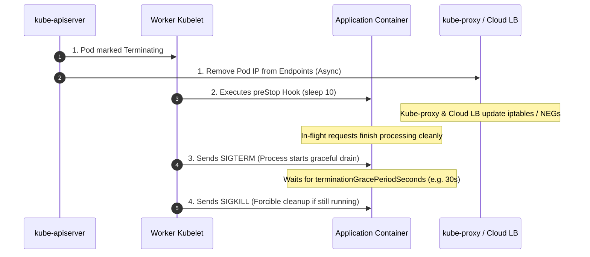

# Lesson 0009: Pod lifecycle, resource allocation, and health probes

## Fast interview summary and cheatsheet

| Mechanism | Trigger / Scope | System action on failure | Key operational fact |
| :--- | :--- | :--- | :--- |
| **CPU requests** | Scheduler placement | Reserved CPU time | Used by scheduler to place Pods; compressible via CFS shares. |
| **CPU limits** | Linux CFS Quota | CPU throttling (No restart) | Container process slows down; does not cause an OOMKill. |
| **Memory requests** | Scheduler placement | Reserved RAM capacity | Incompressible resource. Guaranteed available to the Pod. |
| **Memory limits** | Linux `cgroups` limit | **`OOMKilled` (Exit code 137)** | Kernel sends `SIGKILL` to container process immediately. |
| **`startupProbe`** | Initial container boot | Restarts container | Disables liveness and readiness checks until container initializes. |
| **`livenessProbe`** | Deadlock / Frozen app | Restarts container | Never query external databases here (causes cascading restart loops). |
| **`readinessProbe`** | Ready to receive traffic | Removes Pod from Endpoints | Does not restart container; stops incoming traffic. |
| **`preStop` hook** | Pod termination initiated | Runs script before SIGTERM | A `sleep 10` hook allows kube-proxy and load balancers to update routing tables. |

---

## 1. Quality of Service (QoS) classes and eviction hierarchy

Kubernetes assigns every Pod into one of three **Quality of Service (QoS)** tiers. When a worker node runs low on memory or disk space, `kubelet` evicts Pods in reverse order of their QoS tier:


```mermaid
graph TD
    subgraph EvictionPriority ["Kubelet Node Eviction Priority (Under Node Memory Pressure)"]
        BE["1. BestEffort (KILLED FIRST)\nNo requests or limits declared"]
        BU["2. Burstable (KILLED SECOND)\nRequests declared, but Requests != Limits"]
        GU["3. Guaranteed (KILLED LAST / PROTECTED)\nRequests == Limits for all containers"]
        
        BE --> BU --> GU
    end
```

### QoS classification rules
1. **`Guaranteed` (Highest Priority):**
   - Every container in the Pod has CPU and Memory requests and limits set, and `requests == limits`.
2. **`Burstable` (Medium Priority):**
   - At least one container has a memory or CPU request, but limits are higher than requests (or limits are omitted).
3. **`BestEffort` (Lowest Priority):**
   - The Pod specifies no requests and no limits. Under node memory pressure, `kubelet` terminates `BestEffort` Pods first.

---

## 2. Health probes: Startup, liveness, and readiness


```mermaid
graph TD
    Start["Container Starts"] --> Startup{"1. Startup Probe Passing?"}
    Startup -->|No: Exceeded threshold| Kill1["Killed & Restarted by Kubelet"]
    Startup -->|Yes: App Ready| ActiveProbes["Enable Liveness & Readiness Probes"]
    
    ActiveProbes --> Liveness{"2. Liveness Probe Passing?"}
    Liveness -->|No: Deadlock detected| Kill2["Killed & Restarted by Kubelet"]
    
    ActiveProbes --> Readiness{"3. Readiness Probe Passing?"}
    Readiness -->|No: Overloaded| PullEndpoint["Withdraw Pod IP from Service Endpoints\n(No traffic routed)"]
    Readiness -->|Yes: Healthy| AddEndpoint["Add Pod IP to Service Endpoints\n(Accepts user traffic)"]
```

### Probe handlers
* **`httpGet`:** Sends an HTTP GET request (status code 200 to 399 indicates success).
* **`tcpSocket`:** Checks if a TCP socket connection succeeds.
* **`exec`:** Runs a command inside the container (exit code 0 indicates success).
* **`grpc`:** Sends a native gRPC health check request.

---

## 3. Zero-downtime graceful shutdown sequence

During rolling updates, scale-downs, or node drains, applications can drop active user requests if endpoint removal races with container termination:


```mermaid
sequenceDiagram
    autonumber
    participant KubeAPI as kube-apiserver
    participant Kubelet as Worker Kubelet
    participant Pod as Application Container
    participant Proxy as kube-proxy / Cloud LB

    KubeAPI->>Kubelet: 1. Pod marked Terminating
    KubeAPI->>Proxy: 1. Remove Pod IP from Endpoints (Async)
    Kubelet->>Pod: 2. Executes preStop Hook (sleep 10)
    Note over Proxy: Kube-proxy & Cloud LB update iptables / NEGs
    Note over Pod: In-flight requests finish processing cleanly
    Kubelet->>Pod: 3. Sends SIGTERM (Process starts graceful drain)
    Note over Pod: Waits for terminationGracePeriodSeconds (e.g. 30s)
    Kubelet->>Pod: 4. Sends SIGKILL (Forcible cleanup if still running)
```

### The in-flight request race condition
When a Pod is deleted, two actions occur asynchronously in parallel:
1. The API server notifies `kube-proxy` and Cloud Load Balancers to remove the Pod IP from active endpoints.
2. `kubelet` sends `SIGTERM` to the container process.

It takes 2 to 5 seconds for network routing tables to update across the cluster. If the container process shuts down immediately upon receiving `SIGTERM`, incoming requests hit a closed socket and return `502 Bad Gateway`.

A `preStop` hook running `sleep 10` delays process termination until network tables complete their updates:

```yaml
spec:
  terminationGracePeriodSeconds: 45   # Must be greater than preStop + drain time
  containers:
    - name: web-app
      image: my-app:v1.0
      lifecycle:
        preStop:
          exec:
            command: ["/bin/sh", "-c", "sleep 10"] # Wait for endpoint propagation
      startupProbe:
        httpGet:
          path: /healthz
          port: 8080
        failureThreshold: 30          # Allow up to 30 * 2s = 60s for initial boot
        periodSeconds: 2
      livenessProbe:
        httpGet:
          path: /healthz
          port: 8080
        periodSeconds: 10
      readinessProbe:
        httpGet:
          path: /ready
          port: 8080
        periodSeconds: 5
```

---

## Interview deep-dives and scenarios

??? question "Interview scenario: Why is pointing a livenessProbe to an external database an antipattern?"
    If a service's `/healthz` endpoint queries PostgreSQL, and PostgreSQL experiences a short network hiccup or lock contention:
    1. Every Pod replica fails its `livenessProbe` at the same time.
    2. `kubelet` on every node terminates and restarts all service replicas simultaneously.
    3. The restarting containers all attempt to open new database connections at once, causing a connection spike that can keep the database unresponsive.
    
    **Best practice:**
    - `livenessProbe` should test only internal process health (such as deadlock checks or thread responsiveness).
    - `readinessProbe` can check external dependencies, which stops incoming traffic without terminating the container.

??? question "Interview question: Differentiate CPU throttling and Memory OOMKilling."
    - **CPU is a compressible resource:** If a container exceeds its `resources.limits.cpu`, the Linux CFS (Completely Fair Scheduler) throttles the container's CPU allocation. The application slows down, but the process does not terminate.
    - **Memory is an incompressible resource:** If a container allocates more RAM than its `resources.limits.memory`, the Linux kernel cgroups controller cannot compress memory. The kernel terminates the process with `SIGKILL` (Exit code 137 - OOMKilled) to maintain host stability.

---

## Common production pitfalls and interview traps

??? warning "Production trap: Omitting startupProbe for slow-starting applications"
    If an application takes 45 seconds to initialize, configuring a `livenessProbe` with `initialDelaySeconds: 10` causes `kubelet` to kill the container during startup, leading to a `CrashLoopBackOff`. Use a `startupProbe` with a sufficient `failureThreshold` to protect the boot sequence.

??? warning "Production trap: Missing preStop hook drops in-flight connections"
    Without a `preStop` sleep hook, rolling updates drop active connections because cloud load balancers and `kube-proxy` require a short propagation window to withdraw terminating Pod IPs from routing tables.

---

## Hands-on verification and diagnostics

```bash
# 1. Inspect Pod QoS Class
kubectl get pod <POD_NAME> -o jsonpath='{.status.qosClass}'

# 2. Check probe failure events and restart counts
kubectl describe pod <POD_NAME> | grep -E "(Liveness|Readiness|Startup|Last State)"

# 3. View CPU throttling metrics
kubectl top pod <POD_NAME> --containers

# 4. View real-time container termination signals
kubectl get events --field-selector reason=Killing
```

---

## Test your knowledge

1. A Pod has CPU and memory requests configured, but its memory limit is twice its memory request. Which QoS class does this Pod belong to?
   - [ ] A) The Burstable QoS classification
   - [ ] B) The Guaranteed QoS classification
   
   Answer: A. A Pod is `Burstable` if at least one container specifies requests, but requests do not strictly equal limits across all containers.

2. Why must a `preStop` hook execute `sleep 10` before a web server handles `SIGTERM` during a rolling update?
   - [ ] A) It allows time for kube-proxy and cloud load balancers to remove the Pod IP from routing tables
   - [ ] B) It forces the container runtime to flush all ephemeral storage snapshots to persistent disks
   
   Answer: A. Asynchronous network routing propagation requires a brief delay to prevent client traffic from hitting a terminating container.

---

## Recommended primary resources
- [Kubernetes liveness, readiness, and startup probes](https://kubernetes.io/docs/tasks/configure-pod-container/configure-liveness-readiness-startup-probes/)
- [Kubernetes Pod Quality of Service (QoS) classes](https://kubernetes.io/docs/concepts/workloads/pods/pod-qos/)

---

[← Lesson 8: GKE Gateway API](./0008-gke-gateway-api.md) | [Lesson 10: Capstone project →](./0010-capstone-project.md)
