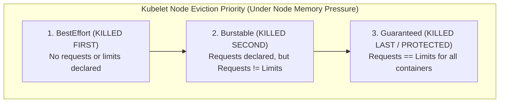
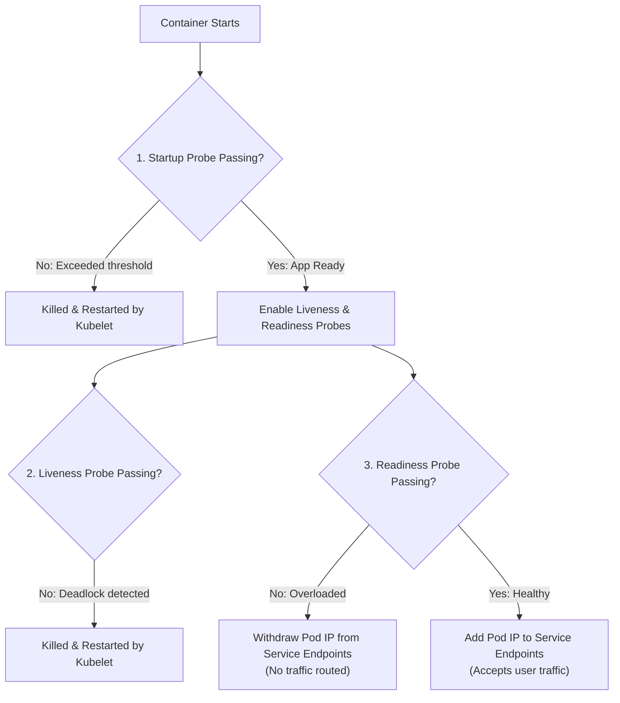
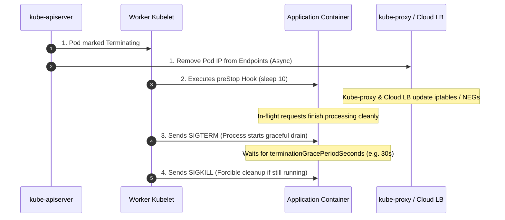

# Lesson 0009: Pod Lifecycle, Resource Allocation & Health Probes

## 🚀 Fast Interview Summary & Cheatsheet

| Mechanism | Trigger / Scope | System Action on Failure | Interview Must-Know |
| :--- | :--- | :--- | :--- |
| **CPU Requests** | Scheduler placement | Reserved CPU time | Used by scheduler to place Pods; compressible via CFS shares. |
| **CPU Limits** | Linux CFS Quota | **CPU Throttling** (No restart) | Container process slows down; never causes OOMKill. |
| **Memory Requests** | Scheduler placement | Reserved RAM capacity | Incompressible resource. Guaranteed available to Pod. |
| **Memory Limits** | Linux `cgroups` limit | **`OOMKilled` (Exit Code 137)** | Kernel immediately sends `SIGKILL` to container process. |
| **`startupProbe`** | Initial container boot | Restarts container | **Disables liveness/readiness checks** until container initializes. |
| **`livenessProbe`** | Deadlock / Frozen app | **Kills & Restarts container** | NEVER check external databases here (causes cascading restart storms!). |
| **`readinessProbe`** | Ready to receive traffic | **Removes Pod from Endpoints** | Does **NOT** restart container; simply halts incoming HTTP traffic. |
| **`preStop` Hook** | Pod termination initiated | Runs script before SIGTERM | Essential `sleep 10` hook allows kube-proxy iptables propagation. |

---

## 1. Quality of Service (QoS) Classes & Eviction Hierarchy

Kubernetes classifies every Pod into one of three **Quality of Service (QoS)** tiers. When a worker node runs low on memory or disk space, `kubelet` evicts Pods in strict reverse order of their QoS tier:


```mermaid
graph TD
    subgraph EvictionPriority ["Kubelet Node Eviction Priority (Under Node Memory Pressure)"]
        BE["1. BestEffort (KILLED FIRST)\nNo requests or limits declared"]
        BU["2. Burstable (KILLED SECOND)\nRequests declared, but Requests != Limits"]
        GU["3. Guaranteed (KILLED LAST / PROTECTED)\nRequests == Limits for all containers"]
        
        BE --> BU --> GU
    end
```

### QoS Classification Rules:
1. **`Guaranteed` (Highest Priority):**
   - Every container in the Pod must have CPU and Memory **requests AND limits explicitly set**, and `requests == limits`.
2. **`Burstable` (Medium Priority):**
   - At least one container has a memory or CPU request, but limits are higher than requests (or limits are omitted).
3. **`BestEffort` (Lowest Priority):**
   - The Pod specifies **no requests and no limits** whatsoever. Under node memory pressure, `kubelet` kills `BestEffort` Pods first.

---

## 2. Health Probes: Startup, Liveness & Readiness


```mermaid
graph TD
    Start["Container Starts"] --> Startup{"1. Startup Probe Passing?"}
    Startup -->|No: Exceeded threshold| Kill1["Killed & Restarted by Kubelet"]
    Startup -->|Yes: App Ready| ActiveProbes["Enable Liveness & Readiness Probes"]
    
    ActiveProbes --> Liveness{"2. Liveness Probe Passing?"}
    Liveness -->|No: Deadlock detected| Kill2["Killed & Restarted by Kubelet"]
    
    ActiveProbes --> Readiness{"3. Readiness Probe Passing?"}
    Readiness -->|No: Overloaded| PullEndpoint["Withdraw Pod IP from Service Endpoints\n(No traffic routed)"]
    Readiness -->|Yes: Healthy| AddEndpoint["Add Pod IP to Service Endpoints\n(Accepts user traffic)"]
```

### The 4 Probe Handlers:
* **`httpGet`:** Sends an HTTP GET request (status `200–399` indicates success).
* **`tcpSocket`:** Checks if a TCP socket can be opened.
* **`exec`:** Runs a command inside the container (exit code `0` indicates success).
* **`grpc`:** Sends a native gRPC health check request (K8s 1.24+).

---

## 3. Zero-Downtime Graceful Shutdown Sequence

During rolling updates, scaling down, or node drains, why do applications frequently drop in-flight user requests even when `readinessProbe` is configured?


```mermaid
sequenceDiagram
    autonumber
    participant KubeAPI as kube-apiserver
    participant Kubelet as Worker Kubelet
    participant Pod as Application Container
    participant Proxy as kube-proxy / Cloud LB

    KubeAPI->>Kubelet: 1. Pod marked Terminating
    KubeAPI->>Proxy: 1. Remove Pod IP from Endpoints (Async)
    Kubelet->>Pod: 2. Executes preStop Hook (sleep 10)
    Note over Proxy: Kube-proxy & Cloud LB update iptables / NEGs
    Note over Pod: In-flight requests finish processing cleanly
    Kubelet->>Pod: 3. Sends SIGTERM (Process starts graceful drain)
    Note over Pod: Waits for terminationGracePeriodSeconds (e.g. 30s)
    Kubelet->>Pod: 4. Sends SIGKILL (Forcible cleanup if still running)
```

### The In-Flight Request Race Condition:
- When a Pod is deleted, two events happen **asynchronously and in parallel**:
  1. The API Server notifies `kube-proxy` and Cloud Load Balancers to remove the Pod IP from the network endpoints.
  2. `kubelet` immediately sends `SIGTERM` to the container process.
- **The Problem:** It takes 2–5 seconds for network routing tables across the cluster to update. If your container terminates immediately upon receiving `SIGTERM`, clients will send HTTP requests to a dead container, resulting in **`502 Bad Gateway`** errors.
- **The Solution:** A `preStop` hook with `sleep 10` forces the container to wait for network routing tables to drain before stopping!

```yaml
spec:
  terminationGracePeriodSeconds: 45   # Must be greater than preStop + drain time
  containers:
    - name: web-app
      image: my-app:v1.0
      lifecycle:
        preStop:
          exec:
            command: ["/bin/sh", "-c", "sleep 10"] # Wait for endpoint propagation
      startupProbe:
        httpGet:
          path: /healthz
          port: 8080
        failureThreshold: 30          # Allow up to 30 * 2s = 60s for initial boot
        periodSeconds: 2
      livenessProbe:
        httpGet:
          path: /healthz
          port: 8080
        periodSeconds: 10
      readinessProbe:
        httpGet:
          path: /ready
          port: 8080
        periodSeconds: 5
```

---

## 🎯 Interview Deep-Dives & Scenarios

??? question "Interview Scenario: Why is pointing a `livenessProbe` to an external database a catastrophic antipattern?"
    **The Cascading Failure Storm:**
    - If your microservice’s `/healthz` endpoint queries PostgreSQL, and PostgreSQL experiences a brief 10-second network glitch or lock saturation:
      1. Every single Pod replica across your cluster will fail its `livenessProbe` simultaneously.
      2. `kubelet` on every node will kill and restart **all replicas of your service at the exact same moment**.
      3. When thousands of new containers reboot, they will slam PostgreSQL with simultaneous initialization connection storms, permanently crashing your database.
    - **Rule:**
      - **`livenessProbe`** should **ONLY** check local process health (e.g. is the thread pool alive? is the process deadlocked?).
      - **`readinessProbe`** can verify external dependencies and temporarily stop routing traffic without killing the process!

??? question "Interview Question: What is the exact difference between CPU throttling and Memory OOMKilling?"
    **Answer:**
    - **CPU is a Compressible Resource:** If a container attempts to use more CPU than its `resources.limits.cpu`, Linux CFS (Completely Fair Scheduler) **throttles** the container’s CPU time slices. The application slows down, but the process is **never killed**.
    - **Memory is an Incompressible Resource:** If a container attempts to allocate more RAM than its `resources.limits.memory`, the Linux kernel cgroups controller cannot compress memory. The kernel **immediately kills the process with `SIGKILL` (Exit Code 137 - OOMKilled)** to protect the stability of the host node.

---

## ⚠️ Common Production Pitfalls & Interview Traps

??? warning "Production Trap: Omitting `startupProbe` for Slow Applications"
    If a Java/Spring Boot or Rails app takes 45 seconds to initialize, setting `livenessProbe` with `initialDelaySeconds: 10` will cause `kubelet` to kill the container halfway through booting, putting the Pod into an infinite `CrashLoopBackOff`. Always configure a `startupProbe` with high `failureThreshold` to shield the boot phase.

??? warning "Production Trap: Missing `preStop` Hook Dropping In-Flight WebSocket/HTTP Traffic"
    Without a `preStop` sleep hook, rolling updates will drop active connections because cloud load balancers and `kube-proxy` require a few seconds to withdraw the terminating Pod IP from active routing tables.

---

## 💻 Hands-on Verification & Diagnostic Toolkit

```bash
# 1. Inspect Pod QoS Class
kubectl get pod <POD_NAME> -o jsonpath='{.status.qosClass}'

# 2. Check probe failure events and restart counts
kubectl describe pod <POD_NAME> | grep -E "(Liveness|Readiness|Startup|Last State)"

# 3. View CPU throttling metrics (via metrics-server)
kubectl top pod <POD_NAME> --containers

# 4. View real-time container termination signals
kubectl get events --field-selector reason=Killing
```

---

## Test Your Knowledge

1. A Pod has CPU/Memory requests configured, but its memory limit is twice its memory request. Which QoS class does this Pod belong to?
   - [ ] A) The Burstable QoS classification
   - [ ] B) The Guaranteed QoS classification
   
   *Answer:* A) The Burstable QoS classification - Correct! A Pod is `Burstable` if at least one container has requests set, but requests do not strictly equal limits.

2. Why must a `preStop` hook execute `sleep 10` before a web server handles `SIGTERM` during a rolling update?
   - [ ] A) It allows time for kube-proxy and cloud load balancers to remove the Pod IP from routing tables
   - [ ] B) It forces the container runtime to flush all ephemeral storage snapshots to persistent disks
   
   *Answer:* A) It allows time for kube-proxy and cloud load balancers to remove the Pod IP from routing tables - Correct! Asynchronous network propagation requires a brief delay to prevent client requests from hitting a terminating container.

---

## Recommended Primary Resource
- [Kubernetes Configure Liveness, Readiness and Startup Probes](https://kubernetes.io/docs/tasks/configure-pod-container/configure-liveness-readiness-startup-probes/)
- [Kubernetes Pod Quality of Service (QoS) Classes](https://kubernetes.io/docs/concepts/workloads/pods/pod-qos/)

---
**Diagnosing CPU throttling or fine-tuning probe timings?** Ask in chat, and we'll analyze your container resource allocations!

[← Lesson 8: GKE Gateway API](./0008-gke-gateway-api.md) | [Lesson 10: Capstone Project →](./0010-capstone-project.md)
