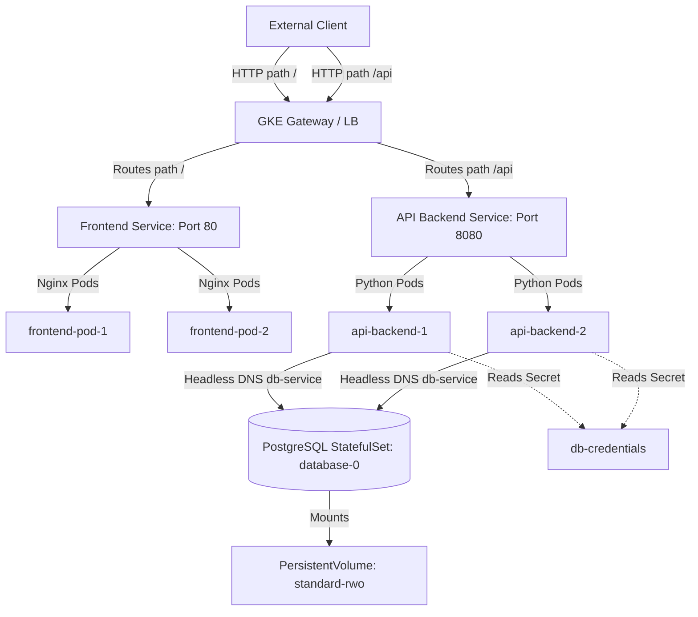

# Lesson 0010: Capstone Exercise: Multi-Tier Application Workflow (Capstone)

## Introduction

Welcome to your Capstone Project! This hands-on exercise combines all the concepts you have learned so far—Pod anatomy, service discovery, stateful configurations, secrets injection, storage volumes, Gateway API routing, and resource management—into a single integrated multi-tier deployment flow.

**Goal:**  Deploy a secure, highly-available, and auto-provisioned three-tier system on GKE representing a production database, a REST API server, and a web frontend.

## Architecture Overview

The system will consist of the following tiers:

* **Database Tier (Stateful):**  A single PostgreSQL Pod managed via `StatefulSet`, exposed via a headless service, using dynamic GCP storage provisioning via a `PersistentVolumeClaim`.
* **API Tier (Stateless):**  A Python REST API backend service reading secrets (db login) from K8s secrets, checking health status with readiness/liveness probes, and constrained by resource limits.
* **Frontend Tier (Stateless Web):**  An Nginx web server configured with a `preStop` graceful shutdown sleep hook.
* **Ingress/Gateway Tier:**  Exposes the web frontend on path `/` and routing backend requests on path `/api` under a single external HTTP load balancer.

### Capstone Architecture Diagram



## Capstone Step-by-Step Instructions

Step 1: Deploy the Database Secret & Service

Create a Kubernetes Secret encoding the postgres username and password. Then, define a headless Service for internal database communication.

```yaml
apiVersion: v1
kind: Secret
metadata:
  name: db-credentials
type: Opaque
data:
  # Base64 encoded strings
  username: cG9zdGdyZXM= # postgres
  password: bXlwYXNzd29yZA== # mypassword
---
apiVersion: v1
kind: Service
metadata:
  name: db-service
spec:
  clusterIP: None # Headless service
  selector:
    app: database
  ports:
  - port: 5432
```

Step 2: Deploy the Stateful Database

Configure a `StatefulSet` with a single replica, using GKE's default `standard-rwo` StorageClass for dynamic storage volume claims.

```yaml
apiVersion: apps/v1
kind: StatefulSet
metadata:
  name: database
spec:
  serviceName: "db-service"
  replicas: 1
  selector:
    matchLabels:
      app: database
  template:
    metadata:
      labels:
        app: database
    spec:
      containers:
      - name: postgres
        image: postgres:15
        env:
        - name: POSTGRES_USER
          valueFrom:
            secretKeyRef:
              name: db-credentials
              key: username
        - name: POSTGRES_PASSWORD
          valueFrom:
            secretKeyRef:
              name: db-credentials
              key: password
        ports:
        - containerPort: 5432
          name: dbport
        volumeMounts:
        - name: db-data
          mountPath: /var/lib/postgresql/data
  volumeClaimTemplates:
  - metadata:
      name: db-data
    spec:
      accessModes: [ "ReadWriteOnce" ]
      storageClassName: "standard-rwo"
      resources:
        requests:
          storage: 10Gi
```

Step 3: Deploy the API Backend

Write a stateless Backend Deployment referencing resource limits, health probes, and database connection secrets.

```yaml
apiVersion: apps/v1
kind: Deployment
metadata:
  name: api-backend
spec:
  replicas: 2
  selector:
    matchLabels:
      app: api-backend
  template:
    metadata:
      labels:
        app: api-backend
    spec:
      containers:
      - name: api
        image: gcr.io/google-samples/hello-app:2.0 # Or your custom API image
        resources:
          requests:
            memory: "128Mi"
            cpu: "100m"
          limits:
            memory: "256Mi"
            cpu: "250m"
        readinessProbe:
          httpGet:
            path: /
            port: 8080
          initialDelaySeconds: 5
          periodSeconds: 10
        livenessProbe:
          httpGet:
            path: /
            port: 8080
          initialDelaySeconds: 15
          periodSeconds: 15
        ports:
        - containerPort: 8080
---
apiVersion: v1
kind: Service
metadata:
  name: api-service
spec:
  type: ClusterIP
  selector:
    app: api-backend
  ports:
  - port: 8080
    targetPort: 8080
```

Step 4: Create the Gateway / Ingress Route

Configure a GKE Gateway to route incoming traffic based on path rules, routing to the frontend or api-backend.

```yaml
apiVersion: gateway.networking.k8s.io/v1
kind: Gateway
metadata:
  name: capstone-gateway
spec:
  gatewayClassName: gke-l7-gxlb
  listeners:
  - name: http
    protocol: HTTP
    port: 80
    allowedRoutes:
      namespaces:
        from: Same
---
apiVersion: gateway.networking.k8s.io/v1
kind: HTTPRoute
metadata:
  name: capstone-route
spec:
  parentRefs:
  - name: capstone-gateway
  rules:
  - matches:
    - path:
        type: PathPrefix
        value: /api
    backendRefs:
    - name: api-service
      port: 8080
  - matches:
    - path:
        type: PathPrefix
        value: /
    backendRefs:
    - name: frontend-service # Create service pointing to Nginx pods
      port: 80
```

## Test Your Knowledge

### 1. What type of Service exposes the StatefulSet Pods under stable network DNS names (e.g. `database-0.db-service`)?

- [ ] **A.** A LoadBalancer Service.
- [ ] **B.** A Headless Service (with `clusterIP: None`).
- [ ] **C.** A NodePort Service.

<details>
<summary><b>Answer & Explanation</b></summary>

**Correct Answer:** B

Correct! Headless services bypass clusterIP routing, allowing CoreDNS to return direct IP addresses for the StatefulSet individual pods.
</details>

### 2. If your Backend API Pod crashes during high-traffic surges and `kubectl describe pod` lists `Reason: OOMKilled` (Exit Code 137), what is the correct action?

- [ ] **A.** Increase the container's memory limit config inside the deployment resources spec.
- [ ] **B.** Increase the container's CPU request configuration.
- [ ] **C.** Disable the Readiness Probe.

<details>
<summary><b>Answer & Explanation</b></summary>

**Correct Answer:** A

Correct! OOMKilled (Exit Code 137) means the app hit its hard memory limit. Increasing the memory limit allows the app to handle memory spikes without getting terminated.
</details>

---

[← Lesson 9: Pod Lifecycle, Resource Allocation, and Health Probes](./0009-resources-probes-graceful-shutdown.md) | [Lesson 11: Helm Package Manager →](./0011-helm-package-manager.md)
