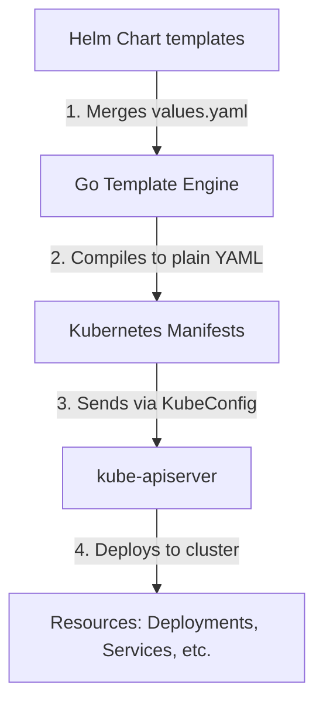

# Lesson 10: Helm Package Manager & Core Open Source Charts

## 1. Why Helm? The Kubernetes Package Manager
Managing Kubernetes applications via plain YAML manifests scales poorly. If you need to deploy the same application across Dev, Staging, and Production environments, you end up duplicating manifests or using tools like Kustomize. But if you want to version, package, and share pre-configured applications, you need **Helm**.

Helm acts as the package manager for Kubernetes (analogous to `apt` for Ubuntu or `npm` for Node.js). It introduces three core concepts:
- **Chart:** A bundle of pre-configured Kubernetes resource templates.
- **Release:** A specific running instance of a Chart in a Kubernetes cluster. You can install the same Chart multiple times, and each install gets its own Release name.
- **Values:** Configuration parameters that are injected into your templates, allowing you to customize the deployment without editing the templates themselves.

!!! note "Analogy: Charts and Releases"
    Think of a Helm Chart as a class definition, and a Release as an object instance created from that class. The `values.yaml` file holds the constructor arguments.

### Helm Architecture & Compilation Flow



---

## 2. Helm Chart Structure
A standard Helm chart is organized in a directory structure like this:

```
my-chart/
├── Chart.yaml          # Metadata about the chart (version, description, API version)
├── values.yaml         # The default configuration values for this chart
├── templates/          # Directory containing Kubernetes manifest templates
│   ├── deployment.yaml
│   ├── service.yaml
│   ├── _helpers.tpl    # Reusable template snippets and helpers
│   └── NOTES.txt       # Plain text instructions displayed after installation
└── charts/             # Subcharts or dependencies (optional)
```

### Inside a Template
Helm templates use the Go template syntax. Values from `values.yaml` are referenced using the `.Values` object:

```yaml
# templates/service.yaml
apiVersion: v1
kind: Service
metadata:
  name: {{ .Release.Name }}-service
spec:
  type: {{ .Values.service.type }}
  ports:
  - port: {{ .Values.service.port }}
  selector:
    app: {{ .Release.Name }}
```

---

## 3. Essential Helm Commands
To deploy and manage charts, master these basic operations in your terminal:

### A. Repository Management
```bash
# Add a public chart repository
helm repo add bitnami https://charts.bitnami.com/bitnami

# Fetch the latest list of charts from all repositories
helm repo update

# Search for packages across added repositories
helm search repo postgresql
```

### B. Installing & Upgrading Releases
```bash
# Install a chart with a specific release name
helm install my-db bitnami/postgresql

# Install or upgrade a chart, overriding values using inline flags
helm upgrade --install my-db bitnami/postgresql --set auth.database=mydb

# Upgrade using a custom values.yaml file
helm upgrade -f prod-values.yaml my-db bitnami/postgresql
```

### C. Inspecting and Version Control
```bash
# List all running releases in the current namespace
helm list

# Show the history of upgrades for a specific release
helm history my-db

# Roll back to a previous revision (e.g. revision 1)
helm rollback my-db 1

# Uninstall a release and clean up all resources
helm uninstall my-db
```

---

## 4. Best Open Source Helm Charts
Rather than writing everything from scratch, production Kubernetes environments rely on high-quality community Helm charts to deploy core infrastructure stack:

| Category | Chart Name | Use Case & Importance |
| :--- | :--- | :--- |
| **Ingress / Routing** | `ingress-nginx/ingress-nginx` | The default industry standard Nginx-based reverse proxy and load balancer to route external traffic to services. |
| **Monitoring** | `prometheus-community/kube-prometheus-stack` | Deploys Prometheus, Grafana, Alertmanager, and Node Exporter. Crucial for collecting metrics and setting up visual dashboards. |
| **Certificates** | `jetstack/cert-manager` | Automatically provisions and renews TLS certificates from Let's Encrypt and other authorities to secure HTTP ingress routes. |
| **Databases** | `bitnami/postgresql` (or `redis`) | Pre-configured, secure stateful applications with replication, clustering, and health-checks out of the box (great for persistent storage labs). |

---

## Test Your Knowledge

1. What command should you use to rollback a release named "api-server" to its 2nd deployment revision?
   - [ ] A) `helm rollback api-server 2`
   - [ ] B) `helm reset api-server --version 2`
   
   *Answer:* A) `helm rollback api-server 2` - Correct! "helm rollback <release> <revision>" is the correct syntax.

2. If you want to check the customizable variables and default options supported by a chart before installing it, which command should you run?
   - [ ] A) `helm inspect variables bitnami/redis`
   - [ ] B) `helm show values bitnami/redis`
   
   *Answer:* B) `helm show values bitnami/redis` - Correct! "helm show values <chart>" extracts the default values.yaml file from the packaged chart so you can inspect configuration options.

---

## Interactive Win: Deploying a Custom Redis Stateful Stack
Let's practice customization and installation using a Bitnami chart inside your practice cluster.

**Step 1:** Add and update the Bitnami repository:
```bash
helm repo add bitnami https://charts.bitnami.com/bitnami
helm repo update
```

**Step 2:** View the values configuration that can be modified:
```bash
helm show values bitnami/redis > default-values.yaml
```

**Step 3:** Save a minimal override config file named `custom-redis.yaml` in your workspace:
```yaml
# custom-redis.yaml
architecture: standalone
auth:
  enabled: true
  password: "SecureRedisPassword123"
master:
  persistence:
    enabled: true
    size: 2Gi
    storageClass: "standard" # Match your GKE storage class
```

**Step 4:** Deploy Redis using your overrides:
```bash
helm upgrade --install my-redis bitnami/redis -f custom-redis.yaml
```

**Step 5:** Verify the release is active and pods are healthy:
```bash
helm list
kubectl get pods -l app.kubernetes.io/name=redis
```

---

## Recommended Resource
Read the official [Helm Quickstart Guide](https://helm.sh/docs/intro/quickstart/) and explore charts on [Artifact Hub](https://artifacthub.io/).

---
**Got stuck or have a question?** Ask in chat, and we'll walk through helm templating or troubleshooting templates together!

[← Lesson 9](./0009-capstone-project.md) | [Home →](../index.md)
