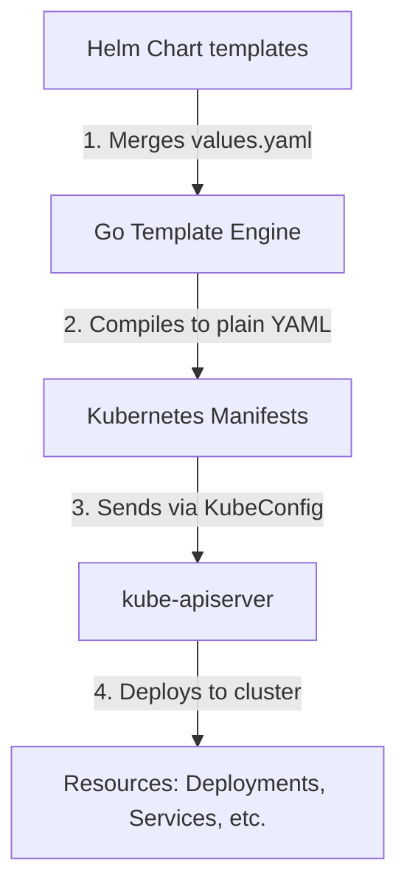

# Lesson 0011: Helm package manager and community charts

## 1. Why Helm? The Kubernetes package manager

Managing Kubernetes applications with plain YAML manifests scales poorly across environments. When you deploy the same application across dev, staging, and production clusters, maintaining duplicate manifests creates drift. Helm solves this by packaging, parameterizing, and versioning application manifests.

Helm introduces three core concepts:

- **Chart:** A bundle of parameterized Kubernetes resource templates.
- **Release:** A specific running instance of a Chart in a Kubernetes cluster. You can install the same Chart multiple times under distinct release names.
- **Values:** Configuration values injected into templates, allowing customization without modifying chart templates.

!!! note "Charts and Releases"
    Think of a Helm Chart as a class definition, and a Release as an object instance created from that class. The `values.yaml` file provides the constructor arguments.

### Helm architecture and compilation flow



---

## 2. Helm chart structure

A standard Helm chart uses this layout:

```
my-chart/
├── Chart.yaml          # Metadata about the chart (version, description, API version)
├── values.yaml         # The default configuration values for this chart
├── templates/          # Directory containing Kubernetes manifest templates
│   ├── deployment.yaml
│   ├── service.yaml
│   ├── _helpers.tpl    # Reusable template snippets and helpers
│   └── NOTES.txt       # Plain text instructions displayed after installation
└── charts/             # Subcharts or dependencies (optional)
```

### Inside a template

Helm templates use Go templating syntax. Values from `values.yaml` are referenced through the `.Values` object:

```yaml
# templates/service.yaml
apiVersion: v1
kind: Service
metadata:
  name: {{ .Release.Name }}-service
spec:
  type: {{ .Values.service.type }}
  ports:
  - port: {{ .Values.service.port }}
  selector:
    app: {{ .Release.Name }}
```

---

## 3. Essential Helm commands

### A. Repository management
```bash
# Add a public chart repository
helm repo add bitnami https://charts.bitnami.com/bitnami

# Fetch the latest list of charts from all repositories
helm repo update

# Search for packages across added repositories
helm search repo postgresql
```

### B. Installing and upgrading releases
```bash
# Install a chart with a specific release name
helm install my-db bitnami/postgresql

# Install or upgrade a chart, overriding values with inline flags
helm upgrade --install my-db bitnami/postgresql --set auth.database=mydb

# Upgrade using a custom values.yaml file
helm upgrade -f prod-values.yaml my-db bitnami/postgresql
```

### C. Inspecting and version control
```bash
# List all running releases in the current namespace
helm list

# Show the history of upgrades for a specific release
helm history my-db

# Roll back to a previous revision
helm rollback my-db 1

# Uninstall a release and clean up all resources
helm uninstall my-db
```

---

## 4. Common open-source Helm charts

Production clusters rely on community Helm charts for core infrastructure:

| Category | Chart name | Purpose |
| :--- | :--- | :--- |
| **Ingress and routing** | `ingress-nginx/ingress-nginx` | Nginx-based reverse proxy and load balancer to route external traffic to services. |
| **Monitoring** | `prometheus-community/kube-prometheus-stack` | Bundles Prometheus, Grafana, Alertmanager, and Node Exporter for metrics collection and dashboards. |
| **Certificates** | `jetstack/cert-manager` | Automates provisioning and renewal of TLS certificates from Let's Encrypt and private CAs. |
| **Databases** | `bitnami/postgresql` (or `redis`) | Pre-configured stateful applications with replication, clustering, and health checks. |

---

## Test your knowledge

1. What command should you use to rollback a release named "api-server" to its 2nd deployment revision?
   - [ ] A) `helm rollback api-server 2`
   - [ ] B) `helm reset api-server --version 2`
   
   Answer: A. `helm rollback <release> <revision>` is the standard rollback command.

2. If you want to check the customizable variables and default options supported by a chart before installing it, which command should you run?
   - [ ] A) `helm inspect variables bitnami/redis`
   - [ ] B) `helm show values bitnami/redis`
   
   Answer: B. `helm show values <chart>` extracts the default `values.yaml` file from the packaged chart.

---

## Hands-on practice: Deploying a custom Redis stack

**Step 1:** Add and update the Bitnami repository:
```bash
helm repo add bitnami https://charts.bitnami.com/bitnami
helm repo update
```

**Step 2:** Inspect default values:
```bash
helm show values bitnami/redis > default-values.yaml
```

**Step 3:** Save an override configuration file named `custom-redis.yaml`:
```yaml
# custom-redis.yaml
architecture: standalone
auth:
  enabled: true
  password: "SecureRedisPassword123"
master:
  persistence:
    enabled: true
    size: 2Gi
    storageClass: "standard"
```

**Step 4:** Deploy Redis using your overrides:
```bash
helm upgrade --install my-redis bitnami/redis -f custom-redis.yaml
```

**Step 5:** Verify the release is active and pods are healthy:
```bash
helm list
kubectl get pods -l app.kubernetes.io/name=redis
```

---

## Recommended resources
- [Helm quickstart guide](https://helm.sh/docs/intro/quickstart/)
- [Artifact Hub chart repository](https://artifacthub.io/)

---

[← Lesson 10: Capstone project](./0010-capstone-project.md) | [Lesson 12: CI/CD with GitHub Actions and GKE →](./0012-github-actions-cicd-gke.md)
