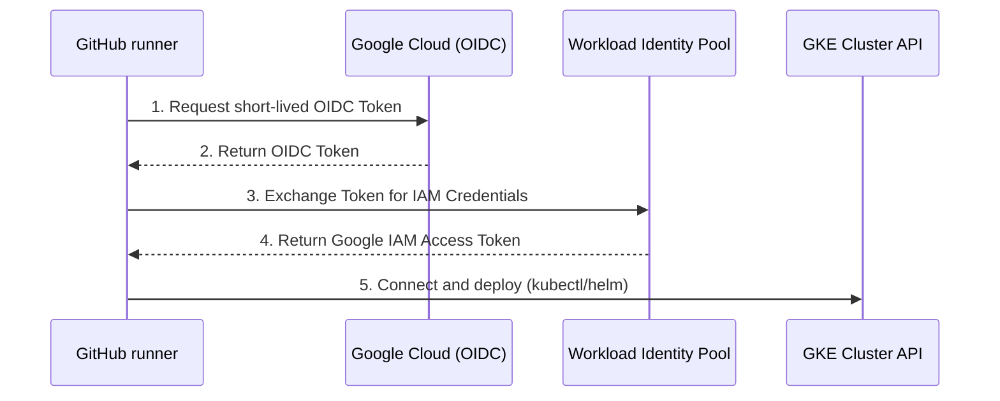

# Lesson 0012: CI/CD with GitHub Actions & GKE

Automating application deployments to Google Kubernetes Engine (GKE) requires a secure, automated CI/CD pipeline. In this lesson, we will cover how to configure GitHub Actions to authenticate securely to Google Cloud, fetch cluster credentials, and deploy applications using standard deployment steps.

---

## 1. Modern GKE Authentication: Workload Identity Federation

In the past, CI/CD systems authenticated to Google Cloud by downloading long-lived service account JSON keys. These keys are a significant security risk if leaked. 

Today, Google Cloud and GitHub support **Workload Identity Federation (WIF)**. WIF allows GitHub Actions to use short-lived OpenID Connect (OIDC) tokens to authenticate directly to Google Cloud without storing any secrets in GitHub.



---

## 2. Acquiring GKE Credentials inside the Workflow

Once authenticated, the GitHub Actions runner needs a `kubeconfig` file to connect to GKE. We use the official **`google-github-actions/get-gke-credentials`** action to generate this file automatically.

### Configuring the credentials step
```yaml
      - name: Get GKE Credentials
        uses: google-github-actions/get-gke-credentials@v2
        with:
          cluster_name: ${{ env.CLUSTER_NAME }}
          location: ${{ env.REGION }}
          use_dns_based_endpoint: true
```

### What does `use_dns_based_endpoint: true` do?
By default, the credentials tool configures `kubectl` to connect to the cluster control plane using its direct IP address. Setting `use_dns_based_endpoint: true` forces the connection to target GKE's modern **DNS-based endpoints** (e.g. `*.gke.gcloud.dev`).

This is essential because:

- **TLS Verification:** It ensures connection certificates align correctly with Google-managed DNS hostnames, preventing hostname validation issues.
- **Private Clusters:** Private clusters often route external administrative connections strictly through private cloud DNS or load-balanced domain name records.

---

## 3. Complete GitHub Actions Workflow Example

Save the following YAML file to your GitHub repository at `.github/workflows/deploy.yaml` to configure the deployment pipeline.

```yaml
name: Deploy Workload to GKE

on:
  push:
    branches:
    - main

env:
  PROJECT_ID: my-gcp-project-id
  CLUSTER_NAME: gke-prod-cluster
  REGION: us-central1
  IMAGE_NAME: gcr.io/my-gcp-project-id/my-web-app

permissions:
  contents: read
  id-token: write # CRUCIAL: Required for requesting WIF OIDC tokens

jobs:
  deploy:
    runs-on: ubuntu-latest
    steps:
    - name: Checkout Code
      uses: actions/checkout@v4

    # 1. Authenticate to GCP using Workload Identity Federation
    - name: Authenticate to GCP
      id: auth
      uses: google-github-actions/auth@v2
      with:
        token_format: access_token
        workload_identity_provider: 'projects/1234567890/locations/global/workloadIdentityPools/github-pool/providers/github-provider'
        service_account: 'github-deployer@my-gcp-project-id.iam.gserviceaccount.com'

    # 2. Acquire GKE cluster credentials and generate Kubeconfig
    - name: Get GKE Credentials
      uses: google-github-actions/get-gke-credentials@v2
      with:
        cluster_name: ${{ env.CLUSTER_NAME }}
        location: ${{ env.REGION }}
        use_dns_based_endpoint: true

    # 3. Verify connection
    - name: Verify cluster connectivity
      run: |
        kubectl cluster-info
        kubectl get nodes

    # 4. Deploy Manifests
    - name: Deploy application
      run: |
        kubectl apply -f k8s/deployment.yaml
        kubectl rollout status deployment/my-web-app
```

---

## 4. Google Cloud IAM Pre-requisite Configuration

Before running the workflow, you must link GitHub and GCP in the Cloud Console or CLI.

### Step 1: Create the Workload Identity Pool and Provider
```bash
# Create Pool
gcloud iam workload-identity-pools create "github-pool" \
    --location="global" \
    --display-name="GitHub Actions Pool"

# Create Provider linking to GitHub OIDC
gcloud iam workload-identity-pools providers create-oidc "github-provider" \
    --location="global" \
    --workload-identity-pool="github-pool" \
    --display-name="GitHub Actions Provider" \
    --attribute-mapping="google.subject=assertion.subject,attribute.repository=assertion.repository" \
    --issuer-uri="https://token.actions.githubusercontent.com"
```

### Step 2: Grant the WIF Provider access to your Service Account
Allow GitHub Actions running within your specific repository to assume the IAM Service Account identity:
```bash
gcloud iam service-accounts add-iam-policy-binding "github-deployer@my-gcp-project-id.iam.gserviceaccount.com" \
    --role="roles/iam.workloadIdentityUser" \
    --member="principalSet://iam.googleapis.com/projects/YOUR_PROJECT_NUMBER/locations/global/workloadIdentityPools/github-pool/attribute.repository/YOUR_GITHUB_ORG/YOUR_REPO_NAME"
```

### Step 3: Grant Service Account permission to GKE
Ensure the Service Account possesses cluster admin or developer access roles:
```bash
gcloud projects add-iam-policy-binding my-gcp-project-id \
    --member="serviceAccount:github-deployer@my-gcp-project-id.iam.gserviceaccount.com" \
    --role="roles/container.developer"
```

---

## Test Your Knowledge

### 1. Why is the 'permissions' config 'id-token: write' required in the GitHub Actions YAML file?
- [ ] **A.** To allow the runner to checkout code from the private git repository.
- [ ] **B.** To authorize GitHub to request the temporary OIDC ID token needed to authenticate with Google's Workload Identity Federation.
- [ ] **C.** To allow the runner to write tag metadata to the container registry.

<details>
<summary><b>Answer & Explanation</b></summary>

**Correct Answer:** B

**Explanation:** Without the `id-token: write` permission, GitHub Actions cannot mint the OIDC security assertion token needed by `google-github-actions/auth` to swap for Google Cloud IAM access credentials.
</details>

### 2. What security benefit does Workload Identity Federation offer over traditional Service Account JSON keys?
- [ ] **A.** It speeds up the deployment process by bypassing TLS handshake protocols.
- [ ] **B.** It eliminates the need to manage, store, or rotate long-lived, high-risk cryptographic keys in GitHub Secrets.
- [ ] **C.** It prevents the use of public load balancer configurations.

<details>
<summary><b>Answer & Explanation</b></summary>

**Correct Answer:** B

**Explanation:** Workload Identity Federation operates on short-lived, automated token exchanges. No secret JSON files are stored in GitHub, removing the risk of key leaks and eliminating the need for periodic rotation.
</details>

---

[← Lesson 11: Helm Package Manager](./0011-helm-package-manager.md) | [Home →](../index.md)
