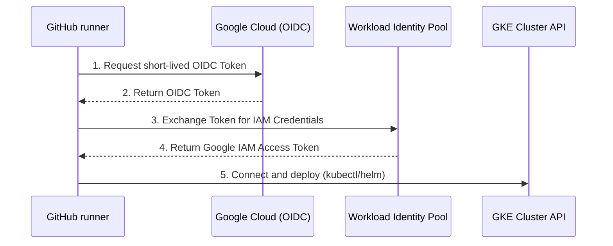

# Lesson 0012: CI/CD with GitHub Actions and GKE

Automating application deployments to Google Kubernetes Engine (GKE) requires a secure authentication workflow. This lesson covers how to configure GitHub Actions to authenticate to Google Cloud using short-lived tokens, retrieve cluster credentials, and deploy applications.

---

## 1. Modern GKE authentication: Workload Identity Federation

Traditional CI/CD pipelines authenticated to Google Cloud by downloading long-lived service account JSON keys. If leaked, these static keys give attackers persistent access to your cloud project.

Google Cloud and GitHub support **Workload Identity Federation (WIF)**. WIF allows GitHub Actions to use short-lived OpenID Connect (OIDC) tokens to authenticate directly to Google Cloud without storing secret keys in GitHub.


```mermaid
sequenceDiagram
    participant GH as GitHub runner
    participant GCP as Google Cloud (OIDC)
    participant WIF as Workload Identity Pool
    participant GKE as GKE Cluster API

    GH->>GCP: 1. Request short-lived OIDC Token
    GCP-->>GH: 2. Return OIDC Token
    GH->>WIF: 3. Exchange Token for IAM Credentials
    WIF-->>GH: 4. Return Google IAM Access Token
    GH->>GKE: 5. Connect and deploy (kubectl/helm)
```

---

## 2. Acquiring GKE credentials inside the workflow

Once authenticated, the GitHub Actions runner needs a `kubeconfig` file to connect to GKE. The **`google-github-actions/get-gke-credentials`** action generates this file automatically.

### Configuring the credentials step
```yaml
      - name: Get GKE Credentials
        uses: google-github-actions/get-gke-credentials@v2
        with:
          cluster_name: ${{ env.CLUSTER_NAME }}
          location: ${{ env.REGION }}
          use_dns_based_endpoint: true
```

### How DNS-based endpoints work
By default, credential tools configure `kubectl` to connect to the cluster control plane using its direct IP address. Setting `use_dns_based_endpoint: true` directs the connection to GKE's modern **DNS-based endpoints** (such as `*.gke.gcloud.dev`).

This provides two benefits:

- **TLS verification:** Certificates match Google-managed DNS hostnames, preventing certificate validation errors.
- **Private clusters:** Private clusters route administrative connections through private cloud DNS or load-balanced domain records.

---

## 3. GitHub Actions workflow example

Save the following YAML file to `.github/workflows/deploy.yaml` in your repository:

```yaml
name: Deploy Workload to GKE

on:
  push:
    branches:
    - main

env:
  PROJECT_ID: my-gcp-project-id
  CLUSTER_NAME: gke-prod-cluster
  REGION: us-central1
  IMAGE_NAME: gcr.io/my-gcp-project-id/my-web-app

permissions:
  contents: read
  id-token: write # Required for requesting WIF OIDC tokens

jobs:
  deploy:
    runs-on: ubuntu-latest
    steps:
    - name: Checkout Code
      uses: actions/checkout@v4

    # 1. Authenticate to GCP using Workload Identity Federation
    - name: Authenticate to GCP
      id: auth
      uses: google-github-actions/auth@v2
      with:
        token_format: access_token
        workload_identity_provider: 'projects/1234567890/locations/global/workloadIdentityPools/github-pool/providers/github-provider'
        service_account: 'github-deployer@my-gcp-project-id.iam.gserviceaccount.com'

    # 2. Acquire GKE cluster credentials and generate Kubeconfig
    - name: Get GKE Credentials
      uses: google-github-actions/get-gke-credentials@v2
      with:
        cluster_name: ${{ env.CLUSTER_NAME }}
        location: ${{ env.REGION }}
        use_dns_based_endpoint: true

    # 3. Verify connection
    - name: Verify cluster connectivity
      run: |
        kubectl cluster-info
        kubectl get nodes

    # 4. Deploy Manifests
    - name: Deploy application
      run: |
        kubectl apply -f k8s/deployment.yaml
        kubectl rollout status deployment/my-web-app
```

---

## 4. Google Cloud IAM setup

Before running the workflow, configure Workload Identity Federation in Google Cloud:

### Step 1: Create the Workload Identity Pool and Provider
```bash
# Create Pool
gcloud iam workload-identity-pools create "github-pool" \
    --location="global" \
    --display-name="GitHub Actions Pool"

# Create Provider linking to GitHub OIDC
gcloud iam workload-identity-pools providers create-oidc "github-provider" \
    --location="global" \
    --workload-identity-pool="github-pool" \
    --display-name="GitHub Actions Provider" \
    --attribute-mapping="google.subject=assertion.subject,attribute.repository=assertion.repository" \
    --issuer-uri="https://token.actions.githubusercontent.com"
```

### Step 2: Bind the provider to your Service Account
Allow GitHub Actions running from your repository to impersonate the IAM Service Account:
```bash
gcloud iam service-accounts add-iam-policy-binding "github-deployer@my-gcp-project-id.iam.gserviceaccount.com" \
    --role="roles/iam.workloadIdentityUser" \
    --member="principalSet://iam.googleapis.com/projects/YOUR_PROJECT_NUMBER/locations/global/workloadIdentityPools/github-pool/attribute.repository/YOUR_GITHUB_ORG/YOUR_REPO_NAME"
```

### Step 3: Grant GKE permissions
Assign the Service Account appropriate GKE permissions:
```bash
gcloud projects add-iam-policy-binding my-gcp-project-id \
    --member="serviceAccount:github-deployer@my-gcp-project-id.iam.gserviceaccount.com" \
    --role="roles/container.developer"
```

---

## Test your knowledge

1. Why is the permission `id-token: write` required in the GitHub Actions workflow file?
   - [ ] A) To allow the runner to clone code from private Git repositories
   - [ ] B) To authorize GitHub to mint the temporary OIDC token used by Workload Identity Federation
   
   Answer: B. Without `id-token: write`, GitHub Actions cannot generate the OIDC assertion token needed by `google-github-actions/auth` to exchange for Google Cloud IAM access credentials.

2. What security benefit does Workload Identity Federation offer over service account JSON keys?
   - [ ] A) It speeds up deployments by skipping TLS handshakes
   - [ ] B) It eliminates long-lived secret keys stored in GitHub Secrets
   
   Answer: B. Workload Identity Federation uses short-lived tokens, eliminating static secret files and key rotation overhead.

---

[← Lesson 11: Helm package manager](./0011-helm-package-manager.md) | [Lesson 13: Zero-downtime cluster upgrades →](./0013-zero-downtime-cluster-upgrades.md)
